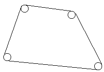

 # Tema

- [Tema](#tema)
    - [1. Fracţii](#1-fracţii)
    - [2. Centenar](#2-centenar)
    - [3. Şirul lui Hamming](#3-şirul-lui-hamming)
    - [4. Lungimea curelei de transmisie](#4-lungimea-curelei-de-transmisie)

### 1. Fracţii

O proprietate interesanta a fractiilor ireductibile este aceea ca oricare dintre ele se poate obtine dupa urmatoarele reguli:
1) pe primul nivel se afla fractia 1/1
2) pe al 2-lea nivel se afla in stanga fractia 1/2 si in dreapta fractia 2/1
3) pe fiecare nivel k, sub fractia i/j de pe nivelul k-1 se plaseaza fractia i/(i+j) in stanga si fractia (i+j)/j in dreapta.

Primele 3 niveluri astfel obtinute sunt:
Nivelul 1: 1/1
Nivelul 2: 1/2 2/1
Nivelul 3: 1/3 3/2 2/3 3/1

Exemple: Fractia 12/8 se afla pe nivelul 3 (este echivalenta cu fractia ireductibila 3/2).
Fractia 13/8 se afla pe nivelul 6.

Elaborati un program C++ pentru determinarea nivelului pe care se afla o fractie data (introdusa de la tastatura)

```c++
#include <iostream>
using namespace std;

int Cmmdc(int a, int b){
	int r = a%b;
	while(r){
		a=b;
		b=r;
		r=a%b;
	}
	return b;
}

int Nivel(int a, int b){
	if(a == 1 && b==1)
		return 1;
	else
		if(a<b)
			return 1+Nivel(a,b-a);
		else
			return 1+Nivel(a-b,b);
}

int main(){
	int a, b; cout<<"Dati numerele: "; cin>>a>>b;
	int d = Cmmdc(a,b);
	a/=d; b/=d;
	cout<<"Fractia se afla pe nivelul: "<<Nivel(a,b)<<endl;
}
```

### 2. Centenar

Pe o tabla sunt scrise numerele naturale 2, 3, 4.
Unul dintre numere se sterge si in locul lui se scrie suma celorlalte doua numere micsorata cu 1.
Aceasta operatie se repeata de cateva ori si in final se obtin numerele 100, 1919, 2018.

Elaborati un program C++ pentru generarea sirului de transformari.

```c++
#include <iostream>
using namespace std;

void Generare(int a, int b, int c){
	if(a>=2 && b>=3 && c>=4){
		int &maxim = (a>b ? (a>c ? a:c) : (b>c ? b:c));
		int &minim = (a<b ? (a<c ? a:c) : (b<c ? b:c));
		int &mijloc = (a!=maxim && a!=minim ? a : (b!=maxim && b!=minim ? b:c));
		maxim = mijloc - minim+1;
		Generare(a,b,c);
		maxim = mijloc+minim-1;
		cout<<a<<" "<<b<<" "<<c<<endl;
	}
}

int main(){
	cout<<"Generare sir: "<<endl;
	Generare(100,1919,2018);
}
```

### 3. Şirul lui Hamming

Şirul lui Hamming se defineşte ca fiind mulţimea de numere H = {2i * 3j * 5k / i, j, k sunt numere naturale}. Primii 10 termeni ai acestui şir sunt 1, 2, 3, 4, 5, 6, 8, 9, 10, 12. 

Elaborati un program C++ pentru generarea în ordine crescătoare a primilor n termeni ai șirului Hamming ( n>0 ). // n se introduce de la tastatura.

```c++
#include <iostream>
using namespace std;

void Afisare(int *A, int n){
    cout<<"Sirul lui Hamming: ";
    for(int i=0; i<n; i++)
        cout<<A[i]<<" ";
    cout<<endl;
}

void GenerareSir(int n){
    int *A = new int[n], p=0;
    int x2 = 2, i2 = 0;
    int x3 = 3, i3 = 0;
    int x5 = 5, i5 = 0;
    while(n--){
        A[++p] = min(x2,min(x3,x5));
        if(A[p]==x2)
            x2 = A[++i2] * 2;
        if(A[p]==x3)
            x3 = A[++i3] * 3;
        if(A[p]==x5)
            x5 = A[++i5] * 5;
    }
    Afisare(A,p);
    delete[] A;
}

int main(){
    int n; cout<<"Dati numarul de termeni: "; cin>>n;
    GenerareSir(n);
}
```

### 4. Lungimea curelei de transmisie

Un mecanism este format din n cercuri de aceeași rază, așezate în vârfurile unui poligon convex cu n laturi ca în figura de mai jos. 

Elaborati un program C++ pentru determinarea lungimii curelei de transmisie.



**Date de intrare**

- n - numarul de cercuri 1<n<=100
- r - lungimea comuna a razei celor n cercuri - numar real
- x1 y1
  x2 y2
-  (…) - coordonatele centrelor celor n cercuri date in sens trigononmetric sau in sens invers trigonometric - numere reale
- xn yn 

**Date de iesire**

- Un numar real cu doua cifre exacte ce reprezinta lungimea curelei de transmisie

**Exemplu**

| Date de intrare | Date de iesire |
| :-------------: | :------------: |
|       4 1       |     14.28      |
|     0.0 0.0     |                |
|     2.0 0.0     |                |
|     2.0 2.0     |                |
|     0.0 2.0     |                |

```c++
#include <iostream>
#include <cmath>
using namespace std;
struct punct{ float x,y; };
struct dreapta{ punct a,b; };

float Distanta(punct a, punct b){ return sqrt((b.x-a.x)*(b.x-a.x) + (b.y-a.y)*(b.y-a.y)); }
float Panta(punct a, punct b){ return (b.y-a.y)/(b.x-a.x); }
float LungimeArcCerc(float r, float u){ return M_PI*r*u/180; }

float UnghiDrepte(dreapta d1, dreapta d2){
    float m1 = Panta(d1.a,d1.b);
    float m2 = Panta(d2.a,d2.b);
    if(abs(m1)==INFINITY || abs(m2)==INFINITY)
        return 90;
    else{
        float m = (m1-m2)/(1+m1*m2);
        return atan(abs(m));
    }
}

float SumaDistante(punct *c, int n){
    float s=Distanta(c[0],c[n-1]);
    for(int i=1; i<n; i++)
        s+=Distanta(c[i-1], c[i]);
    return s;
}

float LungimeCurea(punct *c, int n, float r){
    float s = SumaDistante(c,n);
    dreapta d1; d1.a=c[n-2]; d1.b=c[n-1];
    dreapta d2; d2.a=c[n-1]; d2.b=c[0];
    for(int i=2; i<n; i++){
        s+=LungimeArcCerc(r,UnghiDrepte(d1,d2));
        d1.a=d2.a; d1.b=d2.b;
        d2.a=c[i-2]; d2.b=c[i-1];
    }
    s+=LungimeArcCerc(r,UnghiDrepte(d1,d2));
    d1.a=c[n-2]; d1.b=c[n-1];
    s+=LungimeArcCerc(r,UnghiDrepte(d1,d2));
    return s;
}

void Citire(punct *&c, int &n, float &r){
    cout<<"Dati numarul de cercuri: "; cin>>n;
    cout<<"Dati raza cercurilor: "; cin>>r;
    cout<<"Dati coordonatele punctelor: "<<endl;
    c = new punct[n];
    for(int i=0; i<n; i++)
        cin>>c[i].x>>c[i].y;
}

int main(){
    punct *c; int n; float r;
    Citire(c,n,r);
    cout<<"Lungime curea: "<<LungimeCurea(c,n,r)<<endl;
    delete[] c;
}
```

