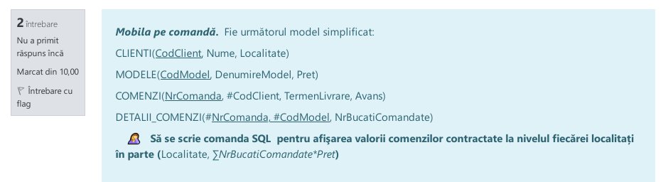
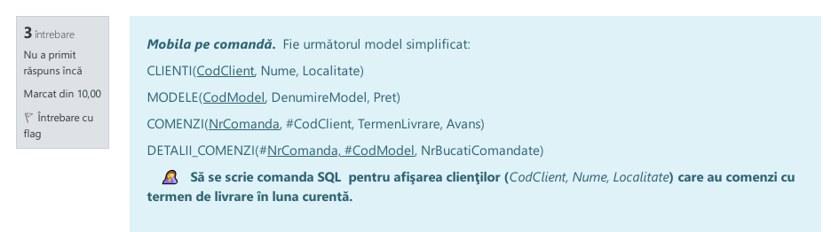
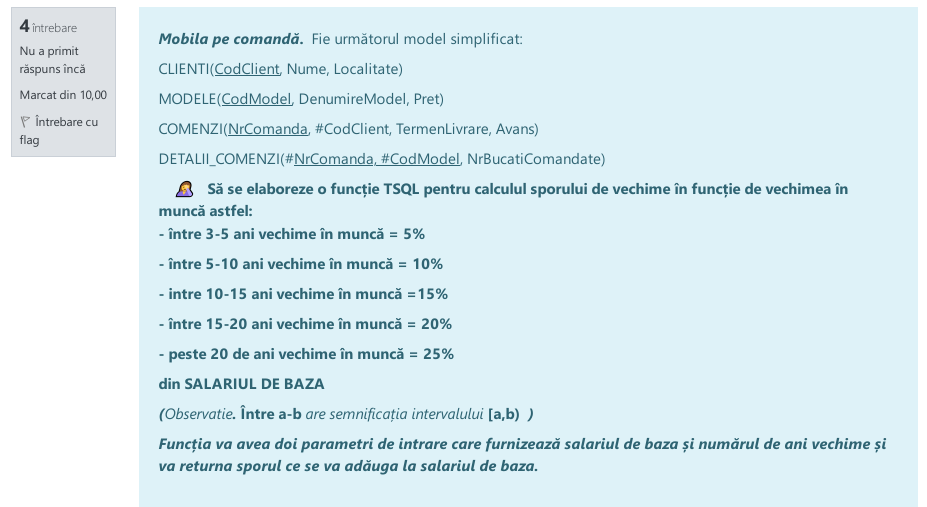
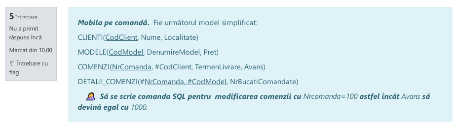
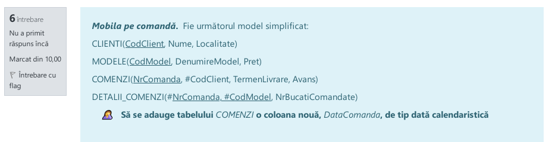
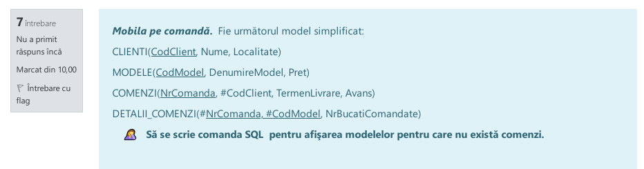
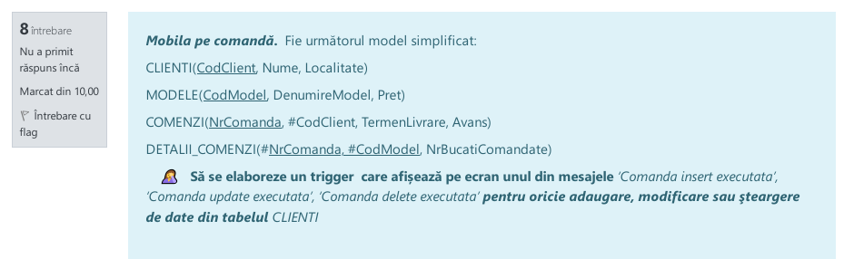
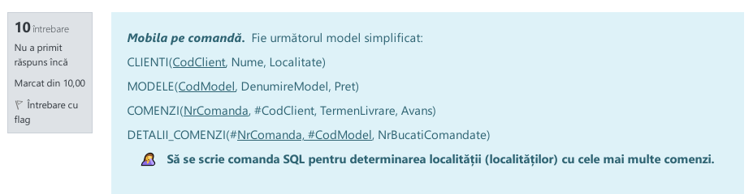

# Grupa 2.6

## Petculescu Mihai-Silviu

## Grupa 2.6

- [Grupa 2.6](#grupa-26)
	- [Petculescu Mihai-Silviu](#petculescu-mihai-silviu)
	- [Grupa 2.6](#grupa-26-1)
		- [01](#01)
		- [02](#02)
		- [03](#03)
		- [04](#04)
		- [05](#05)
		- [06](#06)
		- [07](#07)
		- [08](#08)
		- [09](#09)
		- [10](#10)

### 01


**Nota:** 10

```sql
INSERT INTO CLIENTI(CodClient, Nume, Localitate) VALUES ('C141', 'Andrei Banescu', 'AG')
```

### 02



**Nota:** 9.50

 ```sql
SELECT A.Localitate as 'Localitate', SUM(C.NrBucatiComandate * D.Pret) as 'Total'
FROM CLIENTI as A left join COMENZI as B ON A.CodClient = B.CodClient right join DETALII_COMENZI as C ON B.NrComanda = C.NrComanda 
left join MODELE as D on C.CodModel = D.CodModel
GROUP BY 'Localitate', 'Total'
 ```

### 03



**Nota:** 9

```sql
SELECT * FROM CLIENTI
WHERE CodClient IN (SELECT CodClient, TermenLivrare FROM COMENZI WHERE DATEPART(MONTH, TermenLivrare) = DATEPART(MONTH, GETDATE()))
```

### 04



**Nota:** 9.50

```sql
CREATE function spor_salariu(@sb decimal(5,2), @anivechime int)
returns decimal(5,2)
AS BEGIN
  if @anivechime < 2
  	return 0
  else if @anivechime < 5
  	return 5.0/100 * @sb
  else if @anivechime <10
  	return 10.0/100 * @sb
  else if @anivechime <15
  	return 15.0/100 * @sb
  else if @anivechime < 20
  	return 20.0/100 * @sb
  return 25.0/100 * @sb
END
```

### 05



**Nota:** 10

```sql
UPDATE COMENZI
SET Avans = 1000
WHERE NrComanda = 100; 
```

### 06



**Nota:** 10

```sql
ALTER TABLE COMENZI
ADD DataComanda datetime;
```

### 07



**Nota:** 9

```sql
SELECT * FROM MODELE WHERE CodModel NOT IN (CodModel from DETALII_Comenzi)
```

### 08



**Nota:** 7

```sql
CREATE TRIGGER tg_validareClienti on CLIENTI 
 for insert,update,delete
AS BEGIN
  if exists (select * from inserted)
	print 'Comanda insert executata'
  else if exists (select * from UPDATED)
  	print 'Comanda update executata'
  else if exists (select * from DELETED)
    print 'Comanda delete executata'
END 
```

### 09


**Nota:** 10

```sql
create table COMENZI(
	NrComanda INT PRIMARY KEY IDENTITY (1, 1),
	CodClient char(5) foreign key references CLIENTI(CodClient),
	TermenLivrare date CHECK(TermenLivrare >= GETDATE()),
	Avans decimal(10,2)
)
```

### 10



**Nota:** 5

```sql
-- ?
SELECT count(B.NrComanda) as 'Numar', A.Localitate as 'Localitate'
FROM CLIENTI as A RIGHT OUTER JOIN COMENZI as B
ON A.CodClient = B.CodClient
GROUP BY 'Numar', 'Localitate'
ORDER BY 'Numar'
```

 