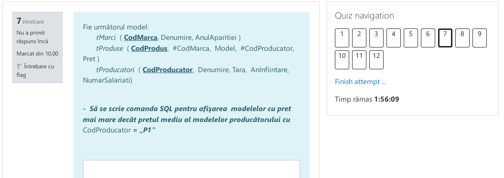

# Test

- [Test](#test)
    - [01](#01)
    - [02](#02)
    - [03](#03)
    - [04](#04)
    - [05](#05)
    - [06](#06)
    - [07](#07)
    - [08](#08)
    - [09](#09)
    - [10](#10)
    - [11](#11)
    - [12](#12)

### 01

**Nota:** 10


```sql
UPDATE tProduse
SET Pret = Pret * 0.9 WHERE CodProdus = 'P1'
```

### 02

**Nota:** 10


```sql
INSERT INTO tMarci (CodMarca, Denumire, AnulAparitiei)
VALUES ('Z101','AutomobilDacia',2010);
```

### 03

**Nota:** 10


```sql
ALTER TABLE tProduse
ADD Moneda varchar(20);
```

### 04

**Nota:** 10


```sql
DECLARE @model VARCHAR(11);
SET @model = 'Ford';
SELECT A.Tara 
FROM tProduse AS A INNER JOIN tProducatori AS B
  ON A.CodProducator = B.CodProducator
WHERE A.Model = @model
```

### 05

**Nota:** 10


```sql
SELECT COUNT(A.CodProdus) AS NumarModel, B.Denumire
FROM tProduse AS A INNER JOIN tProducatori AS B
  ON A.CodProducator = B.CodProducator
GROUP BY B.Denumire ORDER BY B.Denumire
```

### 06

**Nota:** 10


```sql
DELETE
FROM
    tProduse
WHERE
    CodMarca = 'FORD';

DELETE FROM tMarci WHERE CodMarca = 'FORD';
```

### 07

**Nota:** 10



```sql
SELECT Model
FROM tProduse
WHERE Pret >
  (SELECT AVG(Pret) FROM tProduse WHERE CodProducator = 'P1')
```

### 08

**Nota:** 10


```sql
SELECT A.Denumire, C.Denumire, B.Model, B.Pret
FROM tMarci AS A
  INNER JOIN tProduse AS B
    ON A.CodMarca = B.CodMarca
  INNER JOIN tProducatori AS C
    ON B.CodProducator = C.CodProducator
```

### 09

**Nota:** 6


```sql
DECLARE @cod_marca AS VARCHAR(11);
SET @cod_marca = 'a';

SELECT COUNT(tProducatori.Tara) as NrTari, tProducatori.Tara, tProduse.CodMarca, tProduse.CodProducator, tMarci.CodMarca, tProducatori.CodProducator, tMarci.Denumire, tProducatori.Denumire, tProduse.Model
FROM tProduse
INNER JOIN tMarci 
  ON tProduse.CodMarca = tMarci.CodMarca
INNER JOIN tProducatori
  ON tProducatori.CodProducator = tProduse.CodProducator
WHERE tProduse.CodMarca = @cod_marca
```

### 10

**Nota:** 10


```sql
CREATE TABLE tProduse(
  CodProdus CHAR(10) PRIMARY KEY,
  CodMarca CHAR(10) FOREIGN KEY REFERENCES tMarci(CodMarca),
  Model VARCHAR(50) not null,
  CodProducator CHAR(10) FOREIGN KEY REFERENCES tProducatori(CodProducator),
  Pret NUMERIC(7,2) not null
);
```

### 11

**Nota:** 10


```sql
SELECT Model
FROM tProduse
WHERE Pret = (SELECT MAX(Pret) FROM tProduse)
```

### 12

**Nota:** 10


```sql
SELECT Tara, SUM(NumarSlariati)
FROM tProducatori
GROUP BY Tara
```