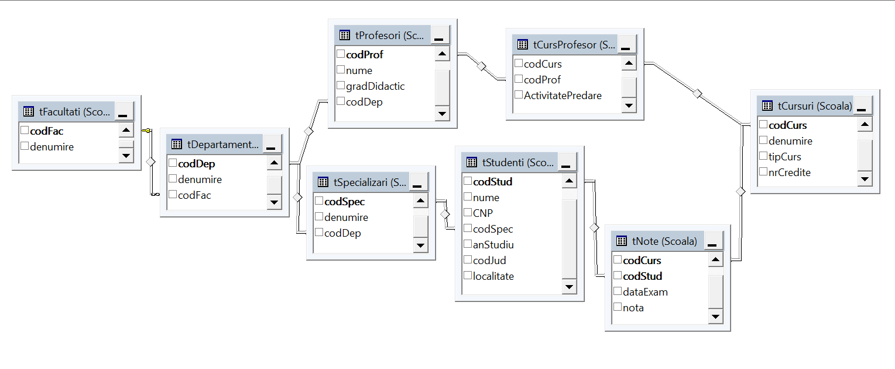

# L03

- [L03](#l03)
  - [Modelul relational al bazei de date bdFacultati](#modelul-relational-al-bazei-de-date-bdfacultati)
  - [Script 1](#script-1)
  - [Script 2](#script-2)
  - [Script 3](#script-3)

## Modelul relational al bazei de date bdFacultati 



## Script 1

**Crearea bazei de date `bdFacultati` si a schemei `Scoala`**

```sql
-- Creare baza de date bdFacultati
create database bdFacultati
GO

-- Activare baza de date bdFacultati
use bdFacultati
GO

-- Creare schema Scoala
create schema Scoala
```

## Script 2

**Crearea tabelelor bazei de date `bdFacultati`**

```sql
-- Activare baza de date
use dbFacultati

-- Comenzi pentru stergerea tabelelor (daca tabelele exista)
if(object_id('Scoala.tNote') is not null)
	drop table Scoala.tNote
if(object_id('Scoala.tCursProfesor') is not null)
	drop table Scoala.tCursProfesor
if(object_id('Scoala.tCursuri') is not null)
	drop table Scoala.tCursuri
if(object_id('Scoala.tStudenti') is not null)
	drop table Scoala.tStudenti
if(object_id('Scoala.tSpecializari') is not null)
	drop table Scoala.tSpecializari
if(object_id('Scoala.tProfesori') is not null)
	drop table Scoala.tProfesori
if(object_id('tDepartamente') is not null)
	drop table tDepartamente
if(object_id('Scoala.tDepartamente') is not null)
	drop table Scoala.tDepartamente
if(object_id('Scoala.tFacultati') is not null)
	drop table Scoala.tFacultati

-- Crearea tabelului tFacultati in schema Scoala
create table Scoala.tFacultati(
  codFac char(10) constraint PK_Facultati primary key,
  denumire varchar(50)
)

/* Crearea tabelului tDepartamente si tSpecializari 
  Vom crea aceste tabele in schema implicita dbo, pentru a arata (ulterior) cum se transfera obiectele intre scheme
*/

-- Crearea tabelului tDepartamentein schema implicita dbo
create table tDepartamente(
  codDep char(10) constraint PK_Departamente primary key,
  denumire varchar(50) not null,
  codFac char(10) constraint FK_Fac foreign key references Scoala.tFacultati(codFac)
)

-- Crearea tabelului tSpecializari in schema implicita dbo
create table tSpecializari(
  codSpec char(10) constraint PK_Specializari primary key,
  denumire varchar(50),
  codDep char(10) constraint FK_DepSpec foreign key references tDepartamente(codDep)
)

-- Transferul tabelelor tDepartamente si tSpecializari din schema dbo in schema Scoala
alter schema Scoala transfer dbo.tDepartamente
alter schema Scoala transfer dbo.tSpecializari

-- Crearea tabelului tProfesori in schema Scoala
create table Scoala.tProfesori(
  codProf char(10) constraint PK_Profesori primary key,
  nume varchar(50),
  gradDidactic varchar(20),
  codDep char(10) constraint FK_DepProf foreign key references Scoala.tDepartamente(codDep)
)

-- Crearea tabelului tStudenti in schema Scoala
create table Scoala.tStudenti(
  codStud char(10) constraint PK_Studenti primary key,
  nume varchar(50) not null,
  CNP char(13),
  codSpec char(10) not null constraint FK_SpecStud foreign key references Scoala.tSpecializari(codSpec),
  anStudiu tinyint,
  codJud char(10),
  localitate varchar(20)
)

-- Crearea tabelului tCursuri in schema Scoala
create table Scoala.tCursuri(
  codCurs char(10) constraint PK_Cursuri primary key,
  denumire varchar(50),
  tipCurs varchar(20) not null constraint CK_tipCurs check(tipCurs in('B','O','F')),
  -- 'B'- de baza, 'O' - optional, 'F' - facultativ
  nrCredite int
)

-- Crearea tabelului tNote in schema Scoala
create table Scoala.tNote(
  codCurs char(10) constraint FK_NoteCurs foreign key references Scoala.tCursuri(codCurs),
  codStud char(10) constraint FK_NoteStud foreign key references Scoala.tStudenti(codStud),
  dataExam smalldatetime constraint df_data default getdate(),
  nota tinyint not null constraint ck_nota check(nota between 1 and 10),
  constraint PK_Note primary key(codCurs, codStud)
)

-- Crearea tabelului tCursProfesor in schema Scoala
create table Scoala.tCursProfesor(
  codCurs char(10) constraint FK_CPCurs foreign key references Scoala.tCursuri(codCurs),
  codProf char(10) constraint FK_CPProf foreign key references Scoala.tProfesori(codProf),
  ActivitatePredare char -- 'C'- curs, 'L' - Laborator
)

GO
```

## Script 3

**Modificarea structurii tabelelor**

```sql

-- MODIFICAREA STRUCTURII TABELELOR
-- Sa se adauge coloana  adresa de tip varchar(50) tabelului Scoala.tFacultati
alter table Scoala.tFacultati
  add adresa varchar(50)

-- Sa se impuna constrangerea NOT NULL coloanei denumire a tabelului Scoala.tFacultati
alter table Scoala.tFacultati
  alter column denumire varchar(50) not null

-- Sa se modifice tipul coloanei gradDidactic a tabelului tProfesori din varchar(20) in char
alter table Scoala.tProfesori
 alter column gradDidactic char
 
/* sa se adauge coloanei gradDidactic  constrangerea de tip validare cu semnificatia
   'A' - asistent universitar, 'L' - lector universitar, 
   'C' - conferentiar universitar,  'P' - profesor universitar
*/
alter table Scoala.tProfesori
  add constraint CK_gradDidactic check(gradDidactic in ('A','L','C','P'))

/* Observatie: In urma adaugarii acestei constrangeri coloana gradDidactic va putea primi una
    dintre valorile 'A','L','C','P' sau valoarea NULL
    pentru a interzice valoarea NULL trebuie sa declaram coloanei gradDidactic constrangerea NOT NULL
*/

/* Urmatoarea comanda ne arata cum putem adauga unui tabel o constrangere de tip cheie primara.
   Sa se creeze constrangerea de tip cheie primara pentru tabelul tCursProfesor
   formata din coloanele codCurs si codProf

    Deoarece cheia primara nu permite valori nule, 
     mai intai impunem coloanelor constrangerea not null 
*/
alter table Scoala.tCursProfesor
  alter column codCurs char(10) not null

alter table Scoala.tCursProfesor
  alter column codProf char(10) not null
go

--Acum putem adauga  cheia primara
alter table Scoala.tCursProfesor
 add constraint PK_CursProf primary key(codCurs,codProf)

/* Utilizand procedura stocata de sistem  sp_rename sa se redenumeasca coloana ActivitatePredare
 a tabelului Scoala.tCursProfesor in tipPredare
*/ 
GO

EXEC sp_rename 'Scoala.tCursProfesor.ActivitatePredare', 'tipPredare', 'COLUMN';  
GO 

/* Sa se impuna coloanei tipPredare valorile posibile 
'T'- predare teoretica(curs) si 'P'- predare practica(laborator,seminar, etc)
*/
alter table Scoala.tCursProfesor
  add constraint CK_tipPredare check(tipPredare in ('T','P'))

/* Sa se adauge tabelului Scoala.tStudenti coloana calculata dataNasterii
prin extragerea datei nasterii din coloana CNP. 
Vom folosi formatul ISO (valoare 12) fara delimitatori intre an,luna,zi  
*/
alter table Scoala.tStudenti
 add  dataNasterii as convert( smalldatetime, substring(CNP,2,6), 12)
```

