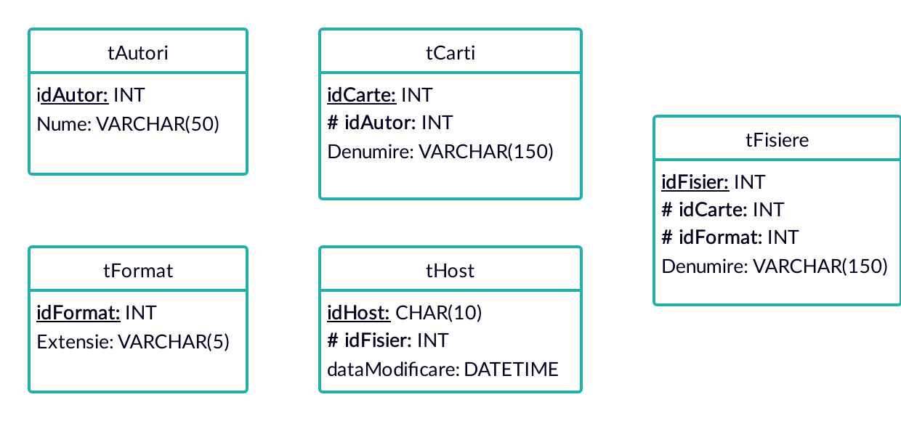

# Temă01 - Crearea bazelor de date

## Petculescu Mihai-Silviu

- [Temă01 - Crearea bazelor de date](#temă01---crearea-bazelor-de-date)
  - [Petculescu Mihai-Silviu](#petculescu-mihai-silviu)
  - [Descriere bazei de date](#descriere-bazei-de-date)
  - [Schema bazei de date](#schema-bazei-de-date)
  - [Creare Bază de Date şi Tabele](#creare-bază-de-date-şi-tabele)

## Descriere bazei de date

Baza de date prezentată în proiectul de faţă este o variantă simplificată a celei gândite pentru producţie, dar care păstrează conceptele esenţiale pentru organizarea datelor. 

Colecţia de date pe care baza de date îşi propune să o trateze cuprinde, printre altele: idAutor, numeAutor, idCarte, denumireCarte, [limbaCarte], idFormat, extensieFormat, [compatibilitateFormat], idFisier, denumireFisier, [dataModificareFisier], idHost, dataModificareHost. Cele prezente în paranteze drepte `[]` nu fac parte din schema de faţă dar au fost incluse pentru a forma o idee mai clară privind necesităţile pe care baza de date trebuie să la îndeplinească. 

De asemenea, acestor date li se atribuie anumite reguli de gestiune:

- 1 autor poate avea una sau mai multe cărţi scrise
- 1 carte este scrisă de un autor (am ales această constrângere mai mult din simplitate, căci numarul titlurilor avute scrise ca şi colaborare nu justifică, pe termen mediu şi lung, îngreunarea structurii bazei de date)
- 1 carte are mai multe fişiere asociate (format diferit, ediţie diferită - în ideea unei traduceri alternative)
- 1 fişier este asociat unei singure cărţi (considerăm ideea de volum de opere ca fiind, în sine, o singură carte)
- 1 fişier are asociat doar un format
- 1 format poate fi aplicat mai multor fişiere (introducerea tabelei de formate are mai mult rorul de sortare a fişierelor pe compatibilitate cu diverse dispozitive)
- 1 fişier hostat îi corespune în baza de date un unci fişier (în acest caz am considerat hostul ca fiind unitar)
- 1 fişier poate fi hostat pe mai multe platforme (o convenţie moştenită din ideea că, în producţie, vom fi nevoiţi să pastrăm anumite fişiere pe mai multe servere pentru a asigura o siguranţă a integrităţii datelor)

## Schema bazei de date


Tipurile de date folosite:



## Creare Bază de Date şi Tabele

```sql
-- Baza de date
CREATE DATABASE dbPlatforma

-- Selectare baza de date
USE dbPlatforma

-- Schemă
CREATE SCHEMA Colectie
```

Iniţial, pentru a ne asigura că tabelele ce urmează a fi create nu există deja în urma utilizărilor anterioare, se va face o verificare, iar în cazul în care există, se vor şterge şi apoi vor fi create din nou.

```sql
IF(object_id('Colectie.tAutori') is not null) DROP TABLE Colectie.tAutori
IF(object_id('Colectie.tFormat') is not null) DROP TABLE Colectie.tFormat
IF(object_id('Colectie.tCarti') is not null) DROP TABLE Colectie.tCarti
IF(object_id('Colectie.tHost') is not null) DROP TABLE Colectie.tHost
IF(object_id('Colectie.tFisiere') is not null) DROP TABLE Colectie.tFisiere
```

Comenzi pentru crearea tabelelor:

```sql
-- tAutori
CREATE TABLE Colectie.tAutori(
  idAutor INT PRIMARY KEY IDENTITY(1,1),
  Nume VARCHAR(50) NOT NULL
)

-- tFormat
CREATE TABLE Colectie.tFormat(
  idFormat INT PRIMARY KEY IDENTITY(1,1),
  Extensie VARCHAR(5) NOT NULL
)

-- tCarti
CREATE TABLE Colectie.tCarti(
   idCarte INT PRIMARY KEY IDENTITY(1,1),
   idAutor INT FOREIGN KEY REFERENCES Colectie.tAutori(idAutor),
   Denumire VARCHAR(150) NOT NULL
)

-- tFisiere
CREATE TABLE Colectie.tFisiere(
   idFisier INT PRIMARY KEY IDENTITY(1,1),
   idCarte INT FOREIGN KEY REFERENCES Colectie.tCarti(idCarte),
   idFormat INT FOREIGN KEY REFERENCES Colectie.tFormat(idFormat),
   Denumire VARCHAR(150) NOT NULL
)

-- tHost
CREATE TABLE Colectie.tHost(
   idHost CHAR(10) PRIMARY KEY,
   idFisier INT FOREIGN KEY REFERENCES Colectie.tFisiere(idFisier),
   dataModificare DATETIME
)
```

Comenzi pentru alterarea tabelelor:

```sql
-- Adaugarea optiunii default pentru campul dataModificare din tHost
ALTER TABLE Colectie.tHost ADD CONSTRAINT DF_tHost_dataModificare DEFAULT GETDATE() FOR dataModificare

-- Adauga An Aparitie si Editie pentru tabela tCarti
ALTER TABLE Colectie.tCarti ADD anAparitie INT, Editie INT

-- Adauga Numar de Pagini pentru tabela tFisiere
ALTER TABLE Colectie.tFisiere ADD nrPagini INT
```