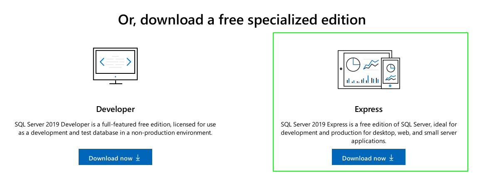
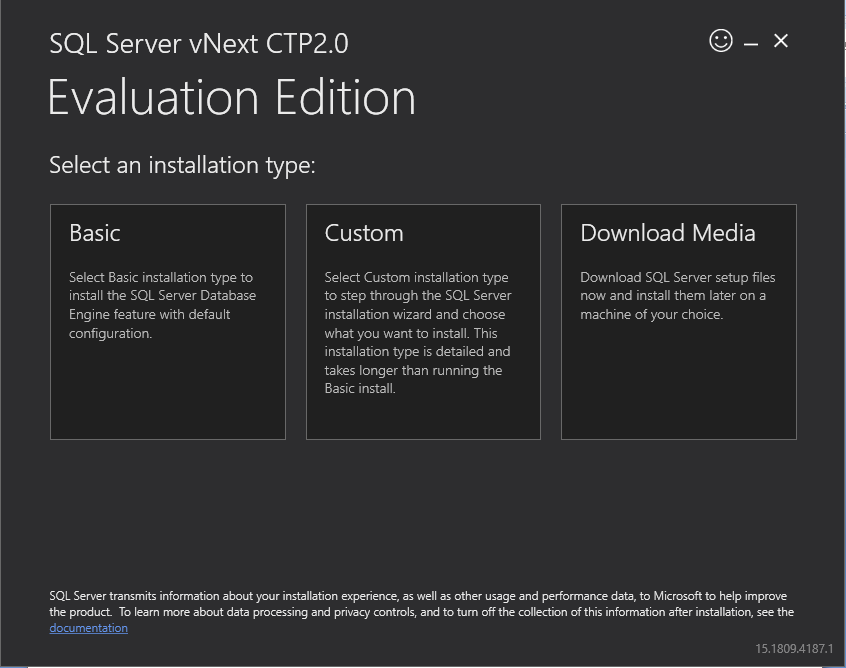
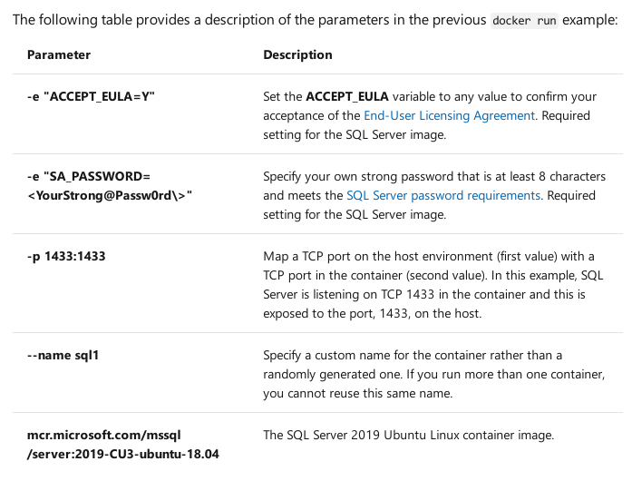
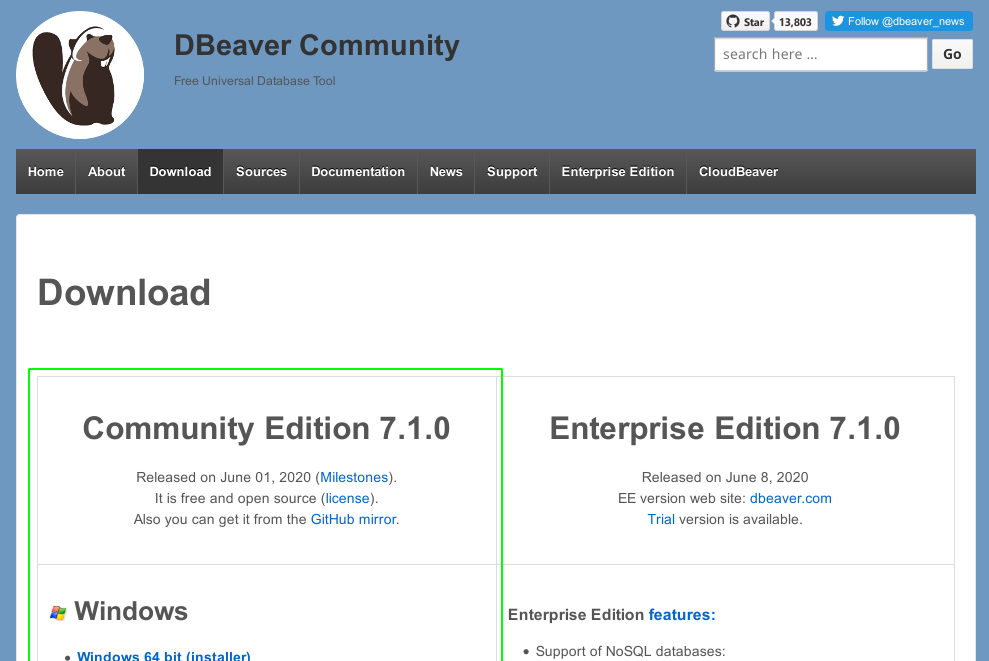
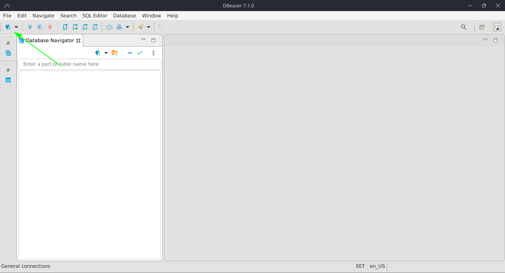
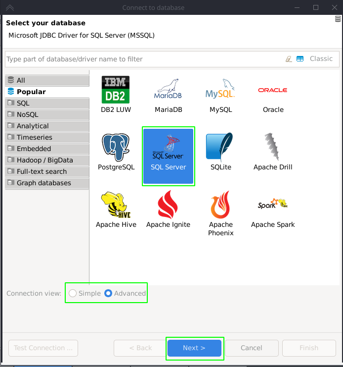
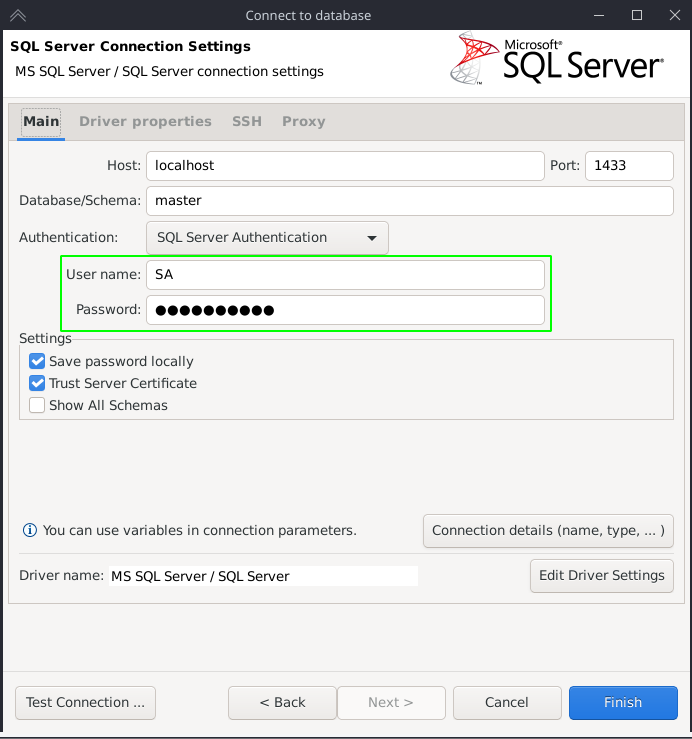
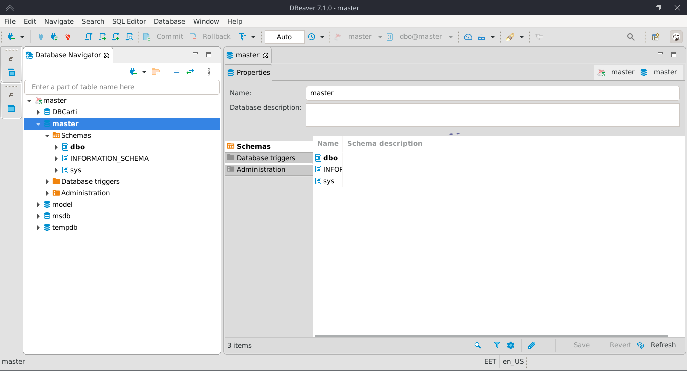
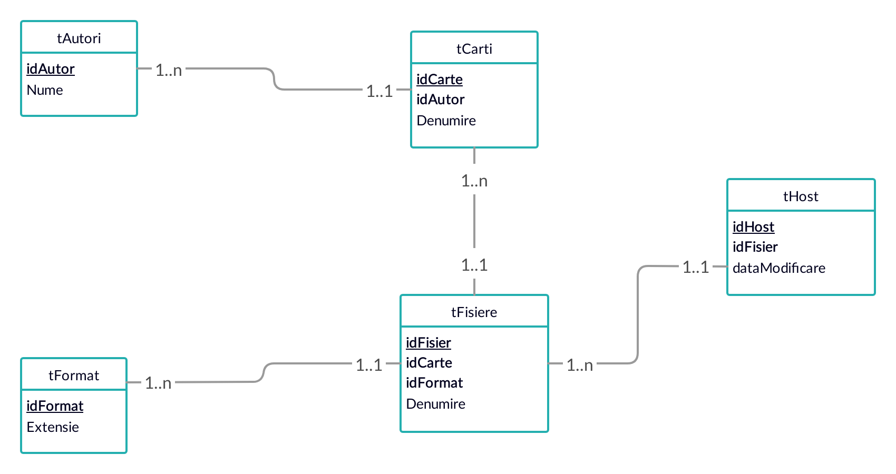
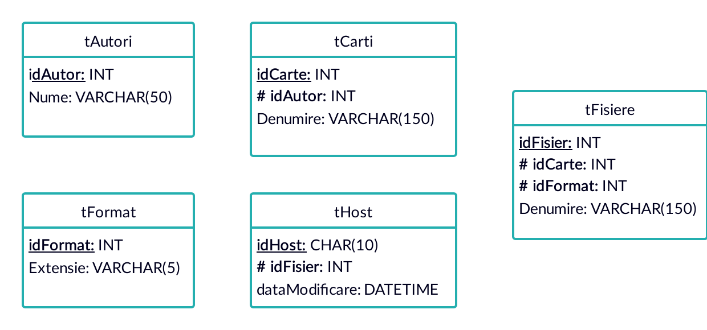

# Proiect Baze de Date

## Petculescu Mihai-Silviu

- [Proiect Baze de Date](#proiect-baze-de-date)
  - [Petculescu Mihai-Silviu](#petculescu-mihai-silviu)
  - [Motivaţie](#motivaţie)
  - [Instalare şi Configurare](#instalare-şi-configurare)
    - [Install SQL Server](#install-sql-server)
      - [Windows](#windows)
      - [Linux](#linux)
      - [Docker](#docker)
    - [DBeaver Comunity Edition](#dbeaver-comunity-edition)
  - [Descriere bazei de date](#descriere-bazei-de-date)
  - [Schema bazei de date](#schema-bazei-de-date)
  - [Creare Bază de Date şi Tabele](#creare-bază-de-date-şi-tabele)
  - [Inserare Date](#inserare-date)
    - [Date de intrare:](#date-de-intrare)
    - [Insert](#insert)
    - [Select](#select)
  - [Interogări multiple](#interogări-multiple)
  - [Subinterogări](#subinterogări)
  - [Sinteza datelor](#sinteza-datelor)
    - [Union](#union)
    - [Intersect](#intersect)
    - [Except](#except)
    - [RollUp](#rollup)
    - [Cube](#cube)
    - [Pivot](#pivot)
  - [Manipularea datelor](#manipularea-datelor)
    - [Insert](#insert-1)
    - [Select Into](#select-into)
    - [Update](#update)
    - [Truncate](#truncate)
    - [Delete](#delete)
  - [Utilizarea vederilor şi indexarea tabelelor](#utilizarea-vederilor-şi-indexarea-tabelelor)
    - [Vederi](#vederi)
    - [Indexi](#indexi)
  - [Crearea funcţiilor şi procedurilor stocate](#crearea-funcţiilor-şi-procedurilor-stocate)
  - [Tranzacţii SQL Server, Cursoare SQL Server](#tranzacţii-sql-server-cursoare-sql-server)
    - [Tranzacţii](#tranzacţii)
    - [Cursor](#cursor)
  - [Utilizarea triggerelor](#utilizarea-triggerelor)

## Motivaţie

Undeva pe la începutul anului am dat peste o colecţie masivă de cărţi, numărând (la momentul la care scriu această documentaţie) aproximativ 14.800 de titluri în dublu format `.docx` (sursa originală) şi `.rtf` (formatate special pentru a fi citite pe dispozitive ca e-readere). Aşa cum se poate deduce din aceste cifre, administrarea unei astfel de colecţii se va dovedi (dacă nu se simte deja) anevoioasă, întrucât spaţiul total ocupat de hard disk este de, aproximativ, 50 GB.

Nu mă pot numi un iubitor de carte, în adevăratul sens al dogmei, întrucât i-aş jigni pe cai care săptămână după săptămână devorează pe nerăsuflate titluri de la autori de care nici nu am auzit, dar altminte a citi ceva scris de mâna lor. Aşa că m-am trezit pus în faţa unei provocări: Cum administrez aşa o colecţie, mai şi pentru a o oferi unor amici, fără stresul (din partea mea) de a căuta cu funcţia de search prin toată librăria şi a le trimite (individual) "comanda" cerută. Pentru asta mi-am rupt destule nopţi cântărind alternative şi, până la urmă, am ajuns la câteva soluţii. Da, voi avea nevoie de o bază de date, dar ţinând cont de titlul acestei lucrări, nu pot spune că reprezintă o surpriză. Nu, pentru a pune mai bine în evidenţă această situaţie, voi fi nevoit sa explic la ce va fi folosită baza de date. Răspunsul stă în cuvântul care a terorizat vreme de generaţii minţile tinerilor programatori ca fiind soluţia (simplă şi unitară) la toate rugile şi apăsările lor, SERVER.

O platformă în care să pot uploada simplu şi uşor claia de fişiere ce-mi mănâncă zilele, să-mi permită să modific şi corectez fişierele, să ofere o funcţie de search prin care să răspund simplu şi rapid la una dintre cele mai ameninţătoare întrebări pe care mi le-au pus (alţii): Conţine `<cutare>` sau `<cutare>`? Dacă scap de întrebarea asta adresată la săptămână pot să-mi consider viaţa puţin mai împlinită. Iar pe ultimul punct, acolo unde baza de date se va dovedi aliat de nădejde, nu că până acum nu ar fi fost altfel, este managementul fişierelor pe una, dar în prisosinţă mai multe, soluţii de stocare, căci adevărul, la momentul scrierii acestei lucrări, este că stocarea costă destul de mult şi a ţine toate fişierele într-un singur loc se dovedeşte mai defăimător (pe termen mediu şi lung) decât a le avea hostate pe mai multe platforme (unele şi gratuit, ceea ce, să fiu sincer, mă bucură). Pentru asta am nevoie de o bază de date şi cu această sarcină am pornit la drum. Proiectarea nu este perfectă, va să zic că nici nu mi-ar trebui, dar îmi satisface necesităţile pentru acest proiect şi eventual altele care s-ar deriva din el.

## Instalare şi Configurare

### Install SQL Server

#### Windows

Pentru sistemul de operare Windows, procedura este destul de simplă. 

1. Accesăm pagina de download SQL Server de pe site-ul Microsoft (la momentul actual linkul pentru pagina principală este https://www.microsoft.com/en-us/sql-server/sql-server-downloads).


2. Descărcăm ediţia SQL Server Express.



3. Pornim executabilul şi selectăm tipul de instalare (în cazul nostru Basic), locaţia de instalare (lăsăm pe Default) şi aşteptăm ca installerul să-şi descarce componentele necesare. 



#### Linux

**Linia de comandă**

La momentul actual SQL Server on Linux suportă oficial 3 distribuţii: 

- Debian (Ubuntu, Linux Mint, ...) - https://docs.microsoft.com/en-us/sql/linux/quickstart-install-connect-ubuntu?view=sql-server-ver15
- Red Hat (Enterprise, CentOS, Fedora, ...) - https://docs.microsoft.com/en-us/sql/linux/quickstart-install-connect-red-hat?view=sql-server-ver15
- SUSE (Enterprise, OpenSuse, ...) - https://docs.microsoft.com/en-us/sql/linux/quickstart-install-connect-suse?view=sql-server-ver15

Instrucţiunile de instalare sunt disponibile pe pagina oficială de suport Microsoft. De remarcat că SQL Server poate fi instalat cu succes pe orice alt tip de distribuţie linux, paşii de instalare putând fi găsiţi cu uşurinţă pe internet. Pentru instalare se recomandă cunoştinţe minime în linia de comandă şi o oarecare familiaritate cu managerul de pachete folosit.

#### Docker

Instrucţiuni pentru instalarea Docker:

- Pagina Oficială - https://docs.docker.com/engine/install/
- DigitalOcean - https://www.digitalocean.com/community/tutorials/how-to-install-and-use-docker-on-ubuntu-20-04

Instrucţiuni pentru instalarea SQL Server On Docker se găsesc pe pagina oficială: https://docs.microsoft.com/en-us/sql/linux/quickstart-install-connect-docker?view=sql-server-ver15&pivots=cs1-bash

**Detalii configuraţie**



Comenzi folosite la instalare.

**Username - SA** (default)

**Password - DBPass.123** (minim 8 caractere, literă mare, cifre, semne de punctuaţie)


```bash
# Pull Image
docker pull mcr.microsoft.com/mssql/server:2019-GA-ubuntu-16.04

# Create a Persistent Volume
docker volume create mssqlsystem
docker volume create mssqluser

# Create a Container
docker container run -p 1433:1433 \
--volume mssqlsystem:/var/opt/mssql \
--volume mssqluser:/var/opt/sqlserver \
--env "ACCEPT_EULA=Y" \
--env "SA_PASSWORD=DBPass.123" \
--name mssql_2019_GA_docker \
-d mcr.microsoft.com/mssql/server:2019-GA-ubuntu-16.04
```

### DBeaver Comunity Edition

Pentru a accesa baza de date vom opta pentru SGBD-ul DBeaver, în principal datorită compatibilităţii cu ambele platforme Windows şi Linux. Varianta Community, gratuită şi opensource poate fi descărcată direct de pe saitul oficial: https://dbeaver.io/download/ 



Pentru a adăuga baza noastră de date, dăm click pe New Database Connection



Selectăm din ecranul principal SQL Servel şi la tipul conecsiunii Advanced apoi dăm click pe Next



Completăm câmpurile User name şi Password cu datele furnizate mai sus şi apăsăm Finish. 



Dacă nu au apărut probleme neaşteptate ar trebui să putem accesa baza de date.



## Descriere bazei de date

Baza de date prezentată în proiectul de faţă este o variantă simplificată a celei gândite pentru producţie, dar care păstrează conceptele esenţiale pentru organizarea datelor. 

Colecţia de date pe care baza de date îşi propune să o trateze cuprinde, printre altele: idAutor, numeAutor, idCarte, denumireCarte, [limbaCarte], idFormat, extensieFormat, [compatibilitateFormat], idFisier, denumireFisier, [dataModificareFisier], idHost, dataModificareHost. Cele prezente în paranteze drepte `[]` nu fac parte din schema de faţă dar au fost incluse pentru a forma o idee mai clară privind necesităţile pe care baza de date trebuie să la îndeplinească. 

De asemenea, acestor date li se atribuie anumite reguli de gestiune:

- 1 autor poate avea una sau mai multe cărţi scrise
- 1 carte este scrisă de un autor (am ales această constrângere mai mult din simplitate, căci numarul titlurilor avute scrise ca şi colaborare nu justifică, pe termen mediu şi lung, îngreunarea structurii bazei de date)
- 1 carte are mai multe fişiere asociate (format diferit, ediţie diferită - în ideea unei traduceri alternative)
- 1 fişier este asociat unei singure cărţi (considerăm ideea de volum de opere ca fiind, în sine, o singură carte)
- 1 fişier are asociat doar un format
- 1 format poate fi aplicat mai multor fişiere (introducerea tabelei de formate are mai mult rorul de sortare a fişierelor pe compatibilitate cu diverse dispozitive)
- 1 fişier hostat îi corespune în baza de date un unci fişier (în acest caz am considerat hostul ca fiind unitar)
- 1 fişier poate fi hostat pe mai multe platforme (o convenţie moştenită din ideea că, în producţie, vom fi nevoiţi să pastrăm anumite fişiere pe mai multe servere pentru a asigura o siguranţă a integrităţii datelor)

## Schema bazei de date



Tipurile de date folosite:



## Creare Bază de Date şi Tabele

```sql
-- Baza de date
CREATE DATABASE dbPlatforma

-- Selectare baza de date
USE dbPlatforma

-- Schemă
CREATE SCHEMA Colectie
```

Iniţial, pentru a ne asigura că tabelele ce urmează a fi create nu există deja în urma utilizărilor anterioare, se va face o verificare, iar în cazul în care există, se vor şterge şi apoi vor fi create din nou.

```sql
IF(object_id('Colectie.tAutori') is not null) DROP TABLE Colectie.tAutori
IF(object_id('Colectie.tFormat') is not null) DROP TABLE Colectie.tFormat
IF(object_id('Colectie.tCarti') is not null) DROP TABLE Colectie.tCarti
IF(object_id('Colectie.tHost') is not null) DROP TABLE Colectie.tHost
IF(object_id('Colectie.tFisiere') is not null) DROP TABLE Colectie.tFisiere
```

Comenzi pentru crearea tabelelor:

```sql
-- tAutori
CREATE TABLE Colectie.tAutori(
  idAutor INT PRIMARY KEY IDENTITY(1,1),
  Nume VARCHAR(50) NOT NULL
)

-- tFormat
CREATE TABLE Colectie.tFormat(
  idFormat INT PRIMARY KEY IDENTITY(1,1),
  Extensie VARCHAR(5) NOT NULL
)

-- tCarti
CREATE TABLE Colectie.tCarti(
   idCarte INT PRIMARY KEY IDENTITY(1,1),
   idAutor INT FOREIGN KEY REFERENCES Colectie.tAutori(idAutor),
   Denumire VARCHAR(150) NOT NULL
)

-- tFisiere
CREATE TABLE Colectie.tFisiere(
   idFisier INT PRIMARY KEY IDENTITY(1,1),
   idCarte INT FOREIGN KEY REFERENCES Colectie.tCarti(idCarte),
   idFormat INT FOREIGN KEY REFERENCES Colectie.tFormat(idFormat),
   Denumire VARCHAR(150) NOT NULL
)

-- tHost
CREATE TABLE Colectie.tHost(
   idHost CHAR(10) PRIMARY KEY,
   idFisier INT FOREIGN KEY REFERENCES Colectie.tFisiere(idFisier),
   dataModificare DATETIME
)
```

Comenzi pentru alterarea tabelelor:

```sql
-- Adaugarea optiunii default pentru campul dataModificare din tHost
ALTER TABLE Colectie.tHost ADD CONSTRAINT DF_tHost_dataModificare DEFAULT GETDATE() FOR dataModificare

-- Adauga An Aparitie si Editie pentru tabela tCarti
ALTER TABLE Colectie.tCarti ADD anAparitie INT, Editie INT

-- Adauga Numar de Pagini pentru tabela tFisiere
ALTER TABLE Colectie.tFisiere ADD nrPagini INT
```

## Inserare Date

Pentru că, la momentul actual, vorbim de un sample de date de peste câteva mii de fişiere, inserarea manuală se va dovedi nesatisfăcătoare când va fi necesară încărcarea acestora în baza de date. De aceea, cu toate ca pentru proiectul de faţă, mă voi limita la un număr de câteva zeci de fişiere, voi adăuga şi un model de script pentru automatizarea procesului. Acesta este scris în python, dar procedura propriu-zisă poate fi replicată în orice alt limbaj de programare ca Java, C#, etc... cu condiţia de a avea disponibil un driver cu compatibilitate ODBC.

Înainte de a începe, va fi necesar să instalăm pe sistemul nostru de lucru `Microsoft ODBC Driver for SQL Server`. Instrucţiunile pentru instalarea acestuia se găsesc la pagina - https://docs.microsoft.com/en-us/sql/connect/python/pyodbc/step-1-configure-development-environment-for-pyodbc-python-development?view=sql-server-ver15

Paşi introductivi pentru instalarea şi configurarea `python`, `pyodbc` şi pandas:

```bash
# Creare virtual envinronment
python3 -m venv venv

# Activare pe Windows 
activate venv/bin/activate

# Activate pe Linux/Unix
source venv/bin/activate

# Instalare PyODBC
pip install pyodbc

# Instalare Pandas
pip install pyodbc
```

Inserare format fişiere în baza de date:

```python
import pandas as pd
import pyodbc
import os

server = 'localhost'
database = 'dbPlatforma'
schema = 'Colectie'
username = 'SA'
password = 'DBPass.123'

cnxn = pyodbc.connect('DRIVER={ODBC Driver 17 for SQL Server};SERVER='+server+';DATABASE='+database+';UID='+username+';PWD='+ password)

# 0 == null
def get_format_id(format_name):
    data = pd.read_sql('SELECT * FROM Colectie.tFormat', cnxn)
    data = data.loc[data['Extensie'] == format_name]
    if data.shape[0] == 0:
        return 0
    else:
        return data.iloc[0]['idFormat']

def insert_formats(format_list):
    for format in format_list:
        if get_format_id(format) == 0:
            query = f"INSERT INTO {schema}.tFormat (Extensie) VALUES ('{format}');"
            cursor.execute(query)
    cnxn.commit()

def extract_formats(file_list):
    formats = []
    for file in file_list:
        formats.append(file.split(".")[-1].lower())
    return set(formats)

file_list = os.listdir("files")

insert_formats(extract_formats(file_list))
```

Analog se pot deduce funcţii pentru inserarea celolalte elemente în baza de date.

### Date de intrare:

```bash
Agnes Martin Lugand - Încă aud muzica noastră în gând 1.0 10 {Dragoste}.rtf
Agnes Martin Lugand - Încă aud muzica noastră în gând 1.0 {Dragoste}.docx
Alexandr Soljeniţîn - O zi din viaţa lui Ivan Denisovici 1.0 10 {Literatură}.rtf
Alexandr Soljeniţîn - O zi din viaţa lui Ivan Denisovici 1.0 {Literatură}.docx
Amelie Nothomb - V19 Barbă albastră 1.0 10 {Thriller}.rtf
Amelie Nothomb - V19 Barbă albastră 1.0 {Thriller}.docx
Andrew Crumey - Mobius Dick 1.0 10 {Literatură}.rtf
Andrew Crumey - Mobius Dick 1.0 {Literatură}.docx
Camilla Lackberg - Fjallbacka - V6 Sirena 1.1 10 {Poliţistă}.rtf
Camilla Lackberg - Fjallbacka - V6 Sirena 1.1 {Poliţistă}.docx
Camilla Lackberg - Fjallbacka - V7 Paznicul farului 1.1 {Poliţistă}.docx
Camilla Lackberg - Fjallbacka - V8 Făuritoarea de îngeri 1.1 10 {Poliţistă}.rtf
Camilla Lackberg - Fjallbacka - V8 Făuritoarea de îngeri 1.1 {Poliţistă}.docx
Catherine Isaac - Aici, acum, mereu 1.0 10 {Literatură}.rtf
Catherine Isaac - Aici, acum, mereu 1.0 {Literatură}.docx
Charles Berlitz - Misterul lumilor uitate 1.0 ^{Mister şi Ştiinţă}.docx
Charlie Jane Anders - Oraşul de la miezul nopţii 1.0 10 {SF}.rtf
Charlie Jane Anders - Oraşul de la miezul nopţii 1.0 {SF}.docx
Christina Dalcher - Tăcerea poate fi asurzitoare 1.0 10 {SF}.rtf
Christina Dalcher - Tăcerea poate fi asurzitoare 1.0 {SF}.docx
```

### Insert

```sql
-- Inserare in tFormat
INSERT INTO Colectie.tFormat (Extensie) VALUES ('docx'),('rtf');

-- Inserare in tAutori
INSERT INTO Colectie.tAutori (Nume)
VALUES ('Agnes Martin Lugand'),
	('Alexandr Soljeniţîn'),
	('Amelie Nothomb'),
	('Andrew Crumey'),
	('Camilla Lackberg'),
	('Catherine Isaac'),
	('Charles Berlitz'),
	('Charlie Jane Anders'),
	('Christina Dalcher');
	
-- Inserare in tCarti
INSERT INTO Colectie.tCarti (idAutor, Denumire, anAparitie, Editie)
VALUES (1,'Încă aud muzica noastră în gând',2010,1),
	(2,'O zi din viaţa lui Ivan Denisovici',2011,2),
	(3,'V19 Barbă albastră',1980,3),
	(4,'Mobius Dick',1990,2),
	(5,'Fjallbacka - V6 Sirena',2005,1),
	(5,'Fjallbacka - V7 Paznicul farului',2008,1),
	(5,'Fjallbacka - V8 Făuritoarea de îngeri',2012,1),
	(6,'Aici, acum, mereu',2015,1),
	(7,'Misterul lumilor uitate',2010,1),
	(8,'Oraşul de la miezul nopţii',2015,2),
	(9,'Tăcerea poate fi asurzitoare',2000,2);
	
-- Inserare in tFisiere
INSERT INTO Colectie.tFisiere (idCarte, idFormat, Denumire, nrPagini)
VALUES 
(1,2,'Agnes Martin Lugand - Încă aud muzica noastră în gând 1.0 10 {Dragoste}.rtf',500),
(1,1,'Agnes Martin Lugand - Încă aud muzica noastră în gând 1.0 {Dragoste}.docx',520),
(2,2,'Alexandr Soljeniţîn - O zi din viaţa lui Ivan Denisovici 1.0 10 {Literatură}.rtf',380),
(2,1,'Alexandr Soljeniţîn - O zi din viaţa lui Ivan Denisovici 1.0 {Literatură}.docx',410),
(3,2,'Amelie Nothomb - V19 Barbă albastră 1.0 10 {Thriller}.rtf',450),
(3,1,'Amelie Nothomb - V19 Barbă albastră 1.0 {Thriller}.docx',470),
(4,2,'Andrew Crumey - Mobius Dick 1.0 10 {Literatură}.rtf',610),
(4,1,'Andrew Crumey - Mobius Dick 1.0 {Literatură}.docx',590),
(5,2,'Camilla Lackberg - Fjallbacka - V6 Sirena 1.1 10 {Poliţistă}.rtf',280),
(5,1,'Camilla Lackberg - Fjallbacka - V6 Sirena 1.1 {Poliţistă}.docx',300),
(6,1,'Camilla Lackberg - Fjallbacka - V7 Paznicul farului 1.1 {Poliţistă}.docx',330),
(7,2,'Camilla Lackberg - Fjallbacka - V8 Făuritoarea de îngeri 1.1 10 {Poliţistă}.rtf',170),
(7,1,'Camilla Lackberg - Fjallbacka - V8 Făuritoarea de îngeri 1.1 {Poliţistă}.docx',210),
(8,2,'Catherine Isaac - Aici, acum, mereu 1.0 10 {Literatură}.rtf',250),
(8,1,'Catherine Isaac - Aici, acum, mereu 1.0 {Literatură}.docx',260),
(9,1,'Charles Berlitz - Misterul lumilor uitate 1.0 ^{Mister şi Ştiinţă}.docx',570),
(10,2,'Charlie Jane Anders - Oraşul de la miezul nopţii 1.0 10 {SF}.rtf',230),
(10,1,'Charlie Jane Anders - Oraşul de la miezul nopţii 1.0 {SF}.docx',245),
(11,2,'Christina Dalcher - Tăcerea poate fi asurzitoare 1.0 10 {SF}.rtf',278),
(11,1,'Christina Dalcher - Tăcerea poate fi asurzitoare 1.0 {SF}.docx',302);

-- Inserare in tHost
INSERT INTO Colectie.tHost (idHost, idFisier,dataModificare)
VALUES ('z2xsl23jd3',1,'2020-04-15'),
	('7b0l1wpllj',2,'2020-04-16'),
	('ktt0swufn1',3,'2020-04-16'),
	('28151eohux',4,'2020-04-16'),
	('tczrxs6vno',5,'2020-04-17'),
	('xx25soydmq',6,'2020-04-17'),
	('29q2ygf3e6',7,'2020-04-20'),
	('2hfvz9ad86',8,'2020-04-20'),
	('quq91yv0ty',9,'2020-04-21'),
	('7hgfjqvqsu',10,'2020-04-25'),
	('bn9gzc2yyd',11,'2020-04-26'),
	('7akrk0ert0',12,'2020-04-28'),
	('arxkjc2rnq',13,'2020-04-28'),
	('gahj8wt25l',14,'2020-04-28'),
	('9mfzaonrek',15,'2020-04-29'),
	('q3xchig4u9',16,'2020-04-29'),
	('xztgtmla34',17,'2020-05-04'),
	('u5e8eh4k3z',18,'2020-05-04'),
	('3f964odvw6',19,'2020-05-04'),
	('4ky6orfjah',20,'2020-05-04');
```

### Select

**tAutori**

```bash
idAutor|Nume               |
-------|-------------------|
      1|Agnes Martin Lugand|
      2|Alexandr Soljenitîn|
      3|Amelie Nothomb     |
      4|Andrew Crumey      |
      5|Camilla Lackberg   |
      6|Catherine Isaac    |
      7|Charles Berlitz    |
      8|Charlie Jane Anders|
      9|Christina Dalcher  |
```

**tFormat**

```bash
idFormat|Extensie|
--------|--------|
       1|docx    |
       2|rtf     |
```

**tCarti**

```sql
SELECT * FROM Colectie.tCarti
```

**Rezultat**

```bash
idCarte|idAutor|Denumire                             |anAparitie|Editie|
-------|-------|-------------------------------------|----------|------|
      1|      1|Înca aud muzica noastra în gând      |      2010|     1|
      2|      2|O zi din viata lui Ivan Denisovici   |      2011|     2|
      3|      3|V19 Barba albastra                   |      1980|     3|
      4|      4|Mobius Dick                          |      1990|     2|
      5|      5|Fjallbacka - V6 Sirena               |      2005|     1|
      6|      5|Fjallbacka - V7 Paznicul farului     |      2008|     1|
      7|      5|Fjallbacka - V8 Fauritoarea de îngeri|      2012|     1|
      8|      6|Aici, acum, mereu                    |      2015|     1|
      9|      7|Misterul lumilor uitate              |      2010|     1|
     10|      8|Orasul de la miezul noptii           |      2015|     2|
     11|      9|Tacerea poate fi asurzitoare         |      2000|     2|
```

**tFisiere**

```sql
SELECT * FROM Colectie.tFisiere
```

**Rezultat**

```bash
idFisier|idCarte|idFormat|Denumire                                                        |nrPagini|
--|---|--|--------------------------------------------------------------------------------|--------|
 2|  1| 1|Agnes Martin Lugand - Înca aud muzica noastra în gând 1.0 {Dragoste}.docx       | 520|
 1|  1| 2|Agnes Martin Lugand - Înca aud muzica noastra în gând 1.0 10 {Dragoste}.rtf     | 500|
 3|  2| 2|Alexandr Soljenitîn - O zi din viata lui Ivan Denisovici 1.0 10 {Literatura}.rtf| 380|
 4|  2| 1|Alexandr Soljenitîn - O zi din viata lui Ivan Denisovici 1.0 {Literatura}.docx  | 410|
 5|  3| 2|Amelie Nothomb - V19 Barba albastra 1.0 10 {Thriller}.rtf                       | 450|
 6|  3| 1|Amelie Nothomb - V19 Barba albastra 1.0 {Thriller}.docx                         | 470|
 7|  4| 2|Andrew Crumey - Mobius Dick 1.0 10 {Literatura}.rtf                             | 610|
 8|  4| 1|Andrew Crumey - Mobius Dick 1.0 {Literatura}.docx                               | 590|
 9|  5| 2|Camilla Lackberg - Fjallbacka - V6 Sirena 1.1 10 {Politista}.rtf                | 280|
10|  5| 1|Camilla Lackberg - Fjallbacka - V6 Sirena 1.1 {Politista}.docx                  | 300|
11|  6| 1|Camilla Lackberg - Fjallbacka - V7 Paznicul farului 1.1 {Politista}.docx        | 330|
12|  7| 2|Camilla Lackberg - Fjallbacka - V8 Fauritoarea de îngeri 1.1 10 {Politista}.rtf | 170|
13|  7| 1|Camilla Lackberg - Fjallbacka - V8 Fauritoarea de îngeri 1.1 {Politista}.docx   | 210|
14|  8| 2|Catherine Isaac - Aici, acum, mereu 1.0 10 {Literatura}.rtf                     | 250|
15|  8| 1|Catherine Isaac - Aici, acum, mereu 1.0 {Literatura}.docx                       | 260|
16|  9| 1|Charles Berlitz - Misterul lumilor uitate 1.0 ^{Mister si Stiinta}.docx         | 570|
17| 10| 2|Charlie Jane Anders - Orasul de la miezul noptii 1.0 10 {SF}.rtf                | 230|
18| 10| 1|Charlie Jane Anders - Orasul de la miezul noptii 1.0 {SF}.docx                  | 245|
19| 11| 2|Christina Dalcher - Tacerea poate fi asurzitoare 1.0 10 {SF}.rtf                | 278|
20| 11| 1|Christina Dalcher - Tacerea poate fi asurzitoare 1.0 {SF}.docx                  | 302|
```

**tHost**

```sql
SELECT * FROM Colectie.tHost
```

**Rezultat**

```bash
idHost    |idFisier|dataModificare     |
----------|--------|-------------------|
28151eohux|       4|2020-04-16 00:00:00|
29q2ygf3e6|       7|2020-04-20 00:00:00|
2hfvz9ad86|       8|2020-04-20 00:00:00|
3f964odvw6|      19|2020-05-04 00:00:00|
4ky6orfjah|      20|2020-05-04 00:00:00|
7akrk0ert0|      12|2020-04-28 00:00:00|
7b0l1wpllj|       2|2020-04-16 00:00:00|
7hgfjqvqsu|      10|2020-04-25 00:00:00|
9mfzaonrek|      15|2020-04-29 00:00:00|
arxkjc2rnq|      13|2020-04-28 00:00:00|
bn9gzc2yyd|      11|2020-04-26 00:00:00|
gahj8wt25l|      14|2020-04-28 00:00:00|
ktt0swufn1|       3|2020-04-16 00:00:00|
q3xchig4u9|      16|2020-04-29 00:00:00|
quq91yv0ty|       9|2020-04-21 00:00:00|
tczrxs6vno|       5|2020-04-17 00:00:00|
u5e8eh4k3z|      18|2020-05-04 00:00:00|
xx25soydmq|       6|2020-04-17 00:00:00|
xztgtmla34|      17|2020-05-04 00:00:00|
z2xsl23jd3|       1|2020-04-15 00:00:00|
```

## Interogări multiple

1. Afişare Nume Autor + Denumire Carte

```sql
-- Afisare Nume Autor + Denumire Carte
SELECT Nume, Denumire
FROM Colectie.tAutori as A RIGHT JOIN Colectie.tCarti as B
ON A.idAutor = B.idAutor 
```

**Rezultat**

```bash
Nume               |Denumire                             |
-------------------|-------------------------------------|
Agnes Martin Lugand|Înca aud muzica noastra în gând      |
Alexandr Soljenitîn|O zi din viata lui Ivan Denisovici   |
Amelie Nothomb     |V19 Barba albastra                   |
Andrew Crumey      |Mobius Dick                          |
Camilla Lackberg   |Fjallbacka - V6 Sirena               |
Camilla Lackberg   |Fjallbacka - V7 Paznicul farului     |
Camilla Lackberg   |Fjallbacka - V8 Fauritoarea de îngeri|
Catherine Isaac    |Aici, acum, mereu                    |
Charles Berlitz    |Misterul lumilor uitate              |
Charlie Jane Anders|Orasul de la miezul noptii           |
Christina Dalcher  |Tacerea poate fi asurzitoare         |
```

2. Afişare idHost + Denumire_Fişier

```sql
SELECT idHost as [ID], Denumire as [File]
FROM Colectie.tHost AS A LEFT JOIN Colectie.tFisiere as B
ON A.idFisier = B.idFisier 
```

**Rezultat**

```bash
ID        |File                                                                            |
----------|--------------------------------------------------------------------------------|
28151eohux|Alexandr Soljenitîn - O zi din viata lui Ivan Denisovici 1.0 {Literatura}.docx  |
29q2ygf3e6|Andrew Crumey - Mobius Dick 1.0 10 {Literatura}.rtf                             |
2hfvz9ad86|Andrew Crumey - Mobius Dick 1.0 {Literatura}.docx                               |
3f964odvw6|Christina Dalcher - Tacerea poate fi asurzitoare 1.0 10 {SF}.rtf                |
4ky6orfjah|Christina Dalcher - Tacerea poate fi asurzitoare 1.0 {SF}.docx                  |
7akrk0ert0|Camilla Lackberg - Fjallbacka - V8 Fauritoarea de îngeri 1.1 10 {Politista}.rtf |
7b0l1wpllj|Agnes Martin Lugand - Înca aud muzica noastra în gând 1.0 {Dragoste}.docx       |
7hgfjqvqsu|Camilla Lackberg - Fjallbacka - V6 Sirena 1.1 {Politista}.docx                  |
9mfzaonrek|Catherine Isaac - Aici, acum, mereu 1.0 {Literatura}.docx                       |
arxkjc2rnq|Camilla Lackberg - Fjallbacka - V8 Fauritoarea de îngeri 1.1 {Politista}.docx   |
bn9gzc2yyd|Camilla Lackberg - Fjallbacka - V7 Paznicul farului 1.1 {Politista}.docx        |
gahj8wt25l|Catherine Isaac - Aici, acum, mereu 1.0 10 {Literatura}.rtf                     |
ktt0swufn1|Alexandr Soljenitîn - O zi din viata lui Ivan Denisovici 1.0 10 {Literatura}.rtf|
q3xchig4u9|Charles Berlitz - Misterul lumilor uitate 1.0 ^{Mister si Stiinta}.docx         |
quq91yv0ty|Camilla Lackberg - Fjallbacka - V6 Sirena 1.1 10 {Politista}.rtf                |
tczrxs6vno|Amelie Nothomb - V19 Barba albastra 1.0 10 {Thriller}.rtf                       |
u5e8eh4k3z|Charlie Jane Anders - Orasul de la miezul noptii 1.0 {SF}.docx                  |
xx25soydmq|Amelie Nothomb - V19 Barba albastra 1.0 {Thriller}.docx                         |
xztgtmla34|Charlie Jane Anders - Orasul de la miezul noptii 1.0 10 {SF}.rtf                |
z2xsl23jd3|Agnes Martin Lugand - Înca aud muzica noastra în gând 1.0 10 {Dragoste}.rtf     |
```

3. Afişare ultimele cărţi actualizare

```sql
SELECT DISTINCT C.Denumire AS [Carte], H.dataModificare AS [Data]
FROM Colectie.tCarti AS C
INNER JOIN Colectie.tFisiere AS F ON C.idCarte  = F.idCarte 
INNER JOIN Colectie.tHost AS H ON F.idFisier = H.idFisier 
ORDER BY H.dataModificare DESC
```

**Rezultat**

```bash
Carte                                |Data               |
-------------------------------------|-------------------|
Orasul de la miezul noptii           |2020-05-04 00:00:00|
Tacerea poate fi asurzitoare         |2020-05-04 00:00:00|
Aici, acum, mereu                    |2020-04-29 00:00:00|
Misterul lumilor uitate              |2020-04-29 00:00:00|
Aici, acum, mereu                    |2020-04-28 00:00:00|
Fjallbacka - V8 Fauritoarea de îngeri|2020-04-28 00:00:00|
Fjallbacka - V7 Paznicul farului     |2020-04-26 00:00:00|
Fjallbacka - V6 Sirena               |2020-04-25 00:00:00|
Fjallbacka - V6 Sirena               |2020-04-21 00:00:00|
Mobius Dick                          |2020-04-20 00:00:00|
V19 Barba albastra                   |2020-04-17 00:00:00|
Înca aud muzica noastra în gând      |2020-04-16 00:00:00|
O zi din viata lui Ivan Denisovici   |2020-04-16 00:00:00|
Înca aud muzica noastra în gând      |2020-04-15 00:00:00|
```

## Subinterogări

1. Selectează numărul de cărţi ale autorului cu id-ul 5

```sql
SELECT COUNT(idCarte) AS 'Numar de carti' FROM Colectie.tCarti WHERE idAutor = 5
```

**Rezultat**

```bash
Numar de carti|
--------------|
             3|
```

2. Selectează numărul mediu de pagini al cărtilor disponibile

```sql
SELECT AVG(nrPagini) as 'Nr mediu de pagini' FROM Colectie.tFisiere
```

**Rezultat**

```bash
Nr mediu de pagini|
------------------|
               367|
```

3. Deteminaţi numărul mediu al reviziilor (ediţiilor) la care se află cărţile

```sql
SELECT AVG(Editie) as 'Editie' FROM Colectie.tCarti
```

**Rezultat**

```bash
Editie|
------|
     1|
```

4. Determinaţi numărul de pagini minime pentru fiecare carte în parte

```sql
SELECT C.idCarte AS 'ID', C.idAutor AS 'ID Autor', C.Denumire AS 'Nume', F.nrPagini AS 'Numar Pagini' FROM Colectie.tCarti AS C INNER JOIN Colectie.tFisiere AS F ON C.idCarte = F.idCarte
WHERE nrPagini = (SELECT MIN(nrPagini) AS Pagini FROM Colectie.tFisiere WHERE idCarte = C.idCarte)
```

**Rezultat**

```bash
ID|ID Autor|Nume                                 |Numar Pagini|
--|--------|-------------------------------------|------------|
 1|       1|Înca aud muzica noastra în gând      |         500|
 2|       2|O zi din viata lui Ivan Denisovici   |         380|
 3|       3|V19 Barba albastra                   |         450|
 4|       4|Mobius Dick                          |         590|
 5|       5|Fjallbacka - V6 Sirena               |         280|
 6|       5|Fjallbacka - V7 Paznicul farului     |         330|
 7|       5|Fjallbacka - V8 Fauritoarea de îngeri|         170|
 8|       6|Aici, acum, mereu                    |         250|
 9|       7|Misterul lumilor uitate              |         570|
10|       8|Orasul de la miezul noptii           |         230|
11|       9|Tacerea poate fi asurzitoare         |         278|
```

## Sinteza datelor

### Union

1. Să se afişeze toţi autorii urmaţi de cărţile scrise de fiecare în parte

```sql
SELECT idAutor, Denumire FROM Colectie.tCarti 
UNION
SELECT idAutor, Nume FROM Colectie.tAutori 
```

**Rezultat**

```bash
idAutor|Denumire                             |
-------|-------------------------------------|
      1|Agnes Martin Lugand                  |
      1|Înca aud muzica noastra în gând      |
      2|Alexandr Soljenitîn                  |
      2|O zi din viata lui Ivan Denisovici   |
      3|Amelie Nothomb                       |
      3|V19 Barba albastra                   |
      4|Andrew Crumey                        |
      4|Mobius Dick                          |
      5|Camilla Lackberg                     |
      5|Fjallbacka - V6 Sirena               |
      5|Fjallbacka - V7 Paznicul farului     |
      5|Fjallbacka - V8 Fauritoarea de îngeri|
      6|Aici, acum, mereu                    |
      6|Catherine Isaac                      |
      7|Charles Berlitz                      |
      7|Misterul lumilor uitate              |
      8|Charlie Jane Anders                  |
      8|Orasul de la miezul noptii           |
      9|Christina Dalcher                    |
      9|Tacerea poate fi asurzitoare         |
```

2. Să se afişeze cărţile sortate după format

```sql
SELECT idFormat, Denumire FROM Colectie.tFisiere 
UNION
SELECT idFormat, Extensie FROM Colectie.tFormat 
```

**Rezultat**

```bash
idFormat|Denumire                                                                        |
--------|--------------------------------------------------------------------------------|
       1|Agnes Martin Lugand - Înca aud muzica noastra în gând 1.0 {Dragoste}.docx       |
       1|Alexandr Soljenitîn - O zi din viata lui Ivan Denisovici 1.0 {Literatura}.docx  |
       1|Amelie Nothomb - V19 Barba albastra 1.0 {Thriller}.docx                         |
       1|Andrew Crumey - Mobius Dick 1.0 {Literatura}.docx                               |
       1|Camilla Lackberg - Fjallbacka - V6 Sirena 1.1 {Politista}.docx                  |
       1|Camilla Lackberg - Fjallbacka - V7 Paznicul farului 1.1 {Politista}.docx        |
       1|Camilla Lackberg - Fjallbacka - V8 Fauritoarea de îngeri 1.1 {Politista}.docx   |
       1|Catherine Isaac - Aici, acum, mereu 1.0 {Literatura}.docx                       |
       1|Charles Berlitz - Misterul lumilor uitate 1.0 ^{Mister si Stiinta}.docx         |
       1|Charlie Jane Anders - Orasul de la miezul noptii 1.0 {SF}.docx                  |
       1|Christina Dalcher - Tacerea poate fi asurzitoare 1.0 {SF}.docx                  |
       1|docx                                                                            |
       2|Agnes Martin Lugand - Înca aud muzica noastra în gând 1.0 10 {Dragoste}.rtf     |
       2|Alexandr Soljenitîn - O zi din viata lui Ivan Denisovici 1.0 10 {Literatura}.rtf|
       2|Amelie Nothomb - V19 Barba albastra 1.0 10 {Thriller}.rtf                       |
       2|Andrew Crumey - Mobius Dick 1.0 10 {Literatura}.rtf                             |
       2|Camilla Lackberg - Fjallbacka - V6 Sirena 1.1 10 {Politista}.rtf                |
       2|Camilla Lackberg - Fjallbacka - V8 Fauritoarea de îngeri 1.1 10 {Politista}.rtf |
       2|Catherine Isaac - Aici, acum, mereu 1.0 10 {Literatura}.rtf                     |
       2|Charlie Jane Anders - Orasul de la miezul noptii 1.0 10 {SF}.rtf                |
       2|Christina Dalcher - Tacerea poate fi asurzitoare 1.0 10 {SF}.rtf                |
       2|rtf                                                                             |
```

### Intersect

1. Să se afişeze id-urile cărţilor ce sunt dinsponibile în toate formatele

```sql
SELECT idCarte FROM Colectie.tFisiere WHERE idFormat = 1
intersect
SELECT idCarte FROM Colectie.tFisiere WHERE idFormat = 2
```

**Rezultat**

```bash
idCarte|
-------|
      1|
      2|
      3|
      4|
      5|
      7|
      8|
     10|
     11|
```

2. Să se afişeze cărţile scrise după 2010

```sql
SELECT idCarte, Denumire, anAparitie FROM Colectie.tCarti
INTERSECT
SELECT idCarte, Denumire, anAparitie FROM Colectie.tCarti where anAparitie >= 2010
```

**Rezultat**

```bash
idCarte|Denumire                             |anAparitie|
-------|-------------------------------------|----------|
      1|Înca aud muzica noastra în gând      |      2010|
      2|O zi din viata lui Ivan Denisovici   |      2011|
      7|Fjallbacka - V8 Fauritoarea de îngeri|      2012|
      8|Aici, acum, mereu                    |      2015|
      9|Misterul lumilor uitate              |      2010|
     10|Orasul de la miezul noptii           |      2015|
```

### Except

1. Să se afişeze fişierele cu un număr consistent de pagini (>300)

```sql
SELECT idCarte, Denumire, nrPagini FROM Colectie.tFisiere
EXCEPT
SELECT idCarte, Denumire, nrPagini FROM Colectie.tFisiere WHERE nrPagini < 300
```

**Rezultat**

```bash
idCarte|Denumire                                                                        |nrPagini|
-------|--------------------------------------------------------------------------------|--------|
      1|Agnes Martin Lugand - Înca aud muzica noastra în gând 1.0 {Dragoste}.docx       |     520|
      1|Agnes Martin Lugand - Înca aud muzica noastra în gând 1.0 10 {Dragoste}.rtf     |     500|
      2|Alexandr Soljenitîn - O zi din viata lui Ivan Denisovici 1.0 {Literatura}.docx  |     410|
      2|Alexandr Soljenitîn - O zi din viata lui Ivan Denisovici 1.0 10 {Literatura}.rtf|     380|
      3|Amelie Nothomb - V19 Barba albastra 1.0 {Thriller}.docx                         |     470|
      3|Amelie Nothomb - V19 Barba albastra 1.0 10 {Thriller}.rtf                       |     450|
      4|Andrew Crumey - Mobius Dick 1.0 {Literatura}.docx                               |     590|
      4|Andrew Crumey - Mobius Dick 1.0 10 {Literatura}.rtf                             |     610|
      5|Camilla Lackberg - Fjallbacka - V6 Sirena 1.1 {Politista}.docx                  |     300|
      6|Camilla Lackberg - Fjallbacka - V7 Paznicul farului 1.1 {Politista}.docx        |     330|
      9|Charles Berlitz - Misterul lumilor uitate 1.0 ^{Mister si Stiinta}.docx         |     570|
     11|Christina Dalcher - Tacerea poate fi asurzitoare 1.0 {SF}.docx                  |     302|
```

2. Să se afişeze cărtile cu cea mai recentă corectură (ediţie > 2)

```sql
SELECT idCarte, Denumire, Editie FROM Colectie.tCarti
EXCEPT
SELECT idCarte, Denumire, Editie FROM Colectie.tCarti WHERE Editie < 2
```

**Rezultat**

```bash
idCarte|Denumire                          |Editie|
-------|----------------------------------|------|
      2|O zi din viata lui Ivan Denisovici|     2|
      3|V19 Barba albastra                |     3|
      4|Mobius Dick                       |     2|
     10|Orasul de la miezul noptii        |     2|
     11|Tacerea poate fi asurzitoare      |     2|
```

### RollUp

Să se afişeze o statistică privind anul de apariţie al cărţilor în funcţie de autor

```sql
SELECT A.idAutor, A.Nume, [Media], [Cel mai vechi], [Cel mai recent] FROM Colectie.tAutori AS A
INNER JOIN
(SELECT idAutor,
       avg(anAparitie) AS [Media],
       min(anAparitie) AS [Cel mai vechi],
       max(anAparitie) AS [Cel mai recent]
FROM Colectie.tCarti
group by idAutor with rollup) AS B ON A.idAutor = B.idAutor
```

**Rezultat**

```bash
idAutor|Nume               |Media|Cel mai vechi|Cel mai recent|
-------|-------------------|-----|-------------|--------------|
      1|Agnes Martin Lugand| 2010|         2010|          2010|
      2|Alexandr Soljenitîn| 2011|         2011|          2011|
      3|Amelie Nothomb     | 1980|         1980|          1980|
      4|Andrew Crumey      | 1990|         1990|          1990|
      5|Camilla Lackberg   | 2008|         2005|          2012|
      6|Catherine Isaac    | 2015|         2015|          2015|
      7|Charles Berlitz    | 2010|         2010|          2010|
      8|Charlie Jane Anders| 2015|         2015|          2015|
      9|Christina Dalcher  | 2000|         2000|          2000|
```

### Cube

Să se determine nivelul corecturii (ediţiei), în medie, pentru fiecare autor in parte

```sql
SELECT A.idAutor, A.Nume, [Media] FROM Colectie.tAutori AS A
INNER JOIN
(SELECT idAutor,
       avg(Editie) AS [Media]
FROM Colectie.tCarti
group by idAutor with cube) AS B ON A.idAutor = B.idAutor
```

**Rezultat**

```bash
idAutor|Nume               |Media|
-------|-------------------|-----|
      1|Agnes Martin Lugand|    1|
      2|Alexandr Soljenitîn|    2|
      3|Amelie Nothomb     |    3|
      4|Andrew Crumey      |    2|
      5|Camilla Lackberg   |    1|
      6|Catherine Isaac    |    1|
      7|Charles Berlitz    |    1|
      8|Charlie Jane Anders|    2|
      9|Christina Dalcher  |    2|
```

### Pivot

Să se afişeze, pentru fiecare carte în parte, numărul de pagini asociat fiecărui format în parte

```sql
SELECT idCarte, [1] AS [docx], [2] AS [rtf]
FROM
(SELECT idCarte, idFormat, nrPagini FROM Colectie.tFisiere) AS F
Pivot (MAX(F.nrPagini) FOR idFormat  IN  ([1],[2])) AS pvt
```

**Rezultat**

```bash
idCarte|docx|rtf|
-------|----|---|
      1| 520|500|
      2| 410|380|
      3| 470|450|
      4| 590|610|
      5| 300|280|
      6| 330|   |
      7| 210|170|
      8| 260|250|
      9| 570|   |
     10| 245|230|
     11| 302|278|
```

## Manipularea datelor

### Insert

```sql
-- Inserare noi Autori
INSERT INTO Colectie.tAutori(Nume)
VALUES ('Sylvain Neuvel'), --10
	('Traian Tandin'), --11
	('Nicolae Mărgeanu'), --12
	('Petre Vârlan'), --13
	('Pierre Barbet'); --14

-- Inserare noi Carti
INSERT INTO Colectie.tCarti(idAutor, Denumire, anAparitie, Editie)
VALUES
(10, 'Giganţii adormiţi', 2007, 1), --12
(11, 'Dilemele căpitanului Roman', 2007, 1), --13
(12, 'Alte aventuri ale căpitanului Vigu', 2010, 2), --14
(12, 'Romanul care ucide', 2010, 1), --15
(13, 'Înfrângerea lui Thanatos', 2012, 1), --16
(14, 'Planeta vrăjită', 2012, 2); --17

-- inserare noi Formate
INSERT INTO Colectie.tFormat(Extensie) VALUES ('pdf')

-- Inserare noi Fisiere
INSERT INTO Colectie.tFisiere(idCarte, idFormat, Denumire, nrPagini)
VALUES
(12,2,'Sylvain Neuvel - Giganţii adormiţi 1.0 10 {SF}.rtf',400),
(12,1,'Sylvain Neuvel - Giganţii adormiţi 1.0 {SF}.docx',405),
(13,2,'Traian Tandin - Dilemele căpitanului Roman 2.0 10 {Poliţistă}.rtf',330),
(13,1,'Traian Tandin - Dilemele căpitanului Roman 2.0 {Poliţistă}.docx',340),
(14,2,'Nicolae Mărgeanu - Alte aventuri ale căpitanului Vigu 1.0 10 {Poliţistă}.rtf',350),
(14,1,'Nicolae Mărgeanu - Alte aventuri ale căpitanului Vigu 1.0 {Poliţistă}.docx',355),
(15,2,'Nicolae Mărgeanu - Romanul care ucide 1.0 10 {Poliţistă}.rtf',360),
(15,1,'Nicolae Mărgeanu - Romanul care ucide 1.0 {Poliţistă}.docx',360),
(16,1,'Petre Vârlan - Înfrângerea lui Thanatos 1.0 {Poliţistă}.docx',340),
(16,3,'Petre Vârlan - Înfrângerea lui Thanatos 1.0 10 {Poliţistă}.pdf',345),
(17,1,'Pierre Barbet - Planeta vrăjită 1.1 {SF}.docx',365),
(17,3,'Pierre Barbet - Planeta vrăjită 1.1 10 {SF}.pdf',365);
```

### Select Into

```sql
SELECT idFormat, nrPagini
INTO Colectie.tStatisticiPagini
FROM Colectie.tFisiere
```

**Rezultat**

```bash
idFormat|nrPagini|
--------|--------|
       2|     500|
       1|     520|
       2|     380|
       1|     410|
       2|     450|
       1|     470|
       2|     610|
       1|     590|
       2|     280|
       1|     300|
       1|     330|
       2|     170|
       1|     210|
       2|     250|
       1|     260|
       1|     570|
       2|     230|
       1|     245|
       2|     278|
       1|     302|
       2|     400|
       1|     405|
       2|     330|
       1|     340|
       2|     350|
       1|     355|
       2|     360|
       1|     360|
       1|     340|
       3|     345|
       1|     365|
       3|     365|
```

### Update

```sql
-- Update Editie Carti
UPDATE Colectie.tCarti SET Editie = 3 WHERE idCarte = 15 OR idAutor = 13

-- Update Data Modificare Fisier in Host
UPDATE Colectie.tHost SET dataModificare = '2020-05-24' WHERE idFisier < 5
```

### Truncate

```sql
-- Golire tabela tStatisticiPagini
TRUNCATE TABLE Colectie.tStatisticiPagini
```

### Delete

```sql
-- Stergere Carti de pe Host mai vechi de '2020-04-10'
DELETE Colectie.tHost WHERE dataModificare < '2020-04-10'

-- Stergere tabel tStatisticiPagini
DELETE Colectie.tStatisticiPagini
DROP TABLE Colectie.tStatisticiPagini; 
```

## Utilizarea vederilor şi indexarea tabelelor

### Vederi

1. Creaţi o vedere care conţine toţi autorii şi operele scrise de aceştia

```sql
CREATE VIEW Colectie.vTitluri AS
SELECT Nume, Denumire
FROM Colectie.tAutori AS A INNER JOIN Colectie.tCarti AS C
ON A.idAutor = C.idAutor 
```

**Rezultat**

```bash
Nume               |Denumire                             |
-------------------|-------------------------------------|
Agnes Martin Lugand|Înca aud muzica noastra în gând      |
Alexandr Soljenitîn|O zi din viata lui Ivan Denisovici   |
Amelie Nothomb     |V19 Barba albastra                   |
Andrew Crumey      |Mobius Dick                          |
Camilla Lackberg   |Fjallbacka - V6 Sirena               |
Camilla Lackberg   |Fjallbacka - V7 Paznicul farului     |
Camilla Lackberg   |Fjallbacka - V8 Fauritoarea de îngeri|
Catherine Isaac    |Aici, acum, mereu                    |
Charles Berlitz    |Misterul lumilor uitate              |
Charlie Jane Anders|Orasul de la miezul noptii           |
Christina Dalcher  |Tacerea poate fi asurzitoare         |
Sylvain Neuvel     |Gigantii adormiti                    |
Traian Tandin      |Dilemele capitanului Roman           |
Nicolae Margeanu   |Alte aventuri ale capitanului Vigu   |
Nicolae Margeanu   |Romanul care ucide                   |
Petre Vârlan       |Înfrângerea lui Thanatos             |
Pierre Barbet      |Planeta vrajita                      |
```

2. Redenumiţi titlul cărţii 'V19 Barba albastra'

```sql
UPDATE Colectie.vTitluri
SET Denumire = 'Barba albastra' WHERE Nume = 'Amelie Nothomb'
```

**Rezultat**

```bash
Nume               |Denumire                             |
-------------------|-------------------------------------|
Agnes Martin Lugand|Înca aud muzica noastra în gând      |
Alexandr Soljenitîn|O zi din viata lui Ivan Denisovici   |
Amelie Nothomb     |Barba albastra                       |
Andrew Crumey      |Mobius Dick                          |
Camilla Lackberg   |Fjallbacka - V6 Sirena               |
Camilla Lackberg   |Fjallbacka - V7 Paznicul farului     |
Camilla Lackberg   |Fjallbacka - V8 Fauritoarea de îngeri|
Catherine Isaac    |Aici, acum, mereu                    |
Charles Berlitz    |Misterul lumilor uitate              |
Charlie Jane Anders|Orasul de la miezul noptii           |
Christina Dalcher  |Tacerea poate fi asurzitoare         |
Sylvain Neuvel     |Gigantii adormiti                    |
Traian Tandin      |Dilemele capitanului Roman           |
Nicolae Margeanu   |Alte aventuri ale capitanului Vigu   |
Nicolae Margeanu   |Romanul care ucide                   |
Petre Vârlan       |Înfrângerea lui Thanatos             |
Pierre Barbet      |Planeta vrajita                      |
```

3. Ştergeţi cărţile lui 'Camilla Lackberg'.

```sql
DELETE FROM Colectie.vTitluri WHERE Nume='Camilla Lackberg'
```

**Rezultat**

```bash
Nume               |Denumire                             |
-------------------|-------------------------------------|
Agnes Martin Lugand|Înca aud muzica noastra în gând      |
Alexandr Soljenitîn|O zi din viata lui Ivan Denisovici   |
Amelie Nothomb     |Barba albastra                       |
Andrew Crumey      |Mobius Dick                          |
Catherine Isaac    |Aici, acum, mereu                    |
Charles Berlitz    |Misterul lumilor uitate              |
Charlie Jane Anders|Orasul de la miezul noptii           |
Christina Dalcher  |Tacerea poate fi asurzitoare         |
Sylvain Neuvel     |Gigantii adormiti                    |
Traian Tandin      |Dilemele capitanului Roman           |
Nicolae Margeanu   |Alte aventuri ale capitanului Vigu   |
Nicolae Margeanu   |Romanul care ucide                   |
Petre Vârlan       |Înfrângerea lui Thanatos             |
Pierre Barbet      |Planeta vrajita                      |
```

4. Ştergere vedere

```sql
DROP VIEW Colectie.vTitluri
```

### Indexi

- Creare Index

```sql
-- Insexare Titlu Carti
CREATE INDEX IX_Titlu_Carti ON Colectie.tCarti(Denumire)

-- Insexare Nume Autori
CREATE INDEX IX_Nume_Autori ON Colectie.tAutori(Nume)
```

- Interogări

1. Selectaţi toate cărţile care fac parte din seria 'Fjallbacka'

```sql
SELECT * FROM Colectie.tCarti WHERE Denumire LIKE 'Fjallbacka%'
```

**Rezultat**

```bash
idCarte|idAutor|Denumire                   |anAparitie|Editie|
--|--|-------------------------------------|----------|------|
 5| 5|Fjallbacka - V6 Sirena               |      2005|     1|
 6| 5|Fjallbacka - V7 Paznicul farului     |      2008|     1|
 7| 5|Fjallbacka - V8 Fauritoarea de îngeri|      2012|     1| 
```

2. Selectaţi toate cărţile care conţin în titlu cuvântul 'oras'

```sql
SELECT * FROM Colectie.tCarti WHERE LOWER(Denumire) LIKE '%oras%'
```

**Rezultat**

```bash
idCarte|idAutor|Denumire                  |anAparitie|Editie|
-------|-------|--------------------------|----------|------|
     10|      8|Orasul de la miezul noptii|      2015|     2|
```

3. Selectaţi toţi autoriii al cărol nume în baza de date începe cu litera 'c'

```sql
SELECT * FROM Colectie.tAutori WHERE lower(Nume) LIKE 'c%'
```

**Rezultat**

```bash
idAutor|Nume               |
-------|-------------------|
      5|Camilla Lackberg   |
      6|Catherine Isaac    |
      7|Charles Berlitz    |
      8|Charlie Jane Anders|
      9|Christina Dalcher  |
```

- Ştergere indexi

```sql
DROP INDEX Colectie.tCarti.IX_Titlu_Carti
DROP INDEX Colectie.tAutori.IX_Nume_Autori
```

## Crearea funcţiilor şi procedurilor stocate

1. Scrieţi o funcţie care să afişeze media anilor cărţilor din baza de date

```sql
CREATE FUNCTION anAVG() RETURNS INT AS
BEGIN
	DECLARE @x INT
	SELECT @x=AVG(anAparitie) FROM Colectie.tCarti;
	RETURN @x;
END

print dbo.anAVG();
```

**Rezultat**

```bash
2006
```

2. Scrieţi o funcţie care afişează numărul cărţilor publicate mai recent decât o anumită dată.

```sql
CREATE FUNCTION Carti_Recente(@an_dat INT) RETURNS INT AS
BEGIN
	DECLARE @x int
	SELECT @x = COUNT(*) FROM Colectie.tCarti WHERE anAparitie >= @an_dat
	return @x
END

BEGIN
print 'Carti aparute dupa 2000: '+ str(dbo.Carti_Recente(2000))
print 'Carti aparute dupa 2010: '+ str(dbo.Carti_Recente(2010))
END
```

**Rezultat**

```bash
Carti aparute dupa 2000:         15
Carti aparute dupa 2010:         10
```

3. Creaţi o procedură care afişează lista cărţilor.

```sql
CREATE PROCEDURE Colectie.Afisare_Carti @Titlu VARCHAR(50)='' AS 
BEGIN
	SET @Titlu = '%' + @Titlu + '%'
	SELECT idCarte AS 'ID', Denumire AS 'Titlu' From Colectie.tCarti AS C Where LOWER(C.Denumire) LIKE @Titlu
END

EXECUTE Colectie.Afisare_Carti
```

- `EXECUTE Colectie.Afisare_Carti`

**Rezultat**

```bash
ID|Titlu                                |
--|-------------------------------------|
 1|Înca aud muzica noastra în gând      |
 2|O zi din viata lui Ivan Denisovici   |
 3|Barba albastra                       |
 4|Mobius Dick                          |
 5|Fjallbacka - V6 Sirena               |
 6|Fjallbacka - V7 Paznicul farului     |
 7|Fjallbacka - V8 Fauritoarea de îngeri|
 8|Aici, acum, mereu                    |
 9|Misterul lumilor uitate              |
10|Orasul de la miezul noptii           |
11|Tacerea poate fi asurzitoare         |
12|Gigantii adormiti                    |
13|Dilemele capitanului Roman           |
14|Alte aventuri ale capitanului Vigu   |
15|Romanul care ucide                   |
16|Înfrângerea lui Thanatos             |
17|Planeta vrajita                      |
```

- `EXECUTE Colectie.Afisare_Carti 'aici'`

**Rezultat**

```bash
ID|Titlu            |
--|-----------------|
 8|Aici, acum, mereu|
```

4. Ştergere funcţii şi proceduri

```sql
DROP PROCEDURE Colectie.Afisare_Carti
DROP FUNCTION Carti_Recente
```

## Tranzacţii SQL Server, Cursoare SQL Server

### Tranzacţii

1. Adaugă noi autori fără a le atribui încă cărţi.

```sql
-- Finalizata cu Succes
BEGIN TRANSACTION
	INSERT INTO Colectie.tAutori(Nume)
	VALUES ('Ruth Hogan'), ('Sandor Marai'), ('Sylvain Neuvel');
COMMIT TRANSACTION
```

**Rezultat**

```bash
idAutor|Nume               |
-------|-------------------|
      1|Agnes Martin Lugand|
      2|Alexandr Soljenitîn|
      3|Amelie Nothomb     |
      4|Andrew Crumey      |
      5|Camilla Lackberg   |
      6|Catherine Isaac    |
      7|Charles Berlitz    |
      8|Charlie Jane Anders|
      9|Christina Dalcher  |
     10|Sylvain Neuvel     |
     11|Traian Tandin      |
     12|Nicolae Margeanu   |
     13|Petre Vârlan       |
     14|Pierre Barbet      |
     15|Ruth Hogan         |
     16|Sandor Marai       |
     17|Sylvain Neuvel     |
```

2. Adăugare cărţi pentru noii autori

```sql
-- Finalizata cu Esec
BEGIN TRANSACTION
	INSERT INTO Colectie.tCarti(idAutor, Denumire, anAparitie, Editie)
	VALUES (15,'Colecţionarul de obiecte pierdute',2010,2),
		(16,'Lumânările ard până la capăt',2010,2),
		(16,'Moştenirea Esztere',2010,2),
		(17,'Giganţii adormiţi',2010,2)
ROLLBACK TRANSACTION
```

**Rezultat**

```bash
idAutor|Denumire                             |anAparitie|Editie|
-------|-------------------------------------|----------|------|
      1|Înca aud muzica noastra în gând      |      2010|     1|
      2|O zi din viata lui Ivan Denisovici   |      2011|     2|
      3|Barba albastra                       |      1980|     3|
      4|Mobius Dick                          |      1990|     2|
      5|Fjallbacka - V6 Sirena               |      2005|     1|
      5|Fjallbacka - V7 Paznicul farului     |      2008|     1|
      5|Fjallbacka - V8 Fauritoarea de îngeri|      2012|     1|
      6|Aici, acum, mereu                    |      2015|     1|
      7|Misterul lumilor uitate              |      2010|     1|
      8|Orasul de la miezul noptii           |      2015|     2|
      9|Tacerea poate fi asurzitoare         |      2000|     2|
     10|Gigantii adormiti                    |      2007|     1|
     11|Dilemele capitanului Roman           |      2007|     1|
     12|Alte aventuri ale capitanului Vigu   |      2010|     2|
     12|Romanul care ucide                   |      2010|     3|
     13|Înfrângerea lui Thanatos             |      2012|     3|
     14|Planeta vrajita                      |      2012|     2|
```

3. Înserare cărţi noi în baza de date. Tranzacţia se va efectua cu succes dacă autorul a fost deja în baza de date, altfel funcţia se va oferi să-l adauge.

```sql
BEGIN TRAN T1
	INSERT INTO Colectie.tCarti(idAutor, Denumire, anAparitie, Editie)
	VALUES (16,'Lumânările ard până la capăt',2010,2),
		(16,'Moştenirea Esztere',2010,2);
	IF NOT EXISTS (select * from Colectie.tCarti where idAutor = 16)
		BEGIN TRAN T2
		INSERT INTO Colectie.tAutori(Nume) VALUES ('Sandor Marai')
		COMMIT TRAN T2
COMMIT TRAN T1
```

**Rezultat**

```bash
idCarte|idAutor|Denumire                             |
-------|-------|-------------------------------------|
      1|      1|Înca aud muzica noastra în gând      |
      2|      2|O zi din viata lui Ivan Denisovici   |
      3|      3|Barba albastra                       |
      4|      4|Mobius Dick                          |
      5|      5|Fjallbacka - V6 Sirena               |
      6|      5|Fjallbacka - V7 Paznicul farului     |
      7|      5|Fjallbacka - V8 Fauritoarea de îngeri|
      8|      6|Aici, acum, mereu                    |
      9|      7|Misterul lumilor uitate              |
     10|      8|Orasul de la miezul noptii           |
     11|      9|Tacerea poate fi asurzitoare         |
     12|     10|Gigantii adormiti                    |
     13|     11|Dilemele capitanului Roman           |
     14|     12|Alte aventuri ale capitanului Vigu   |
     15|     12|Romanul care ucide                   |
     16|     13|Înfrângerea lui Thanatos             |
     17|     14|Planeta vrajita                      |
     22|     16|Lumânarile ard pâna la capat         |
     23|     16|Mostenirea Esztere                   |
```

### Cursor

1. Parcurgeţi tabela cu cărţi

```sql
DECLARE crs1 CURSOR FOR SELECT idCarte, Denumire FROM Colectie.tCarti
OPEN crs1
DECLARE @cod INT, @titlu NVARCHAR(50)
fetch next FROM crs1 INTO @cod, @titlu
WHILE @@fetch_status = 0 
  BEGIN
	print str(@cod) + ' - ' + @titlu
	fetch next FROM crs1 INTO @cod, @titlu
  END
CLOSE crs1
DEALLOCATE crs1
```

**Rezultat**

```bash
 1 - ?nca aud muzica noastra ?n g?nd
 2 - O zi din viata lui Ivan Denisovici
 3 - Barba albastra
 4 - Mobius Dick
 5 - Fjallbacka - V6 Sirena
 6 - Fjallbacka - V7 Paznicul farului
 7 - Fjallbacka - V8 Fauritoarea de ?ngeri
 8 - Aici, acum, mereu
 9 - Misterul lumilor uitate
10 - Orasul de la miezul noptii
11 - Tacerea poate fi asurzitoare
12 - Gigantii adormiti
13 - Dilemele capitanului Roman
14 - Alte aventuri ale capitanului Vigu
15 - Romanul care ucide
16 - ?nfr?ngerea lui Thanatos
17 - Planeta vrajita
22 - Lum?narile ard p?na la capat
23 - Mostenirea Esztere
```

2. Parcurgeţi tabela cu cărţi în ordine descrescătoare

```sql
DECLARE crs1 CURSOR SCROLL FOR SELECT idCarte, Denumire FROM Colectie.tCarti
OPEN crs1
DECLARE @cod INT, @titlu NVARCHAR(50)
fetch last FROM crs1 INTO @cod, @titlu
WHILE @@fetch_status = 0 
  BEGIN
	print str(@cod) + ' - ' + @titlu
	fetch prior FROM crs1 INTO @cod, @titlu
  END
CLOSE crs1
DEALLOCATE crs1
```

**Rezultat**

```bash
23 - Mostenirea Esztere
22 - Lum?narile ard p?na la capat
17 - Planeta vrajita
16 - ?nfr?ngerea lui Thanatos
15 - Romanul care ucide
14 - Alte aventuri ale capitanului Vigu
13 - Dilemele capitanului Roman
12 - Gigantii adormiti
11 - Tacerea poate fi asurzitoare
10 - Orasul de la miezul noptii
 9 - Misterul lumilor uitate
 8 - Aici, acum, mereu
 7 - Fjallbacka - V8 Fauritoarea de ?ngeri
 6 - Fjallbacka - V7 Paznicul farului
 5 - Fjallbacka - V6 Sirena
 4 - Mobius Dick
 3 - Barba albastra
 2 - O zi din viata lui Ivan Denisovici
 1 - ?nca aud muzica noastra ?n g?nd
```

3. Afişare autori din 2 în 2.

```sql
DECLARE crs1 cursor scroll FOR SELECT idAutor, Nume FROM Colectie.tAutori
OPEN crs1
DECLARE @cod INT, @nume NVARCHAR(50)
fetch first FROM crs1 INTO @cod, @nume
WHILE @@fetch_status = 0 
  BEGIN
	print str(@cod) + ' - ' + @nume
	fetch relative 2 FROM crs1 INTO @cod, @nume
  END
CLOSE crs1
DEALLOCATE crs1
```

**Rezultat**

```bash
 1 - Agnes Martin Lugand
 3 - Amelie Nothomb
 5 - Camilla Lackberg
 7 - Charles Berlitz
 9 - Christina Dalcher
11 - Traian Tandin
13 - Petre V?rlan
15 - Ruth Hogan
17 - Sylvain Neuvel
19 - Sandor Marai
```

## Utilizarea triggerelor

Validare ISBN10 in tabela tCarti

```sql
-- Creare Functie de validare ISBN10
CREATE function Colectie.ValidareISBN10(@ISBN CHAR(10)) returns INT AS
BEGIN
	DECLARE @S int
    DECLARE @I int
    DECLARE @P int
    SET @S=0
    SET @I=1
    SET @P=10
    WHILE @I<=10
    	BEGIN
        	IF SUBSTRING(@ISBN,@I,1) not between '0' and '9' RETURN 0
            SET @S = @S + convert(int,SUBSTRING(@ISBN,@I,1)) * @P
            SET @I = @I + 1
            SET @P = @P - 1
        END
	DECLARE @C int
    SET @C = @S % 11
    IF NOT @C = convert(int,SUBSTRING(@ISBN,1,1))
    	RETURN 0
    RETURN 1
END

-- Creare Coloana ISBN10
ALTER TABLE Colectie.tCarti ADD ISBN10 char(10)

-- Creare Trigger pentru validare ISBN10
CREATE TRIGGER TRG_Valid_ISBN10 ON Colectie.tCarti for insert, update AS
BEGIN
	DECLARE @n int = @@ROWCOUNT
    if not update(ISBN10) RETURN
    if @n > 1
    begin
    	print 'Aceasta varianta de trigger nu permite modificari in mai multe randuri'
        ROLLBACK TRANSACTION
        print 'Actualizarea tabelului a fost anulata'
        RETURN
    end
    
    DECLARE @ISBN char(10)
    SELECT @ISBN = ISBN10 from inserted
    if Colectie.ValidareISBN10(@ISBN) = 0
    	begin
        	print 'EROARE ISBN ' + @ISBN
        	ROLLBACK
            print 'Actualizarea tabelului a fost anulata'
        end
END
```

Utilizare

```sql
INSERT INTO Colectie.tCarti(idAutor, Denumire, ISBN10)
VALUES (15, 'Colecţionarul de obiecte pierdute', '0716703441')
```

**Rezultat**

```bash
EROARE ISBN 0716703441
Actualizarea tabelului a fost anulata
```

Pentru ISBN10 = 0716703440

**Rezultat**

```bash
idAutor|Denumire                             |ISBN10    |
-------|-------------------------------------|----------|
      1|Înca aud muzica noastra în gând      |          |
      2|O zi din viata lui Ivan Denisovici   |          |
      3|Barba albastra                       |          |
      4|Mobius Dick                          |          |
      5|Fjallbacka - V6 Sirena               |          |
      5|Fjallbacka - V7 Paznicul farului     |          |
      5|Fjallbacka - V8 Fauritoarea de îngeri|          |
      6|Aici, acum, mereu                    |          |
      7|Misterul lumilor uitate              |          |
      8|Orasul de la miezul noptii           |          |
      9|Tacerea poate fi asurzitoare         |          |
     10|Gigantii adormiti                    |          |
     11|Dilemele capitanului Roman           |          |
     12|Alte aventuri ale capitanului Vigu   |          |
     12|Romanul care ucide                   |          |
     13|Înfrângerea lui Thanatos             |          |
     14|Planeta vrajita                      |          |
     16|Lumânarile ard pâna la capat         |          |
     16|Mostenirea Esztere                   |          |
     15|Colectionarul de obiecte pierdute    |0716703440|
```

