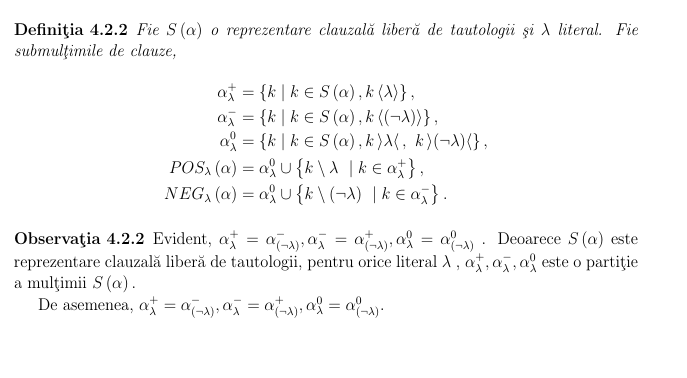
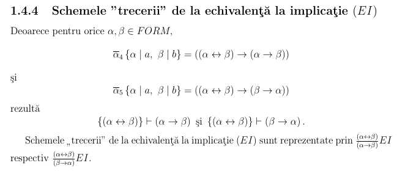
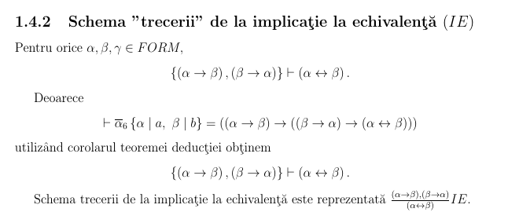

# Notiţe

- [Notiţe](#notiţe)
    - [Axiome](#axiome)
    - [Dublă negaţie (DN)](#dublă-negaţie-dn)
    - [DvP](#dvp)
    - [Echivalenţă la Implicaţie (EI)](#echivalenţă-la-implicaţie-ei)
    - [Gentzen](#gentzen)
    - [Funcţie de Interpretare I](#funcţie-de-interpretare-i)
    - [Implicaţie la Echivalenţă (IE)](#implicaţie-la-echivalenţă-ie)
    - [Modus Ponens (MP)](#modus-ponens-mp)
    - [Schema Permutării Premiselor (PP)](#schema-permutării-premiselor-pp)
    - [rez](#rez)
    - [REZ](#rez-1)
    - [Schema Silogismului (RS)](#schema-silogismului-rs)
    - [Substituţie](#substituţie)
    - [Tablou Semantic](#tablou-semantic)
    - [Teorema Deductiei](#teorema-deductiei)

### Axiome

### Dublă negaţie (DN)

### DvP

### Echivalenţă la Implicaţie (EI)

### Gentzen

### Funcţie de Interpretare I

### Implicaţie la Echivalenţă (IE)

### Modus Ponens (MP)

### Schema Permutării Premiselor (PP)

### rez

### REZ

### Schema Silogismului (RS)

### Substituţie

### Tablou Semantic

### Teorema Deductiei

