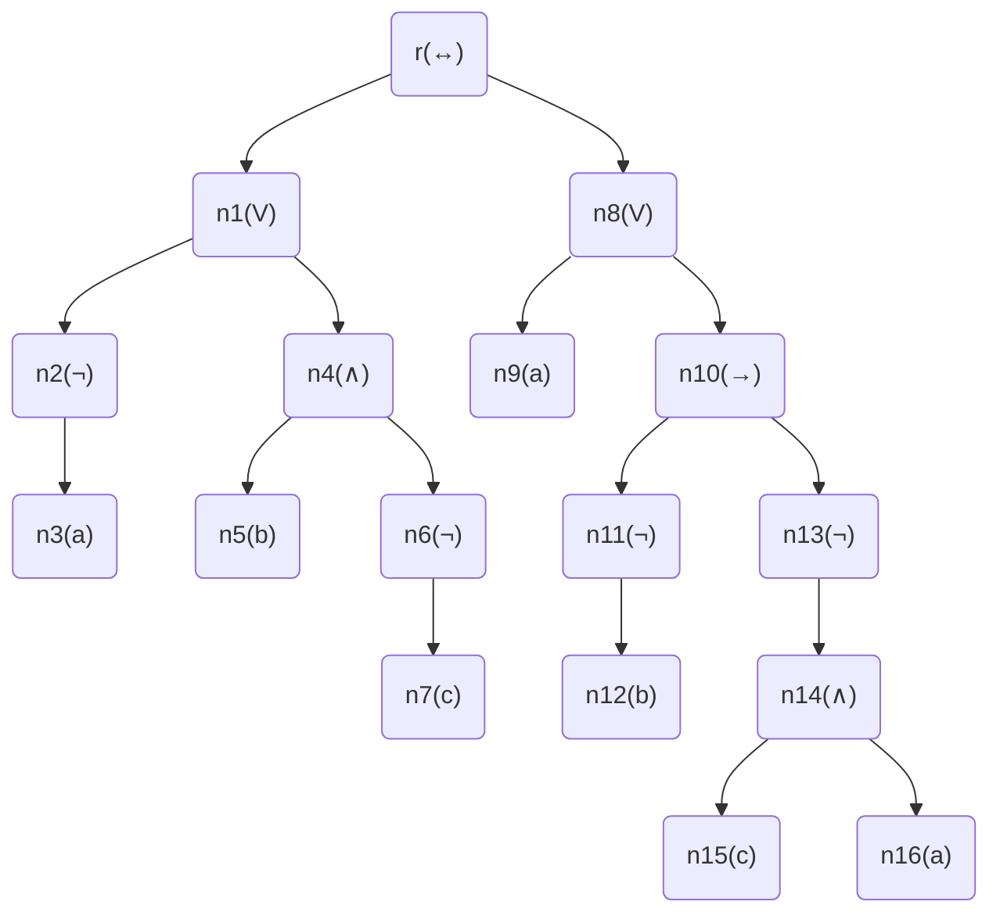
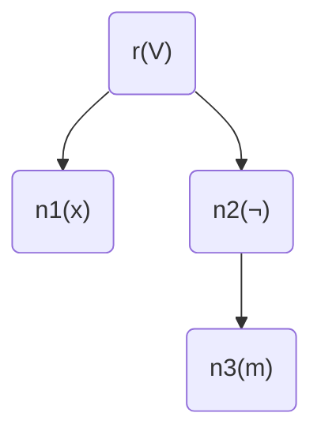
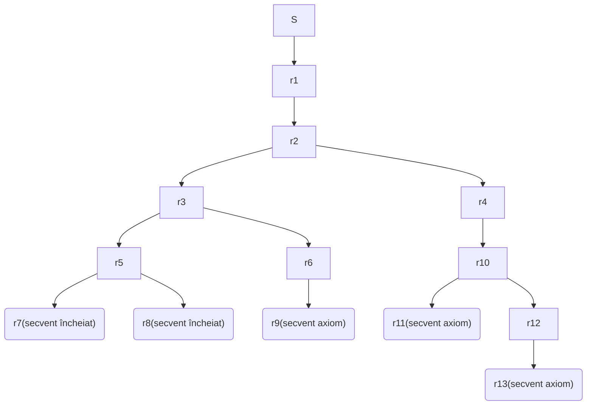

# Laborator5 - Temă - Model 1

## Petculescu Mihai-Silviu

- [Laborator5 - Temă - Model 1](#laborator5---temă---model-1)
  - [Petculescu Mihai-Silviu](#petculescu-mihai-silviu)
    - [Exerciţiul 1.0.1.](#exerciţiul-101)
    - [Exerciţiul 1.0.2.](#exerciţiul-102)
    - [Exerciţiul 1.0.3.](#exerciţiul-103)

### Exerciţiul 1.0.1.

Se consideră formula
$$
\alpha = ((\neg a \or (b \and \neg c)) \leftrightarrow (a \or (\neg b \to \neg(c \and a))))
$$
şi substituţia
$$
\sigma = \{(x \or \neg m)|\alpha,(d \and \neg t)|a,(q \or p)|m, a|q\}
$$
Să se determine:

- secvenţa generativă formule (SGF) pentru formula $ \alpha $
- tabelul de adevăr pentru formula $ \alpha $
- arborele de structură pentru formula $ \alpha $ 
- $ \alpha \sigma $ rezultatul aplicării substituţiei $ \sigma $ pentru formula $ \alpha $ şi arborele de structură asociat lui $ \alpha \sigma $

Rezolvare

**SGF**:
$$
a,b,c,\neg a,\neg b,\neg c,b \and\neg c,\neg a \or (b \and\neg c),c \and a,\neg(c \and a),\neg b \to\neg(c \and a), a\or(\neg b \to\neg(c \and a)),\\
((\neg a \or (b \and \neg c)) \leftrightarrow (a \or (\neg b \to \neg(c \and a)))) = \alpha
$$
**Tabel de Adevăr**:

| $a$  | $b$  | $c$  | $b \and \neg c$ | $\neg a \or (b \and\neg c)$ | $\neg(c \and a)$ | $\neg b \to\neg(c \and a)$ | $a\or(\neg b \to\neg(c \and a))$ | $ \alpha $ |
| :--: | :--: | :--: | :-------------: | :-------------------------: | :--------------: | :------------------------: | :------------------------------: | :--------: |
|  T   |  T   |  T   |        F        |              F              |        F         |             T              |                T                 |     F      |
|  T   |  T   |  F   |        T        |              T              |        T         |             T              |                T                 |     T      |
|  T   |  F   |  T   |        F        |              F              |        F         |             F              |                T                 |     F      |
|  T   |  F   |  F   |        F        |              F              |        T         |             T              |                T                 |     F      |
|  F   |  T   |  T   |        F        |              T              |        T         |             T              |                T                 |     T      |
|  F   |  T   |  F   |        T        |              T              |        T         |             T              |                T                 |     T      |
|  F   |  F   |  T   |        F        |              T              |        T         |             T              |                T                 |     T      |
|  F   |  F   |  F   |        F        |              T              |        T         |             T              |                T                 |     T      |

**Arbore de Structură**:
$$
\begin{align}
&r\\
T(\alpha):\ \swarrow&\searrow\ ,
\varphi(r)=\leftrightarrow,
\beta=\neg a \or (b \and \neg c),
\gamma=a \or (\neg b \to \neg(c \and a))\\
T(\beta)\ &\ \ T(\gamma)\\
\\
&n_1\\
T(\beta):\ \swarrow&\searrow\ ,
\varphi(n_1)=\or,
\beta_1=\neg a,
\beta_2=b \and \neg c\\
T(\beta_1)\ &\ \ T(\beta_2)\\
\\
&n_2\\
T(\beta_1):\ &\downarrow\ ,
\varphi(n_2)=\neg,
\beta_3=a\\
T&(\beta_3)\\
\\
&T(\beta_3)=n_3, \varphi(n_3)=a\\
\\
&n_4\\
T(\beta):\ \swarrow&\searrow\ ,
\varphi(n_4)=\and,
\beta_4=b,
\beta_5=\neg c\\
T(\beta_4)\ &\ \ T(\beta_5)\\
\\
&T(\beta_4)=n_5, \varphi(n_5)=b\\
\\
&n_6\\
T(\beta_5):\ &\downarrow\ ,
\varphi(n_6)=\neg,
\beta_6=c\\
T&(\beta_6)\\
\\
&T(\beta_6)=n_7, \varphi(n_7)=c\\
\\
&n_8\\
T(\gamma):\ \swarrow&\searrow\ ,
\varphi(n_8)=\and,
\gamma_1=a,
\gamma_2=\neg b \to \neg(c \and a)\\
T(\gamma_1)\ &\ \ T(\gamma_2)\\
\\
&T(\gamma_1)=n_9, \varphi(n_9)=a\\
\\
&n_{10}\\
T(\gamma_2):\ \swarrow&\searrow\ ,
\varphi(n_{10})=\to,
\gamma_3=\neg b,
\gamma_4=\neg(c \and a)\\
T(\gamma_3)\ &\ \ T(\gamma_4)\\
\\
&n_{11}\\
T(\gamma_3):\ &\downarrow\ ,
\varphi(n_{11})=\neg,
\gamma_5=b\\
T&(\gamma_5)\\
\\
&T(\gamma_5)=n_{12}, \varphi(n_{12})=b\\
\\
&n_{13}\\
T(\gamma_4):\ &\downarrow\ ,
\varphi(n_{13})=\neg,
\gamma_6=c \and a\\
T&(\gamma_6)\\
\\
&n_{14}\\
T(\gamma_6):\ \swarrow&\searrow\ ,
\varphi(n_{14})=\and,
\gamma_7=c,
\gamma_8=a\\
T(\gamma_7)\ &\ \ T(\gamma_8)\\
\\
&T(\gamma_7)=n_{15}, \varphi(n_{15})=c\\
\\
&T(\gamma_8)=n_{16}, \varphi(n_{16})=a\\
\end{align}
$$
**Final**:

**Aplicare substituţie** $\alpha\sigma$:
$$
\alpha\sigma = x \or\neg m
$$

### Exerciţiul 1.0.2.

a) Să se verifice dacă următorul secvent este demonstrabil:
$$
S = \{(\alpha \or (\neg\beta)),(\beta \or (\gamma \and \theta))\} \Rightarrow \{\neg \alpha \to (\theta \and \gamma)\}
$$
**Sistem**:
$$
\begin{align}
&S = \{(\alpha \or \neg\beta),(\beta \or (\gamma \and \theta))\} \Rightarrow \{\neg \alpha \to (\theta \and \gamma)\} \\
G8:\ & r1=\{\alpha \or \neg\beta, \beta\or (\gamma\and\theta), \neg\theta\} \Rightarrow \{\theta \and \gamma\} \\
G1:\ & r2=\{\alpha \or \neg\beta, \beta\or (\gamma\and\theta)\} \Rightarrow \{\theta,\theta \and \gamma\} \\
G3:\ & r3=\{\alpha, \beta\or (\gamma\and\theta)\} \Rightarrow \{\theta,\theta \and \gamma\} \\
& r4=\{\neg\beta, \beta\or (\gamma\and\theta)\} \Rightarrow \{\theta,\theta \and \gamma\} \\
G3:\ & r5=\{\alpha, \beta\} \Rightarrow \{\theta,\theta \and \gamma\} \\
& r6=\{\alpha, \gamma\and\theta)\} \Rightarrow \{\theta,\theta \and \gamma\} \\
G6:\ & r7=\{\alpha, \beta\} \Rightarrow \{\theta\}\ secvent\ incheiat\\
& r8=\{\alpha, \beta\} \Rightarrow \{\theta,\gamma\}\ secvent\ incheiat\\
G2:\ & r9=\{\alpha, \gamma, \theta)\} \Rightarrow \{\theta,\theta \and \gamma\}\ secvent\ axiom \\
G1:\ & r10=\{\beta\or (\gamma\and\theta)\} \Rightarrow \{\beta, \theta,\theta \and \gamma\} \\
G3:\ & r11=\{\beta\} \Rightarrow \{\beta, \theta,\theta \and \gamma\}\ secvent\ axiom\\
& r12=\{\gamma\and\theta\} \Rightarrow \{\beta, \theta,\theta \and \gamma\} \\
G2:\ & r13=\{\gamma, \theta\} \Rightarrow \{\beta, \theta,\theta \and \gamma\}\ secvent\ axiom\\
&S\ nu\ e\ tautologie
\end{align}
$$
**Schema**:

b) Să se calculeze mulţimile $\alpha_{\lambda}^{+}$, $\alpha_{\lambda}^{-}$, $\alpha_{\lambda}^{0}$,$POS_{\lambda}^{\alpha}$, $NEG_{\lambda}^{\alpha}$, $REZ_{\lambda}^{\alpha}$, unde $\lambda=\beta$, respectiv $\lambda=\neg\delta$, iar:
$$
S(\alpha)=\{\neg\gamma \or \beta \or \neg\eta,\neg\beta \or \delta \or \neg\gamma, \neg\delta, \beta, \theta \or \beta, \delta \or \beta \or \neg\theta, \gamma \or \eta \or \neg\delta\}
$$
**Pentru** $\lambda=\beta$:
$$
\begin{align}
\alpha_{\lambda}^{+}&=\{\neg\gamma \or \beta \or \neg\eta, \beta, \theta \or \beta, \delta \or \beta \or \neg\theta\}\\
\alpha_{\lambda}^{-}&=\{\neg\beta \or \delta \or \neg\gamma\}\\
\alpha_{\lambda}^{0}&=\{\neg\delta, \gamma \or \eta \or \neg\delta\}\\
POS_{\lambda}^{\alpha}&=\{\neg\delta,\gamma \or \eta \or \neg\delta, \neg\gamma \or \neg\eta, \square, \theta, \delta \or \neg\theta\}\\
NEG_{\lambda}^{\alpha}&=\{\neg\delta, \gamma \or \eta \or \neg\delta, \delta \or \neg\gamma\}\\
REZ_{\lambda}^{\alpha}&=\{\neg\delta, \gamma \or \eta \or \neg\delta, \delta \or \neg\gamma \or \neg\eta, \delta \or \neg\gamma \or \square, \delta \or \neg\gamma \or \theta, \delta \or \neg\gamma \or \neg\theta\}\\
\end{align}
$$
**Pentru** $\lambda=\neg\delta$:
$$
\begin{align}
\alpha_{\lambda}^{+}&=\{\neg\delta, \gamma \or \eta \or \neg\delta\}\\
\alpha_{\lambda}^{-}&=\{\neg\beta \or \delta \or \neg\gamma, \delta \or \beta \or \neg\theta\}\\
\alpha_{\lambda}^{0}&=\{\neg\gamma \or \beta \or \neg\eta, \beta, \theta \or \beta\}\\
POS_{\lambda}^{\alpha}&=\{\neg\gamma \or \beta \or \neg\eta, \beta, \theta \or \beta, \square, \gamma \or \eta\}\\
NEG_{\lambda}^{\alpha}&=\{\neg\gamma \or \beta \or \neg\eta, \beta, \theta \or \beta, \neg\beta \or \neg\gamma, \beta \or \neg\theta\}\\
REZ_{\lambda}^{\alpha}&=\{\neg\gamma \or \beta \or \neg\eta, \beta, \theta \or \beta, \neg\beta \or \neg\gamma \or \square, \neg\beta \or \eta, \beta \or \neg\theta \or \square, \beta \or \neg\theta \or \gamma \or \eta\}\\
\end{align}
$$

### Exerciţiul 1.0.3.

Să se determine forma normală conjunctivă (CNF) şi să se aplice algoritmul bazat pe rezoluţie pentru formula:
$$
\alpha = ((b \to (\neg a)) \leftrightarrow (\neg c \to d))
$$
**CNF**:
$$
((b \to\neg a) \to (\neg c \to d)) \and ((\neg c \to d) \to (b \to\neg a)) \\
(\neg(\neg b \or\neg a) \or (c \or d)) \and (\neg(c \or d) \or (\neg b \or\neg a)) \\
((b \and a) \or (c \or d)) \and ((\neg c \and\neg d) \or (\neg b \or\neg a)) \\
(a \or c \or d) \and (b \or c \or d) \and (\neg c \or\neg b \or\neg a) \and (\neg d \or\neg b \or\neg a)
$$
**Soluţie**:
$$
\begin{align}
Initializare:\ & \gamma \leftarrow \{a \or c \or d, b \or c \or d, \neg c \or\neg b \or\neg a, \neg d \or\neg b \or\neg a\} \\
Iteratia\ 1:\ &Nu\ exista\ clauze\ unitare\ si\ nici\ literali\ puri\\
&alegem\ \lambda=a\ literal\\
&\gamma \leftarrow REZ_a(\gamma)=\{b \or c \or d, \neg b \or d, \neg b \or c\}\\
Iteratia\ 2:\ &\lambda = c\ literal\ pur\\
&\gamma \leftarrow NEG_c(\gamma)=\{\neg b \or d\}\\
Iteratia\ 3:\ &\lambda = d\ literal\ pur\\
&\gamma \leftarrow NEG_d(\gamma)=\O\\
Iteratia\ 4:\ &\gamma = \O \Rightarrow write\ "validabila", sw \leftarrow true\\
& \Rightarrow STOP
\end{align}
$$

