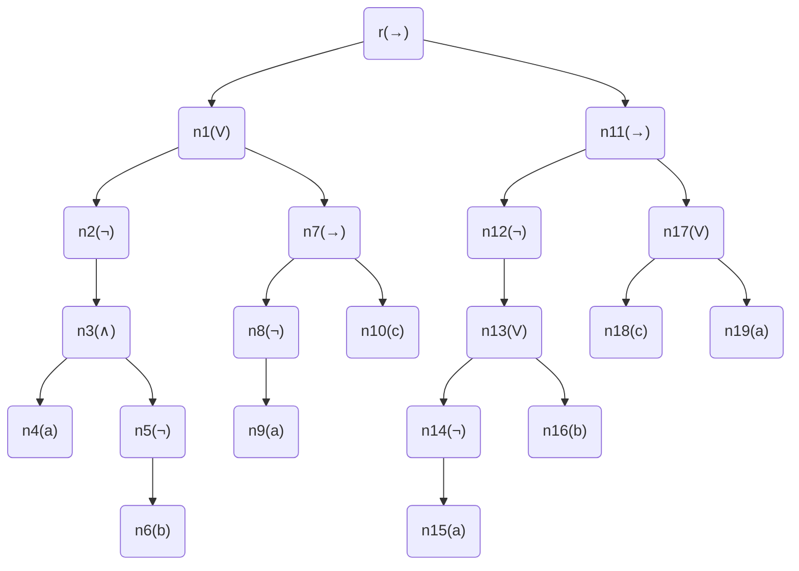
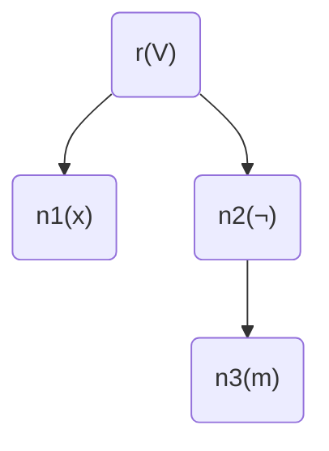
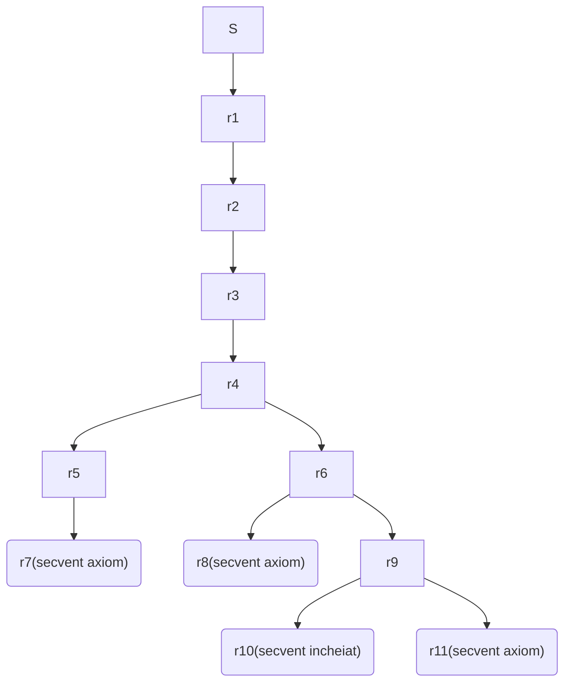

# Laborator5 - Temă - Model2

## Petculescu Mihai-Silviu

- [Laborator5 - Temă - Model2](#laborator5---temă---model2)
  - [Petculescu Mihai-Silviu](#petculescu-mihai-silviu)
    - [Exerciţiu 1.0.4.](#exerciţiu-104)
    - [Exerciţiul 1.0.5.](#exerciţiul-105)
    - [Exerciţiul 1.0.6.](#exerciţiul-106)

### Exerciţiu 1.0.4.

Se consideră formula
$$
\alpha = (\neg(a \and (\neg b)) \or (\neg a \to c)) \to (\neg(\neg a \or b) \to (c \or a))
$$
şi substituţia
$$
\sigma=\{(x \or \neg m)|\alpha,(m \and n)|a,(q \and p)|m, a|q\}
$$
Să se determine:
- secvenţa generativă formule (SGF) pentru formula $\alpha$
- tabelul de adevăr pentru formula $\alpha$
- arborele de structură pentru formula $\alpha$
- $\alpha\sigma$ - rezultatul aplicării substituţiei $\sigma$ pentru formula $\alpha$ şi arborele de structură asociat lui $\alpha\sigma$

**SGF**:
$$
a,b,c,\neg a,\neg b,a \and\neg b,\neg(a \and\neg b),\neg a \to c,(\neg(a \and\neg b))\or(\neg a \to c),\neg a \or b,\neg(\neg a \or b),c \or a,\neg(\neg a \or b)\to(c \or a)\\
(\neg(a \and (\neg b)) \or (\neg a \to c)) \to (\neg(\neg a \or b) \to (c \or a)) = \alpha
$$
**Tabel de Adevăr**:

| $a$  | $b$  | $c$  | $\neg(a \and\neg b)$ | $\neg a \to c$ | $\neg(a \and (\neg b))\or(\neg a \to c)$ | $\neg(\neg a \or b)$ | $c \or a$ | $\neg(\neg a \or b) \to (c \or a)$ | $ \alpha $ |
| :--: | :--: | :--: | :------------------: | :------------: | :--------------------------------------: | :------------------: | :-------: | :--------------------------------: | :--------: |
|  T   |  T   |  T   |          T           |       T        |                    T                     |          F           |     T     |                 T                  |     T      |
|  T   |  T   |  F   |          T           |       T        |                    T                     |          F           |     T     |                 T                  |     T      |
|  T   |  F   |  T   |          F           |       T        |                    T                     |          T           |     T     |                 T                  |     T      |
|  T   |  F   |  F   |          F           |       T        |                    T                     |          T           |     T     |                 T                  |     T      |
|  F   |  T   |  T   |          T           |       T        |                    T                     |          F           |     T     |                 T                  |     T      |
|  F   |  T   |  F   |          T           |       F        |                    T                     |          F           |     F     |                 T                  |     T      |
|  F   |  F   |  T   |          T           |       T        |                    T                     |          F           |     T     |                 T                  |     T      |
|  F   |  F   |  F   |          T           |       F        |                    T                     |          F           |     F     |                 T                  |     T      |

**Arbore de structură**:
$$
\begin{align}
&r\\
T(\alpha):\ \swarrow&\searrow\ ,
\varphi(r)=\to,
\beta=\neg(a \and\neg b) \or (\neg a \to c),
\gamma=\neg(\neg a \or b) \to (c \or a)\\
T(\beta)\ &\ \ T(\gamma)\\
\\
&n_1\\
T(\beta):\ \swarrow&\searrow\ ,
\varphi(n_1)=\or,
\beta_1=\neg(a \and\neg b),
\beta_2=\neg a \to c\\
T(\beta_1)\ &\ \ T(\beta_2)\\
\\
&n_2\\
T(\beta_1):\ &\downarrow\ ,
\varphi(n_2)=\neg,
\beta_3=a \and\neg b\\
T&(\beta_3)\\
\\
&n_3\\
T(\beta_3):\ \swarrow&\searrow\ ,
\varphi(n_3)=\and,
\beta_4=a,
\beta_5=\neg b\\
T(\beta_4)\ &\ \ T(\beta_5)\\
\\
&T(\beta_4)=n_4, \varphi(n_4)=a\\
\\
&n_5\\
T(\beta_5):\ &\downarrow\ ,
\varphi(n_5)=\neg,
\beta_6=b\\
T&(\beta_6)\\
\\
&T(\beta_6)=n_6, \varphi(n_6)=b\\
\\
&n_7\\
T(\beta_2):\ \swarrow&\searrow\ ,
\varphi(n_7)=\to,
\beta_7=\neg a,
\beta_8=c\\
T(\beta_7)\ &\ \ T(\beta_8)\\
\\
&n_8\\
T(\beta_7):\ &\downarrow\ ,
\varphi(n_8)=\neg,
\beta_9=a\\
T&(\beta_9)\\
\\
&T(\beta_9)=n_9, \varphi(n_9)=a\\
\\
&T(\beta_8)=n_{10}, \varphi(n_{10})=c\\
\\
&n_{11}\\
T(\gamma):\ \swarrow&\searrow\ ,
\varphi(n_{11})=\to,
\gamma_1=\neg(\neg a \or b),
\gamma_2=c \or a\\
T(\gamma_1)\ &\ \ T(\gamma_2)\\
\\
&n_{12}\\
T(\gamma_1):\ &\downarrow\ ,
\varphi(n_{12})=\neg,
\gamma_3=\neg a \or b\\
T&(\gamma_3)\\
\\
&n_{13}\\
T(\gamma):\ \swarrow&\searrow\ ,
\varphi(n_{13})=\or,
\gamma_4=\neg a,
\gamma_5=b\\
T(\gamma_4)\ &\ \ T(\gamma_5)\\
\\
&n_{14}\\
T(\gamma_4):\ &\downarrow\ ,
\varphi(n_{14})=\neg,
\gamma_6=a\\
T&(\gamma_6)\\
\\
&T(\gamma_6)=n_{15}, \varphi(n_{15})=a\\
\\
&T(\gamma_5)=n_{16}, \varphi(n_{16})=b\\
\\
&n_{17}\\
T(\gamma):\ \swarrow&\searrow\ ,
\varphi(n_{17})=\or,
\gamma_7=c,
\gamma_8=a\\
T(\gamma_7)\ &\ \ T(\gamma_8)\\
\\
&T(\gamma_7)=n_{18}, \varphi(n_{18})=c\\
\\
&T(\gamma_8)=n_{19}, \varphi(n_{19})=a\\
\\
\end{align}
$$
**Final**:

**Aplicare substituţie** $\alpha\sigma$:
$$
\alpha\sigma = x \or\neg m
$$

### Exerciţiul 1.0.5.

a) Să se verifice dacă următorul secvent este demonstrabil:
$$
S=\{(a \or (b \to c)),(a \to (\neg c))\} \Rightarrow \{\neg(d \or (\neg(b)) \to (\neg c)\}
$$
**Sistem**:
$$
\begin{align}
&S=\{a \or (b \to c), a \to \neg c\} \Rightarrow \{\neg(d \or \neg b) \to \neg c\}\\
G8:\ & r1=\{a \or (b \to c), a \to \neg c, \neg(d \or \neg b)\} \Rightarrow \{\neg c\}\\
G1:\ & r2=\{a \or (b \to c), a \to \neg c\} \Rightarrow \{d \or \neg b, \neg c\}\\
G7:\ & r3=\{a \or (b \to c), a \to \neg c\} \Rightarrow \{d, \neg b, \neg c\}\\
G5:\ & r4=\{a \or (b \to c), a \to \neg c, c, b\} \Rightarrow \{d\}\\
G4:\ & r5=\{a \or (b \to c), \neg c, c, b\} \Rightarrow \{d\}\\
& r6=\{a \or (b \to c), c, b\} \Rightarrow \{a,d\}\\
G1:\ & r7=\{a \or (b \to c), c, b\} \Rightarrow \{d,c\}\ secvent\ axiom\\
G3:\ & r8=\{a, c, b\} \Rightarrow \{a,d\}\ secvent\ axiom\\
& r9=\{b \to c, c, b\} \Rightarrow \{a,d\}\\
G4:\ & r10=\{c, b\} \Rightarrow \{a,d\}\ secvent\ incheiat\\
& r11=\{c, b\} \Rightarrow \{b,a,d\}\ secvent\ axiom\\
& S\ nu\ e\ tautologie
\end{align}
$$
**Schema**:

b) Să se calculeze mulţimile $\alpha_{\lambda}^{+}$,$\alpha_{\lambda}^{-}$, $\alpha_{\lambda}^{0}$,$POS_{\lambda}^{\alpha}$, $NEG_{\lambda}^{\alpha}$, $REZ_{\lambda}^{\alpha}$, unde $\lambda = \eta$, respectiv $\lambda = \neg\theta$, iar:
$$
S(\alpha)=\{\neg\gamma \or \beta \or \neg\delta, \neg\beta \or \eta \or \neg\gamma, \neg\theta, \beta, \theta \or \beta \or \neg\eta, \delta \or \beta \or \neg\theta, \gamma \or \eta \or \neg\delta \}
$$
**Pentru** $\lambda = \eta$:
$$
\begin{align}
\alpha_{\lambda}^{+}&=\{\neg\beta \or \eta \or \neg\gamma, \gamma \or \eta \or \neg\delta\} \\
\alpha_{\lambda}^{-}&=\{\theta \or \beta \or \neg\eta\} \\
\alpha_{\lambda}^{0}&=\{\neg\gamma \or \beta \or \neg\delta, \neg\theta, \beta, \delta \or \beta \or \neg\theta\} \\
POS_{\lambda}^{\alpha}&=\{\neg\gamma \or \beta \or \neg\delta,\neg\beta \or \neg\gamma, \neg\theta, \beta, \delta \or \beta \or \neg\theta, \gamma \or \neg\delta\} \\
NEG_{\lambda}^{\alpha}&=\{\neg\gamma \or \beta \or \neg\delta, \neg\theta, \beta, \theta \or \beta, \delta \or \beta \or \neg\theta\} \\
REZ_{\lambda}^{\alpha}&=\{\neg\gamma \or \beta \or \neg\delta, \neg\theta, \beta, \delta \or \beta \or \neg\theta, \theta \or \neg\gamma, \theta \or \beta \or \gamma \or \neg\delta \} \\
\end{align}
$$
**Pentru** $\lambda = \neg\theta$:
$$
\begin{align}
\alpha_{\lambda}^{+}&=\{\neg\theta, \delta \or \beta \or \neg\theta\}\\
\alpha_{\lambda}^{-}&=\{\theta \or \beta \or \neg\eta\} \\
\alpha_{\lambda}^{0}&=\{\neg\gamma \or \beta \or \neg\delta, \neg\beta \or \eta \or \neg\gamma, \beta, \gamma \or \eta \or \neg\delta\} \\
POS_{\lambda}^{\alpha}&=\{\neg\gamma \or \beta \or \neg\delta, \neg\beta \or \eta \or \neg\gamma, \square, \beta, \delta \or \beta, \gamma \or \eta \or \neg\delta\} \\
NEG_{\lambda}^{\alpha}&=\{\neg\gamma \or \beta \or \neg\delta, \neg\beta \or \eta \or \neg\gamma, \beta, \beta \or \neg\eta, \gamma \or \eta \or \neg\delta\} \\
REZ_{\lambda}^{\alpha}&=\{\neg\gamma \or \beta \or \neg\delta, \neg\beta \or \eta \or \neg\gamma, \beta, \gamma \or \eta \or \neg\delta, \square \or \beta \or \neg\eta, \delta \or \beta \or \neg\eta\} \\
\end{align}
$$

### Exerciţiul 1.0.6.

Să se determine forma normală conjunctivă (CNF) şi să se aplice algoritmul *Davis-Putnam* pentru formula
$$
\alpha=((\neg a \or b) \leftrightarrow (d \to c))
$$
**CNF**:
$$
((\neg a \or b) \to (d \to c)) \and ((d \to c) \to (\neg a \or b))\\
(\neg(\neg a \or b) \or (\neg d \or c)) \and (\neg(\neg d \or c) \or (\neg a \or b))\\
((a \and\neg b) \or (\neg d \or c)) \and ((d \and\neg c) \or (\neg a \or b))\\
(a \or\neg d \or c) \and (\neg b \and\neg d \or c) \and (d \or\neg a \or b) \and (\neg c \or\neg a \or b)\\
$$
**Davis-Putnam**:
$$
\begin{align}
Initializare:&\ \gamma\leftarrow \{a \or\neg d \or c, \neg b \and\neg d \or c, d \or\neg a \or b, \neg c \or\neg a \or b\}\\
&\ sw\leftarrow false, T\leftarrow \O\\
Iteratia\ 1:&\ Nu\ exista\ literar\ pur\ sau \ clauza\ unitara\\
&\ alegem\ \lambda = b\ literar\\
&\ \gamma\leftarrow NEG_b(\gamma) = \{a \or\neg d \or c, \neg d \or c\}\\
&\ T \leftarrow POS_b(\gamma) = \{a \or\neg d \or c, d \or\neg a, \neg c \or\neg a\}\\
Iteratia\ 2:&\ \lambda = c\ literar\ pur\\
&\ \gamma\leftarrow NEG_c(\gamma) = \O\\
Iteratia\ 3:&\ \gamma = \O, \gamma\leftarrow T = \{a \or\neg d \or c, d \or\neg a, \neg c \or\neg a\}\\
&\ T = \O\\
Iteratia\ 4:&\ Nu\ exista\ literar\ pur\ sau \ clauza\ unitara\\
&\ alegem\ \lambda = a\ literar\\
&\ \gamma\leftarrow NEG_a(\gamma) = \{d, \neg c\}\\
&\ T \leftarrow POS_a(\gamma) = \{\neg d \or c\}\\
Iteratia\ 5:&\ \lambda = d\ clauza\ unitara\\
&\ \gamma\leftarrow NEG_d(\gamma) = \{\neg c\}\\
Iteratia\ 6:&\ \lambda = \neg c\ clauza\ unitara\\
&\ \gamma\leftarrow NEG_{\neg c}(\gamma) = \O\\
Iteratia\ 7:&\ \gamma = \O, \gamma\leftarrow T=\{\neg d \or c\}\\
&\ T = \O\\
Iteratia\ 8:&\ \lambda = c\ literar\ pur\\
&\ \gamma\leftarrow NEG_c(\gamma) = \O\\
Iteratia\ 9:&\ \gamma=\O \Rightarrow write('validalibila'),\ sw\leftarrow true\\
\end{align}
$$

