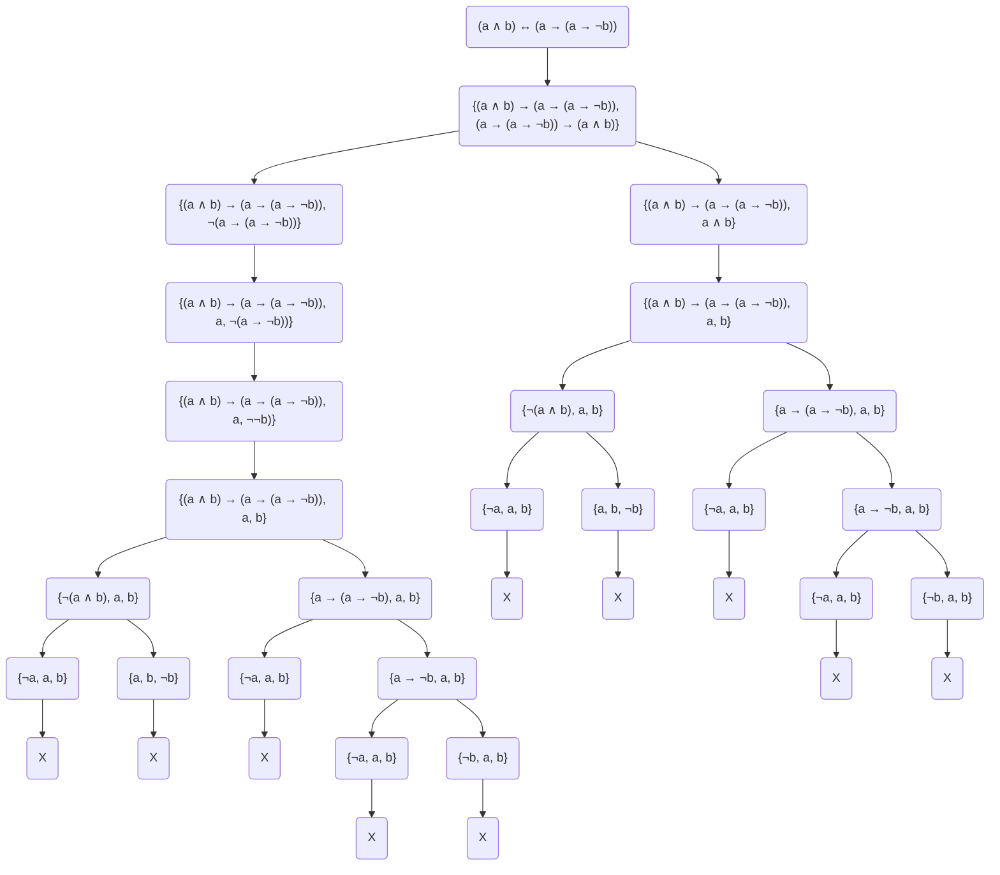
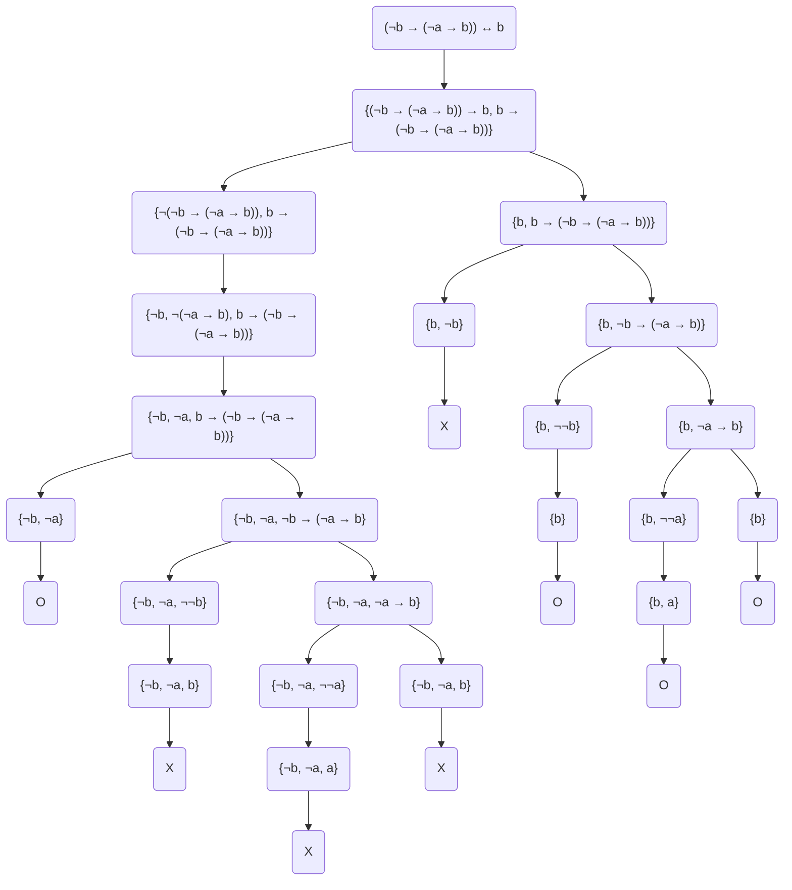
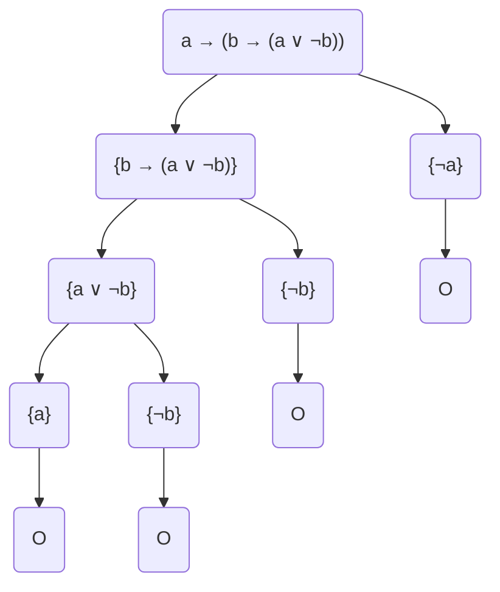
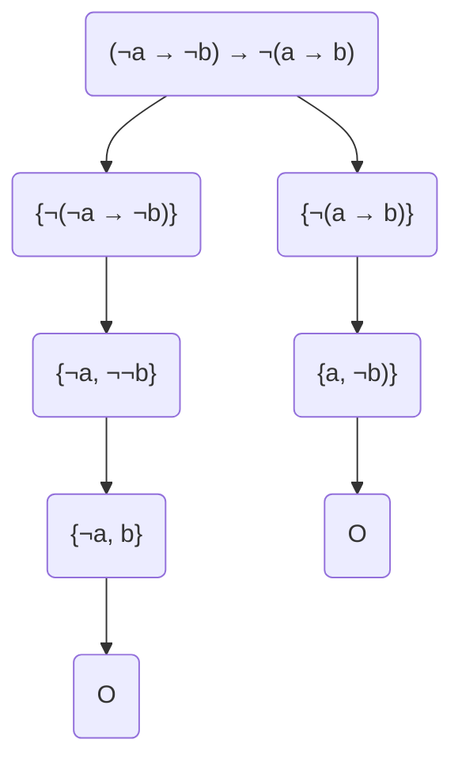
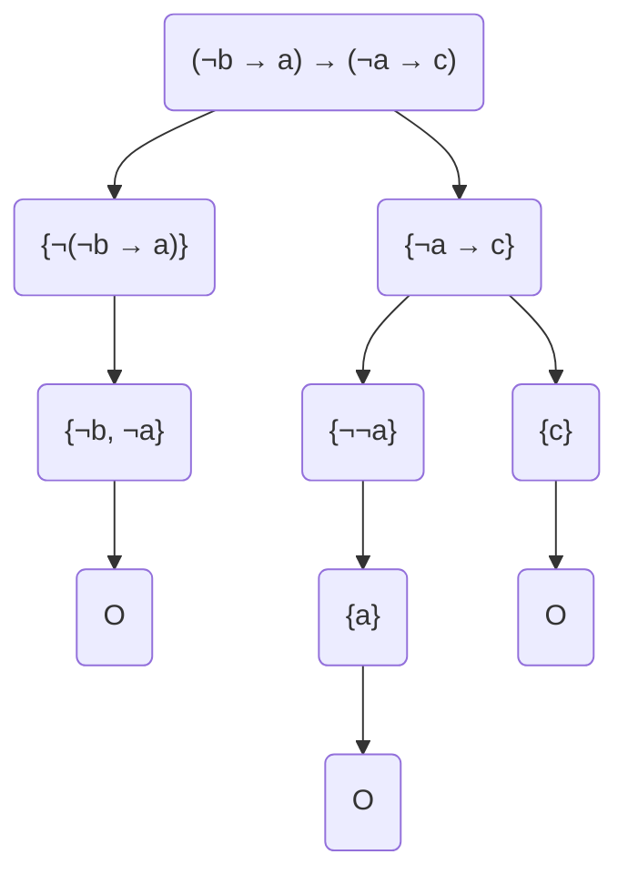
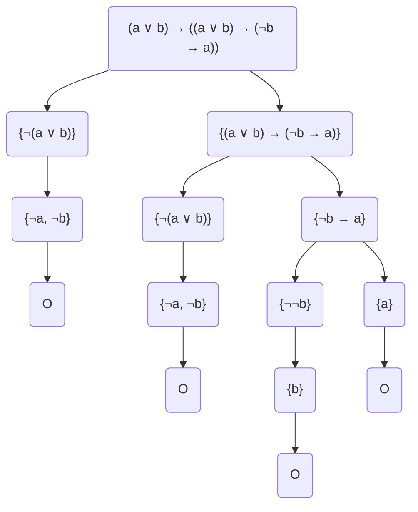
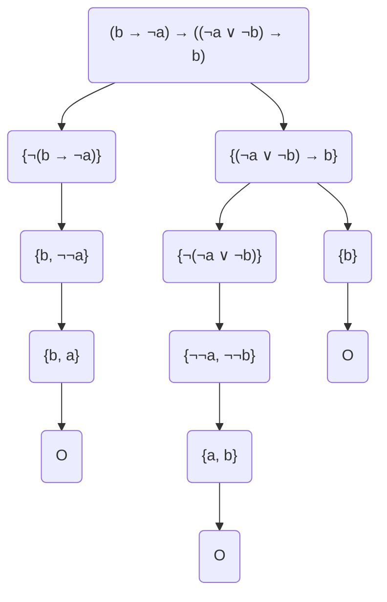
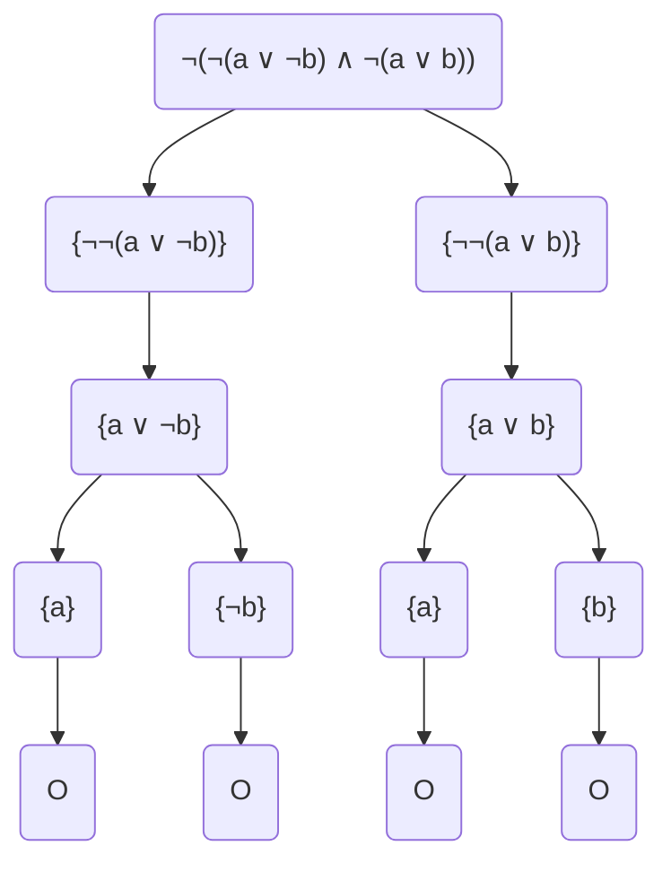
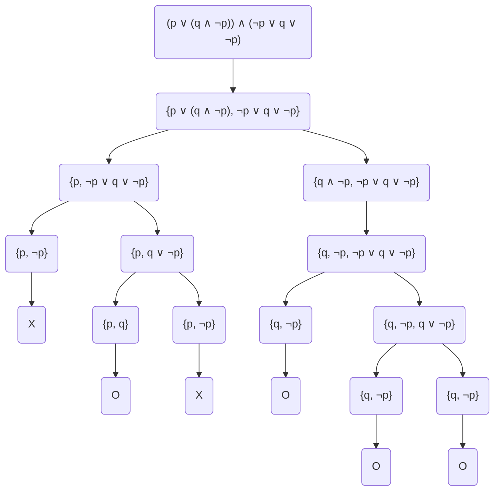
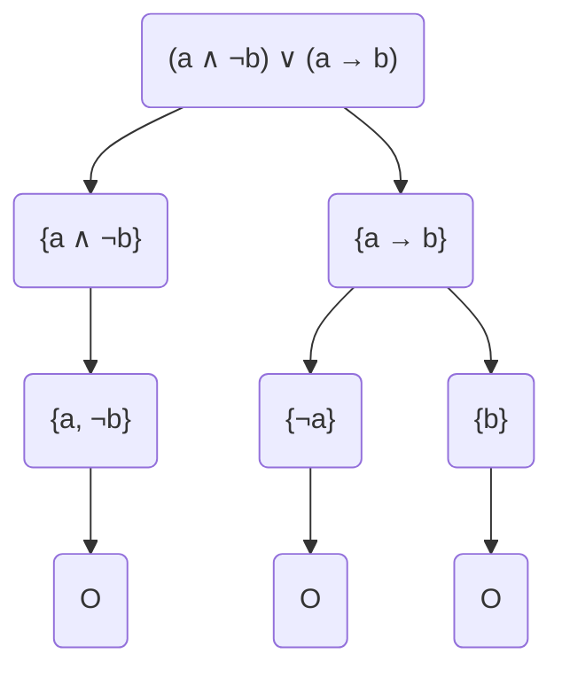

# Laborator6 - Temă

## Petculescu Mihai-Silviu

- [Laborator6 - Temă](#laborator6---temă)
  - [Petculescu Mihai-Silviu](#petculescu-mihai-silviu)
    - [Exerciţiu 1.0.1. Să se construiască arborii semantici pentru următoarele formule:](#exerciţiu-101-să-se-construiască-arborii-semantici-pentru-următoarele-formule)

### Exerciţiu 1.0.1. Să se construiască arborii semantici pentru următoarele formule:

1) $(a \and b) \leftrightarrow (a \to (a \to \neg b))$

2) $(\neg b \to (\neg a \to b) \leftrightarrow b)$

3) $a \to (b \to (a \or \neg b))$

4) $(\neg a \to \neg b) \to \neg (a \to b)$

5) $(\neg b \to a) \to (\neg a \to c)$

6) $(a \or b) \to ((a \or b) \to (\neg b \to a))$

7) $(b \to \neg a) \to ((\neg a \or \neg b) \to b)$

8) $\neg(\neg(a \or \neg b) \and \neg (a \or b))$

9) $(p \or (q \and \neg p)) \and (\neg p \or q \or \neg p)$

10) $(a \and \neg b) \or (a \to b)$

