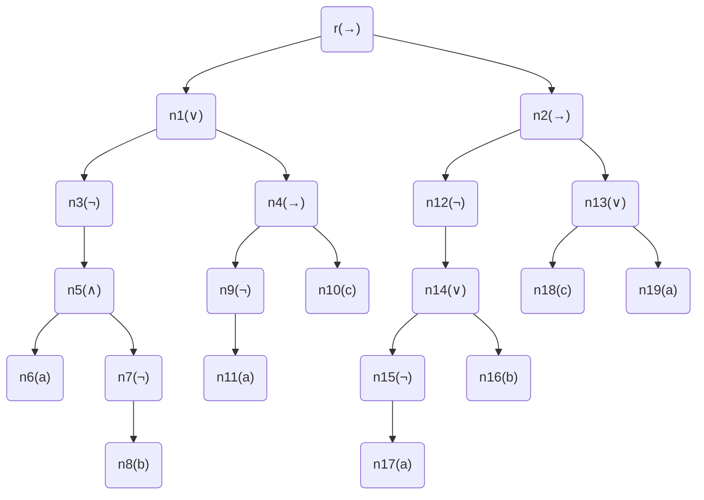
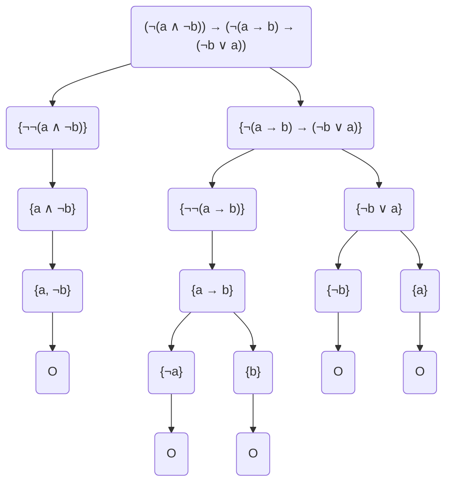
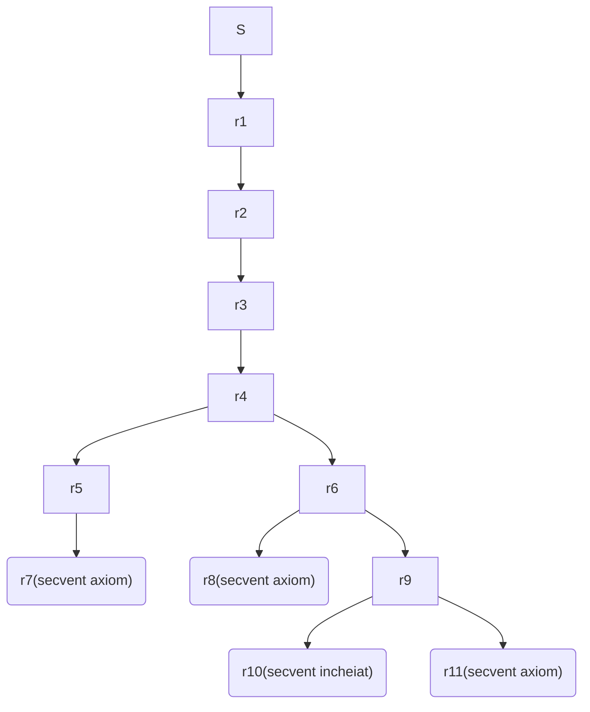

# Laborator12 - Temă - Model 2

## Petculescu Mihai-Silviu

- [Laborator12 - Temă - Model 2](#laborator12---temă---model-2)
  - [Petculescu Mihai-Silviu](#petculescu-mihai-silviu)
    - [Exerciţiul 1.0.1](#exerciţiul-101)
    - [Exerciţiul 1.0.2](#exerciţiul-102)
    - [Exerciţiul 1.0.3](#exerciţiul-103)
    - [Exerciţiul 1.0.4](#exerciţiul-104)

### Exerciţiul 1.0.1

Se consideră formula
$$
\alpha = (\neg(a \and \neg b) \or (\neg a \to c)) \to (\neg(\neg a \or b) \to (c \or a))
$$
şi substituţia
$$
\sigma = \{(x \or \neg m)|\alpha, (m \and n)|a, (q \or p)|m, a|q\}
$$
Să se determine:

- secvenţa generativă formule (SGF) pentru formula $\alpha$
- tabelul de adevăr pentru formula $\alpha$
- arborele de structură pentru formula $\alpha$
- $\alpha\sigma$ - rezultatul aplicării substituţiei $\sigma$ pentru formula $\alpha$ şi arborele de structură asociat lui $\alpha\sigma$

Rezolvare

**SGF**:
$$
a,b,c,\neg a,\neg b,a \and \neg b, \neg(a \and\neg b), \neg a \to c, (\neg(a \and\neg b) \or (\neg a \to c)), \neg a \or b, \neg(\neg a \or b), c \or a, (\neg(\neg a \or b) \to (c\or a)),\\
(\neg(a \and \neg b) \or (\neg a \to c)) \to (\neg(\neg a \or b) \to (c \or a)) = \alpha
$$
**Tabel de Adevăr**:

| $a$  | $b$  | $c$  | $a \and \neg b$ | $\neg a \to c$ | $\neg(a \and \neg b) \or (\neg a \to c)$ | $\neg a \or b$ | $c \or a$ | $\neg(\neg a \or b) \to (c \or a)$ | $\alpha$ |
| :--: | :--: | :--: | :-------------: | :------------: | :--------------------------------------: | :------------: | :-------: | :--------------------------------: | :------: |
|  T   |  T   |  T   |        F        |       T        |                    T                     |       T        |     T     |                 T                  |    T     |
|  T   |  T   |  F   |        F        |       T        |                    T                     |       T        |     T     |                 T                  |    T     |
|  T   |  F   |  T   |        T        |       T        |                    T                     |       F        |     T     |                 T                  |    T     |
|  T   |  F   |  F   |        T        |       T        |                    T                     |       F        |     T     |                 T                  |    T     |
|  F   |  T   |  T   |        F        |       T        |                    T                     |       T        |     T     |                 T                  |    T     |
|  F   |  T   |  F   |        F        |       F        |                    T                     |       T        |     F     |                 T                  |    T     |
|  F   |  F   |  T   |        F        |       T        |                    T                     |       T        |     T     |                 T                  |    T     |
|  F   |  F   |  F   |        F        |       F        |                    T                     |       T        |     F     |                 T                  |    T     |

**Arbore de Structură**:
$$
\begin{align}
&r\\
T(\alpha):\ \swarrow&\searrow\ ,
\varphi(r)=\to,
\beta=\neg(a \and \neg b) \or (\neg a \to c),
\gamma=\neg(\neg a \or b) \to (c \or a)\\
T(\beta)\ &\ \ T(\gamma)\\
\\
&n_1\\
T(\beta):\ \swarrow&\searrow\ ,
\varphi(n_1)=\or,
\beta_1=\neg(a \and \neg b),
\beta_2=\neg a \to c\\
T(\beta_1)\ &\ \ T(\beta_2)\\
\\
&n_3\\
T(\beta_1):\ &\downarrow\ ,
\varphi(n_3)=\neg,
\beta_3=a \and \neg b\\
T&(\beta_3)\\
\\
&n_5\\
T(\beta_3):\ \swarrow&\searrow\ ,
\varphi(n_5)=\and,
\beta_4=a,
\beta_5=\neg b\\
T(\beta_4)\ &\ \ T(\beta_5)\\
\\
&T(\beta_4)=n_6, \varphi(n_6)=a\\
\\
&n_7\\
T(\beta_5):\ &\downarrow\ ,
\varphi(n_7)=\neg,
\beta_6=b\\
T&(\beta_6)\\
\\
&T(\beta_6)=n_8, \varphi(n_8)=b\\
\\
&n_4\\
T(\beta_2):\ \swarrow&\searrow\ ,
\varphi(n_4)=\to,
\beta_7=\neg a,
\beta_8=c\\
T(\beta_7)\ &\ \ T(\beta_8)\\
\\
&T(\beta_8)=n_{10}, \varphi(n_{10})=c\\
\\
&n_9\\
T(\beta_7):\ &\downarrow\ ,
\varphi(n_9)=\neg,
\beta_9=a\\
T&(\beta_9)\\
\\
&T(\beta_9)=n_{11}, \varphi(n_{11})=a\\
\\
&n_2\\
T(\gamma):\ \swarrow&\searrow\ ,
\varphi(n_2)=\to,
\gamma_1=\neg(\neg a \or b),
\gamma_2=c \or a\\
T(\gamma_1)\ &\ \ T(\gamma_2)\\
\\
&n_{12}\\
T(\gamma_1):\ &\downarrow\ ,
\varphi(n_{12})=\neg,
\gamma_3=\neg a \or b\\
T&(\gamma_3)\\
\\
&n_{14}\\
T(\gamma_3):\ \swarrow&\searrow\ ,
\varphi(n_{14})=\or,
\gamma_4=\neg a,
\gamma_5=b\\
T(\gamma_4)\ &\ \ T(\gamma_5)\\
\\
&T(\gamma_5)=n_{16}, \varphi(n_{16})=b\\
\\
&n_{15}\\
T(\gamma_1):\ &\downarrow\ ,
\varphi(n_{15})=\neg,
\gamma_6=a\\
T&(\gamma_6)\\
\\
&T(\gamma_6)=n_{17}, \varphi(n_{17})=a\\
\\
&n_{13}\\
T(\gamma_2):\ \swarrow&\searrow\ ,
\varphi(n_{13})=\or,
\gamma_7=c,
\gamma_8=a\\
T(\gamma_7)\ &\ \ T(\gamma_8)\\
\\
&T(\gamma_7)=n_{18}, \varphi(n_{18})=a\\
\\
&T(\gamma_8)=n_{19}, \varphi(n_{19})=a\\
\\
\end{align}
$$

**Final**:

### Exerciţiul 1.0.2

Se consideră formula $\alpha = (\neg(a \and \neg b)) \to (\neg(a \to b) \to (\neg b \or a))$

a) Să se verifice validabilitatea formulei $\alpha$ prin aplicarea metodei arborilor semantici.

b) Să se determine rezultatul aplicării funcţiei de interpretare $I(\alpha)$ asupra formulei $\alpha$.

$$
\begin{align}
I(\alpha) &= \neg I(a \and \neg b) \to I(\neg(a \to b) \to (\neg b \or a))\\
&= \neg\neg(I(a) \and \neg I(b)) \or (\neg\neg I(\neg a  \or b) \or I(\neg b \or a))\\
&= (I(a) \and \neg I(b)) \or (\neg I(a) \or I(b) \or \neg I(b) \or I(a))\\
&= (I(a) \and \neg I(b)) \or (T \or T)\\
&= (I(a) \and \neg I(b)) \or T = T\\
\end{align}
$$

### Exerciţiul 1.0.3

a) Să se verifice dacă următorul secvent este demonstrabil:
$$
S = \{(a \or (b \to c)), (a \to \neg c)\} \Rightarrow \{\neg (d \or \neg b) \to \neg c\}
$$
**Sistem**:
$$
\begin{align}
&S=\{a \or (b \to c), a \to \neg c\} \Rightarrow \{\neg(d \or \neg b) \to \neg c\}\\
G8:\ & r1=\{a \or (b \to c), a \to \neg c, \neg(d \or \neg b)\} \Rightarrow \{\neg c\}\\
G1:\ & r2=\{a \or (b \to c), a \to \neg c\} \Rightarrow \{d \or \neg b, \neg c\}\\
G7:\ & r3=\{a \or (b \to c), a \to \neg c\} \Rightarrow \{d, \neg b, \neg c\}\\
G5:\ & r4=\{a \or (b \to c), a \to \neg c, c, b\} \Rightarrow \{d\}\\
G4:\ & r5=\{a \or (b \to c), \neg c, c, b\} \Rightarrow \{d\}\\
& r6=\{a \or (b \to c), c, b\} \Rightarrow \{a,d\}\\
G1:\ & r7=\{a \or (b \to c), c, b\} \Rightarrow \{d,c\}\ secvent\ axiom\\
G3:\ & r8=\{a, c, b\} \Rightarrow \{a,d\}\ secvent\ axiom\\
& r9=\{b \to c, c, b\} \Rightarrow \{a,d\}\\
G4:\ & r10=\{c, b\} \Rightarrow \{a,d\}\ secvent\ incheiat\\
& r11=\{c, b\} \Rightarrow \{b,a,d\}\ secvent\ axiom\\
& S\ nu\ e\ tautologie
\end{align}
$$
**Schema**:

b) Să se calculeze mulţimile $\alpha_{\lambda}^+$,  $\alpha_{\lambda}^-$,  $\alpha_{\lambda}^0$,  $POS_{\lambda}(\alpha)$, $NEG_{\lambda}(\alpha)$, $REZ_{\lambda}(\alpha)$ unde $\lambda = \eta$, respectiv $\lambda = \neg\theta$, iar
$$
S(\alpha) = \{\neg\gamma \or \beta \or \neg\delta, \neg\beta \or \eta \or \neg\gamma, \neg\theta, \beta, \theta \or \beta \or \neg\eta, \delta \or \beta \or \neg\theta, \gamma \or \eta \or \neg\delta\}
$$
**Pentru** $\lambda = \eta$
$$
\begin{align}
\alpha_{\lambda}^{+} &= \{\neg\beta \or \eta \or \neg\gamma, \gamma \or \eta \or \neg\delta\} \\
\alpha_{\lambda}^{-} &= \{\theta \or \beta \or \neg\eta\} \\
\alpha_{\lambda}^{0} &= \{\neg\gamma \or \beta \or \neg\delta, \neg\theta, \beta, \delta \or \beta \or \neg\theta\} \\
POS_{\lambda}(\alpha) &= \{\neg\gamma \or \beta \or \neg\delta, \neg\theta, \beta, \delta \or \beta \or \neg\theta, \neg\beta \or \neg\gamma, \gamma \or \neg\delta\} \\
NEG_{\lambda}(\alpha) &= \{\neg\gamma \or \beta \or \neg\delta, \neg\theta, \beta, \delta \or \beta \or \neg\theta, \theta \or \beta\} \\
REZ_{\lambda}(\alpha) &= \{\neg\gamma \or \beta \or \neg\delta, \neg\theta, \beta, \delta \or \beta \or \neg\theta, \theta \or \neg\gamma, \gamma \or \neg\delta \or \theta \or \beta\}
\end{align}
$$
**Pentru** $\lambda = \neg\theta$
$$
\begin{align}
\alpha_{\lambda}^{+} &= \{\neg\theta, \delta \or \beta \or \neg\theta\} \\
\alpha_{\lambda}^{-} &= \{\theta \or \beta \or \neg\eta\} \\
\alpha_{\lambda}^{0} &= \{\neg\gamma \or \beta \or \neg\delta, \neg\beta \or \eta \or \neg\gamma, \beta, \gamma \or \eta \or \neg\delta\} \\
POS_{\lambda}(\alpha) &= \{\neg\gamma \or \beta \or \neg\delta, \neg\beta \or \eta \or \neg\gamma, \beta, \gamma \or \eta \or \neg\delta, \square, \delta \or \beta\} \\
NEG_{\lambda}(\alpha) &= \{\neg\gamma \or \beta \or \neg\delta, \neg\beta \or \eta \or \neg\gamma, \beta, \gamma \or \eta \or \neg\delta, \beta \or \neg\eta\} \\
REZ_{\lambda}(\alpha) &= \{\neg\gamma \or \beta \or \neg\delta, \neg\beta \or \eta \or \neg\gamma, \beta, \gamma \or \eta \or \neg\delta, \square \or \beta \or \neg\eta, \delta \or \beta \or \neg\eta\}
\end{align}
$$

### Exerciţiul 1.0.4

Să se determine forma normală conjunctivă (CNF) şi să se aplice algoritmul Davis-Putnam pentru formula $\alpha = ((\neg a \or b) \leftrightarrow (d \to c))$

**CNF**:
$$
((\neg a \or b) \to (d \to c)) \and ((d \to c) \to (\neg a \or b))\\
(\neg(\neg a \or b) \or (\neg d \or c)) \and (\neg(\neg d \or c) \or (\neg a \or b))\\
((a \and\neg b) \or (\neg d \or c)) \and ((d \and\neg c) \or (\neg a \or b))\\
(a \or\neg d \or c) \and (\neg b \and\neg d \or c) \and (d \or\neg a \or b) \and (\neg c \or\neg a \or b)\\
$$
**Davis-Putnam**:
$$
\begin{align}
Initializare:&\ \gamma\leftarrow \{a \or\neg d \or c, \neg b \and\neg d \or c, d \or\neg a \or b, \neg c \or\neg a \or b\}\\
&\ sw\leftarrow false, T\leftarrow \O\\
Iteratia\ 1:&\ Nu\ exista\ literar\ pur\ sau \ clauza\ unitara\\
&\ alegem\ \lambda = b\ literar\\
&\ \gamma\leftarrow NEG_b(\gamma) = \{a \or\neg d \or c, \neg d \or c\}\\
&\ T \leftarrow POS_b(\gamma) = \{a \or\neg d \or c, d \or\neg a, \neg c \or\neg a\}\\
Iteratia\ 2:&\ \lambda = c\ literar\ pur\\
&\ \gamma\leftarrow NEG_c(\gamma) = \O\\
Iteratia\ 3:&\ \gamma = \O, \gamma\leftarrow T = \{a \or\neg d \or c, d \or\neg a, \neg c \or\neg a\}\\
&\ T = \O\\
Iteratia\ 4:&\ Nu\ exista\ literar\ pur\ sau \ clauza\ unitara\\
&\ alegem\ \lambda = a\ literar\\
&\ \gamma\leftarrow NEG_a(\gamma) = \{d, \neg c\}\\
&\ T \leftarrow POS_a(\gamma) = \{\neg d \or c\}\\
Iteratia\ 5:&\ \lambda = d\ clauza\ unitara\\
&\ \gamma\leftarrow NEG_d(\gamma) = \{\neg c\}\\
Iteratia\ 6:&\ \lambda = \neg c\ clauza\ unitara\\
&\ \gamma\leftarrow NEG_{\neg c}(\gamma) = \O\\
Iteratia\ 7:&\ \gamma = \O, \gamma\leftarrow T=\{\neg d \or c\}\\
&\ T = \O\\
Iteratia\ 8:&\ \lambda = c\ literar\ pur\\
&\ \gamma\leftarrow NEG_c(\gamma) = \O\\
Iteratia\ 9:&\ \gamma=\O \Rightarrow write('validalibila'),\ sw\leftarrow true\\
\end{align}
$$

