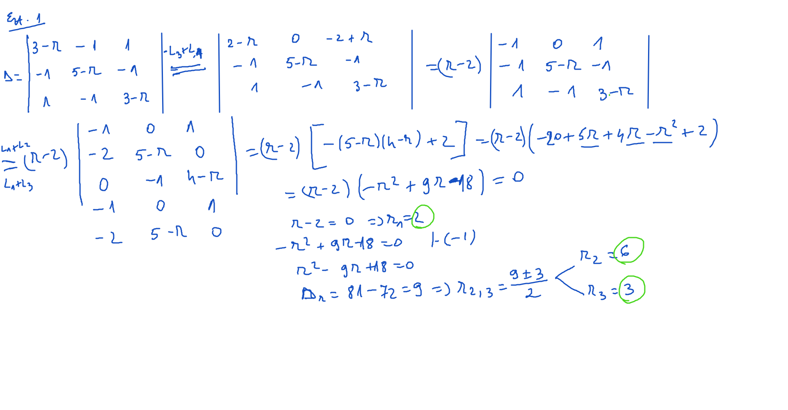
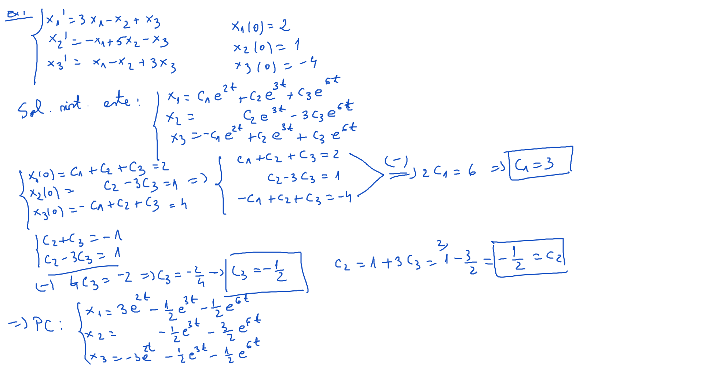
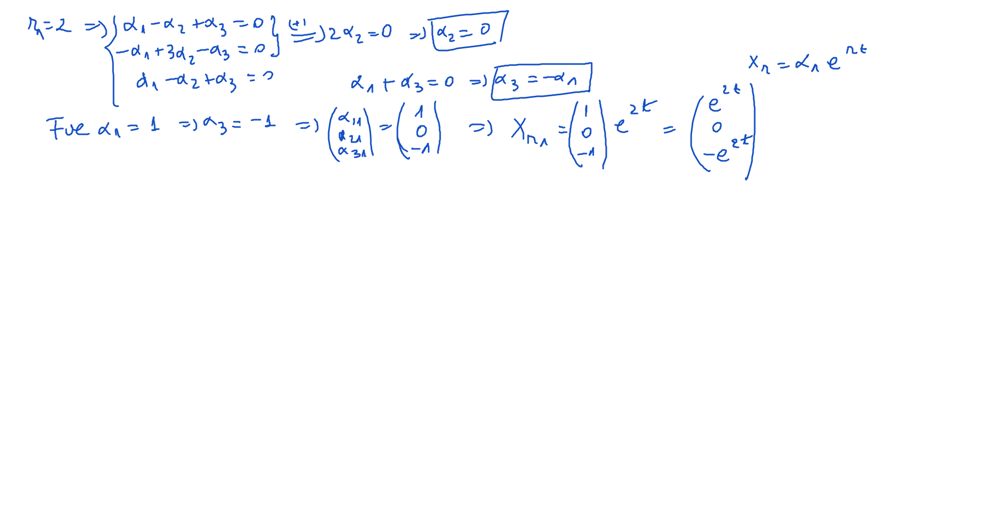
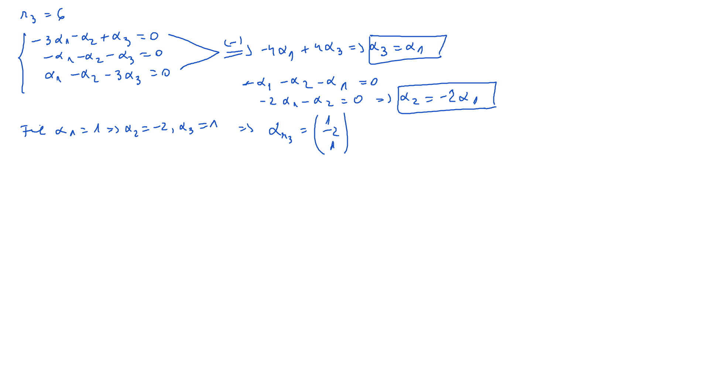
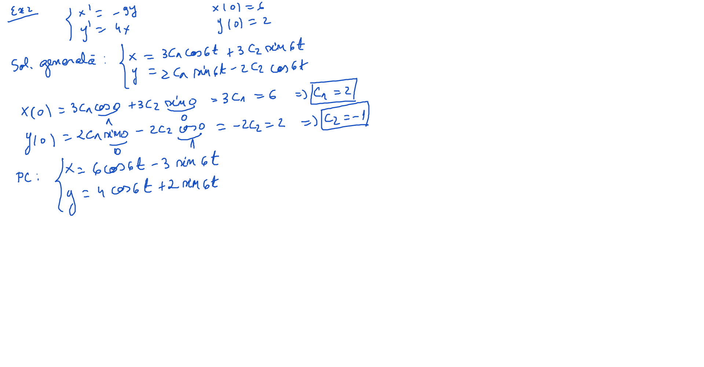

# Curs10 - Rezolvare

[TOC]

## 1. Ecuaţia caracteristică are toate rădăcinile reale şi distincte

**Exemplu**: Să se rezolve sistemul de ecuaţii diferenţiale:
$$
\large
\begin{cases}
x_{1}^{\prime} = 3 \cdot x_{1} - x_{2} + x_{3} \\
x_{2}^{\prime} = -x_{1} + 5 \cdot x_{2} - x_{3} \\
x_{3}^{\prime} = x_{1} - x_{2} + 3 \cdot x_{3}  \\
\end{cases}
$$

## 2. Ecuaţia caracteristică are toate rădăcinile complexe şi distincte

**Exemplu**: Să se rezolve sistemul de ecuaţii diferenţiale.
$$
\large
\begin{cases}
x^{\prime} = -9 \cdot y \\
y^{\prime} = 4 \cdot x \\
\end{cases}
$$

