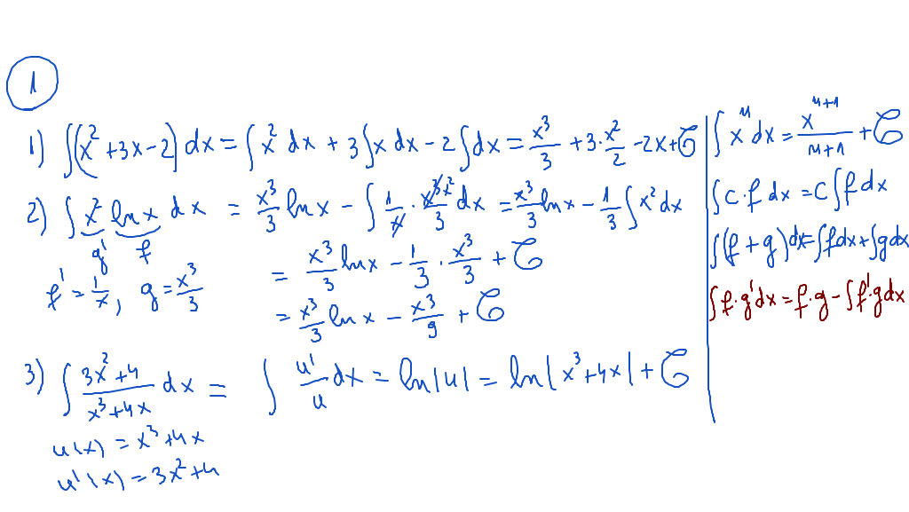
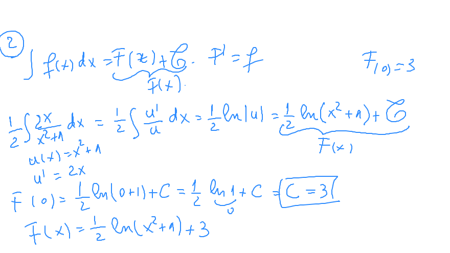
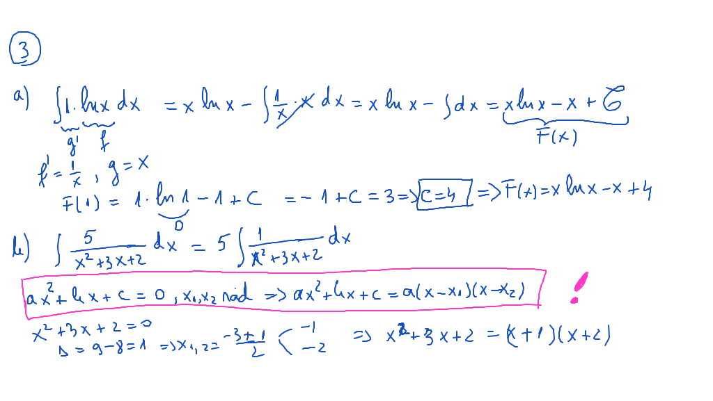
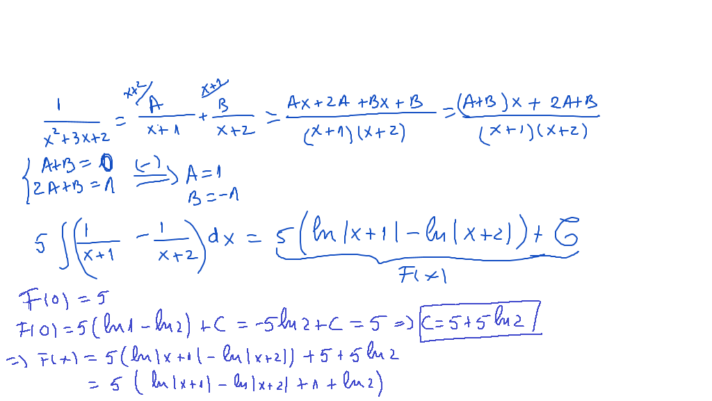
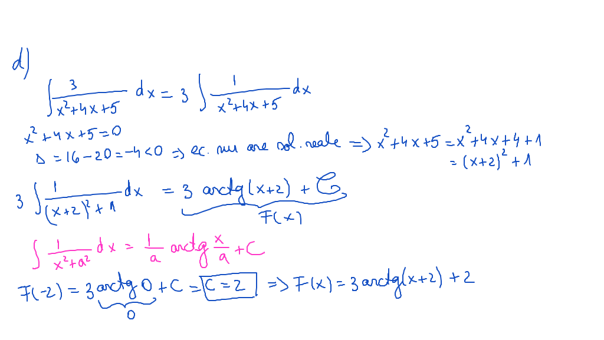

# Laborator01

- [Laborator01](#laborator01)
  - [Exerciţii](#exerciţii)
  - [Rezolvare](#rezolvare)
    - [Exercitiul 1](#exercitiul-1)
    - [Exercitiul 2](#exercitiul-2)
    - [Exercitiul 3](#exercitiul-3)

## Exerciţii
1. Să se calculeze următoarele primitive:

$$
\begin{align*}
1)& \int (x^2 + 3x -2)\ dx \\
2)& \int x^2lnx\ dx \\
3)& \int \frac{3x^2+4}{x^3+4x}\ dx
\end{align*}
$$

2. Să se determine primitiva $F: R \to R$ a funcţiei $f:R \to R,\ f(x) = \frac{x}{x^2+1}$ cu proprietatea că $F(0) = 3$.
3. Să se determine primitivele următoarelor funcţii, care îndeplinesc condiţiile precizate:

$$
\begin{align*}
a)& \int lnx\ dx, && F(1) = 3 \\
b)& \int \frac{5}{x^2+3x+2}\ dx, && F(0) = 5 \\
c)& \int sin^2x\ dx, && F(0) = 1 \\
d)& \int \frac{3}{x^2+4x+5}\ dx, && F(-2) = 2
\end{align*}
$$

## Rezolvare

### Exercitiul 1

### Exercitiul 2

### Exercitiul 3

  