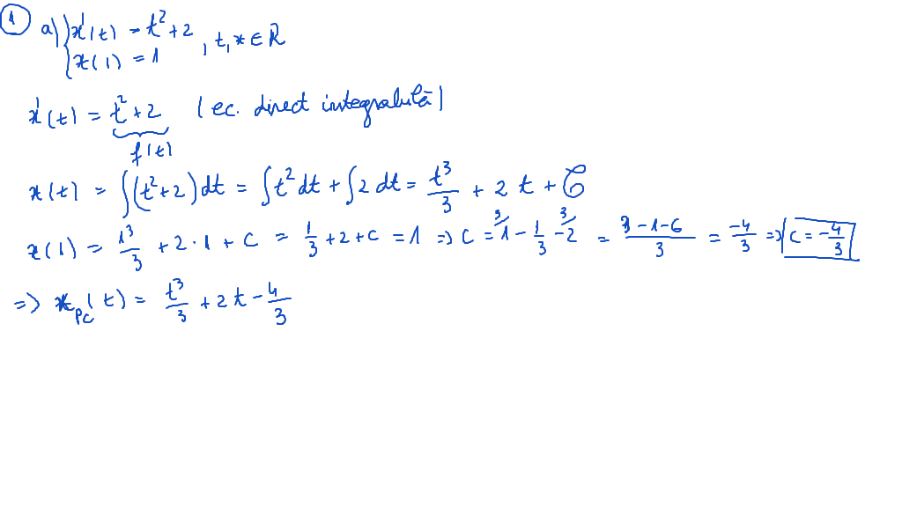
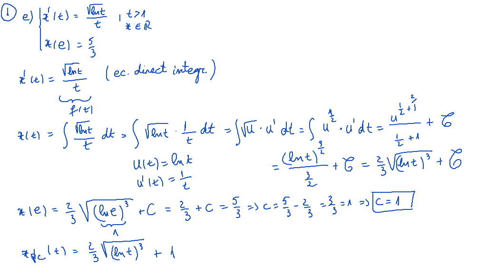
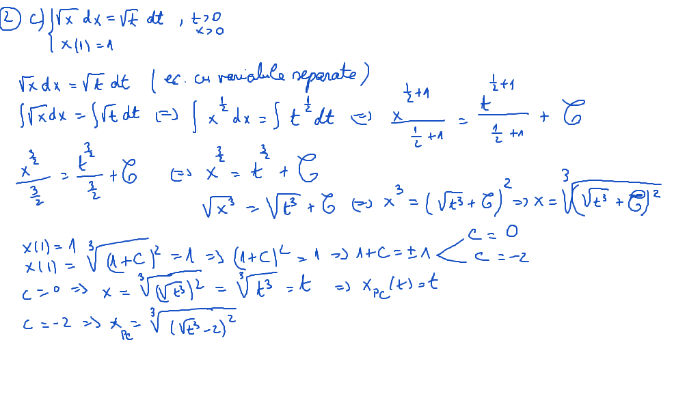
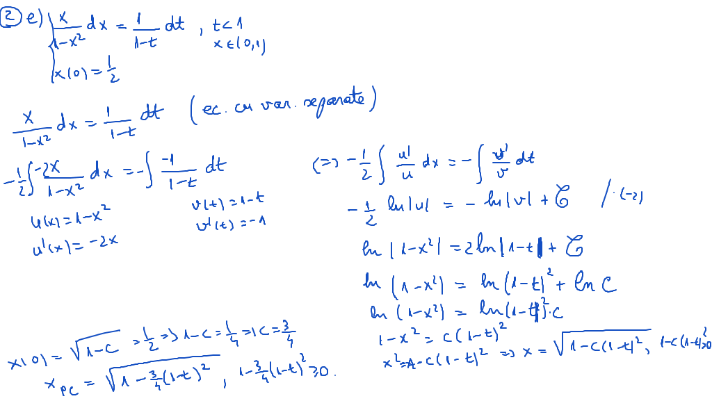
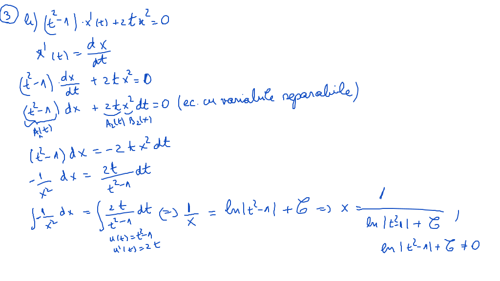
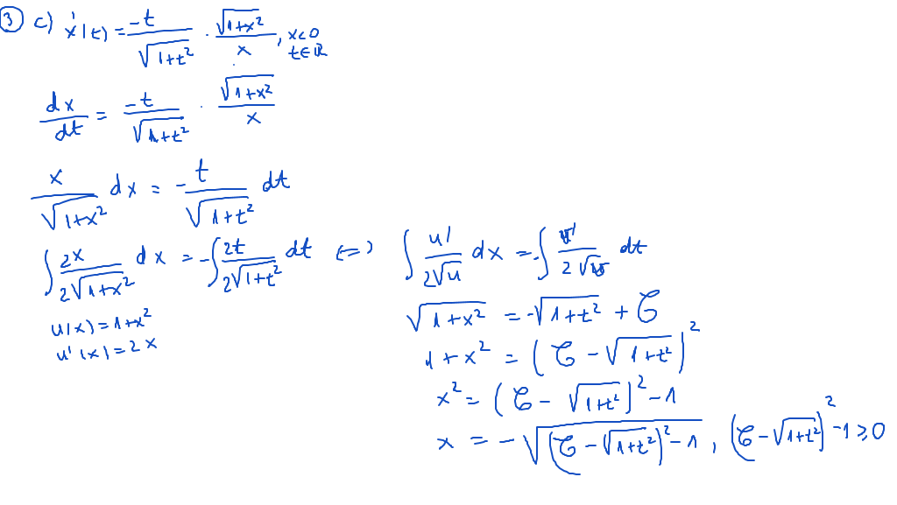

# Laborator02

[TOC]

## Enunţuri

1.  Să se rezolve următoarele ecuaţii diferenţiale direct integrabile:

$$
\begin{align*}

a)\ &
\begin{cases}
x^\prime (t) = t^2 + 2\ , && x,t \in R \\
x (1) = 1
\end{cases} \\

b)\ &
\begin{cases}
x^\prime (t) = \frac{1}{t^2-1}\ , && t \in (-1,1)\\
&& x \in R
\end{cases} \\

c)\ &
\begin{cases}
x^\prime (t) = \frac{1}{1+t^2}\ , && t,x \in R \\
x (-1) = -2
\end{cases} \\

d)\ &
\begin{cases}
x^\prime (t) = sin\ t + 4t^2 \\
x (\frac{\pi}{3}) = - \frac{1}{3}
\end{cases} \\

e)\ &
\begin{cases}
x^\prime (t) = \frac{\sqrt{lnt}}{t}\ , && t > 1\\
x(e) = \frac{5}{3} && x \in R
\end{cases}

\end{align*}
$$

2. Să se rezolve următoarele ecuaţii diferenţiale cu variabile separate:

$$
\begin{align*}
a)\ & \frac{1}{1+t^2}dt + \frac{1}{x}dx = 0, && x>0,\ t \in R \\
b)\ & dx + \frac{1}{t^2-9}dt = 0, && t>3,\ x \in R \\
c)\ & \sqrt{x}\ dx = \sqrt{t}\ dt, && t>0,\ x>0 \\
    & x(1) = 1\\
d)\ & sint\ dt - cosx\ dx = 0, && x \in [0, \pi] \\
    & x(0) = \frac{\pi}{2}\\
e)\ & \frac{x}{1-x^2}dx = \frac{1}{1-t}dt, && t<1,\ x \in (0,1) \\
    & x(0) = \frac{1}{2}\\
\end{align*}
$$

3. Să se rezolve următoarele ecuaţii diferenţiale cu variabile separabile:

$$
\begin{align*}
  a)\ & (t+1) \cdot x^\prime(t) = 2x - 3 \\
  b)\ & (t^2 -1) \cdot x^\prime(t) + 2  t x^2 = 0 \\
  c)\ & x^\prime(t) = \frac{-t}{\sqrt{1+t^2}} \cdot \frac{\sqrt{1+x^2}}{x}, && x<0,\ t \in R \\
  d)\ & \frac{dx}{dt} = \frac{t}{1+t}(1-x), && t>-1,\ x>1 \\
     & x(0) = 5
\end{align*}
$$

## Rezolvare

### Exercitiul 1

#### a) - [Video](./video/Ex1a.mp4)

#### e)

### Exercitiul 2

#### c) - [Video](./video/Ex2c.mp4)

#### e)

### Exercitiul 3

#### b) - [Video](./video/Ex3b.mp4)

#### c)

 

