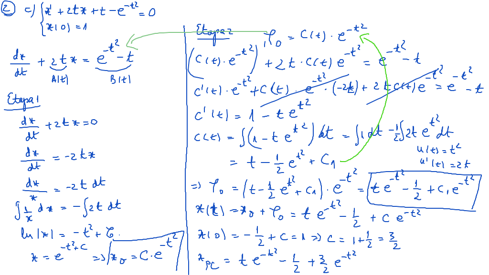
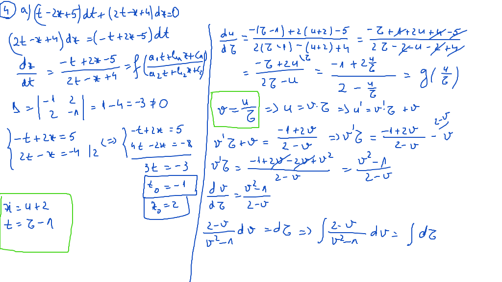

# Laborator03

[TOC]

## Enunţuri

1. Să se rezolve următoarele ecuaţii liniare scalare:

$$
\begin{align*}
a)\ &
\begin{cases}
\frac{dx}{dt} = (t^2 + 1) \cdot x, && t,x \in R_{+} \\
x(0) = 2 
\end{cases} \\

b)\ &
\begin{cases}
\frac{dx}{dt} = \sqrt{t + 1} \cdot x, && t \geq -1 \\
x(0) = 2 && x \in R_{+}
\end{cases} \\

c)\ &
\begin{cases}
\frac{dx}{dt} = t^2 \cdot e^t \cdot x, && t \in R \\
x(0) = 3 && x \in R_{+}
\end{cases} \\

d)\ &
\begin{cases}
\frac{dx}{dt} = \frac{t^2 + 1}{t - 1} \cdot x, && t \in R \setminus \{1\} \\
x(0) = 1 && x \in R_{+}
\end{cases} \\

\end{align*}
$$

2. Să se rezolve următoarele ecuaţii diferenţiale afine:

$$
\begin{align*}

a)\ &\ x^{\prime} + \frac{1-2t}{t^2} \cdot x = 1 \\

b)\ &
\begin{cases}
t \cdot x^{\prime} + x = t \cdot sint, && t > 0 \\
x(\pi) = 2
\end{cases} \\

c)\ &
\begin{cases}
x^{\prime} + 2 \cdot t \cdot x + t - e^{-t^2} = 0 \\
x(0) = 1
\end{cases} \\

d)\ &
\begin{cases}
\frac{dx}{dt} = x - t^2 \\
x(1) = 2
\end{cases} \\

e)\ &
\begin{cases}
x^{\prime}(t) = \frac{1}{t} \cdot x -1 \\
x(1) = 4
\end{cases} \\

\end{align*}
$$

3. Să se rezolve următoarele ecuaţii reductibile la ecuaţii de tip omogen:

$$
\begin{align*}

a)\ &\ (t^2 - t \cdot x  + x^2)dt + (t \cdot x - 2t^2)dx = 0 \\
b)\ &\ x^{\prime} = \frac{2 \cdot t \cdot x}{3t^2 - x^2} \\
c)\ &\ x^{\prime} = \frac{t \cdot x + x^2}{t^2} \\
d)\ &\ (t + 2x)dt - tdx = 0 \\
e)\ &\ t \cdot x \cdot x^{\prime} - x^2 + 3t^2 = 0 \\

\end{align*}
$$

4. Să se rezolve următoarele ecuaţii reductibile la ecuaţii de tip omogen:

$$
\begin{align*}

a)\ &\ (t - 2x +5)dt + (2t - x +4)dx = 0 \\
b)\ &\ 2 \cdot (t + 4x - 6)dt = (7t + x - 15)dx \\
c)\ &\ (2t - 4x + 6)dt + (t + x - 3)dx = 0 \\
d)\ &\ (3t + 3x - 1)dt + (t + x + 1)dx = 0 \\
e)\ &\ (t - 2x + 1)dt + (2t - 4x + 3)dx = 0 \\
f)\ &\ (t - x - 1) + x^{\prime}(x - t + 2) = 0 \\

\end{align*}
$$

## Rezolvare

### Exerciţiu 01

#### c) - [Video](./video/Ex1c.mp4)

#### d)

### Exerciţiu 02

#### b) - [Video](./video/Ex2b.mp4)

#### c)

### Exerciţiu 03

#### b) - [Video](./video/Ex3b.mp4)

#### e)

### Exerciţiu 04

#### a)

