# Laborator04

[TOC]

## Enunţuri

1. Să se rezolve următoarele ecuații de tip Bernoulli.

$$
\begin{align*}

a)\ &\ x^{\prime} + \frac{t}{6} \cdot x = \frac{1}{3} \cdot t \cdot x^{-2} \\

b)\ &
\begin{cases}
3 \cdot t \cdot x^2 \cdot x^{\prime} + x^3 = 2t \\
x(1) = 2
\end{cases}\\

c)\ &
\begin{cases}
x^{\prime} = 2 \cdot t \cdot x + t \cdot \sqrt[3]{x} \\
x(0) = 4
\end{cases} \\

d)\ &\ x^{\prime} + 2 \cdot t \cdot x = 2 \cdot t^3 \cdot x^3

\end{align*}
$$

2. Să se rezolve următoarele ecuații de tip Riccati.

$$
\begin{align*}

a)\ &\ x^{\prime} + x^2 - 2 \cdot x \cdot sint + sin^2t - cost = 0, && \rho_{0}(t) = sint \\

b)\ &\ x^{\prime} = t \cdot x^2 - 2 \cdot t^2 \cdot x + t^3 + 1, && \rho_{0}(t) = t \\

c)\ &
\begin{cases}
x^{\prime} = -x^2 \cdot sint + \frac{2 \cdot sint}{cos^2 t}, \\
x(0) = 2
\end{cases}

&& \rho_{0}(t) = \frac{1}{cost}
\end{align*}
$$

3. Să se rezolve următoarele ecuații cu diferențiale exacte. 

$$
\begin{align*}

a)\ &\ \frac{t}{x^2}dt + \frac{x^2 - t^2}{x^3}dx = 0 \\

b)\ &
\begin{cases}
2 \cdot t \cdot x \ dt + (t^2 +x^2)dx = 0 \\
x(1) = 3
\end{cases} \\

c)\ &\ (t^2 + x^2 + 2t)dt + 2 \cdot t \cdot x\ dx = 0 \\

d)\ &\ t\ dt + x\ dx = \frac{- t\ dx - x\ dt}{t^2 + x^2}

\end{align*}
$$

4. Să se rezolve următoarele ecuații căutând un factor integrant.

$$
\begin{align*}

a)\ &\ (x^2 - 2 \cdot t \cdot x) dt + t^2dx = 0 \\
b)\ &\ 2 \cdot t \cdot x\ dt = (t^2 - x^2) dx \\
c)\ &\ (2 \cdot t \cdot x - t)dt + (x^2 + x + 2t^2)dx = 0

\end{align*}
$$

## Rezolvare

### Exerciţiu 01

#### c) - [Video](./video/Ex1c.mp4)

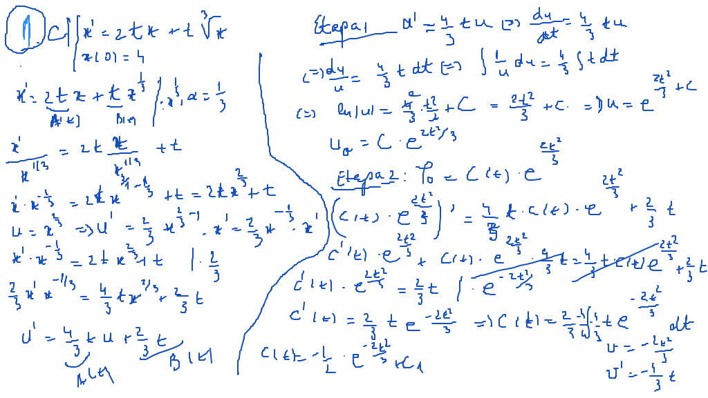

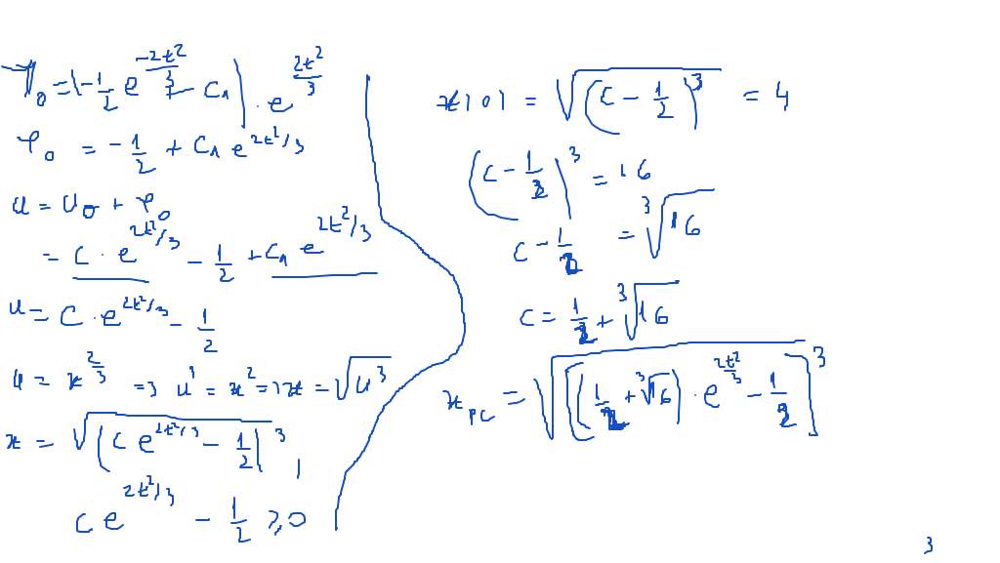

### Exerciţiu 02

#### a) - [Video](./video/Ex2a.mp4)

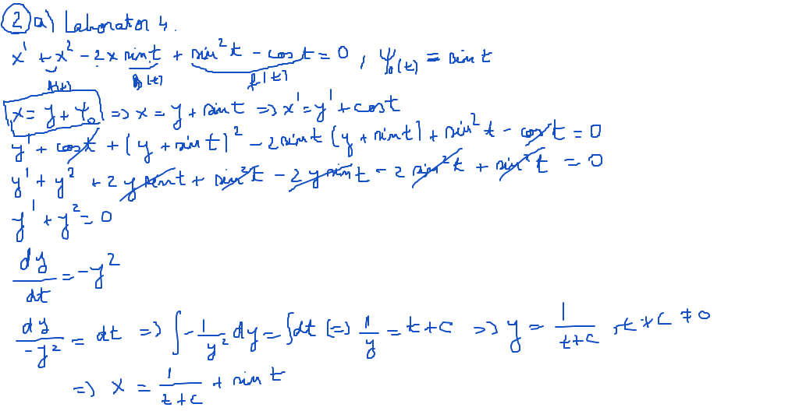

#### c)

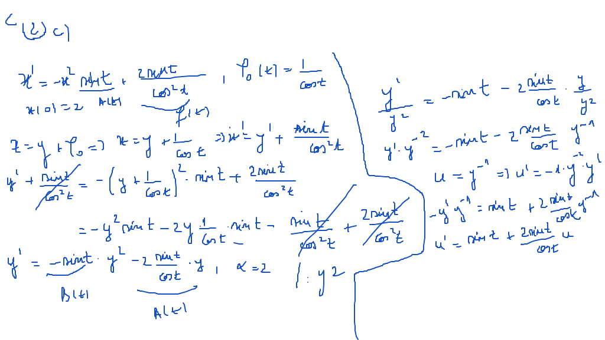

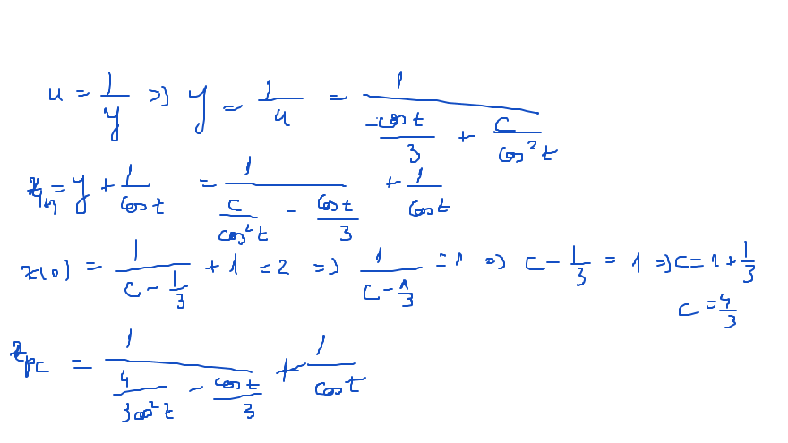

### Exerciţiu 03

#### a)

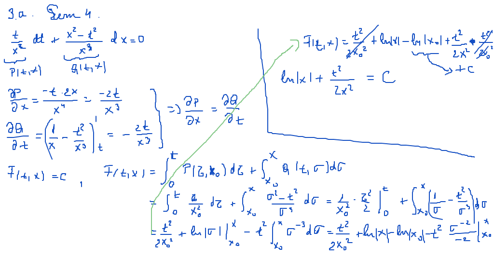

#### b) - [Video](./video/Ex3b.mp4)

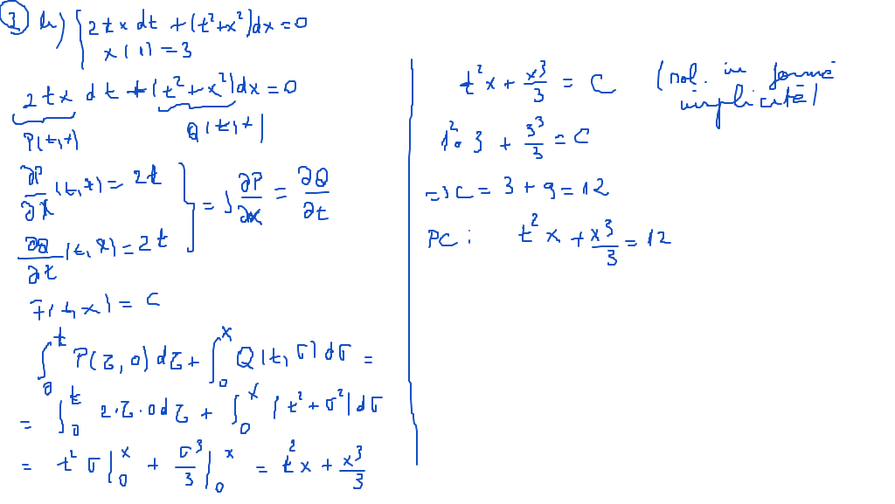

### Exerciţiu 04

#### a) - [Video](./video/Ex4a.mp4)

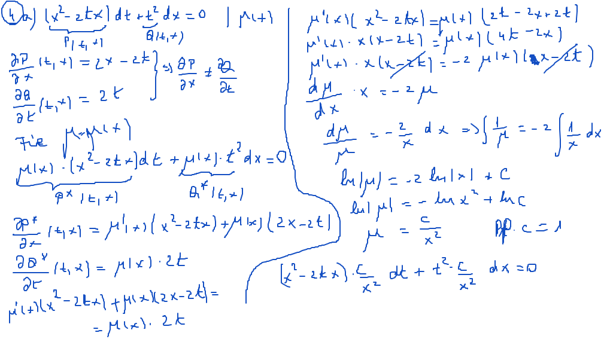

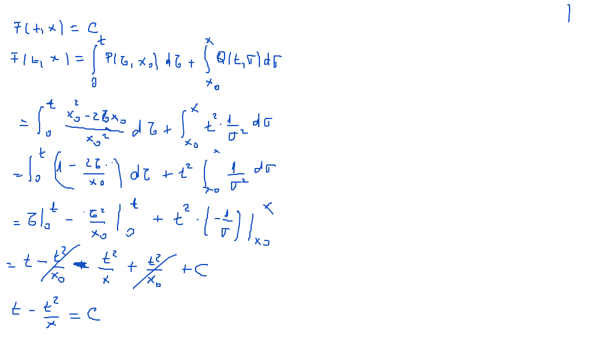

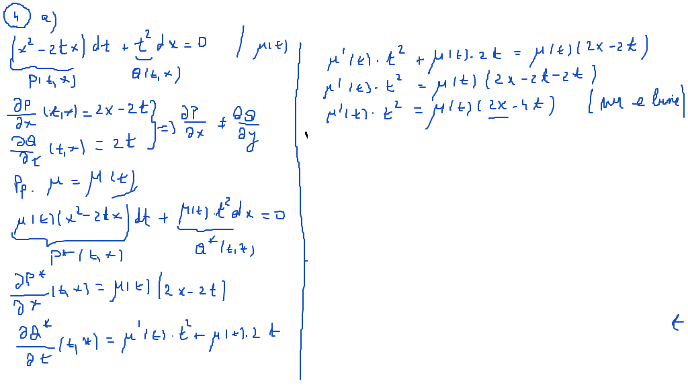

#### c)

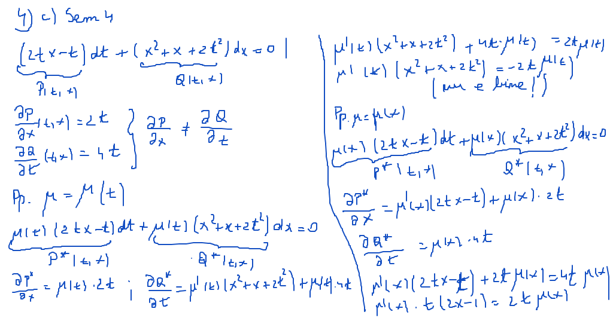

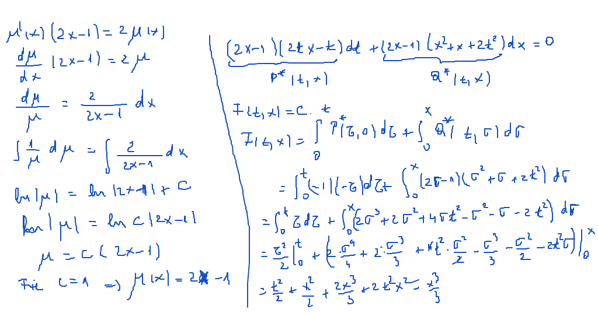

