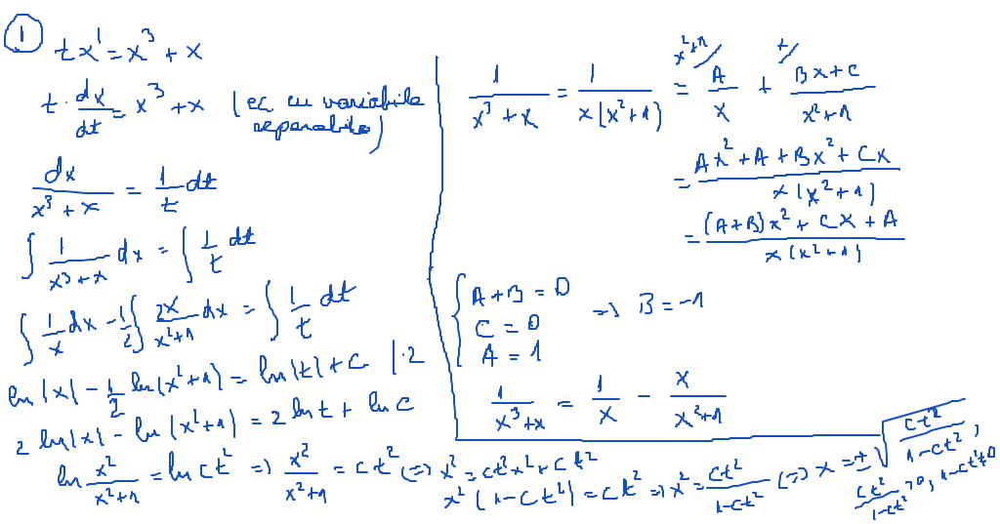
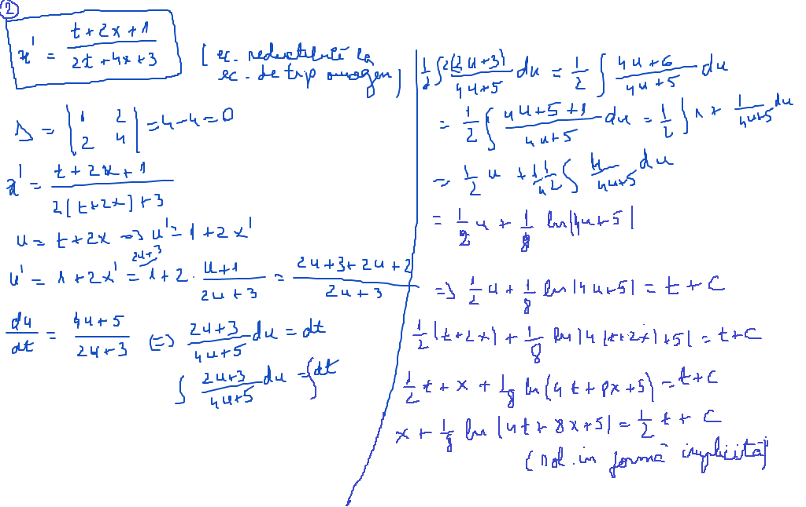
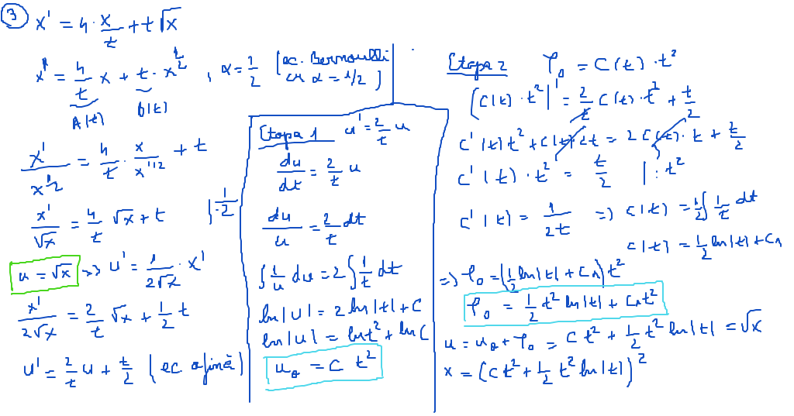
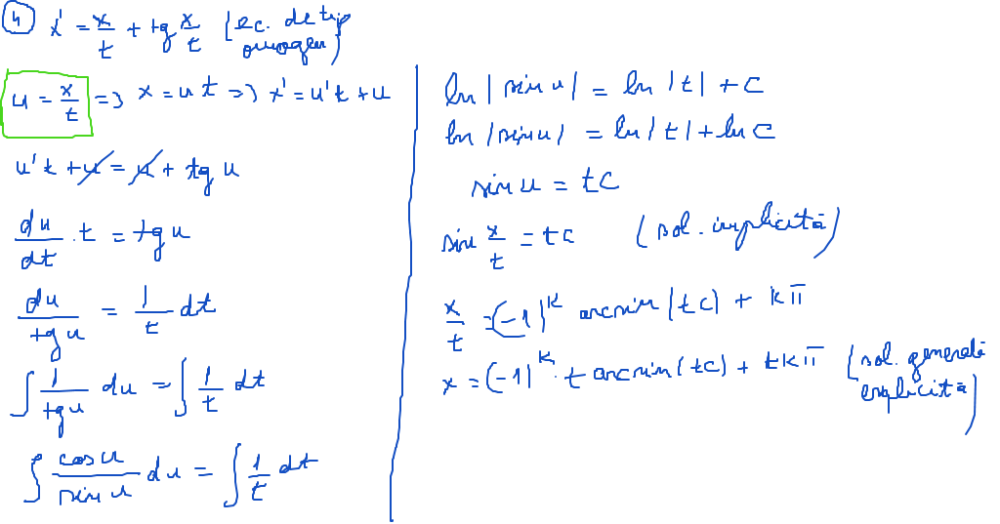
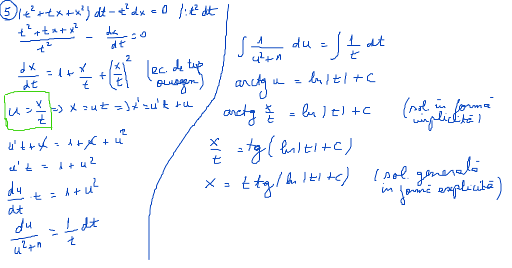

# Laborator05

[TOC]

## Enunţuri

Să se rezolve următoarele ecuaţii:
$$
\begin{align*}
1.\ &\ t \cdot x^{\prime} = x^3 + x \\
2.\ &\ x^{\prime} = \frac{t + 2x + 1}{2t + 4x + 3} \\
3.\ &\ x^{\prime} = 4\frac{x}{t} + t\sqrt{x} \\
4.\ &\ x^{\prime} = \frac{x}{t} + tg\frac{x}{t}\\
5.\ &\ (t^2 + tx + x^2)dt - t^2dx = 0 \\
\end{align*}
$$

## Rezolvare

### Exerciţiu 01

### Exerciţiu 02

### Exerciţiu 03

### Exerciţiu 04

### Exerciţiu 05

