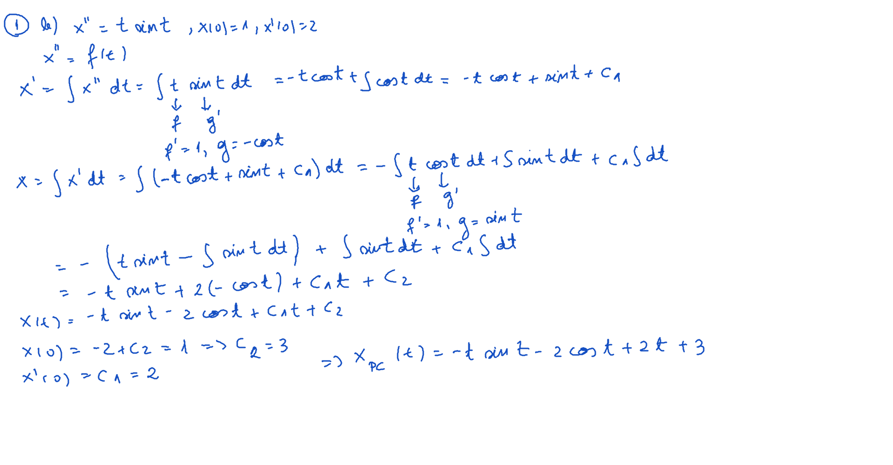
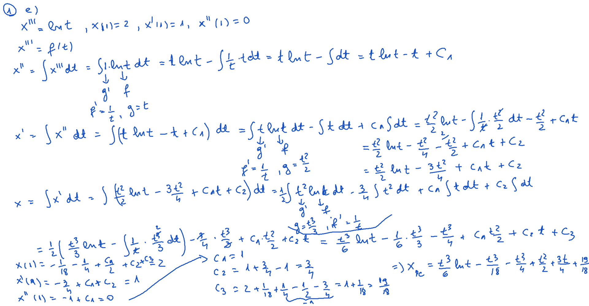
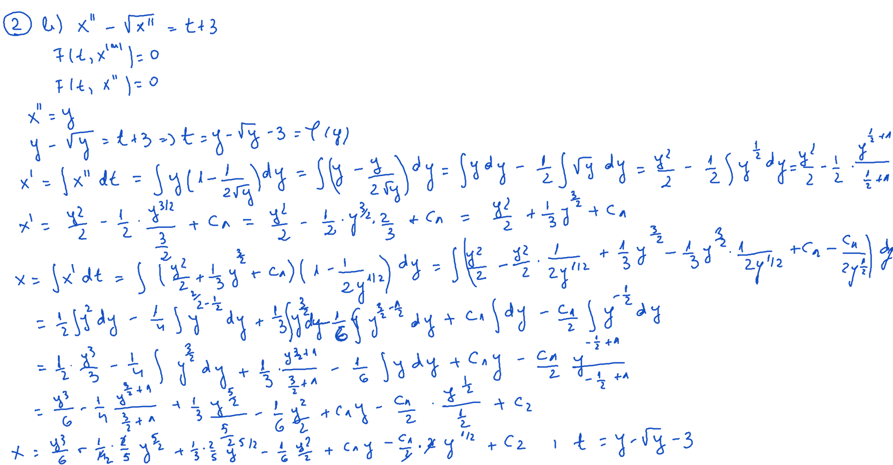
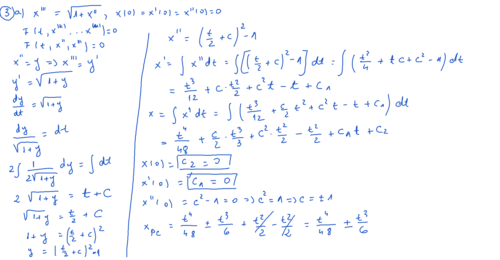
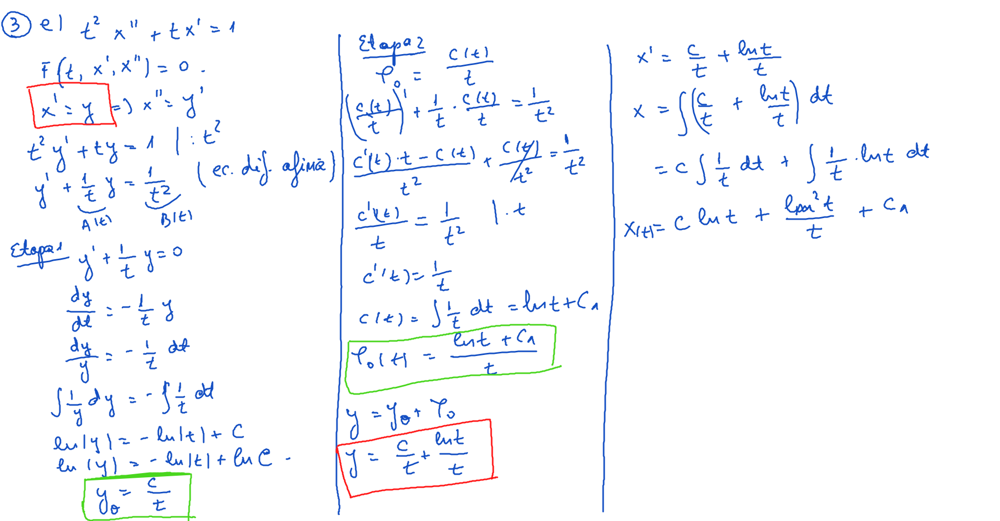

# Laborator07

[TOC]

## Enunţuri

### 1.

Să se rezolve următoarele ecuaţii de ordin n:
$$
\begin{align}
&a)\ x^{IV} = t + 2,\ x(0) = 1,\ x^{I}(0) = 2,\ x^{II}(0) = -1, x^{III}(0) = 0 \\
&b)\ x^{II} = t \cdot sint,\ x(0)=1,\ x^{I}(0)=2\\
&c)\ x^{III} = sint + cost,\ x(0)=1,\ x^{I}(0)=2,\ x^{II}(0) = 3\\
&d)\ x^{II} = \frac{1}{t},\ x(1) = 1,\ x^{I}(1) = 2 \\
&e)\ x^{III} = lnt,\ x(1) = 2,\ x^{I}(1) = 1,\ x^{II}(1) = 0\\
\end{align}
$$

### 2.

$$
\begin{align}
&a) e^{x^{II}} - (x^{II})^2 = t+1\\
&b) x^{II} - \sqrt{x^{II}} = t+3\\
&c) x^{II} + lnx^{II} = t - 5\\
\end{align}
$$

### 3.

$$
\begin{align}
&a)\ x^{III} = \sqrt{1+x^{II}},\ x(0) = x^{I}(0) = x^{II}(0) = 0\\
&b)\ x^{II} + x^{I} \cdot tgt = sin2t\\
&c)\ t^2 \cdot x^{II} + 2(x^{I})^2 = 0,\ x(1) = 2,\ x^{I}(1) = 3\\
&d)\ x^{III} - x^{II} = t,\ x(1) = 1,\ x^{I}(1) = -1,\ x^{II}(1) = 2\\
&e) t^2 \cdot x^{II} + t \cdot x^{I} = 1\\
&f)\ t \cdot x^{III} + x^{II} = 1 + t\\
&g)\ (1+t^2) \cdot x^{II} - 2 \cdot t \cdot x^{I} = 0,\ x(0) = 0,\ x^{I}(0) = 3\\
&h)\ x^{(5)} + x^{(4)} = 0\\
\end{align}
$$

### 4.

$$
\begin{align}
& a) t^2 \cdot x \cdot x^{II} = (x - t \cdot x^{I})^2\\
& b) t \cdot x \cdot x^{II} + t \cdot (x^{I})^2 - x \cdot x^{I} = 0\\
& c) t^2 \cdot x \cdot x^{II} + t^2 \cdot (x^{I})^2 - 5 \cdot t \cdot x \cdot x^{I} + 4 \cdot x^2 = 0,\ x(1) = 1,\ x^{I}(1) = 0\\
\end{align}
$$

### 5.

$$
\begin{align}
& a)\ x^{II} + x^2 = 0\\
& b)\ x^{II} + x \cdot x^{I} = 0\\
& c)\ x \cdot x^{III} + 3 \cdot x^{I} \cdot x^{II} = 0\\
\end{align}
$$

## Rezolvare

### Exerciţiu 1. b) - [Video](./video/Ex1b.mp4)

### Exerciţiu 1. e) - [Video](./video/Ex1e.mp4)

### Exerciţiu 2. b) - [Video](./video/Ex2b.mp4)

### Exerciţiu 3. a) - [Video](./video/Ex3a.mp4)

### Exerciţiu 3. e) - [Video](./video/Ex3e.mp4)

