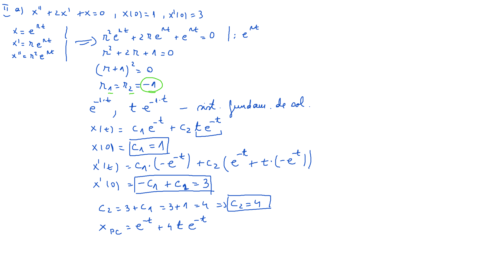

# Laborator08

[TOC]

## Ecuații

Să se rezolve următoarele ecuații diferențiale liniare de ordin n omogene cu coeficienți constanți.

### I

$$
\begin{align*}
&a)\ x^{III}-3x^{II}+2x^{I} = 0,\ x(0)=1,\ x^{I}(0)=2,\ x^{II}(0)=0\\
&b)\ 2x^{III}-3x^{II}+x^{I} =0,\ x(0)=-1,\ x^{I}(0)=2,\ x^{II}(0)=1\\
&c)\ x^{III}-7x^{II}+14x^{I}-8x=0,\ x(0)=1,\ x^{I}(0)=0,\ x^{II}(0)=1\\
&d)\ x^{II}-4x^{I}+3x=0,\ x(0)=2,\ x^{I}(0)=4\\
&e)\ x^{III}-x^{I}=0\\
\end{align*}
$$

### II

$$
\begin{align*}
&a)\ x^{II}+2x^{I}+x=0,\ x(0)=1,\ x^{I}(0)=3\\
&b)\ x^{IV}-5x^{II}+4x=0\\
&c)\ x^{III}-6x^{II}+12x^{I}-8x=0\\
&d)\ x^{IV}-2x^{II}+x=0\\
&e)\ x^{IV}+2x^{III}+x^{II}=0\\
&f)\ x^{(6)}-x^{(5)}-4x^{(4)}+2x^{III}+5x^{II}-x^{I}-2x=0\\
&g)\ x^{(7)}+3x^{(6)}+3x^{(5)}+x^{(4)}=0\\
\end{align*}
$$

### III

$$
\begin{align*}
&a)\ x^{II}+x=0,\ x(0)=3,\ x^{I}(0)=5\\
&b)\ x^{IV}+4x=0\\
&c)\ x^{IV}+8x^{II}+16x=0\\
&d)\ x^{II}+4x^{I}+13x=0\\
&e)\ x^{II}+4x^{I}+5x=0\\
\end{align*}
$$

### IV

$$
\begin{align*}
&a)\ x^{IV}+2x^{III}+4x^{II}-2x^{I}-5x=0\\
&b)\ x^{III}-3x^{II}+9x^{I}+13x=0\\
&c)\ x^{(7)}-x^{(6)}+x^{(5)}-x^{(4)}=0\\
&d)\ x^{III}-5x^{II}+17x^{I}-13x=0\\
&e)\ x^{V}+4x^{IV}+3x^{III}-6x^{I}-2x=0\\
\end{align*}
$$

## Rezolvare

### Exerciţiu 1. a)

### Exerciţiu 1. d) - [Video](./video/Ex1d.mp4)

### Exerciţiu 2. a) - [Video](./video/Ex2a.mp4)

### Exerciţiu 2. f)

**Alfa - Descompunere**

### Exerciţiu 3. a)

### Exerciţiu 3. c) - [Video](./video/Ex3c.mp4)

### Exerciţiu 4. a) - [Video](./video/Ex4a.mp4)

### Exerciţiu 4. c)

