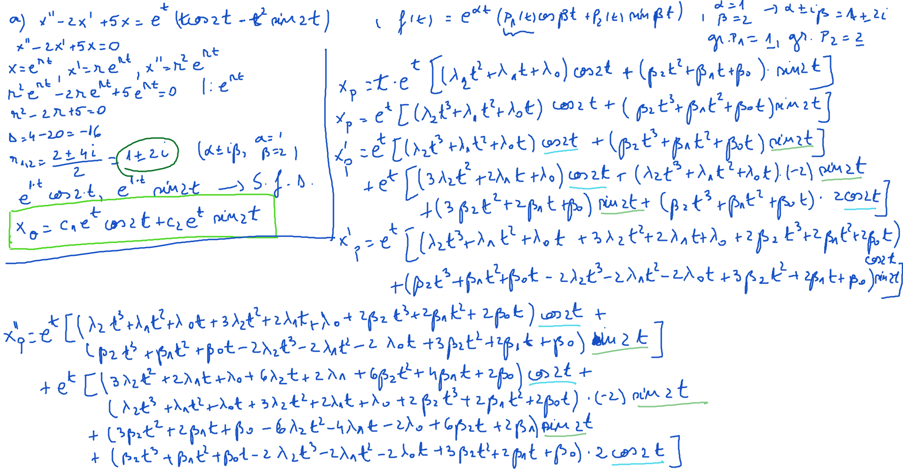
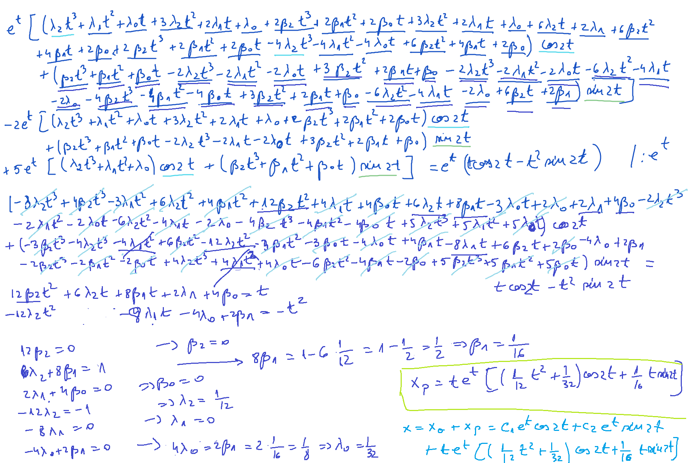
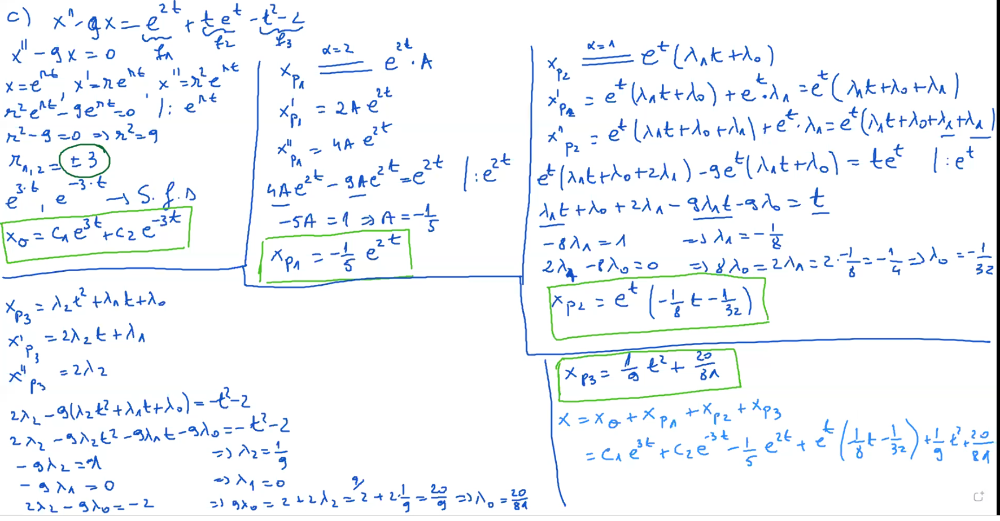

# Laborator10

[TOC]

## Ecuaţii

Să se rezolve următoarele ecuaţii:
$$
\large
\begin{align*}
&a)\ x^{II}- 2x^{I} + 5x = e^t (t \cos 2t - t^2 \sin 2t) \\
&b)\ x^{II} + 9x = t \sin 3t + \cos 3t\\
&c)\ x^{II} - 9x = e^{2t} + te^{t} - t^2 - 2\\
\end{align*}
$$

## Rezolvare

### Exerciţiu 1. a) - [Video1](./video/Ex_a_partea1.mp4) [Video2](./video/Ex_a_partea2.mp4)

### Exerciţiu 1. c) - [Video](./video/Ex_c.mp4)

## [Maple](./maple/Laborator10.mw)

