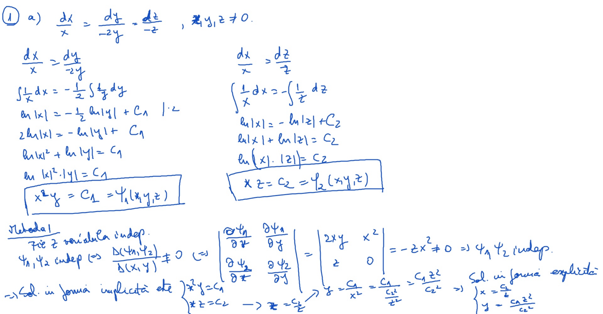
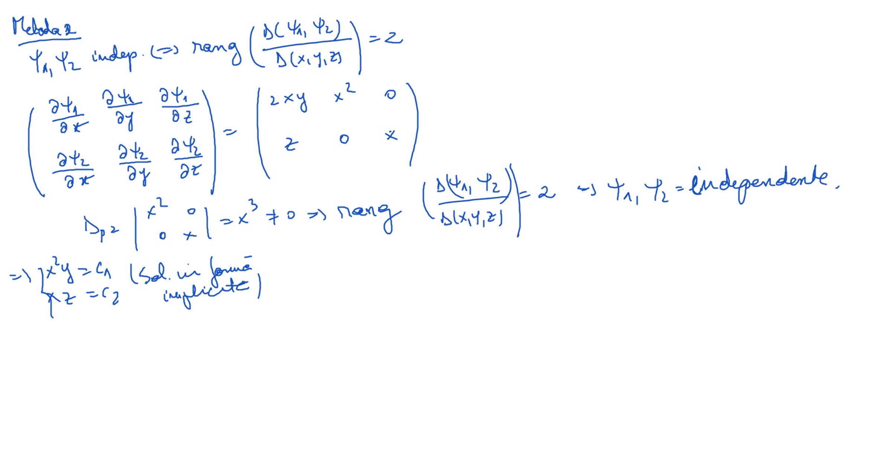
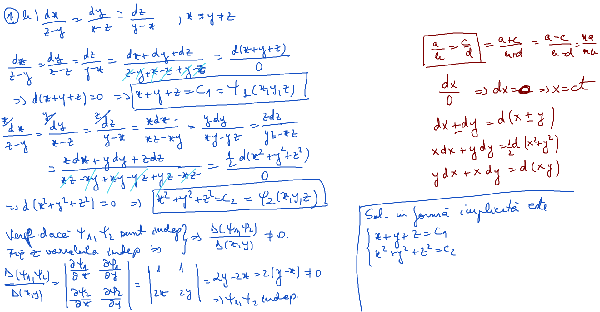
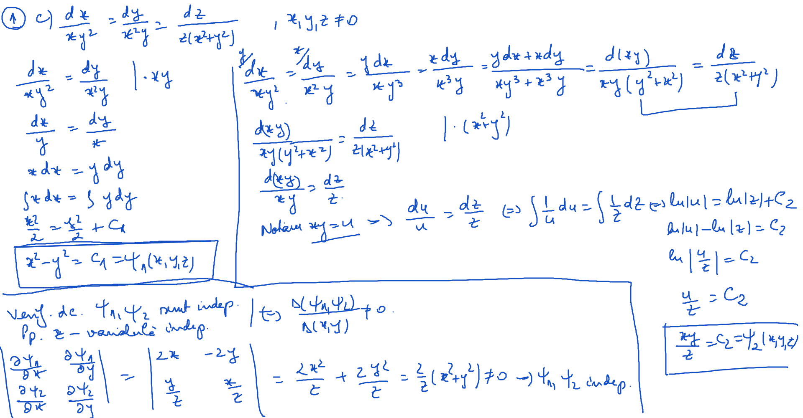
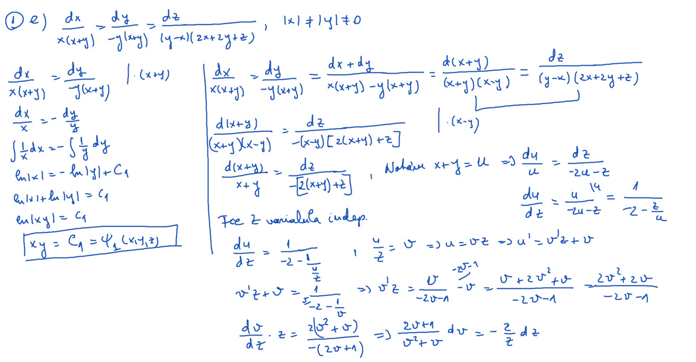
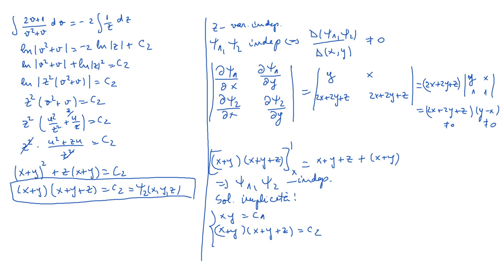
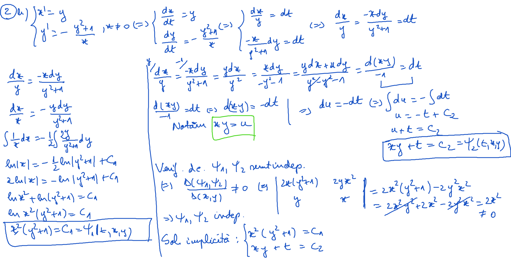

# Laborator14

[TOC] 

## Exerciţii

1. Să se determine soluţia generală a sistemelor simetrice:

$$
\large
\begin{align*}
&a)\ \frac{dx}{x} = - \frac{dy}{2y} = \frac{dz}{-z},\
x \ne 0,\ y \ne 0,\ z \ne 0\\
&R:
\begin{cases}
\varphi(x,y,z) = x\sqrt{y} = C_1\\
\varphi(x,y,z) = xz = C_2
\end{cases}\\ \\

&b)\ \frac{dx}{z-y} = \frac{dy}{x-z} = \frac{dz}{y-x},\ 
x \ne y \ne z\\
&R:
\begin{cases}
x + y + z = C_1\\
x^2 + y^2 + z^2 = C_2
\end{cases}\\ \\

&c)\ \frac{dx}{xy^2} = \frac{dy}{x^2y} = \frac{dz}{z(x^2+y^2)},\ 
x \ne 0,\ y \ne 0,\ z \ne 0\\
&R:
\begin{cases}
x^2 - y^2 = C_1\\
\frac{xy}{z} = C_2
\end{cases}\\ \\

&d) \frac{dx}{2y(2-x)} = \frac{dy}{x^2-z^2-y^2-4x} = \frac{dz}{-2yz},\ 
x > 2,\ y \ne 0,\ z > 0 \\
&R:
\begin{cases}
\frac{x-2}{y} = C_1\\
\frac{x^2+y^2+z^2}{z} = C_2
\end{cases}\\ \\

&e) \frac{dx}{x(x+y)} = \frac{dy}{-y(x+y)} = \frac{dz}{(y-x)(2x+2y+z)},\ 
|x| \ne |y| \ne 0 \\
&R:
\begin{cases}
xy = C_1\\
(x+y)(x+y+z) = C_2
\end{cases}\\ \\

&f) \frac{dx}{2xz} = \frac{dy}{2yz} = \frac{dz}{x^2-y^2},\ 
|x| \ne |y| \ne 0 \\
&R:
\begin{cases}
\frac{y}{x} = C_1\\
2z^2 - x^2 + y^2 = C_2
\end{cases}

\end{align*}
$$

2. Să se rezolve următoarele sisteme cu ajutorul integralelor prime

$$
\large
\begin{align*}

&a)
\begin{cases}
x^\prime = \frac{y}{x-y}\\
y^\prime = \frac{x}{x-y}
\end{cases},\ 
x \ne y \\
&R:
\begin{cases}
x - y + t = C_1\\
x^2 - y^2 = C_2
\end{cases}\\ \\

&b)
\begin{cases}
x^\prime = y\\
y^\prime = -\frac{y^2+1}{x}
\end{cases},\ 
x \ne 0 \\
&R:
\begin{cases}
y^2(z^2 + 1) = C_1\\
yz + x = C_2
\end{cases}\\ \\

&c)
\begin{cases}
x^\prime = 2zy\\
y^\prime = 4xz\\
z^\prime = xy
\end{cases},\
x \ne 0,\ y \ne 0,\ z \ne 0 \\
&R:
\begin{cases}
\frac{y^2}{2} - 2z^2 = C_1\\
\frac{x^2}{2} - z^2 = C_2\\
x^2 + \frac{y^2}{2} - 2z^2 = C_3
\end{cases}\\ \\

&d)
\begin{cases}
x^\prime = x\\
y^\prime = y\\
z^\prime = -2xy
\end{cases},\
x \ne 0,\ y \ne 0 \\
&R:
\begin{cases}
\frac{x}{y} = C_1\\
ln(x) - t = C_2\\
xy - z = C_3
\end{cases}
\Rightarrow
\begin{cases}
x = Ce^t\\
y = \frac{C}{C_1}e^t = C_4e^t \\
z = CC_4e^{2t} - C_3
\end{cases}\\ \\

&e)
\begin{cases}
x^\prime = y\\
y^\prime = x\\
z^\prime = x-y
\end{cases},\
y \ne x \ne 0 \\
&R:
\begin{cases}
x^2 - y^2 = C_1\\
x - y + z = C_2\\
y - x - e^{-t} = C_3
\end{cases}
\Rightarrow
x - y = C_2 - z
\\ \\

&f)
\begin{cases}
x^\prime = y + xy\\
y^\prime = x + yx\\
z^\prime = z^2 - 1
\end{cases},\
x \ne y,\ |z| > 1 \\
&R:
\begin{cases}
(x-y)\sqrt{t^2-1} = C_1\\
ln(x-y) + t = C_2\\
\frac{1}{2} ln(z^2-1) - t = C_3
\end{cases}

\end{align*}
$$

$$
\large
\begin{align*}
&g)
\begin{cases}
x^\prime = xy\\
y^\prime = -y^2\\
z^\prime = -x(1+x^2)
\end{cases},\
x > 0,\ y > 0 \\
&R:
\begin{cases}
xy = C_1\\
\frac{1}{y} - t = C_2\\
\frac{x^3}{3} + \frac{x^5}{5} + xyz = C_3
\end{cases}
\end{align*}
$$

## Rezolvare

### Exerciţiu 1. a) - [Video](./video/Ex1a.mp4)

### Exerciţiu 1. b)

### Exerciţiu 1. c) - [Video](./video/Ex1c.mp4)

### Exerciţiu 1. e) - [Video](./video/Ex1e.mp4)

### Exerciţiu 2. b)

