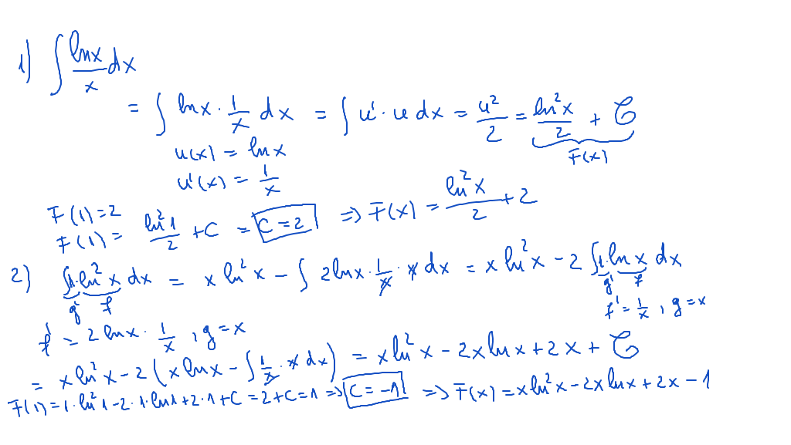
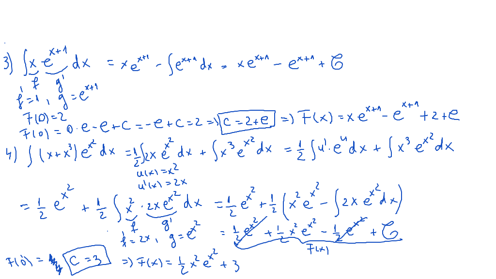
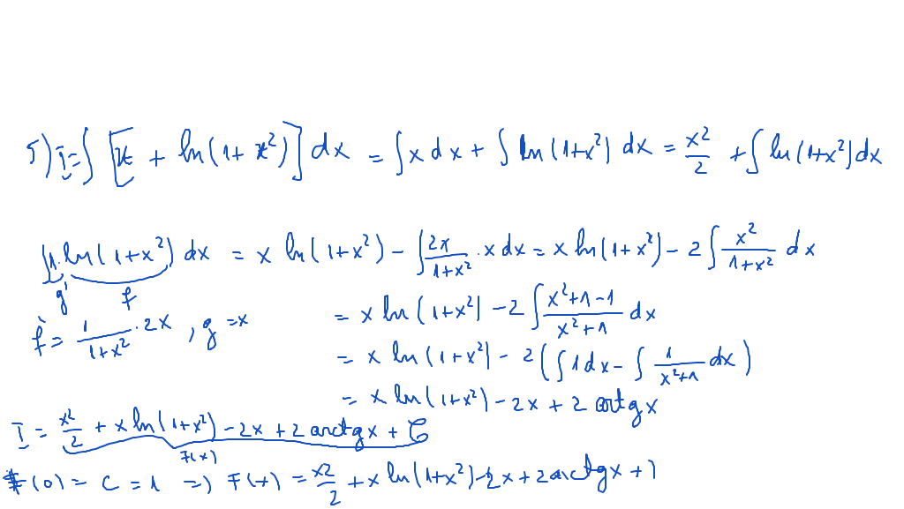

# Seminar01

[TOC]

## Enunţuri

Să se determine următoarele primitive, care îndeplinesc condiţiile specificate:

$$
\begin{align*}
1)& \int \frac{ln(x)}{x}dx;\ F(1) = 2 \\
2)& \int ln^2x\ dx;\ F(1) = 1 \\
3)& \int xe^{x+2}\ dx;\ F(0) = 2 \\
4)& \int (x+x^3)e^{x^2}\ dx; F(0) = 3 \\
5)& \int [x + ln(1 + x^2)]\ dx;\ F(0) = 1\\
\end{align*}
$$

## Rezolvare

### Exerciţiu 1. şi Exerciţiu 2.

### Exerciţiu 3. şi Exerciţiu 4.

### Exerciţiu 5.

 

