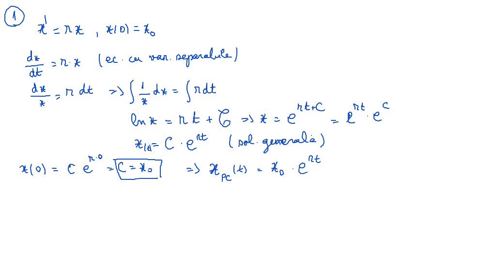
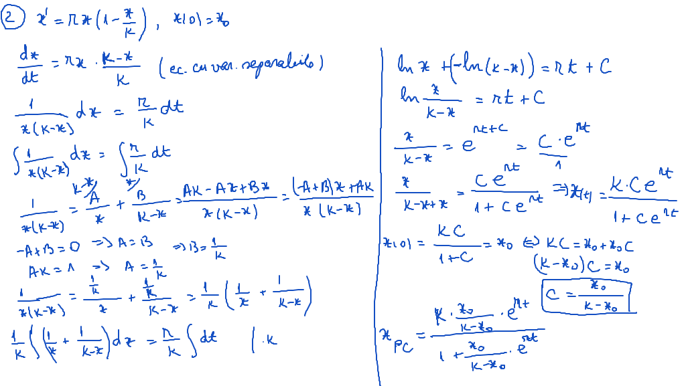
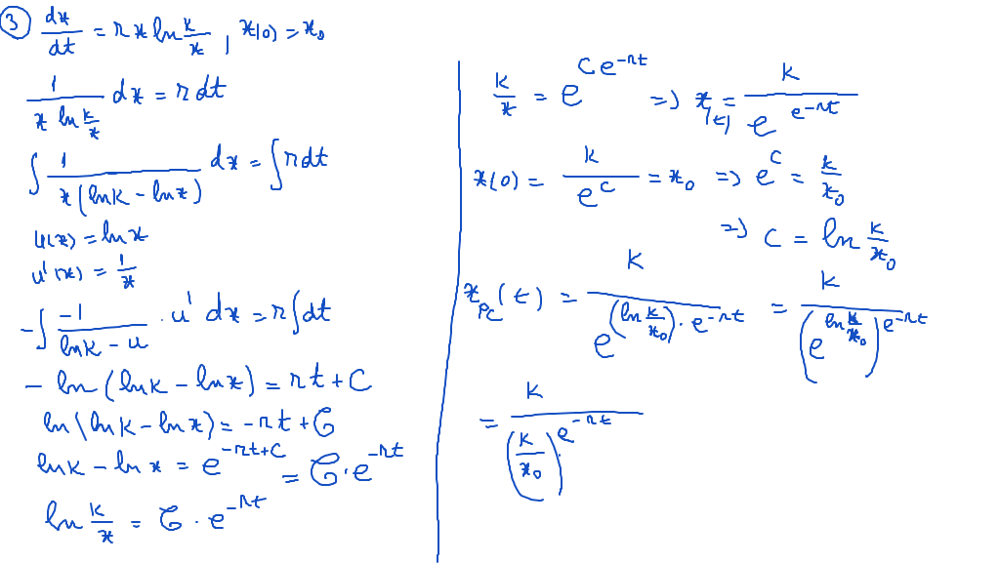
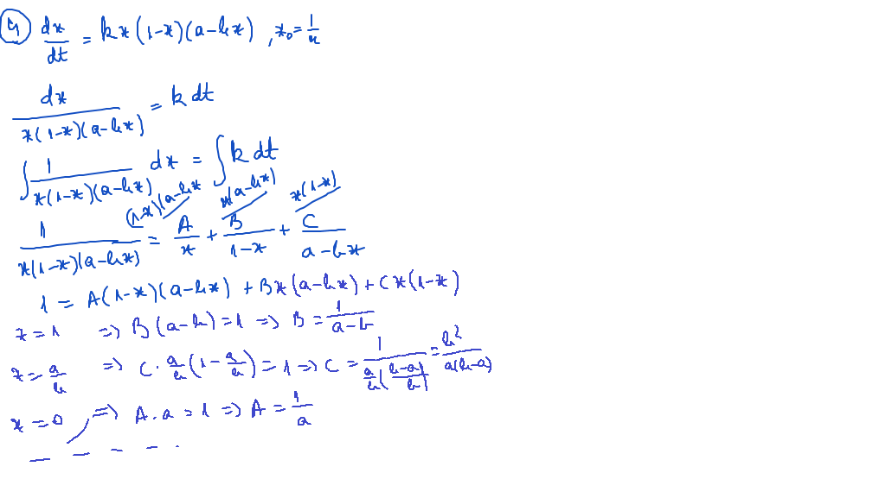

# Seminar02

## Aplicaţii ale ecuaţiilor diferenţiale (cu variabile separate / separabile) 

[TOC]

## Enunţuri

### 1.

Fie $\large x(t)$ populaţia unei anumite specii la momentul $\large t$ şi fie $\large r = b - d$ rata de creştere $\large (r > 0)$, ce reprezintă diferenţa între rata natalităţii $\large (b)$ şi rata mortalităţii $\large (d)$. Dacă această populaţie este izolată, adică nu există nici o imigraţie sau emigrare netă, atunci $\large \frac{dx}{dt}$ (rata de schimbare a populaţiei) este egală cu $\large x(t)$. În modelul cel mai simplist se consideră rata $\large r = constant$. $\large \Rightarrow$ Ecuaţia diferenţială care guvernează creşterea populaţiei este $\large \dot{x} = rx$, $\large r = b - d > 0$. (**modelul Malthus**)

În cazul în care populaţia speciei date este $\large x_0$ la timpul $\large t_0$, atunci acest model e descris de problema Cauchy: $\large \dot x = r \cdot x$, $\large x(0) = 0$ $\large \Rightarrow$ $\large x_{PC} = x_0e^{(b-d)t}$, $\large (r = b - d)$ 

### 2.

În cazul în care populaţia devine foarte mare, trebuie luat în considerare faptul că membrii individuali vor fi în competiţie unii cu alţii pentru spaţiul de locuit limitat, resursele naturale şi produsele alimentare disponibile. Astfel, trebuie adăugat un termen de concurenţă.

$\large \Rightarrow \dot x = rx(1- \frac{x}{K})$, $\large x(0) = x_0$  (**Modelul logistic Verhulst**)

unde:

- $\large x$ - reprezintă numarul de indivizi ai populaţiei,
- $\large r > 0$ - rata de creştere,
- $\large k > 0$ - reprezintă un plafon biologic (o capacitate de hrană şi alte condiţii necesare vieţii) a mediului în care trăieşte acea populaţie. (populaţia maximă ce poate exista)

$\large \Rightarrow$ soluţia generală $\Large x(t) = \frac{kC \cdot e^{rt}}{1 + Ce^{rt}}$

### 3.

Alt model folosit în dinamica populaţiei este $\large \frac{dx}{dt} = r \cdot x \cdot ln \frac{k}{x}$, $\large r > 0$ (**Modelul Gompertz**)

- $\large x$ - numarul de indivizi ai populaţiei,
- $\large r > 0$ - rata de creştere
- $\large k > 0$ - reprezintă populaţia maximă pe care o poate susţine o anumită regiune

$\Large \Rightarrow x = k \cdot e^{-ce^{-rt}}$

### 4.

**Modelul de selecţie hibridă (folosit în genetică)** 

$\large \frac{dx}{dt} = kx(1-x)(a-4x)$, $\large x(0) = \frac{1}{n}$.

- $\large x$ - populaţie
- $\large a,\ b,\ k$ - constante ce depind de caracteristică genetică studiată

$\large \Rightarrow$ soluţie generală $\Large \frac{x^{a-b}(a-bx)^b}{(1-x)^a} = c e^{a(a-b)kt}$

## Rezolvare

### Exerciţiu 1.

### Exerciţiu 2.

### Exerciţiu 3.

### Exerciţiu 4.

