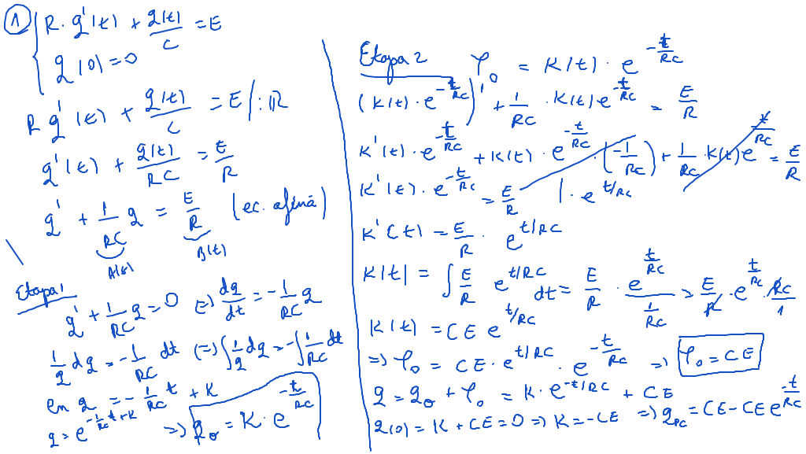
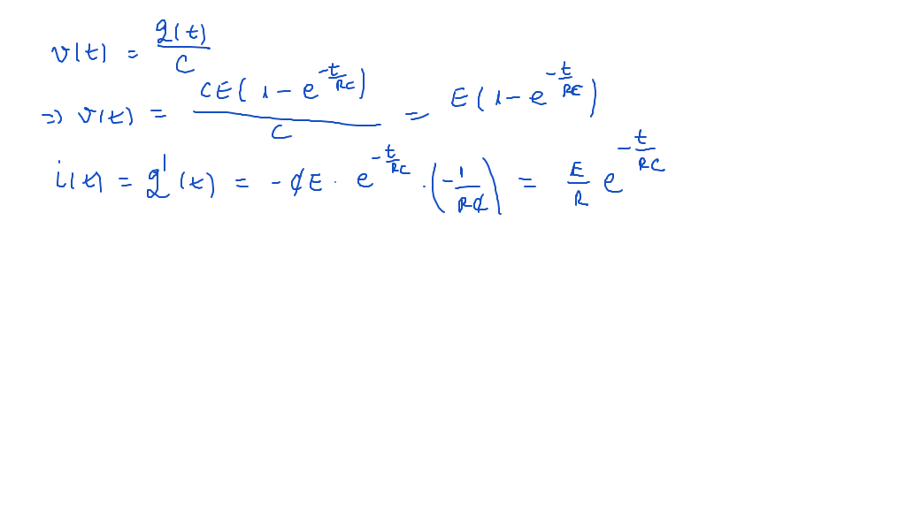
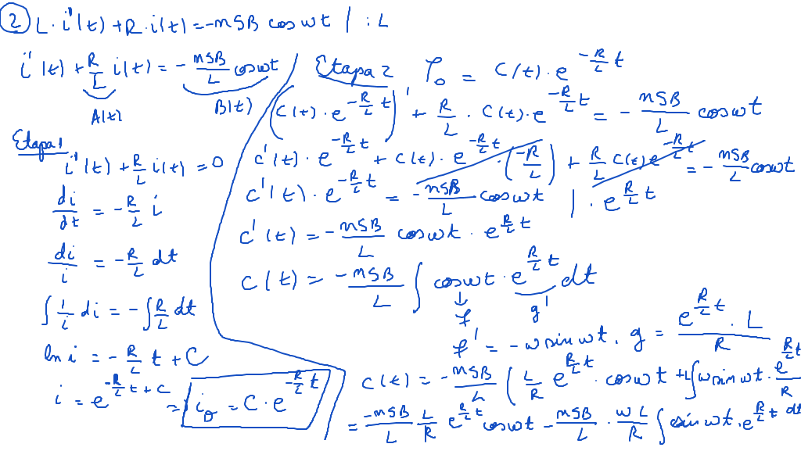
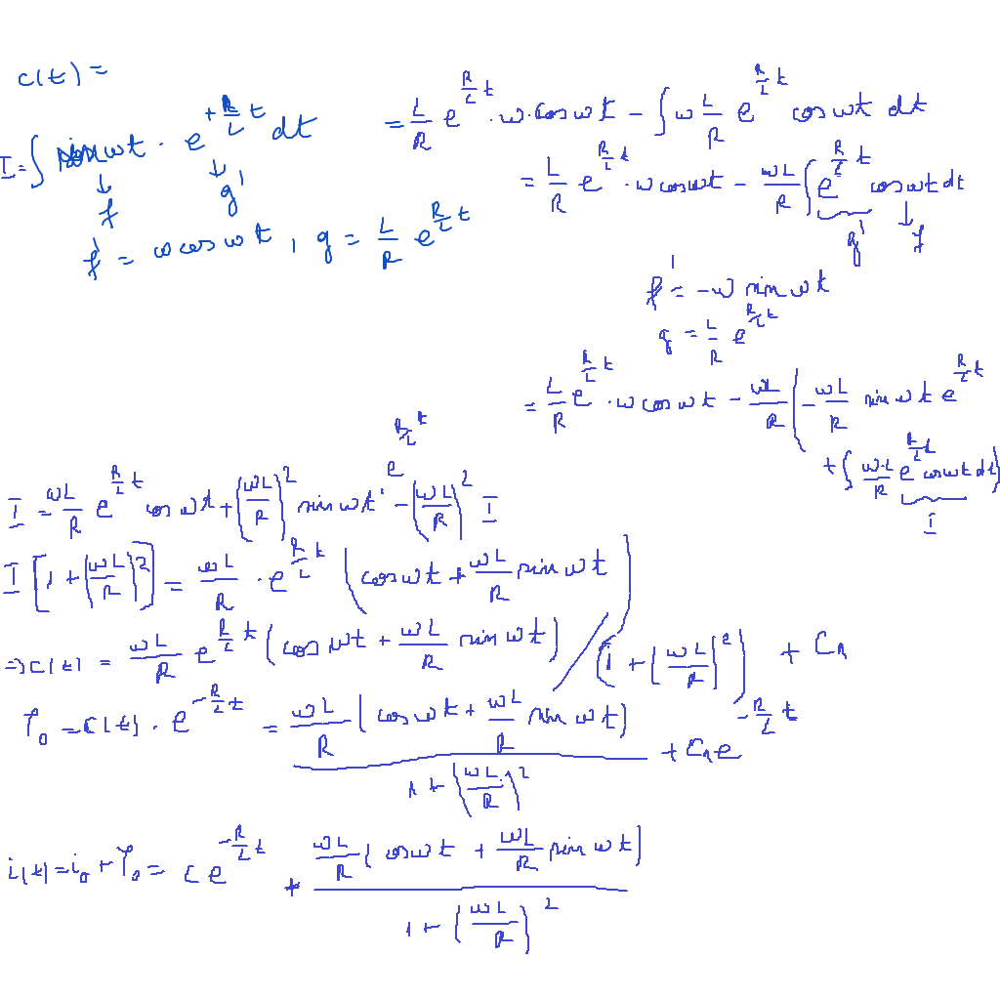

# Seminar03

## Aplicaţii ale ecuaţiilor diferenţiale afine şi ale ecuaţiilor de tip omogen 

[TOC]

## Enunţuri

### 1.

**(Încărcarea unui condensator printr-o rezistenţă)** (D. Constantinescu)

Se dă un circuit format dintr-un condensator, o rezistenţă şi o sursă de curent cu o anumită forţă electromotoare constantă. Intensitatea curentului şi diferenţa de potenţial la borne în funcţie de un anumit moment de timp la care se face măsurătoarea, este soluţia problemei Cauchy:
$$
\large
\begin{cases}
R \cdot q^{\prime}(t) + \frac{Q(t)}{C} = E \\
q(0) = 0
\end{cases}
$$
unde:

- $\large C$ - capacitatea condensatorului,
- $\large R$ - rezistenţa
- $\large E$ - forţa electromotoare,
- $\large t$ - variabilă independentă,
- $\large q$ - sarcina condensatorului,
- $\large i$ - intensitatea curentului,
- $\large v$ - diferenţa de potenţial la borne

### 2.

**(Intensitatea curentului electric dintr-un circuit)**

Intensitatea curentului electric dintr-un circuit în care acţionează o forţă electromotoare datorată unei variaţii de flux şi având o rezistenţă şi o bobină montate în serie, este dată de soluţia ecuaţiei diferenţiale afine
$$
\large L \cdot i^{\prime}(t) + R \cdot i(t) = -nSB \cdot cos \omega t,
$$
unde:

- $\large R$ - rezistenţa,
- $\large L$ - inducţia bobinei,
- $\large n$ - numarul de spire din cadrul considerat,
- $\large S$ - aria spirelor,
- $\large B$ - inducţia câmpului magnetic,
- $\large E$ - forţa electromotoare,
- $\large \omega$ - viteza unghiulară,
- $\large i$ - intensitatea curentului electronic,
- $\large t$ - variabilă independentă.

### 3.

**(Modificarea temperaturii unui corp în funcţie de mediu dacă pentru încălzire se foloseşte energie electrică)** este soluţie ecuaţia: $\large T^{\prime} + \frac{dS}{mC}T = \frac{w}{4,18 \cdot m \cdot C}$ unde:

- $\large T$ - temperatura corpului
- $\large w$ - puterea electrică
- $\large m$ - masa corpului
- $\large C$ - căldura masică
- $\large S$ - suprafaţa de răcire
- $\large \alpha$ - coeficientul de împrăştiere

### 4.

Curbele ortogonale plane pentru tangenta dintr-un punct $\large A$ al unei curbe care taie axa $\large Ox$ în $\large B$, astfel încât $\large |OB| = |AB|$ sunt soluţiile ecuaţiei $\large \frac{dy}{dx} = \frac{2xy}{x^2 - y^2}$. 

### 5.

Curbele ortogonale ale cercurilor cu centrul pe $\large Ox$ şi tangente axei $\large Oy$ sunt soluţiile ecuaţiei $\large y^{\prime} = \frac{y^2 - x^2}{2yx}$. 

## Rezolvare

### Exerciţiu01

### Exerciţiu02

**Neterminat**

