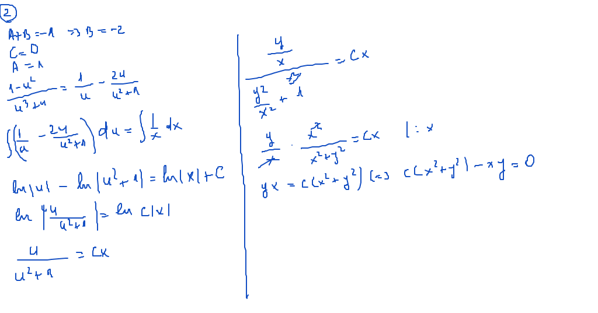

 # Seminar04

[TOC]

## Enunţuri

### 1.

(Modificarea temperaturii unui corp în funcţie de mediu dacă pentru încălzire se foloseşte energie electrică) este soluţie ecuaţia: $\large T^{\prime} + \frac{dS}{mC}T = \frac{w}{4,18 \cdot m \cdot C}$ unde:

- $\large T$ - temperatura corpului
- $\large w$ - puterea electrică
- $\large m$ - masa corpului
- $\large C$ - căldura masică
- $\large S$ - suprafaţa de răcire
- $\large \alpha$ - coeficientul de împrăştiere

### 2.

Curbele ortogonale plane pentru tangenta într-un punct $\large A$ al unei curb care taie axa $\large Ox$ în $\large B$ astfel încât $\large |OB| = |AB|$ sunt soluţiile ecuaţiei $\large \frac{dy}{dx} = \frac{2 \cdot x \cdot y}{x^2 - y^2}$

### 3.

Curbele ortogonale ale cercurilor cu centrul pe $\large Ox$ şi tangente axei $\large Oy$ sunt soluţiile ecuaţiei $\large y^{\prime} = \frac{y^2 - x^2}{2 \cdot y \cdot x}$ 

## Rezolvare

### Exerciţiu 02

