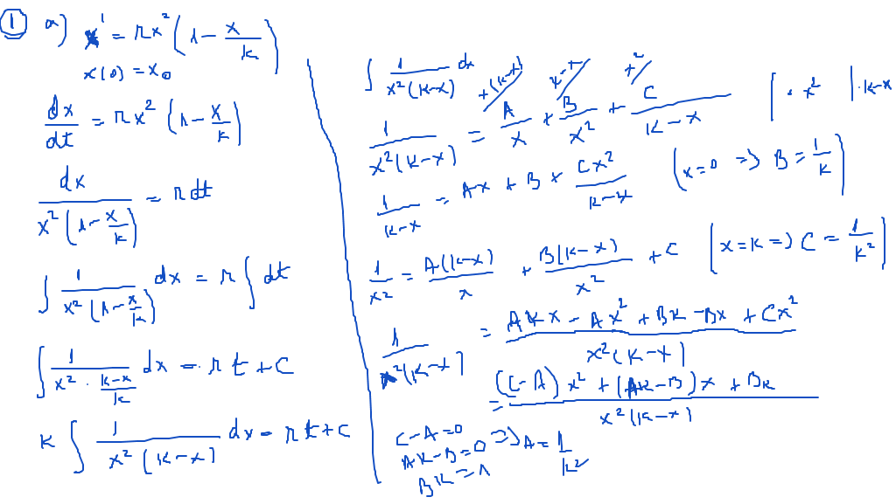
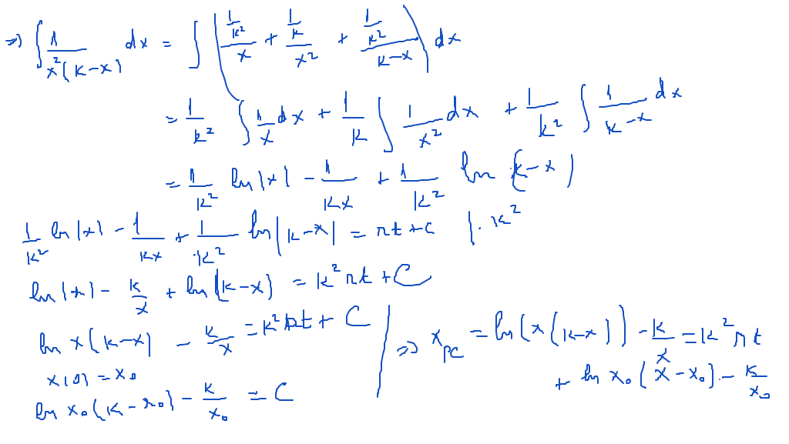
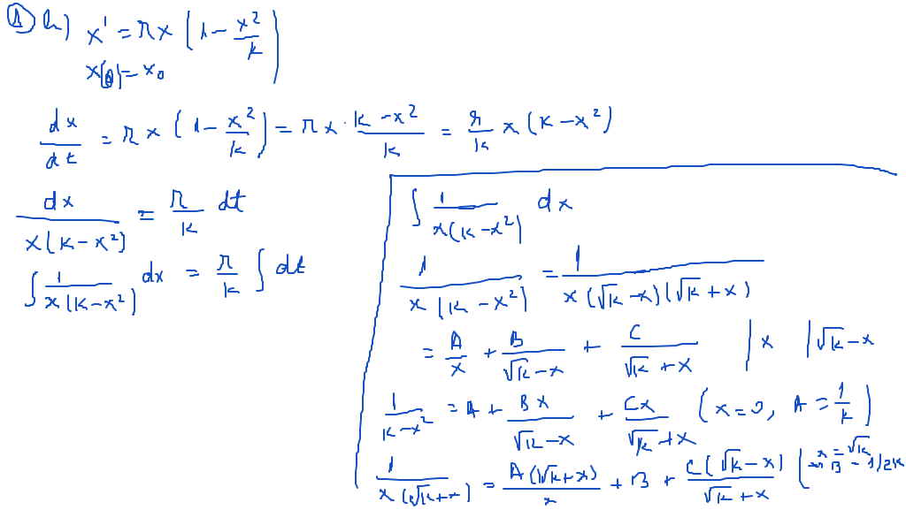
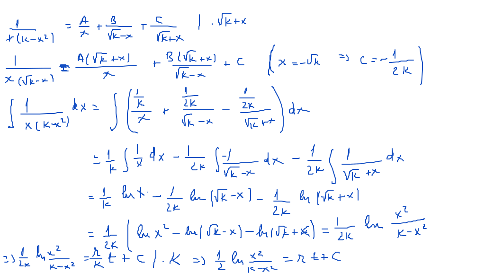

# Seminar06

## Aplicații ale ecuațiilor diferențiale de ordinul I (continuare)

[TOC]

### 1. Variante ale modelului Verhulst

$$
\large
\begin{align*}
&a)\ \dot{x} = rx^2(1 - \frac{x}{K}),\ x(0) = x_0,\ r,K > 0 \\
&b)\ \dot{x} = rx(1 - \frac{x^2}{K}),\ x(0) = x_0,\ r,K > 0 \\
\end{align*}
$$

### 2. Dinamica unei populații care trebuie recoltată

Există situaţii în care anumite specii sunt recoltate. De exemplu, o plantă, a cărei dinamică este guvernată de o lege logistică, este mâncată de cornute. Dacă adăugăm un termen de recoltare la ecuaţia diferenţială logistică, obţinem $\large \dot{x} = x(a-bx) - h(x)$, unde $\large a$ şi $\large b$ sunt parametri pozitivi, iar $\large h(x)$ reprezintă rata de recoltare a plantelor. De cele mai multe ori, rata de recolatre este modelată de o funcţie de forma $\large \dot{x} = rx(1-\frac{x}{K}) - Ex$, (\*) unde $\large r$, $\large A$ şi $\large E$ sunt constante pozitive, $\large Ex$ reprezintă producţia recoltată pe unitatea de timp, iar $\large E$ este o mărime a efortului depus.
Ecuația (\*) se poate scrie astfel $\large \frac{dx}{dt} = \frac{r}{K} x (K - \frac{K}{r}E - x)$ (ecuaţie cu variabile separabile)

## Rezolvare

### Exerciţiu 1. a)

### Exerciţiu 1. b)

