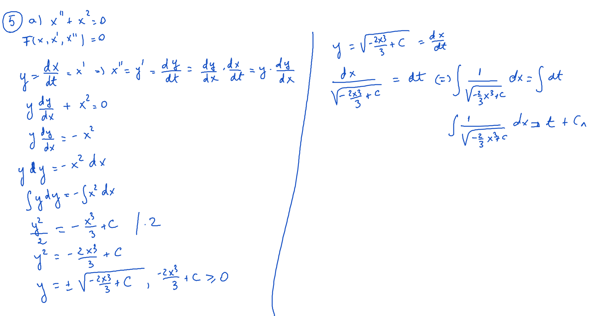

# Seminar07

[TOC]

## Enunţuri

Să se rezolve următoarele ecuaţii:
$$
\begin{align*}
&a)\ x^{II} + x^2 = 0 \\
&b)\ x^{II} + x \cdot x^{I} = 0 \\
&c)\ x \cdot x^{III} + 3 \cdot x^{I} \cdot x^{II} = 0 \\
\end{align*}
$$

## Rezolvare

### Exerciţiu 5. a)

