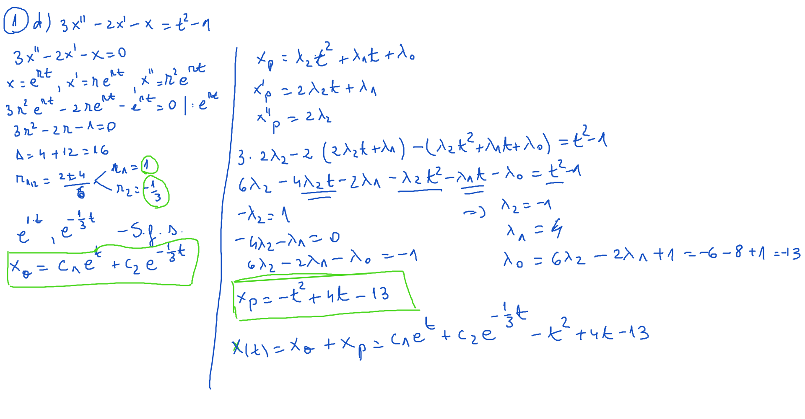
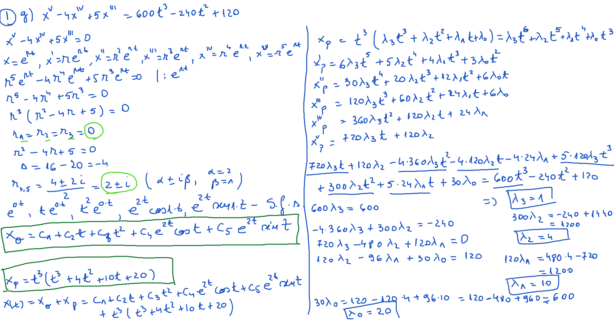

# Seminar09

[TOC]

## Ecuații

### 1.

$$
\large
\begin{align*}
&a)\ x^{II} + x^{I} = 3t + 2\\
&b)\ x^{II} - 4x^{I} + 4x = t^2\\
&c)\ x^{II} - x^{I} + x = t^3 + 6\\
&d)\ 3x^{II} - 2x^{I} - x = t^2 - 1\\
&e)\ x^{IV} - 2x^{III} + x^{II} = t^3\\
&f)\ x^{III} + 3x^{II} - 4x^{I} = 2t^2 - 3t + 9\\
&g)\ x^{V} - 4x^{IV} + 5x^{III} = 600t^3 - 240t^2 + 120\\
\end{align*}
$$

### 2.

$$
\large
\begin{align*}
&a)\ x^{II} - 4x = te^{3t}\\
&b)\ x^{II} - 9x = 5t^2e^{2t}\\
&c)\ x^{II} + 2x^{I} + x = e^{2t}\\
&d)\ x^{II} - 4x = t^2e^{2t}\\
&e)\ x^{II} - 3x^{I} + 2x = 3t^2e^t\\
&f)\ x^{II} + 2x^{I} - 3x = 4te^t\\
\end{align*}
$$

### 3.

$$
\large
\begin{align*}
&a)\ x^{II} + 4x^{I}-3x = t \cdot sin2t\\
&b)\ x^{II} - 4x = e^{2t} \cdot cos2t\\
&c)\ x^{II} - 2x^{I} + 5x = t \cdot e^t \cdot sint\\
&d)\ x^{II} - 2x^{I} + 5x = e^t \cdot cos2t\\
&e)\ x^{II} - x = 2t \cdot sint\\
&f)\ x^{II} + 4x = e^{2t} \cdot sin2t\\
\end{align*}
$$

## Rezolvare

### Exerciţiu 1. d)

### Exercițiu 1. g)

### Exercițiu 2. a)

