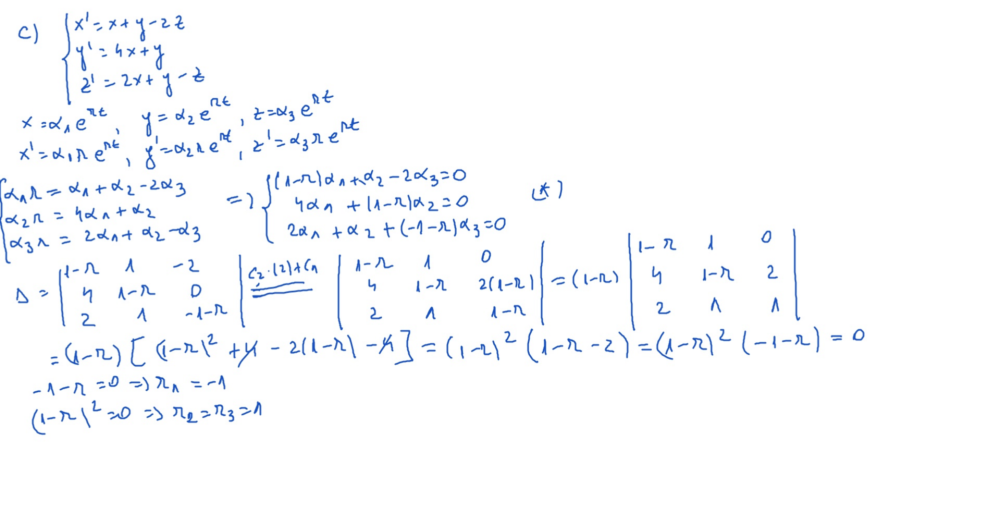
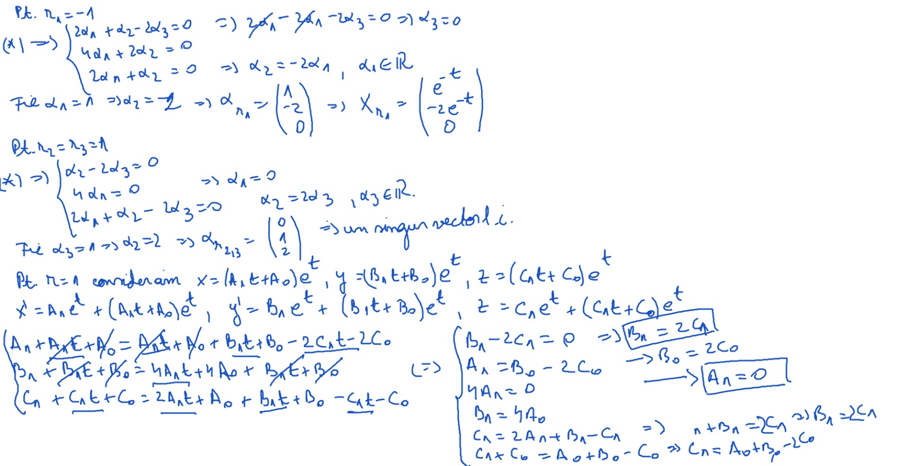
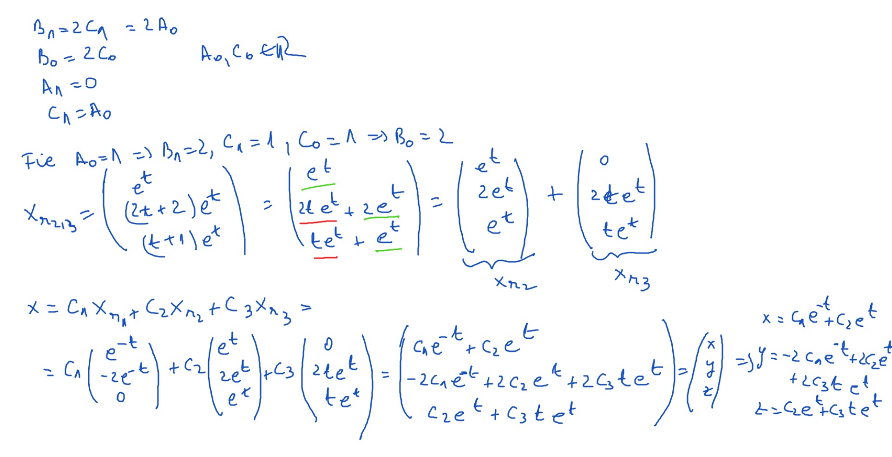

# Seminar12

[TOC] 

## Enunţ

$$
\large
\begin{align*}

& b) \begin{cases}
x^\prime = 2x + y\\
y^\prime = 2y + 4z\\
z^\prime = x - z
\end{cases} \\

& c) \begin{cases}
x^\prime = x + y - 2z\\
y^\prime = 4x + y\\
z^\prime = 2x + y - z
\end{cases}

\end{align*}
$$

## Rezolvare

