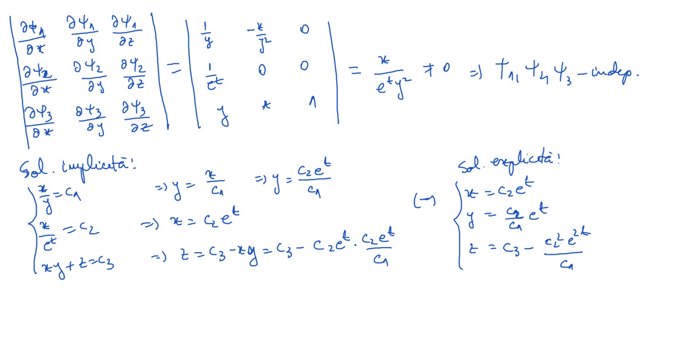
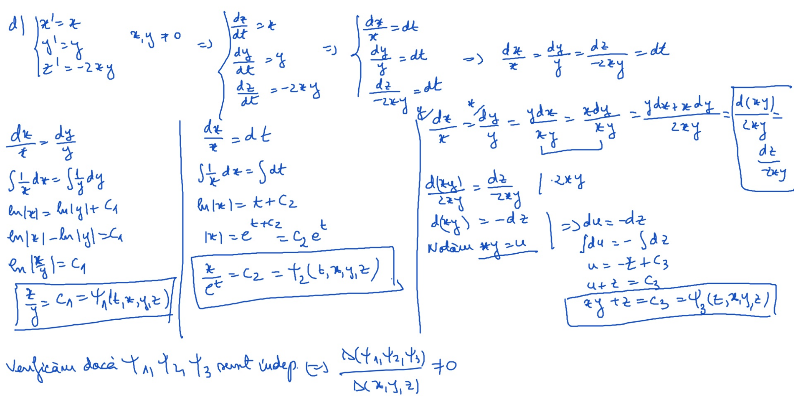
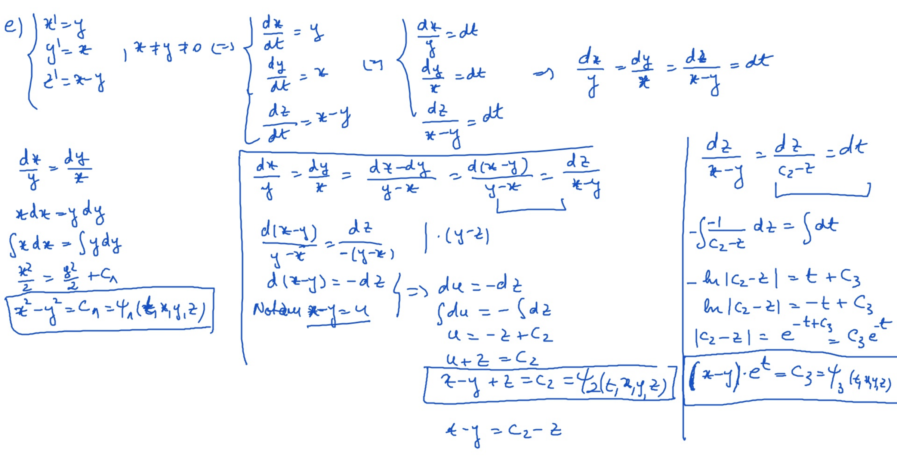
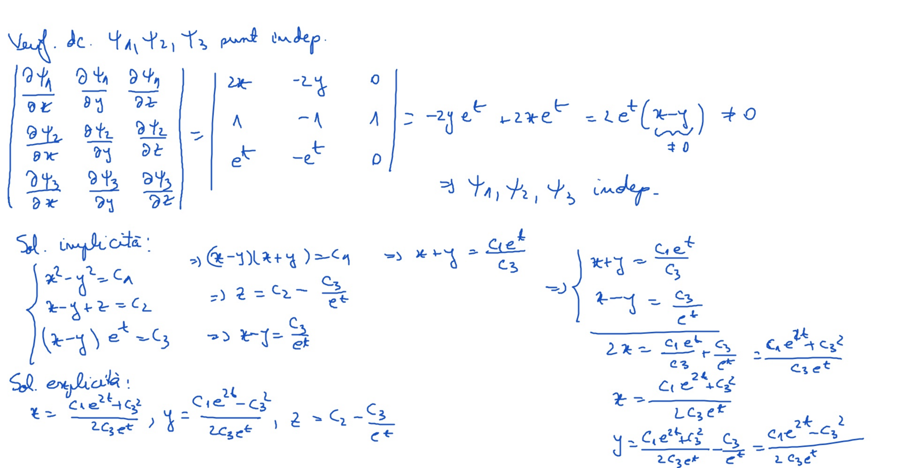

# Seminar14

[TOC] 

## Exerciţii

$$
\large
\begin{align*}

&d)
\begin{cases}
x^\prime = x\\
y^\prime = y\\
z^\prime = -2xy
\end{cases},\ 
x \ne 0, y \ne 0
\\ \\

&e)
\begin{cases}
x^\prime = y\\
y^\prime = x\\
z^\prime = x-y
\end{cases},\ 
y \ne x \ne 0
\\ \\

\end{align*}
$$

## Rezolvare

### Exerciţiu d)

### Exerciţiu e)

