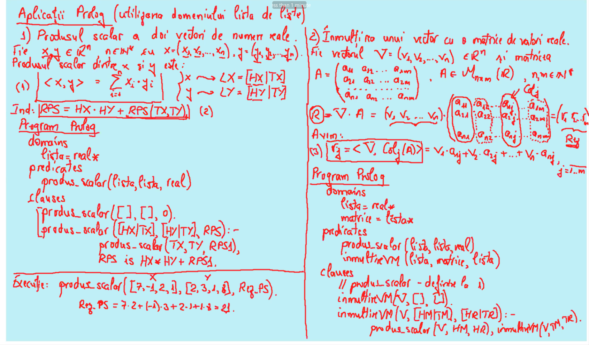
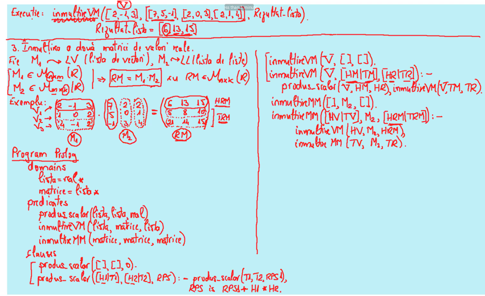

# Laborator08

## Utilizarea domeniului lista de liste

[TOC] 

## Aplicaţii Prolog

### 1. Produsul scalar a doi vectori de numere reale.

Fie $\large x, y \in \R^n, n \in \N^*$ cu $\large x = (x_1,x_2,...,n_x)$, $\large y = (y_1,y_2,...,y_n)$. Produsul scalar dintre $\large x$ şi $\large y$ este: 
$$
\large
<x,y> = \sum_{i=1}^{n} x_i \cdot y_i\ (1) \\
\large
\begin{cases}
x \to LX = [HX|TX] \\
y \to LY = [HY|TY] \\
\end{cases} \\
\large
Ind: RPS = HX \cdot HY + RPS(TX,TY)\ (2)
$$
**Program Prolog**

```apl
domains
  lista = real*
predicates
  produs_scalar(lista,lista,real)
clauses
  produs_scalar([],[],0).
  produs_scalar([HX|TX],[HY|TY],RPS):- produs_scalar(TX,TY,RPS1), RPS is HX*HY+RPS1.
```

**SWI-Prolog**

```apl
produs_scalar([],[],0).
produs_scalar([HX|TX],[HY|TY],RPS):- produs_scalar(TX,TY,RPS1), RPS is HX*HY+RPS1.
```

**Execuţie**

```apl
?- produs_scalar([7,-1,2,1],[2,3,1,8],Rez_PS).
Rez_PS = 21.
```

### 2. Înmulţirea unui vector cu o matrice de valori reale.

Fie vectorul $\large V=(v_1,v_2,...,v_n) \in \R^n$ şi matricea:
$$
\large
A = \begin{pmatrix}
a_{11}\ a_{12}\ ...\ a_{1m} \\
a_{21}\ a_{22}\ ...\ a_{2m} \\
...\ ...\ ...\ ... \\
a_{n1}\ a_{n2}\ ...\ a_{nm}
\end{pmatrix},
A \in M_{n \times m}(\R),\ n,m \in \N^*.
$$

$$
\large
\begin{align*}
R = V \cdot A
& = (v_1, v_2, ..., v_n) \cdot
\begin{pmatrix}
a_{11} &a_{12} &... &a_{1m} \\
a_{21} &a_{22} &... &a_{2m} \\
... &... &... &... \\
a_{n1} &a_{n2} &... &a_{nm} \\
\end{pmatrix} \\
& = (V_1, V_2, ..., V_m)\ (Rez)
\end{align*}
$$

**Avem**:
$$
\large
(3)\
\begin{align*}
V_{j} &= <V,\ Coloana_j(A)>\\
&= v_1 \cdot a_{1j} + v_2 \cdot a_{2j} +\ ...\ + v_n \cdot a_{nj},\ j = \overline{1..m} 
\end{align*}
$$

**Program Prolog**

```apl
domains
  lista=real*
  matrice=lista*
predicates
  produs_scalar(lista,lista,real)
  inmultireVM(lista,matrice,lista)
clauses
  produs_scalar([],[],0).
  produs_scalar([HX|TX],[HY|TY],RPS):- produs_scalar(TX,TY,RPS1), RPS is HX*HY+RPS1.
  inmultireVM(V,[],[]).
  inmultireVM(V,[HM|TM],[HR|TR]):- produs_scalar(V,HM,HR), inmultireVM(V,TM,TR).
```

**SWI-Prolog**

```apl
produs_scalar([],[],0).
produs_scalar([HX|TX],[HY|TY],RPS):- produs_scalar(TX,TY,RPS1), RPS is HX*HY+RPS1.
inmultireVM(_,[],[]).
inmultireVM(V,[HM|TM],[HR|TR]):- produs_scalar(V,HM,HR), inmultireVM(V,TM,TR).
```

**Execuţie**

```apl
?- inmultireVM([2,-1,3], [[7,5,-1],[2,0,3],[2,1,4]], Rezultat_lista).
Rezultat_lista = [6,13,15].
```

### 3. Înmulţirea a două matrici de valori reale.

Fie $\large M_1 \to LV$ (lista de vectori), $\large M_2 \to LL$ (lista de liste) 

$\large \begin{cases} M_1 \in M_{n \times m}(\R) \\ M_2 \in M_{m \times k}(\R) \end{cases}$ $\large \Rightarrow RM = M_1 \cdot M_2$ cu $\large RM \in M_{n \times k}(\R)$

**Exemplu**:
$$
\begin{align*}
\begin{pmatrix}
2 &-1 &3 \\ 1 &0 &2 \\ 4 &-1 &2 \\
& M1
\end{pmatrix}
\cdot 
&\begin{pmatrix}
7 &2 &2 \\ 5 &0 &1 \\ -1 &3 &4 \\
& M2
\end{pmatrix}
=
\begin{pmatrix}
6 &13 &15\\ 5 &8 &10 \\ 21 &14 &15 \\
& RM
\end{pmatrix}
\end{align*}
$$

$$
\begin{align*}
HRM = \begin{bmatrix} 6 &13 &15 \end{bmatrix}
&&&
TRM = \begin{bmatrix} 5 &8 &10 \\ 21 &14 &15 \end{bmatrix}
\end{align*}
$$

**Program Prolog**:

```apl
domains
  lista=real*
  matrice=lista*
predicates
  produs_scalar(lista,lista,real)
  inmultireVM(lista,matrice,lista)
  inmultireMM(matrice,matrice,matrice)
clauses
  produs_scalar([],[],0).
  produs_scalar([H1|T1],[H2|T2],RPS):- produs_scalar(T1,T2,RPS1), RPS is RPS1+H1*H2.
  inmultireVM(V,[],[]).
  inmultireVM(V,[HM|TM],[HR|TR]):- produs_scalar(V,HM,HR), inmultireVM(V,TM,TR).
  inmultireMM([],M2,[]).
  inmultireMM([HV|TV],M2,[HRM|TRM]):- inmultireVM(HV,M2,HRM), inmultireMM(TV,M2,TRM).
```

**SWI-Prolog**:

```apl
produs_scalar([],[],0).
produs_scalar([H1|T1],[H2|T2],RPS):- produs_scalar(T1,T2,RPS1), RPS is RPS1+H1*H2.
inmultireVM(_,[],[]).
inmultireVM(V,[HM|TM],[HR|TR]):- produs_scalar(V,HM,HR), inmultireVM(V,TM,TR).
inmultireMM([],_,[]).
inmultireMM([HV|TV],M2,[HRM|TRM]):- inmultireVM(HV,M2,HRM), inmultireMM(TV,M2,TRM).
```

**Execuţie**:

```apl
?- inmultireMM([[2,-1,3],[1,0,2],[4,-1,2]], [[7,2,2],[5,0,1],[-1,3,4]], Rezultat_matrice).
Rezultat_matrice = [[18, 13, 7], [11, 7, 7], [30, 22, 1]].
```

## Imagini






