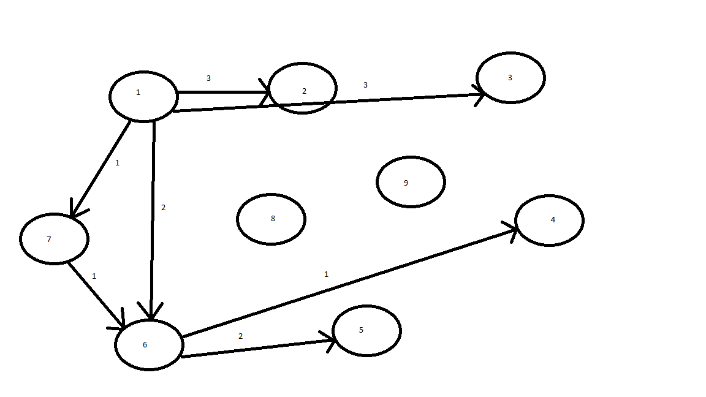

# Curs 05

[TOC] 

## Principiul ISP (Interface Segregation Principle)

**Conform principiului**: "entitățile software trebuie să depindă de abstractizări (clase abstracte și interfețe)", pot apărea situații în care o clasă depinde de o interfață cu foarte multe metode. ("fat interface")

```c#
public interface IFat {
  void Method1();
  void Method2();
  void Method3();
  void Method4();
}

class Client12 {
  IFat _fat;
  public void Method() {
    _fat.Method1();
    _fat.Method2();
  }
}
```

Interfața `IFat` va fi implementată de anumite clase. Acestea obligatoriu vor implementa toate metodele. Indirect, clasa `Client12` depinde de toate metodele din interfața `IFat`, chiar dacă ea utilizează doar `Method1` și `Method2`.

```c#
class Fat1: IFat {
  // toate metodele implementate
}
```

**Probleme**: Dacă se modifică `Method3` sau `Method4`, este afectat și codul clasei `Client12`. (este necesar `redeploy`). Mai mult, dacă o interfață conține foarte multe metode, cu siguranță acest fapt conduce la încălcarea principiului SRP.

**Enunț**: O clasă nu trebuie să depindă de metode pe care nu le utilizează.
**Soluția corectă**: divizarea interfețelor

```c#
public interface IFat12 {
  void Method1();
  void Method2();
}

public interface IFat34 {
  void Method3();
  void Method4();
}

public interface IFat: IFat12, IFat34 {}

class Client12 {
  IFat12 _fat;
}
```

## Principiului DIP (Dependency Inversion Principle)

**Enunț**: Entitățile software de high-level nu trebuie să depinde de entități low-level. Ambele vor fi dependente de abstractizări.

**Parafrazare**: programează orientat către interfețe, nu către implementare!

```c#
class Client {
  public void Task() {
    ConcreteClass c = new ConcreteClass(); // incorect
    c.Job();
  }
}

class ConcreteClass {
  public void Job() { }
}
```

**Corect**:

```c#
public interface IJob {
  void Job();
}

class Client {
  IJob _job;
  public void Task() { _job.Job(); }
}

class ConcreteClass: IJob {
  public void Job() { }
}
```

## Tehnica Dependency Injection (injectarea dependențelor) 

Spunem că o clasă e dependentă de o altă clasă dacă aceasta apare ca referință în clasa inițială (există o relație de asociere între clase). Principiul DIP spune că asocierea trebuie făcută la un nivel cât mai înalt (clase generale, interfețe).

**Dependency Injection** este o tehnică prin care sunt create diverse obiecte de clase concrete utilizate într-o clasa Client fară ca aceasta să aibă cunoștință despre ele.

- **containere IoC** (crează automat instanțe ale interfețelor așa cum sunt specificate în configurare) se indică în config maparile între interfețe și tipuri concrete

(1) Injectare prin constructor

```c#
class Client {
  IJob _service;
  public Client(IJob service) {
    _service = service;
  }
  public void Task() {
    _service.Job();
  }
}

var client = new Client(new ConcreteClient());
```

(2) Injectare prin proprietăţi (metode de tip set)

```c#
class Client {
  IJob _service;
  public IJob Service {
    get { return _service; }
    set { _service = value; }
  }
  public Client(IJob service) {
    _service = service;
  }
  public void Task() {
    _service.Job();
  }
}

var client = new Client();
client.Service = new ConcreteClient(); // aici injectez dependenta!
```

(3) Injectare prin parametru la metodă

```c#
class Client {
  public void Task(IJob service) {
    service.Job();
  }
}
```

## Studiu de caz

Se dorește proiectarea unui sistem multi-panou (de tip wizard). Utilizarea presupune parcurgerea unui set de panouri. Există un panou inițial și unul final. Parcurgerea unei secvențe de panouri se vă numi "sesiune".

Panourile sunt așezate într-o structură de tip graf. Fiecare nod în graf reprezintă un panou. Parcurgerea unei căi reprezintă sesiunea. Orice sesiune începe cu un panou inițial, se termină cu panoul final.

La un momentan, în cadrul aplicației, un singur panou este panou inițial (marcat ca atare); mai multe panouri pot fi panouri finale.

Un panou trebuie să fie executat. O executare a unui panou presupune:
- afișarea panoului;
- citirea datelor furnizate de utilizator;
- validarea datelor citire
- dacă sunt valide, vor fi procesate.
- dacă nu sunt valide, se afișează un mesaj de eroare și se re-afișează panoul.

O sesiune parcurge panourile și le execută succesiv. La fiecare pas, după executare, utilizatorul furnizează și o opțiune de continuare (choice).

La proiectarea soluției se vor considera următoarele conditiţii (Extensibilitate, Flexibilitate, soluție cât mai generală)

- Dacă se doresc noi panouri în sistem (noi tranziții între panouri), acest lucru să fie posibil fară mari costuri (codul actual să fie cât mai puțin afectat)

- Structura grafului să fie eficientă. (tipul de date selectat, resurse puține consumate) 

### Caz particular (Proiect 2):

Să se implementeze o aplicaţie multi-panou pentru o agenţie de zboruri (Tarom).

**Utilizatori**: admin, client
**Facilităţi**:
- autentificare (login) - P1 (initial)
- adăugare zboruri (admin) - P2
- modificare zboruri (admin) - P3
- eliminare zbor (admin) - P10
- rezervare zbor (admin,client) - P4
- cumpărare zbor (admin, client) - P5
- căutare zbor (admin, client) - P6
- listă zboruri - P7
- rezervă loc - P8
- help - P9
- exit - P10 (final)

### Soluţii de implementare:

(1) Descompunere funcţională (programare procedurală)

Presupunem ca nu ştim programare pe obiecte (presupune adevarată / falsă? - sesiunea va demonstra).

Fiecare facilitate o vom transforma într-o funcţie.
- Trebuie sa execut o sesiune? - Implementez o funcţie "ExecuteSession"
- Trebuie sa execut un panou? - Implementez o funcţie "ExecutePanel"
- Display (afişare panou)
- Read (citire date)
- IsCorrect (validare date)
- Message (mesaj de eroare) 
- Process (procesare datelor corect furnizate)

```c#
void ExecutePanel(int panelId, out int choice) {
  do {
    Display(panelId);
    data = Read(panelId, out choice);
    ok = IsCorrect(data, panelId);
    if (!ok) { Message(panelId); }
  }
  while (!ok);
  Process(data, panelId);
}

int IntialPanel() {
  return initialPanelId;
}

bool IsFinal(int panelId) {
  // ...
}

// Ca la automate, returnam urmatorul panou functie de panoul curent si alegerea de continuare
int Transition(int panelId, int choice) {
  return // ...
}

void ExecuteSession() {
  // Obtinem panoul initial
  int panelId = InitialPanel();
  // bool final = IsFinal(panelId);
  int choice;
  do {
    ExcutePanel(panelId, out choice);
    // Obtine id-ul urmatorului panou
    panelId = Transition(panelId, choice);
  } while (!IsFinal(panelId));
}
```

### Dezavantaje abordare

Nu este extensibilă: Fiecare funcţie are un parametru `panelId` prin care decide implementarea (de exemplu, într-o instrucţiune `switch`).

**Exemplu**:

```c#
void Display(int panelId) {
  switch (panelId) {
  case 1: // afisez panoul cu id-ul 1
    ...
  }
}
```



