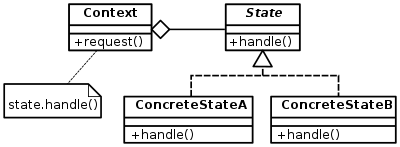

# Curs 06

[TOC]

## Șabloane de proiectare (Design Patterns)

**Șablon**: soluție generală de design (proiectare), reutilizabilă, care rezolvă un scenariu particular de proiectare și poate fi aplicat la o scală largă de aplicații.

De obicei, șabloanele rezolvă probleme de design de 3 categorii:
- **comportamental**: comportamente ale obiectelor în diferite stări
- **structural**: relații dintre clasele obiectelor
- **creaţional**: modul în care sunt create / construite obiectele care participă la șablon.

Un șablon de proiectare se descrie în general după următoarea schemă (**GoF**: `Gang of Four - E. Gamma`). Catalog de șabloane de proiectare:
1. **Numele**: un nume sugestiv (`State`, `Template Method`, `Singleton`, `Composite`...)
2. **Intenția**: care este obiectivul principal al șablonului (ce problemă de design rezolvă)
3. **Motivația**: se prezintă o problemă reală de rezolvat în care s-a utilizat șablonul
4. **Structura**: care sunt clasele/interfețele ce participă la șablon și relațiile dintre ele
5. **Participanți**: clasele care participă la șablon
6. **Aplicabilitate**: când se poate utiliza șablonul (în ce situații)
7. **Consecințe**: avantaje/dezavantaje
8. **Colaborări**: cum comunică obiectele între ele prin mesaje pentru a se implementa șablonul
9. **Implementare**: se indică variante de implementare  

---

1. `State` Pattern
2. Schimbarea stării unui obiect și al comportamentului acestuia fară dependențe de stări concrete.
3. Vezi aplicația `multi-panou` (un panou reprezintă o stare, o sesiune reprezintă obiectul care își schimbă starea; schimbarea stării coincide cu afișare următorului panou; schimbarea comportamentului coincide cu executări diferite ale panoului curent)
4. ...
5. - clasa `Context` (clasa `Session`): pentru obiectele care trec prin stări/comportamente diferite. 
   - metoda `Request()` este comportamentul care se modifică la schimbarea stării (`Execute` din `Session`)
   - `state.Handle` <=> `currentState.Execute`: comportamentul în starea `state`.
   - clasa abstractă `State`: abstractizare a stărilor și comportamentelor obiectului `Context (Session)`.
   - `ConcreteStateA`, `ConcreteStateB` sunt stări/comportamente particulare, concrete. 
6. - Când un obiect trece prin multe stări și se comportă diferit în stări diferite. Pentru extensibilitate, mentenanță, se recomandă utilizarea șablonului.
   - o metodă implementează intructiuni `switch` sau `if/else` extrem de complexe, ce depind în general de o enumerare.

```c#
switch (enumValue) {
  case 1: procesare1;
  case 2: procesare2;
  // ...
  case n: procesaren;
}
```

**Soluţie**: fiecare `case` se transformă într-o stare;

```c#
abstract class State {
  public abstract void procesare();
}

class State1: State {
  public void procesare() {
    // implementez procesare1
  }
}

if (stare1) procesare1();
else if (stare2) procesare2();
```

=> Se poate utiliza ca tehinca de refactorizare de cod sursă.

7. **Avantaje**: extensibilitatea (`OCP` pentru clasa `Context`) 
**Dezavantaje**: complexitate (pot rezultate multe clase - *de mici dimensiuni* - explozie exponențială)
8. - Clientul apelează metoda `Request` din clasa `Context`;
   - în continuare, obiectul `Context` apelează prin intermediul referinței `state`, metoda `Handle`. Prin polimorfism, funcție de obiectul real care prefixează apelul (starea curentă), se vă executa versiunea dintr-o clasă `ConcreteStateX`; în acest fel este simulată schimbarea stării și a comportamentului. 
9. Variante de implementare:
   a) Toate stările posibile sunt create la iniţializea aplicației și memorate în clasa `Context`; analog și tranzițiile; (vezi aplicația de zboruri)
   b) Clasa `Context` deține doar referință către starea curentă, stările concrete sunt create dinamic, pe măsură ce se schimbă starea. Tranzițiile nu mai sunt memorate, sunt implementate "în cod", în clasele derivate din `State`.

`StateA` => `StateB` (se schimbă starea în condiţia `condition`)

```c#
class Context {
  public State CurrentState { get; set; }
  public void Request() {
    CurrentState.Handle();
    CurrentState.NextState(this);
  }
}

abstract class State() {
  abstract void NextState(Context c);
}

class StateA: State {
  public void NextState(Context c) {
    if (condition) { c.CurrentState = new StateB(); }
  }
}
```

Această variantă are avantajul că tranziţiile sunt uşor de văzut din cod, avântul memoriei. **Dezavantaj**: clasele derivate de tip `State` nu mai sunt independente. La noi stări/tranziţii, e posibil să fie modificate cele existente.



## Template Method Pattern

**Intenţia**: se cunoaşte scheletul unui algoritm, dar nu se cunosc paşii acestuia.
**Motivaţia**: vezi metoda `Execute` din clasa abstractă `State`

```c#
public abstract class State {
  public int Id { get; set; }
  public static int Choice { get; set; }
  public abstract void Display();
  public abstract void Read();
  public abstract bool IsFinal();
  public abstract string Message();
  public abstract bool IsCorrect();
  public abstract void Process();

  // metoda Template (schelet de algoritm)
  public void Execute() {
    var ok = false;
    do {
      Display();
      Read();
      ok = IsCorrect();
      if (!ok) { Message(); }
    }
    while (!ok);
    Process();
  }
}
```

**Structură**: o clasă abstractă și cel puțin o implementare concretă.

**Participanți**: `AbstractClass` (vezi clasa `State`): conține schema algoritmului într-o metodă concretă. Pașii algoritmului (`PrimitiveOperation1`, `PrimitiveOperation2`) apar ca metode abstracte. `ConcreteClass` (Vezi `LoginPanel`,...): implementează pașii algoritmului.

**Avantaje**:

- reutilizare de cod sursă; (re-utilizare de comportament comun: metoda `execute` este comună tuturor panourilor)
- aderare la principiul Hollywood ("don't call us, we'll call you!"): principiul corect de reutilizare al codului sursă.

```c#
class A {
  public void m() {
    // codul metodei din clasa de baza	
    hook();
  }
  public virtual void hook() {}
}

class B: A {
  // public void m() {
  //	base.m(); // apelez varianta de baza; incalca principiul!
  //	// cod specific clasei B
  //}
  public override void hook() { }
}
```

**Template method**: "injectare" de comportament în diverse puncte (metode `hook` numite puncte de extensie, fără modificarea codului sursă. **Tehnica recomandată (corecta) de reutilizare de cod sursa!**

**Exemplul particular**:

```c#
//citeste in colectii de obiecte de tip T date din baza de date!!
//metoda de citire va fi o metoda template!!
//pentru instructiuni de tip select din baza de date
public abstract class DbReader<T> {
  public string ConnectionString { get; set; }

  //metoda template
  public List<T> Get() {
    var result = new List<T>();
    try {
      using(var connection = new SqlConnection(ConnectionString)) {
        connection.Open();
        using(var command = new SqlCommand(SqlText, connection)) {
          var reader = command.ExecuteReader(); // rezultatul
          // maparea unui reader la un obiect de tip T
          result = MapAll(reader);
        }
      }
      return result;
    } catch (Exception e) {
      // logare exceptie e
      return result;
    }
  }

  // metoda template
  private List<T> MapAll(IDataReader reader) {
    var result = new List<T>();
    while (reader.Read()) {
      result.Add(Map(reader)); // mapez linia curenta!
    }
    return result;
  }
  protected abstract T Map(IDataReader reader);
  public abstract string SqlText { get; }
}

internal class UserDbReader: DbReader<User> {
  public override string SqlText => "SELECT Username, Password FROM User";
  protected override User Map(IDataReader reader) {
    return new User() {
      Username = (string) reader["Username"],
      Password = (string) reader["Password"]
    };
  }
}
```


## Aplicaţii de tip Undo/Redo (multi-level) (Şablonul Command)

Pentru o aplicaţie cu interfaţă grafică (Agenda de Contacte), să se implementeze mecanismul `undo`/`redo` de nivel $\large n$. Aplicaţia trece printr-o suită de stări provocată de o suită de comenzi efectuate!

> $\large S_{0}$ => $\large S_{1}$ => $\large S_{2}$ ... $\large S_{n}$ => $\large S_{n+1}$ 
> $\large C_{0}$ => $\large C_{1}$ => $\large C_{2}$ ... $\large C_{n}$ => $\large C_{n+1}$

**Executare `Undo`**: să anulez efectul comenzii $\large C_{n+1}$, aplicaţia va trece în starea $\large S_{n}$.

**Soluţia**: pentru anularea unei comenzi se va memora cea mai mică informaţie posibilă - diferenţa dintre starea curentă şi cea anterioară.

**Exemplu**: pentru $\large C_{n+1}$ memorez diferenţa dintre $\large S_{n+1}$ şi $\large S_{n}$
**Exemplu concret**: dacă $\large C_{n+1}$ este "adăugarea unui nou contact în agendă" (!), adică voi memora noul contact adăugat şi poziţia pe care a fost adăugat (!)

