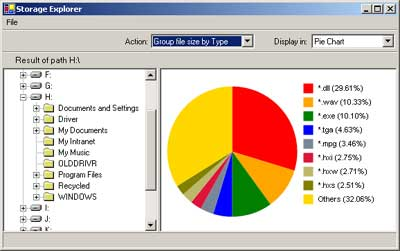
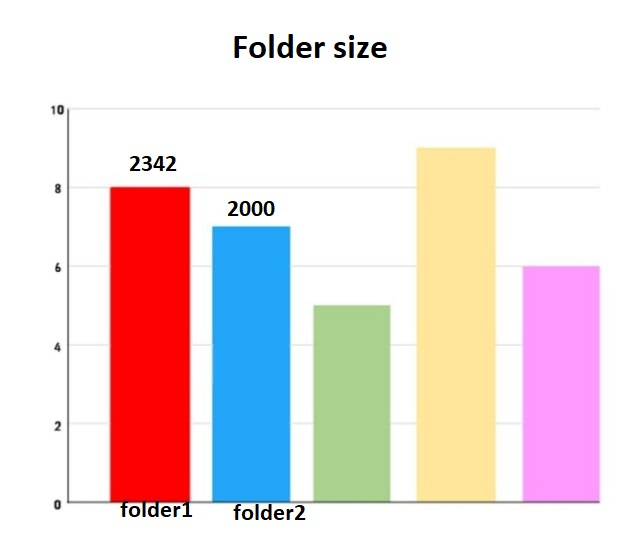

# Curs 09

[TOC]

## Observer Pattern - Un șablon comportamental

Pentru obiecte aflate în relația `one to many`, în care un `subiect` **observabil** are atașate mai multe obiecte **observatoare**. 

Când **subiectul** își schimbă propria stare, toți **observatorii** sunt `notificați`, pentru ca aceștia să își actualizeze propria stare.

**Cerințe**:
- **subiectul să fie general**, astfel încât orice clasă care aderă la principiu să poată
  beneficia de mecanism $\Rightarrow$ **abstractizăm noțiunea de obiect observabil**!
- **observatorii**, de asemenea vor fi abstractizați pentru **extensibilitate / flexibilitate**!
- **subiectul nu cunoaște nimic despre observatori concreți**! - în acest fel putem adauga oricât de mulți și oricât de diferiți observatori fară să afectăm codul subiectului!

**Caz particular**: să se implementeze o colecție generică de obiecte care să permită
atașarea de diverși observatori ce monitorizează schimbările în cadrul colecției (adăugare, eliminare) și care își actualizează propriile stări. **De exemplu**, un observator scrie la consolă toate modificările, alt observator scrie într-un fișier
toate modificările.

```c#
public class ObservableSubject {
  private List<IObserver> _observers;
  public ObservableSubject() {
    _observers = new List<IObserver>();
  }
  public void AddObserver(IObserver observer) {
    _observers.Add(observer);
  }
  public void RemoveObserver(IObserver observer) {
    _observers.Remove(observer);
  }
  // Se apeleaza de fiecare data cand se schimba starea subiectului observat!
  protected void NotifyObservers(object changedValue) {
    foreach(var observer in _observers) {
      observer.Update(this, changedValue);
    }
  }
}
//////////////////////////////
public interface IObserver {
  // Aceasta metoda update este utilizata pentru actualizarea
  // unui observer! (este apelata automat de catre subiect)
  void Update(object subject, object changedValue);
  //obj este subiectul observat!!
}
//////////////////////////////
public enum ActionType { Add = 1, Remove = 2 }

public class ChangedValue<T> {
  public int Action { get; set; }
  public T Value { get; set; }
  public override string ToString() {
    return $ "{ (ActionType)Action }: {Value}";
  }
}

public class ObservableList<T> : ObservableSubject {
  public List<T> _elements;
  public ObservableList(): base() {
    _elements = new List < T > ();
  }

  // Dupa fiecare modificare a starii, sunt notificati observatorii
  public void Add(T elem) {
    _elements.Add(elem);
    NotifyObservers(new ChangedValue<T>() {
      Action = (int) ActionType.Add, Value = elem
    });
  }

  public void Remove(T elem) {
    _elements.Remove(elem);
    NotifyObservers(new ChangedValue<T>() {
      Action = (int) ActionType.Remove, Value = elem
    });
  }
}
//////////////////////////////
class FileObserver : IObserver {
  readonly string fileName = "changes.txt";
  public void Update(object subject, object changedValue) {
    File.AppendAllText(fileName, $"{DateTime.Now}: {changedValue}\n");
  }
}
//////////////////////////////
class ConsoleObserver : IObserver {
  public void Update(object subject, object changedValue) {
    Console.WriteLine(changedValue.ToString());
  }
}
//////////////////////////////
class Program {
  static void Main(string[] args) {
    ObservableList<int> list = new ObservableList<int>();

    // Atasam observatorii
    list.AddObserver(new ConsoleObserver());
    list.AddObserver(new FileObserver());
    list.Add(23);
    list.Add(2);
    list.Add(25);
    list.Add(21);
    list.Remove(23);

    Console.ReadKey();
  }
}
```

## Proiect

Să se implementeze un **storage explorer** care analizează conținutul unui folder pe disk și desenează cel puțin două diagrame:

- **piechart**: toate fișierele din structura de foldere și subfoldere sunt grupate după tip și se calculează dimensiunea (procentual) fiecărui tip de fișier!

```c#
public Dictionary<string, long> GetSizes() {
  // Pentru fiecare tip de extensie gasit, se actualizeaza
  // valoare cheii din dictionar 
}
// Acesta va fi primul observer! (PiechartObserver)
```



- **barchart**: printr-o diagramă de tip barchart, se vor desena dimensiunile tuturor folder-elor structurii.



La fiecare adăugare / ștergere de folder / fișier se vor actualiza automat cei doi observatori utilizând șablonul observer!

**Observație**: observatorii pot fi obiecte de tip `Panel` (pe care desenați diagramele), care se vor atașa la un obiect observabil de tip `StorageExplorer`, clasa derivată din `ObservableSubject`

```c#
class StorageExplorer : ObservableSubject {
  public string RootPath { get; set; }
  // ...
  public List<string> GetAllFiles() { }
  public Dictionary<string, long> GetFileSizes() {
    // Pentru fiecare tip de extensie gasit, se actualizeaza
    // valoare cheii din dictionar 
  }
  public Dictionary<string, long> GetFileSizes() {
    // Pentru fiecare tip de extensie gasit, se actualizeaza
    // valoare cheii din dictionar 
  }
}
class PieChart: IObserver {
  Panel _panel;
  public void Update(object subject, object changedValue) {
    // Desenare diagrama pe _panel!!
    // _subject as StorageExplorer
    // La fiecare apel de Update de catre subject, se va redesena
    // diagrama pe panou!!
  }
}
```

