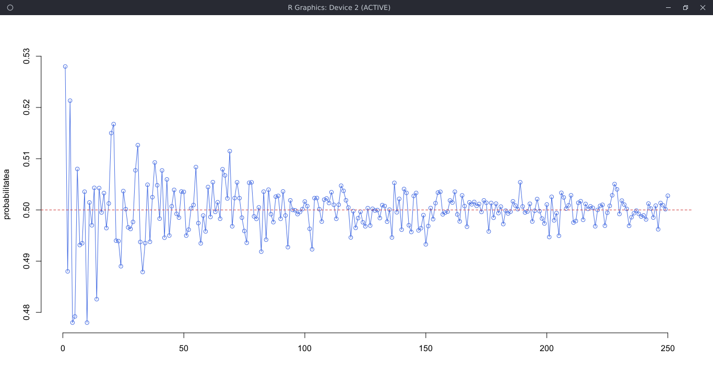
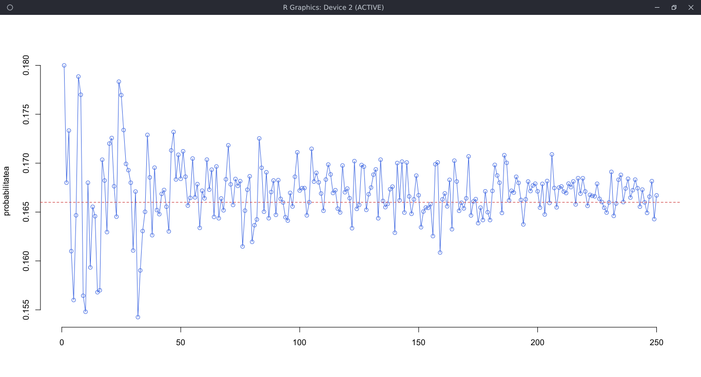
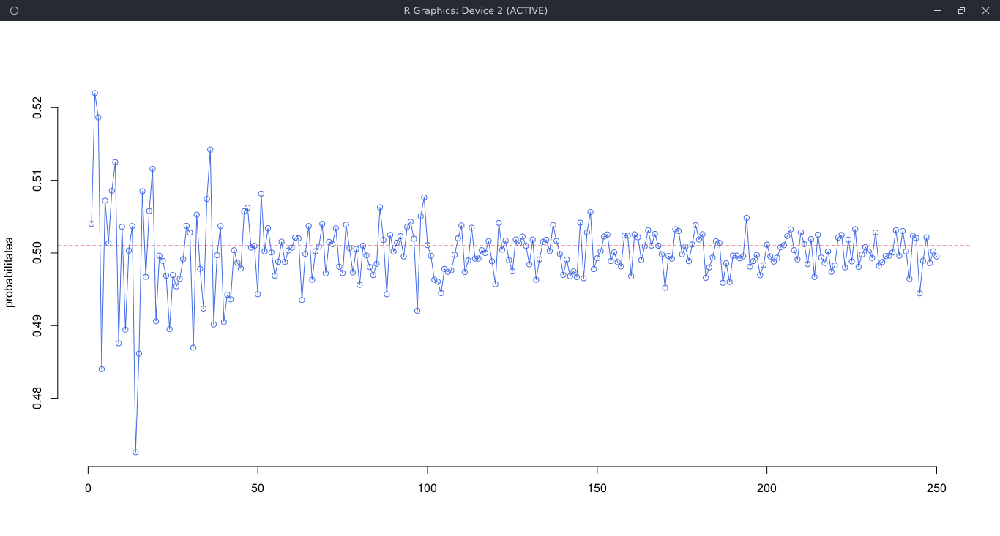
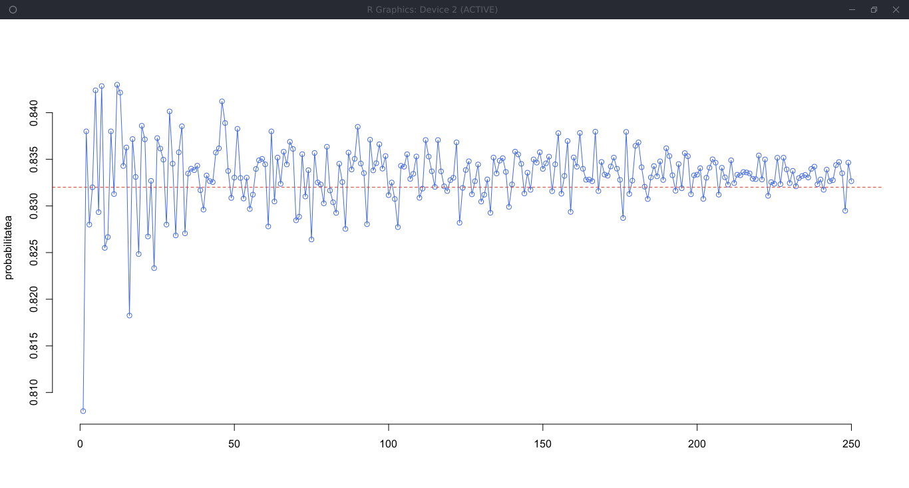

# Laborator 05

## Petculescu Mihai-Silviu

[TOC]

## 1. Aruncarea cu banul

```R
> sample(c("H","T"), 10, replace = TRUE)
[1] "T" "H" "T" "H" "H" "H" "H" "H" "H" "H" 
> a = sample(c("H","T"), 50000, replace = TRUE)
> p = sum(a == "H") / length(a)
> p
[1] 0.50102

# Cu probabilitate setata
> a = sample(c("H","T"), 50000, replace=TRUE, prob = c(0.2,0.8))
> p = sum(a == "H") / length(a)
> p
[1] 0.20456

# Afisare
> y = rep(0,250)
> for(i in 1:250) { a = sample (c("H", "T"), i*250, replace = TRUE); y[i] = sum(a == "H") / length(a) } 
> plot(1:250, y, type = "o", col = "royalblue", bty = "n", xlab="", ylab="probabilitatea"); abline (h=0.5, lty=2, col="brown3")
# Linie de demarcare la 0.5
```



### Aplicaţii

1. Aruncarea unui zar:
   a) Să se calculeze probabilitatea ca la aruncarea unui zar să apară fața cu 3 puncte.
   b) Să se calculeze probabilitatea ca la aruncarea unui zar să apară un număr par.
   c) Să se calculeze probabilitatea ca la aruncarea unui zar să apară fața cu un număr cel mult egal cu 6.

```R
# Punctul a)
> a = sample(c(1:6), 50000, replace = TRUE)
> p = sum(a == 3) / length(a)
> p
[1] 0.16652

# Afisare
> y = rep(0,250)
> for(i in 1:250) { a = sample(c(1:6), i*250, replace = TRUE); y[i] = sum(a == 3) / length(a) }
> plot(1:250, y, type = "o", col = "royalblue", bty = "n", xlab="", ylab="probabilitatea"); abline (h=0.166, lty=2, col="brown3")
# Linie de demarcare la 0.166
```



```R
# Punctul b)
> a = sample(c(1:6), 50000, replace = TRUE)
> p = sum(a %% 2 == 0) / length(a)
> p
[1] 0.50166

# Afisare
> y = rep(0,250)
> for(i in 1:250) { a = sample (c(1:6), i*250, replace = TRUE); y[i] = sum(a %% 2 == 0) / length(a) }
> plot(1:250, y, type = "o", col = "royalblue", bty = "n", xlab="", ylab="probabilitatea"); abline (h=0.502, lty=2, col="brown3")
# Linie de demarcare la 0.502
```



```R
# Punctul b)
> a = sample(c(1:6), 50000, replace = TRUE)
> p = sum(a < 6) / length(a)
> p
[1] 0.83248

# Afisare
> y = rep(0,250)
> for(i in 1:250) { a = sample (c(1:6), i*250, replace = TRUE); y[i] = sum(a < 6) / length(a) }
> plot(1:250, y, type = "o", col = "royalblue", bty = "n", xlab="", ylab="probabilitatea"); abline (h=0.832 , lty=2, col="brown3")
# Linie de demarcare la 0.832
```




2. Dintr-o urnă cu 15 bile numerotate de la 1 la 15 se extrage o bila la intâmplare. Se
   consideră evenimentele: `A - obtinerea unui numar prim`; `B - obtinerea unui numar par`; `C - obtinerea unui numar divizibil cu 3`. Să se calculeze probabilităţile acestor evenimente.

```R
> a = sample(c(1:15), 50000, replace = TRUE)

# Obtinerea unui numar prim
> pA = sum(a == 2 | a == 3 | a == 5 | a == 7 | a == 11 | a == 13 ) / length(a)
> pA
[1] 0.3967

# Obtinerea unui numar par
> pB = sum(a %% 2 == 0) / length(a)
> pB
[1] 0.46994

# Obtinerea unui numar divizibil cu 3
> pC = sum(a %% 3 == 0) / length(a)
> pC
[1] 0.33408
```

## 2. Numărul de băieţi dintr-o familie cu doi copii

```R
> N = 10^5
> copil01 = sample(c("baiat", "fata"), N, replace = TRUE)
> copil02 = sample(c("baiat", "fata"), N, replace = TRUE)

# A - ambii copii sunt baieti
# B - doar cel mai tanar este baiat
# p2 - probabilitatea ca ambii sa fie baieti, cunoscandul pe B
> nB = sum(copil02 == "baiat")
> nAB = sum(copil01 == "baiat" & copil02 == "baiat")
> p2 = nAB/nB
[1] 0.4991623

# C - familia are cel putin un baiat
# p1 - probabilitatea ca ambii sa fie baieti, cunoscandul pe C
> nC = sum(copil01 == "baiat" | copil02 == "baiat")
> p1 = nAB/nC
> p1
[1] 0.3336978
```

### Aplicaţii

1. O urnă conţine 3 bile albe si 4 bile negre, iar o altă urnă conţine 4 bile albe şi
5 bile negre. Din fiecare urnă se extrage câte o bilă. Se consideră evenimentele: `A - bila extrasa din U1 este alba`; `B - bila extrasa din U2 este alba`. Să se calculeze: $\large P(A \cap B)$, $\large P(A \cup B)$, $\large P(A - B)$, $\large P(\overline{A})$.

```R
> N = 10^6
> U1 = sample(c(rep("a",3), rep("n",4)), N, replace = TRUE)
> U2 = sample(c(rep("a",4), rep("n",5)), N, replace = TRUE)
> nA = sum(U1 == "a") / length(U1)
> nB = sum(U2 == "a") / length(U2)

# P(A ∩ B)
> p1 = nA * nB
> p1
[1] 0.190442

# P(A U B)
> p2 = nA + nB - p1
> p2
[1] 0.682496

# P(A − B)
> p3 = nA - p1
> p3
[1] 0.238077

# P(A̅)
> p4 = 1 - nA
> p4
[1] 0.571481
```

2. Se arunca un zar de 3 ori. Care este probabilitatea să obţinem de fiecare dată „cifra 6”?

```R
> N = 10^6
> a = sample(c(1:6), N, replace = TRUE)
> p1 = sum(a == 6) / length(a)
> p2 = sum(a == 6) / length(a)
> p3 = sum(a == 6) / length(a)
> p = p1 * p2 * p3
> p
[1] 0.004559432
```

3. O urnă conţine 6 bile albe şi 5 bile negre. Se extrag succesiv 3 bile fără întoarcerea bilei extrase. Care este probabilitatea ca prima bilă să fie albă, iar celelalte două negre?

```R
> N = 10^6
> U1 = sample(c(rep("a",6), rep("n",5)), N, replace = TRUE)
> U2 = sample(c(rep("a",5), rep("n",5)), N, replace = TRUE)
> U3 = sample(c(rep("a",5), rep("n",4)), N, replace = TRUE)
> p1 = sum(U1 == "a") / length(U1)
> p2 = sum(U2 == "n") / length(U2)
> p3 = sum(U3 == "n") / length(U3)
> p = p1 * p2 * p3
> p
[1] 0.1211184
```


