# Laborator 06

## Petculescu Mihai-Silviu

[TOC]

## Elemente de Grafică în R

 ### Funcţia plot

```R
> plot(x = 1:10, y = 1:10,
       type = "p", # puncte (nu linii)
       main = "Primul grafic",
       xlab = "Axa x", ylab = "Axa y",
       xlim = c(0, 11), # Valorile min si max pe axa x
       ylim = c(0, 11), # Valorile min si max pe axa y
       col = "blue", # Culoarea punctelor
       pch = 16, # Tipul simbolului
       cex = 1 # Marimea simbolului
      )
```

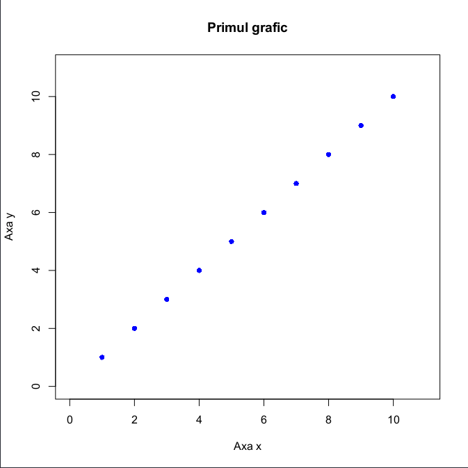

```R
> x = seq(0, 1, 0.1)
> plot(x, x-x^2+2); plot(x, x-x^2+2, type = "l"); plot(x, x-x^2+2, type = "b", pch = 19)
```

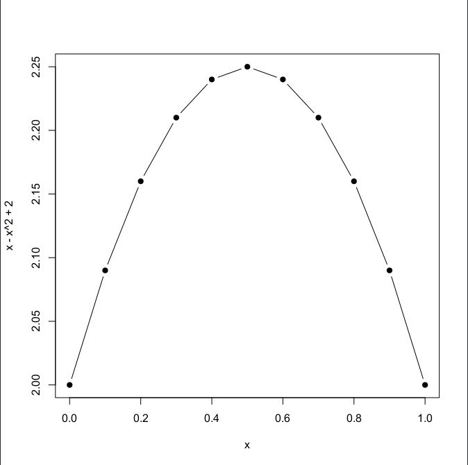

### Funcţia hist

```R
> hist(x = ChickWeight$weight,
       main = "Histograma greutatii gainilor",
       xlab = "Greutate", ylab = "Frecventa",
       xlim = c(0, 500))
```

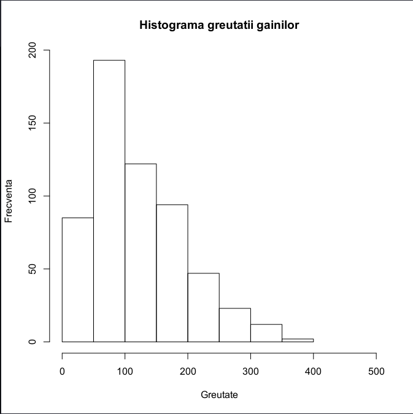

```R
> hist(x = ChickWeight$weight,
       main = "O histograma mai colorata",
       xlab = "Greutate", ylab = "Frecventa",
       breaks = 20, # 20 Bins
       xlim = c(0, 500),
       col = "skyblue", # Culoarea de umplere
       border = "royalblue3" # Culoarea conturului
       )
```

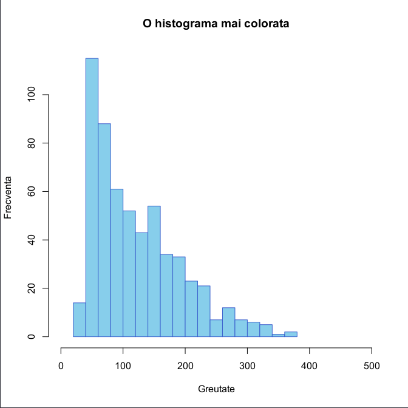

```R
> hist(x = ChickWeight$weight[ChickWeight$Diet == 1],
       main = "Doua histograme pe acelasi grafic",
       xlab = "Greutate", ylab = "Frecventa",
       breaks = 20,
       xlim = c(0, 500),
       col = gray(0, .5)
) & hist(x = ChickWeight$weight[ChickWeight$Diet == 2],
       breaks = 30,
       add = TRUE, # Adauga graficul la cel de dinainte
       col = gray(1, .8))
```

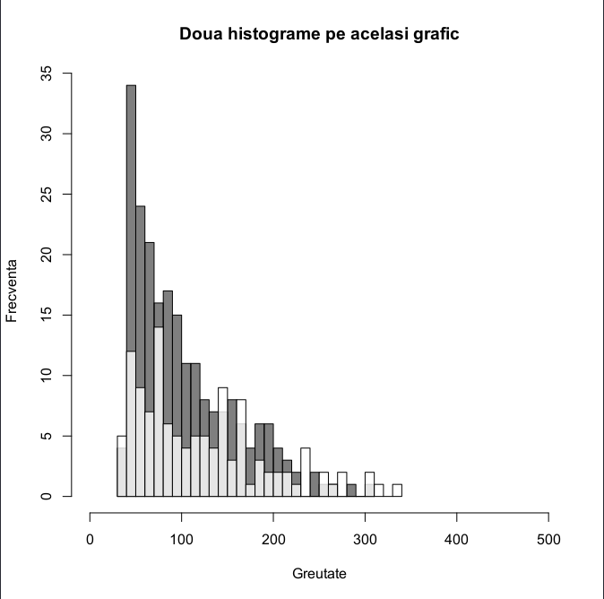

### Funcția barplot

```R
# par(mfrow = c(1, 2))
> weight_cars = aggregate(wt ~ cyl, data = mtcars, FUN = mean)

> barplot(height = weight_cars$wt,
          names.arg = weight_cars$cyl,
          xlab = "Numar de cilindrii", ylab = "Greutatea medie",
          main = "Greutatea medie dupa numarul de cilindrii\n Barp
lot vertical",
          col = "grey80",
          cex.main = 0.7)

> barplot(height = weight_cars$wt,
          names.arg = weight_cars$cyl,
          horiz = TRUE,
          xlab = "Greutatea medie", ylab = "Numar de cilindrii",
          main = "Greutatea medie dupa numarul de cilindrii\n Barp
lot orizontal",
          col = "grey80",
          cex.main = 0.7)
```

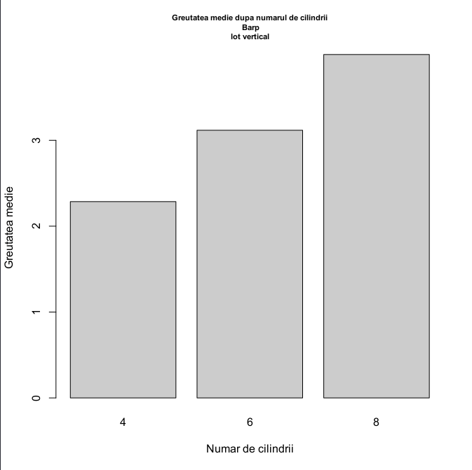

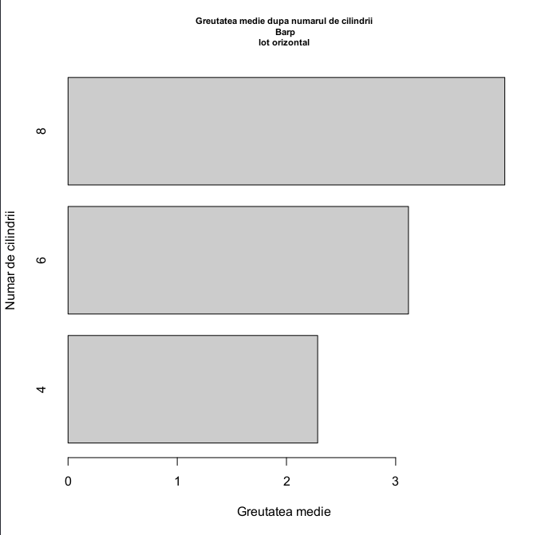

```R
# calculam greutatea medie dupa numarul de cilindrii si transmisie
> carWeight_cyl_am = aggregate(mtcars$wt, by = list(mtcars$cyl, mtcars$am), FUN = mean)

# transformam rezultatul sub forma de matrice
> carWeight_cyl_am = as.matrix(carWeight_cyl_am)
> carWeight_cyl_am
     Group.1 Group.2        x
[1,]       4       0 2.935000
[2,]       6       0 3.388750
[3,]       8       0 4.104083
[4,]       4       1 2.042250
[5,]       6       1 2.755000
[6,]       8       1 3.370000

# aducem la forma necesara pentru barplot
> carWeight = matrix(carWeight_cyl_am[,3], nrow = 3)
> colnames(carWeight) = unique(carWeight_cyl_am[,2])
> rownames(carWeight) = unique(carWeight_cyl_am[, 1])

> carWeight = t(carWeight)
> barplot(carWeight, beside = TRUE, legend.text = TRUE,
          col = c("royalblue3", "brown3"),
          main = "Greutatea medie a masinilor dupa numarul de cili
ndrii si transmisie",
          xlab = "Numar de cilindrii", ylab = "Greutatea medie")
```

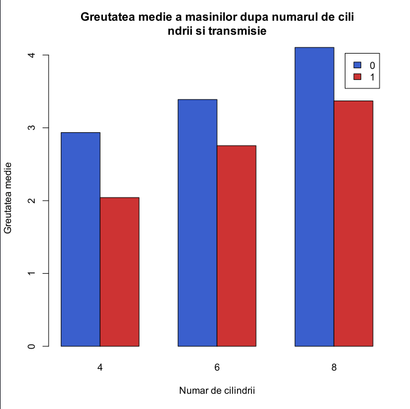

### Funcția boxplot

```R
> boxplot(mpg ~ cyl, data = mtcars,
          xlab = "Numar de cilindrii", ylab = "Mile pe galon",
          main = "Consumul in functie de numarul de cilindrii")
```

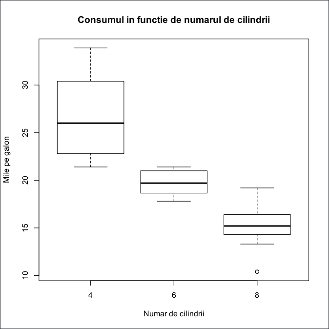

```R
> boxplot(mpg ~ cyl, data = mtcars, subset = am == 0,
          boxwex = 0.25, at = 1:3 - 0.2,
          col = "darkgrey",
          xlab = "Numar de cilindrii", ylab = "Mile pe galon",
          main = "Consumul dupa de numarul de cilindrii si transmisie",
          xlim = c(0.5, 3.5), ylim = c(0, 35),
          yaxs = "i") &
  boxplot(mpg ~ cyl, data = mtcars, subset = am == 1, add = TRUE,
          boxwex = 0.25, at = 1:3 + 0.2, col = "brown3") &
  legend("bottomright", c("Manuala", "Automata"), fill = c("lightgray", "brown3"), bty = "n")
```

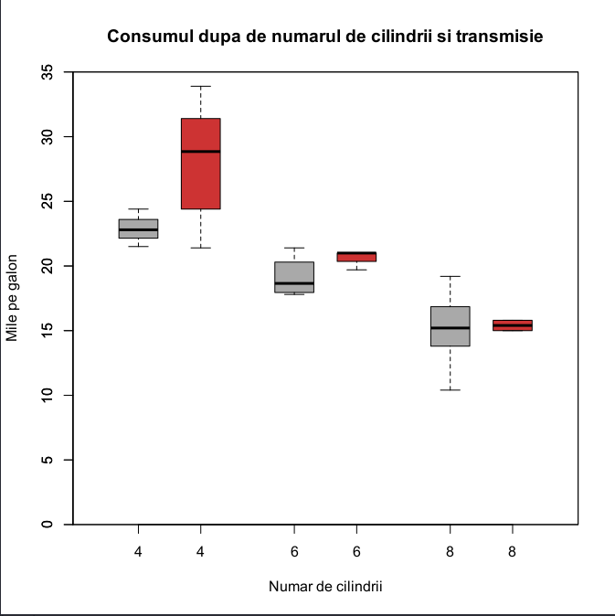

### Funcții pentru adăugarea unor elemente la un grafic

```R
> plot(x = mtcars$mpg[mtcars$am == 0], y = mtcars$hp[mtcars$am == 0],
       xlab = "Mile pe galon", ylab = "Cai putere",
       main = "Consum vs Cai putere dupa transmisie",
       pch = 16, col = "darkgrey") &
  points(x = mtcars$mpg[mtcars$am == 1], y = mtcars$hp[mtcars$am == 1],
         pch = 16, col = "brown3")
```

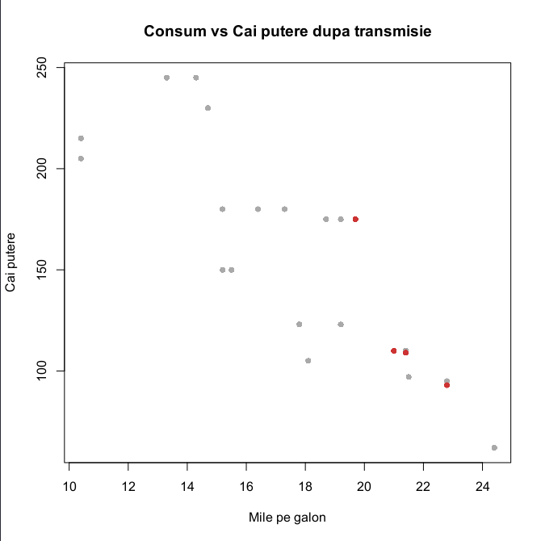

```R
> plot(x = mtcars$mpg, y = mtcars$hp, pch = 16, col = "darkgrey",
       xlab = "Mile pe galon", ylab = "Cai putere",
       main = "Consum vs Cai putere") &
  abline(h = mean(mtcars$hp), lty = 2) &
  abline(v = mean(mtcars$mpg), lty = 2)
```

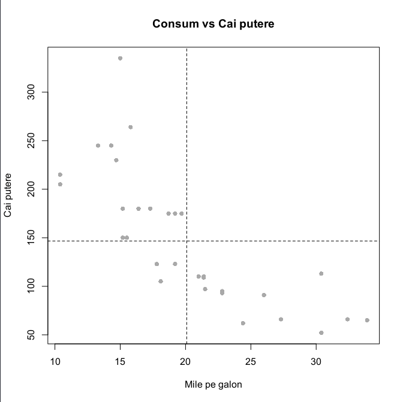

```R
> plot(x = mtcars$mpg, y = mtcars$hp, pch = 16, col = "darkgrey",
       xlab = "Mile pe galon", ylab = "Cai putere",
       main = "Consum vs Cai putere") &
  abline(h = mean(mtcars$hp), lty = 2) &
  abline(v = mean(mtcars$mpg), lty = 2) &
  text(x = mtcars$mpg[mtcars$am == 1], y = mtcars$hp[mtcars$am == 1],
       labels = rownames(mtcars[mtcars$am == 1, ]),
       pos = 3, cex = 0.5)
```

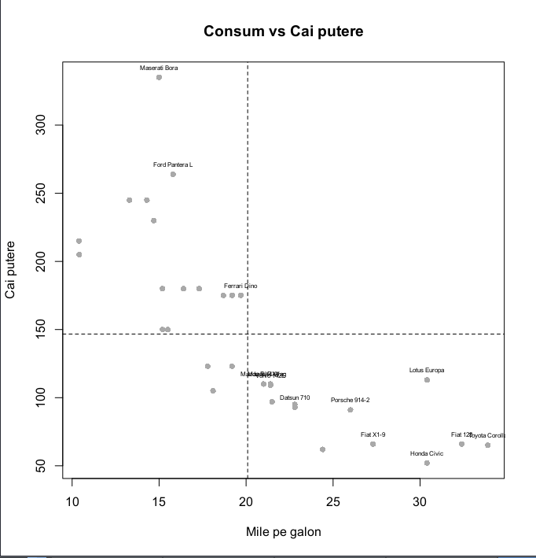

```R
> curve(expr = sin(x), from = 0, to = 2*pi, ylab = "", col = "red",
        main = "Graficul functiei sin si cos") & 
  curve(expr = cos(x), from = 0, to = 2*pi, add = TRUE, col = "blue",
        lty = 2)
# legend("center", legend = c("sin(x)", "cos(x)"), , lty = c(1, 2), col = c("red", "blue"), bty = "n")
```

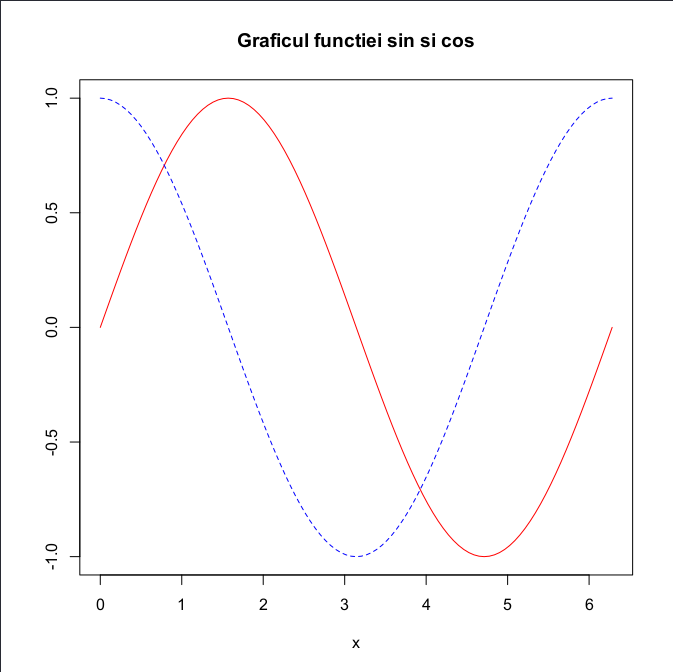

### Salvarea figurilor

```R
# Pasul 1
> pdf(file = "./MyPlot.pdf", # directorul cu fisierul
      width = 4, # latimea in inchi
      height = 4 # inaltimea in inchi
     )

# Pasul 2
> plot(x = 1:10, y = 1:10) & abline(v = 0) & text(x = 0, y = 1, labels = "Ceva text aleator")

# Pasul 3
dev.off()
```

