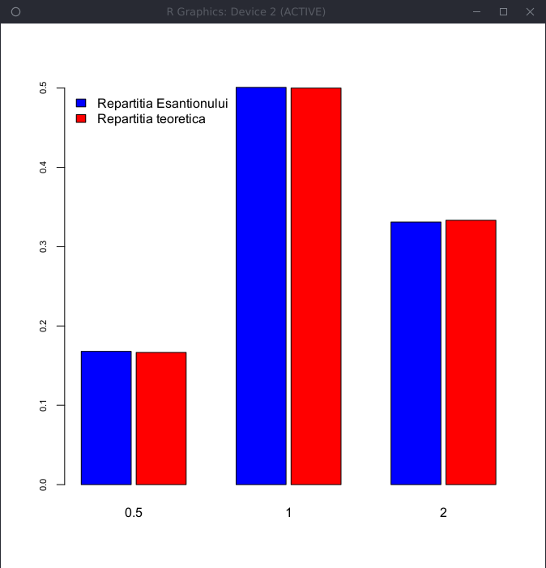

# Laborator 08

## Petculescu Mihai-Silviu

[TOC]

## Generarea unei variabile aleatoare discrete

Definiţi o funcţie care să genereze un eşantion de talie $\large n$ dintr-o distribuţie discretă definită pe
mulţimea $\large \{x_1, ... , x_N\}$ cu probabilităţile $\large \{p_1 , . . . , p_N\}$.

```R
> GenerateDiscrete = function(n = 1, x, p, err = 1e-15) {
  # x alfabetul ; # p probabilitatile
  lp = length(p)
  lx = length(x)
  # verify if x and p have the same size
  if(abs(sum(p) - 1) > err | sum(p >= 0) != lp)
    stop("Suma probabilitatilor nu este 1 || Probabilitatile sunt mai mici decat 0")
  else if(lx != lp) 
    stop("x si p ar trebui sa aiba aceeasi marime")
  else {
    out = rep(0, n)
    indOrderProb = order(p, decreasing = TRUE) # index
    pOrdered = p[indOrderProb] # rearrange the values of the probabilities
    xOrdered = x[indOrderProb] # rearramnge the values of x
    pOrderedCS = cumsum(pOrdered)
    for (i in 1:n) {
      u = runif(1) # runif(n) - generate n uniforms
      k = min(which(u <= pOrderedCS))
      out[i] = xOrdered[k]
    }
  }
  return(out)
}
```

### Exemplu 1
Ne propunem să generăm observaţii din $\large X ∼ \begin{pmatrix} 1 & 2 & 3 \\ 0.2 & 0.3 & 0.5 \end{pmatrix}$, în acest caz: $\large x = [1, 2, 3]$ şi $\large p = [0.2, 0.3, 0.5]$. Începem prin generarea a $\large n = 10$ observaţii din repartiţia lui $\large X$:

```R
> GenerateDiscrete(10, c(1:3), c(0.2, 0.3, 0.5))
[1] 3 2 3 3 3 1 2 2 3 3
```

Plecând de la un eşantion de $\large n = 10000$ de observaţii vrem să comparăm, cu ajutorul diagramei cu bare verticale (`barplot`), repartiţia eşantionului cu cea teoretică:

```R
> n = 10000
> x = GenerateDiscrete(n, c(1:3), c(0.2, 0.3, 0.5))
> pX = table(x) / n
> pT = c(0.2, 0.3, 0.5)
> indX = c(1,2,3)
> barplot(rbind(pX, pT), beside = T, space = c(0.1, 1), col = c("blue", "red"), names.arg = indX, cex.axis = 0.7, legend.text = c("Repartitia Esantionului", "Repartitia teoretica"), args.legend = list(x = "topleft", bty = "n"))
```


### Exemplu 2

În acest caz considerăm variabila aleatoare $\large X ∼ \begin{pmatrix} a & b & c & d \\ 0.15 & 0.25 & 0.15 & 0.45 \end{pmatrix}$, deci $\large x = [a, b, c, d]$ şi $\large p = [0.15, 0.25, 0.15, 0.45]$. Mai jos generăm $\large n = 15$ observaţii din repartiţia variabilei aleatoare $\large X$:

```R
> GenerateDiscrete(15, c("a", "b", "c", "d"), c(0.15, 0.25, 0.15, 0.45))
[1] "a" "d" "a" "b" "c" "c" "d" "b" "d" "d" "b" "b" "d" "c" "d"
```

Ca şi în cazul primului exemplu, vom compara repartiţia teoretică cu cea a unui eşantion de $\large n = 10000$ de observaţii:

```R
> n = 10000
> x = GenerateDiscrete(n, c("a", "b", "c", "d"), c(0.15, 0.25, 0.15, 0.45))
> pX = table(x) / n
> pT = c(0.15, 0.25, 0.15, 0.45)
> indX = c("a", "b", "c", "d")
> barplot(rbind(pX, pT), beside = T, space = c(0.1, 1), col = c("blue", "red"), names.arg = indX, cex.axis = 0.7, legend.text = c("Repartitia Esantionului", "Repartitia teoretica"), args.legend = list(x = "topleft", bty = "n"))
```


### Aplicaţie

Pentru variabila aleatoare $\large X$ cu distribuţia următoare $\large X ∼ \begin{pmatrix} \frac{1}{2} & 1 & 2 \\ \frac{1}{6} & \frac{1}{2} & \frac{1}{3} \end{pmatrix}$

a) Generaţi $\large n = 12$ observaţii din repartiţia variabilei aleatoare $\large X$.

```R
> GenerateDiscrete(12, c(1/2, 1, 2), c(1/6, 1/2, 1/3))
[1] 0.5 0.5 2.0 0.5 0.5 2.0 1.0 2.0 1.0 2.0 1.0 2.0
```

b) Plecând de la un eşantion de $\large n = 10000$ de observaţii comparaţi repartiţia eşantionului cu cea teoretică.

```R
> n = 10000
> x = GenerateDiscrete(n, c(1/2, 1, 2), c(1/6, 1/2, 1/3))
> pX = table(x) / n
> pT = c(1/6, 1/2, 1/3)
> indX = c(1/2, 1, 2)
> barplot(rbind(pX, pT), beside = T, space = c(0.1, 1), col = c("blue", "red"), names.arg = indX, cex.axis = 0.7, legend.text = c("Repartitia Esantionului", "Repartitia teoretica"), args.legend = list(x = "topleft", bty = "n"))
```



## Funcţia de repartiţie pentru variabile aleatoare

Scrieţi o funcţie în R care să traseze graficul funcţiei de repartiţie a unei distribuţii date. Verificaţi şi documentaţia funcţiei `ecdf`.

```R
> cdfPlot = function(dist, title, err = 1e-10) {
  # dist - repartitia discreta (sau discretizata)
  lp = length(dist)
  # dist[1,] in loc de dist
  if (abs(sum(dist[1,]) - 1) > err | sum(dist >= 0) != lp)
    stop("Eroare: vectorul de probabilitati nu formeaza o repartitie")
  else {
    x = 0:(lp-1) # ia valori in 1:lp
    cp = cumsum(dist)
    plot(x, cp, type = "s", lty = 3, xlab = "x", ylab = "F",
      main = paste("Functia de repartitie:", title),
      ylim = c(0,1), col = "grey", bty = "n"
    )
    abline(h = 0, lty = 2, col = "grey")
    abline(h = 1, lty = 2, col = "grey")
    for( i in 1:(lp-1) ) {
      lines( c(x[i], x[i+1]), c(cp[i], cp[i]), col = "blue", lwd = 2 )
    }
    points(x, cp, col = "red", pch = 20, cex = 0.85)
  }
}
```

### Aplicaţie

Fie variabila aleatoare discretă simpla $\large X$ cu distribuţia următoare $\large X ∼ \begin{pmatrix} 1 & 2 & 3 & 4 & 5 & 6 \\ 0.1 & 0.2 & 0.3 & 0.1 & 0.2 & 0.1 \end{pmatrix}$. Determinaţi funcţia de repartiţie a variabilei aleatoare $\large X$ şi reprezentaţi grafic variabila şi funcţia ei de repartiţie.

```R
> x = GenerateDiscrete(n, c(1:6), c(0.1, 0.2, 0.3, 0.1, 0.2, 0.1))
> pX = table(x) / n
> pT = c(0.1, 0.2, 0.3, 0.1, 0.2, 0.1)
> cdfPlot(rbind(pX, pT), "")
```

