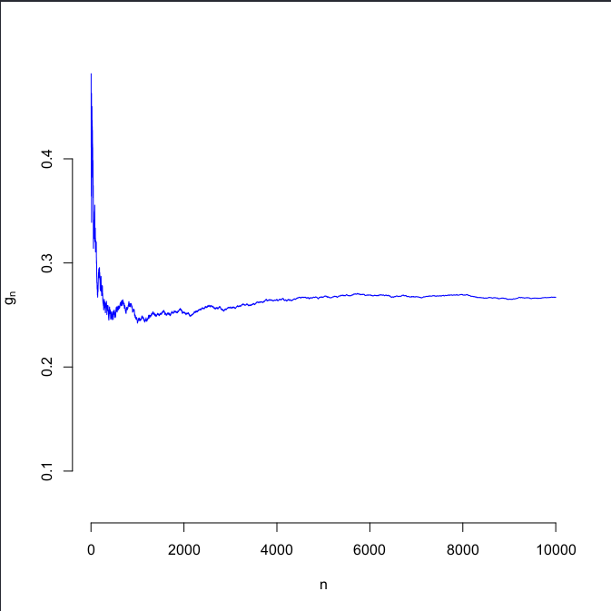
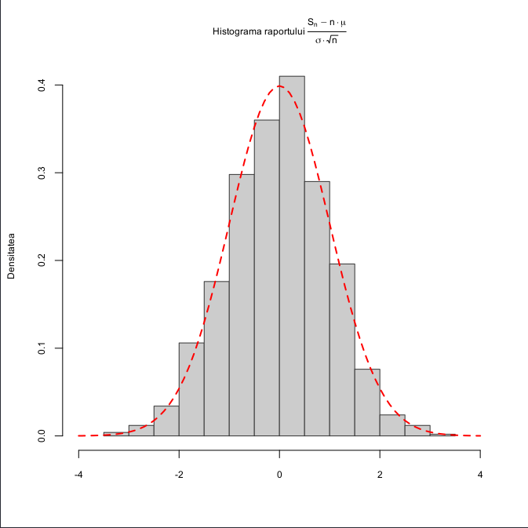

# Laborator 11

## Petculescu Mihai-Silviu

[TOC]

## Legea Numerelor Mari şi Teorema de Limită Centrală

### Ilustrarea Legii Numerelor Mari

Utilizaţi Legea Numerelor Mari pentru a aproxima integrala următoare:
$$
\large I = \int^1_0 e^xsin(2x)cos(2x) \mathrm{d}x
$$

```R
> myfun = function(x) {
    y = exp(x) * sin(2*x) * cos(2*x);
    return(y);
  }
# Calculul integralei cu metode numerice
> I = integrate(myfun,0,1)
# Raspunsul este o lista si oprim prima valoare
> I = I[[1]]
# Calculul integralei cu ajutorul metodei Monte Carlo
> n = 10000
> u = runif(n) # generarea sirului U_n
> z = myfun(u) # calcularea sirului g_n
> I2 = sum(z)/n # aproximarea MC
```

Obţinem că valoarea numerică a lui $I$ este $0.2662$ iar cea obţinută cu ajutorul metodei Monte Carlo este $0.2673$. Avem următoarea ilustrare grafică a convergentei metodei Monte Carlo

```R
# Graficul
> gn = myfun(runif(n))
> gn = cumsum(gn) / (1:n)
> plot(1:n, gn, type = "l", col = "blue", xlab = "n",
       ylab = expression(g[n]), bty = "n",
       ylim = c(I-0.2, I+0.2))
  & abline(h = I, lty = "dashed", col = "red")
```



### Ilustrarea Teoremei de Limită Centrală

Teorema afirmă că dacă $n$ este mare atunci v.a.
$$
\large
\frac{S_n - n\mu}{\sqrt{n}\sigma}
$$
are aproximativ aceeaşi distribut ie ca şi legea normală $N(0,1)$.

```R
> N = 1000 # Alegem numarul de repetitii ale experimentului
> n = 1000 # Alegem n pentru care folosim aproximarea normala
> lambda = 1 # Parametrul legii E(1)
> mu = 1/lambda # Media
> sigma = 1/lambda # Abaterea standard
> s = rep(0,N) # Initializam sirul sumelor partiale
> for (i in 1:N) {
    x = rexp(n, rate = lambda) # Generam variabilele exponentiale
    s[i] = (sum(x)-n*mu)/(sigma*sqrt(n)) # Calculam raportul
}
```

Continuăm prin trasarea histogramei cerute şi adăugăm la grafic densitatea legii normale $ N(0,1) $

```R
# Trasam histograma. Pentru mai multe optiuni latex: ?plotmath
> hist(s, main = expression(paste("Histograma raportului ", frac(S[n]-n%*%mu, sigma%*%sqrt(n)))),
       prob = TRUE, col = "grey80", border = "grey20",
       xlim = c(-4,4), cex.main=0.75,
       cex.lab = 0.75, cex.axis = 0.75,
       xlab = "", ylab = "Densitatea")
# Adaugam densitatea normalei N(0,1)
> x1 = seq(-4, 4, by=0.1)
> y1 = dnorm(x1, mean = 0, sd = 1)
> lines(x1, y1, col = "red", lwd = 2, lty = 2)
```

