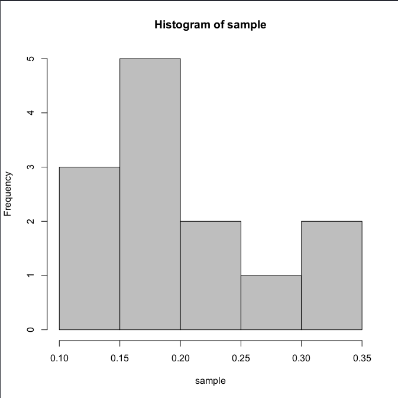
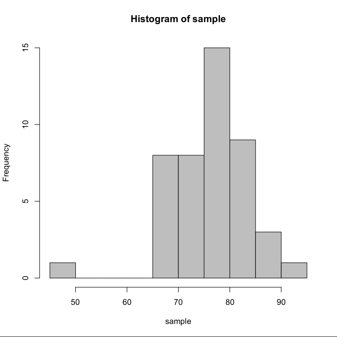
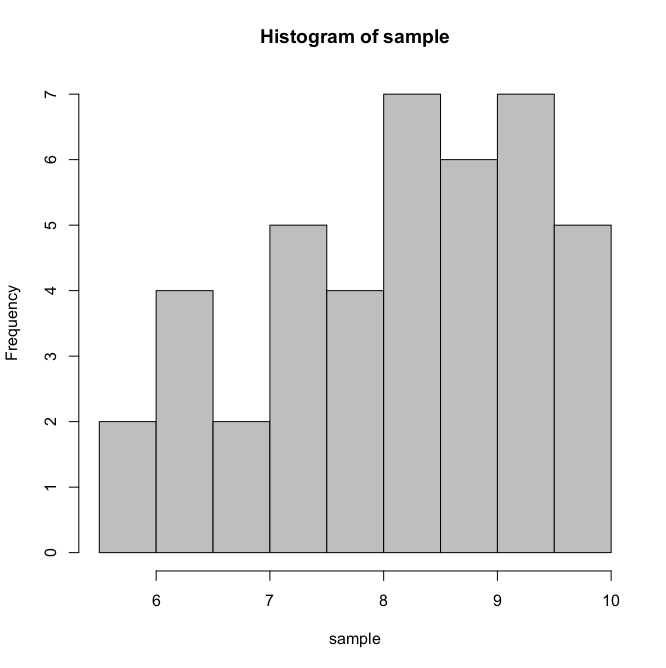

# Laborator 12

[TOC]

## Selecţie şi Statistici

Să presupunem că un aparat de măsurare este utilizat pentru a citi o distanţă de 12 ori. Se obţin valorile:
$$
0.20\ 0.10\ 0.35\ 0.25\ 0.13\ 0.20\ 0.10\ 0.20\ 0.25\ 0.20\ 0.30\ 0.35
$$

```R
> sample = c(0.20, 0.10, 0.35, 0.25, 0.13, 0.20, 0.10, 0.20, 0.20, 0.25, 0.20, 0.30, 0.35);
> summary(sample)
   Min. 1st Qu.  Median    Mean 3rd Qu.    Max.
 0.1000  0.2000  0.2000  0.2177  0.2500  0.3500

> var(sample)
[1] 0.006735897
> sd(sample)
[1] 0.08207251

> hist(sample, col = "gray")
```



## Aplicaţii

### Exerciţiu 1

Considerăm următorul eşantion aleator simplu care conţine masele a 45 de indivizi:
$$
84\ 72\ 88\ 78\ 76\ 84\ 84\ 82\ 87\ 80\ 81\ 69\ 73\ 79\ 79\ 75\ 68\ 80\ 74\ 68\ 77\ 80\ 78\\
81\ 76\ 75\ 70\ 76\ 78\ 82\ 72\ 73\ 86\ 79\ 91\ 70\ 84\ 73\ 69\ 70\ 83\ 76\ 47\ 67\ 76
$$
Determinaţi $mediana$, $media$, $deviatia\ standard$, $cvartilele$ şi $valorile\  aberante$ (dacă există).

```R
> sample = c(84, 72, 88, 78, 76, 84, 84, 82, 87, 80, 81, 69, 73, 79, 79, 75, 68, 80, 74, 68, 77, 80, 78, 81, 76, 75, 70, 76, 78, 82, 72, 73, 86, 79, 91, 70, 84, 73, 69, 70, 83, 76, 47, 67, 76)
> summary(sample)
   Min. 1st Qu.  Median    Mean 3rd Qu.    Max.
  47.00   73.00   77.00   76.67   81.00   91.00

> m = mean(sample)
> s = sd(sample)
> new_sample = vector()
> j = 0
> for(i in 1:length(sample)) {
    # m - 2 * s = 61.87724
    # m + 2 * s = 91.4561
    if(sample[i] < m - 2 * s || sample[i] > m + 2 * s ) {
        j = j + 1;
        new_sample[j] = sample[i];
    }
  }
> new_sample
[1] 47

> hist(sample, col = "gray")
```



### Exerciţiu 2

Se consideră următorul eşantion format din notele de admitere ale unui grup de studenţi:
$$
6.50\ 8.60\ 9.60\ 7.25\ 8.50\ 9.95\ 6.66\ 6.40\ 7.75\ 7.66\ 8.60\\
9.33\ 7.80\ 9.85\ 9.50\ 5.50\ 7.60\ 7.25\ 8.50\ 9.70\ 9.50\ 8.25\\
7.50\ 8.66\ 7.50\ 9.00\ 8.50\ 9.33\ 8.33\ 9.90\ 8.75\ 5.60\ 6.50\\
6.75\ 8.20\ 8.33\ 9.50\ 8.66\ 6.50\ 7.25\ 9.50\ 9.33
$$
Să se determine $media$, $mediana$, $deviatia\ standard$, $quartilele$ şi să se afle (dacă există) $valorile\ aberante$ ale eşantionului.

```R
> sample = c(6.50, 8.60, 9.60, 7.25, 8.50, 9.95, 6.66, 6.40, 7.75, 7.66, 8.60, 9.33, 7.80, 9.85, 9.50, 5.50, 7.60, 7.25, 8.50, 9.70, 9.50, 8.25, 7.50, 8.66, 7.50, 9.00, 8.50, 9.33, 8.33, 9.90, 8.75, 5.60, 6.50, 6.75, 8.20, 8.33, 9.50, 8.66, 6.50, 7.25, 9.50, 9.33)
> summary(sample)
   Min. 1st Qu.  Median    Mean 3rd Qu.    Max.
  5.500   7.312   8.415   8.187   9.330   9.950

> m = mean(sample)
> s = sd(sample)
> new_sample = vector()
> j = 0
> for(i in 1:length(sample)) {
    # m - 2 * s = 5.755248
    # m + 2 * s = 10.61809
    if(sample[i] < m - 2 * s || sample[i] > m + 2 * s ) {
        j = j + 1;
        new_sample[j] = sample[i];
    }
  }
> new_sample
[1] 5.5 5.6

> hist(sample, col = "gray")
```



