# Notiţe Curs

[TOC]

### 2.6 Scheme probabiliste 
#### Schema binomială

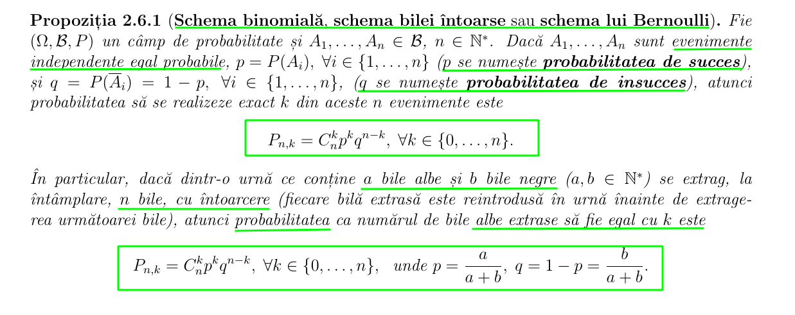

#### Probe Bernoulli

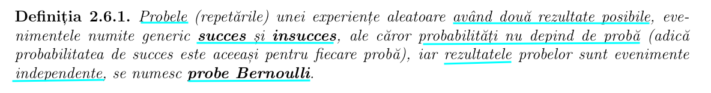

#### Schema multinomială

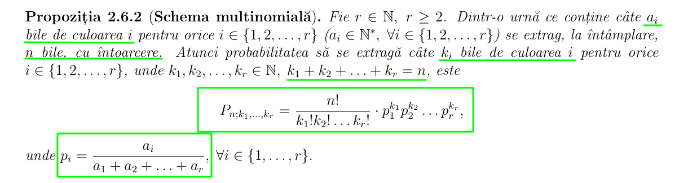

#### Schema binomială generatizată / Schema lui Poisson

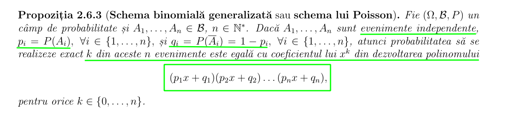

#### Schema hipergeometrică / Schema bilei neı̂ntoarse

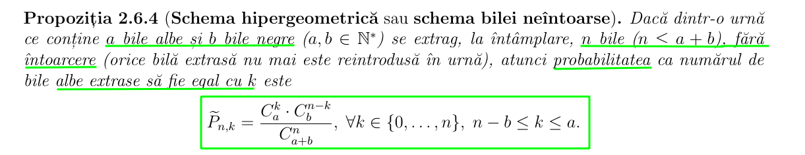

#### Schema hipergeometrică generalizată

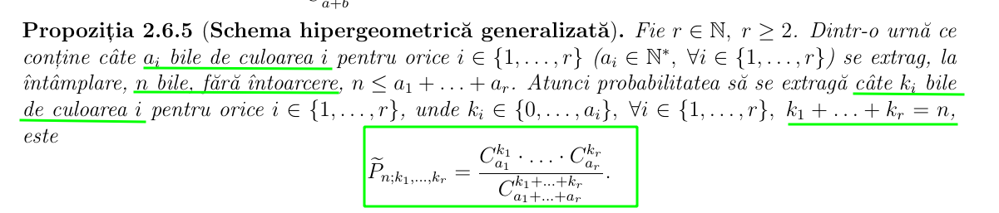

#### Observaţia 2.6.3

Luând $\large r = 2$ ı̂n **schema hipergeometrică generalizată**, regăsim **schema hipergeometrică**.

#### Exemplu 2.6.1

#### Exemplu 2.6.2

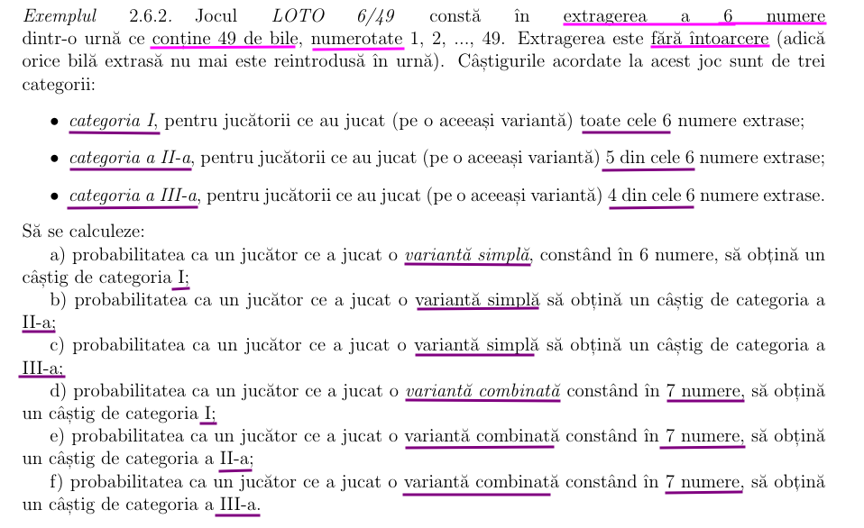

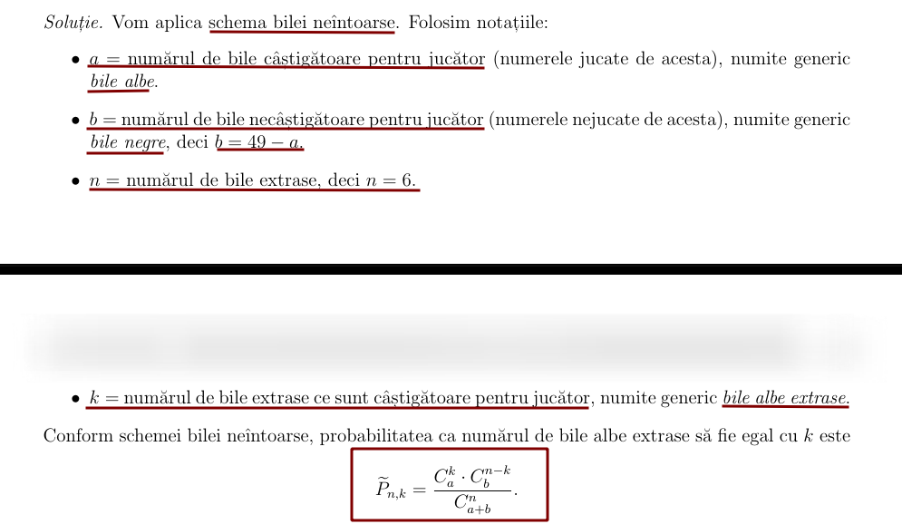

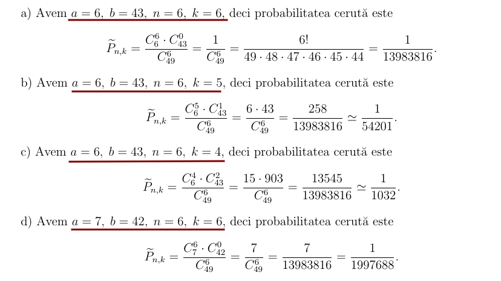

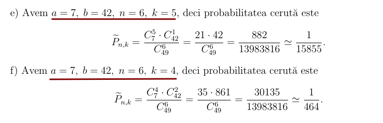

#### Exemplu 2.6.3

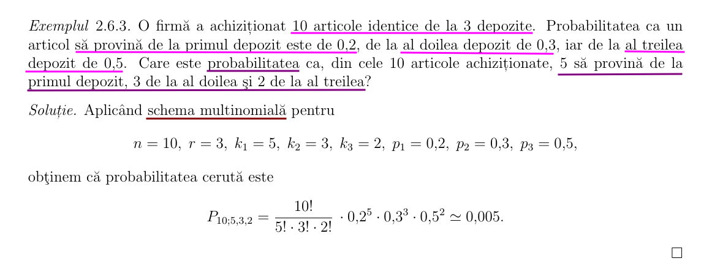

#### Exemplu 2.6.4

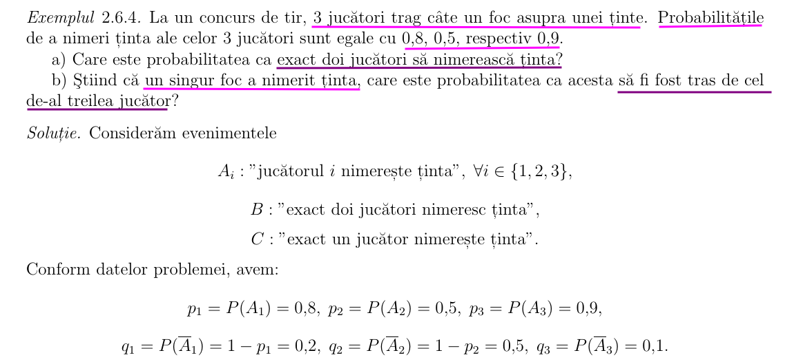

