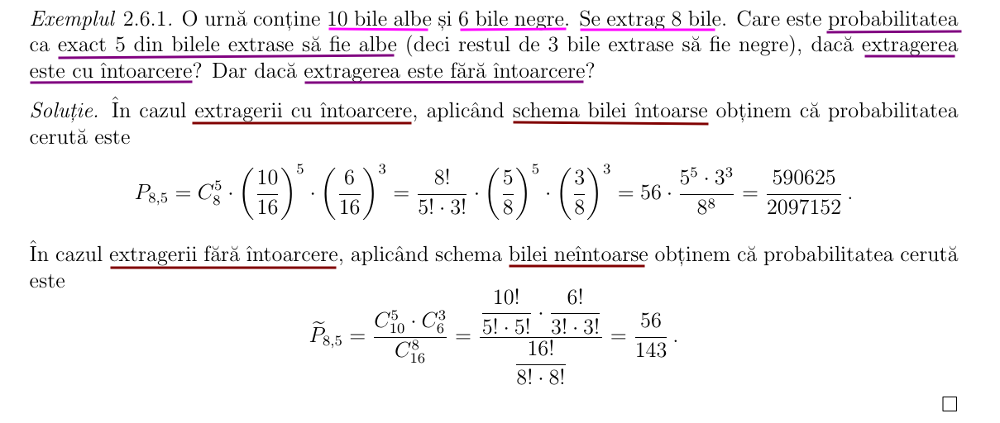
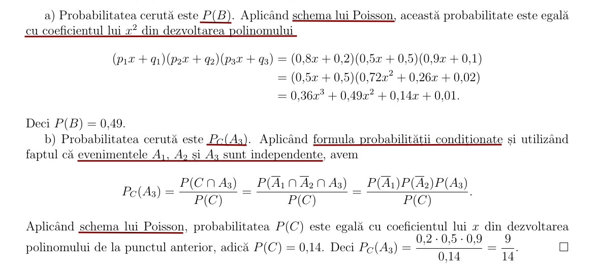

# Notiţe Curs

[TOC]

### 2.6 Scheme probabiliste 
#### Schema binomială

#### Probe Bernoulli

#### Schema multinomială

#### Schema binomială generatizată / Schema lui Poisson

#### Schema hipergeometrică / Schema bilei neı̂ntoarse

#### Schema hipergeometrică generalizată

#### Observaţia 2.6.3

Luând $\large r = 2$ ı̂n **schema hipergeometrică generalizată**, regăsim **schema hipergeometrică**.

#### Exemplu 2.6.1

#### Exemplu 2.6.2

#### Exemplu 2.6.3

#### Exemplu 2.6.4

