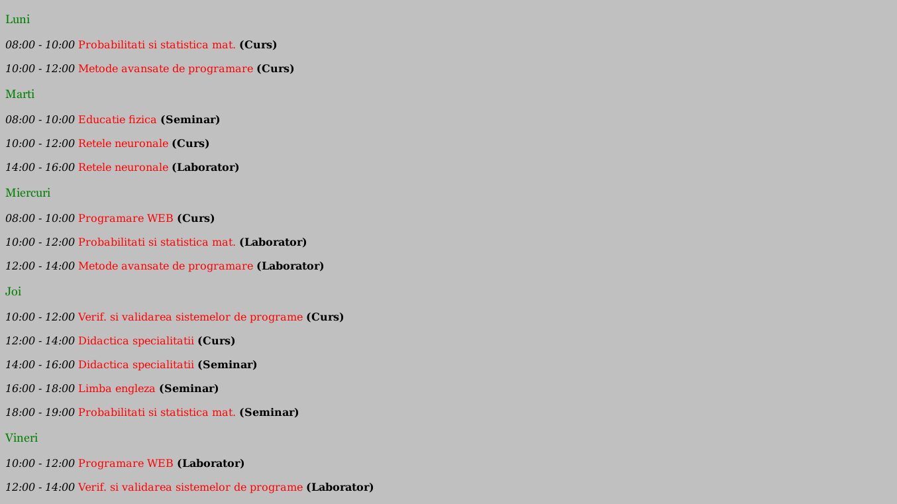
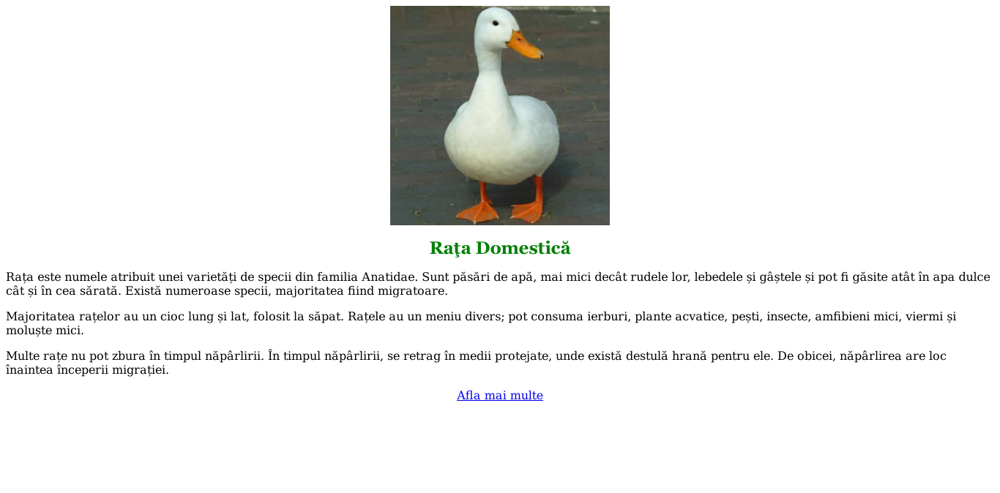
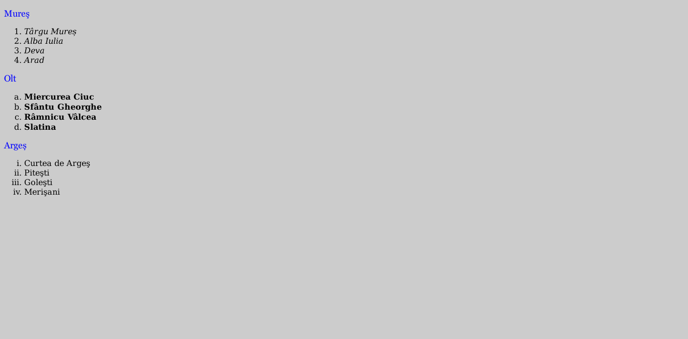
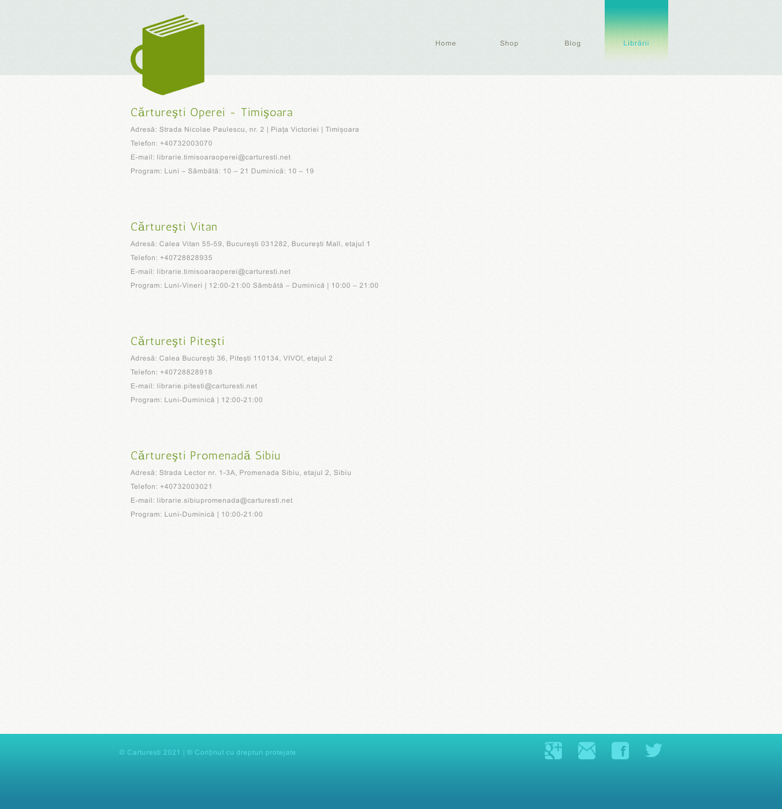
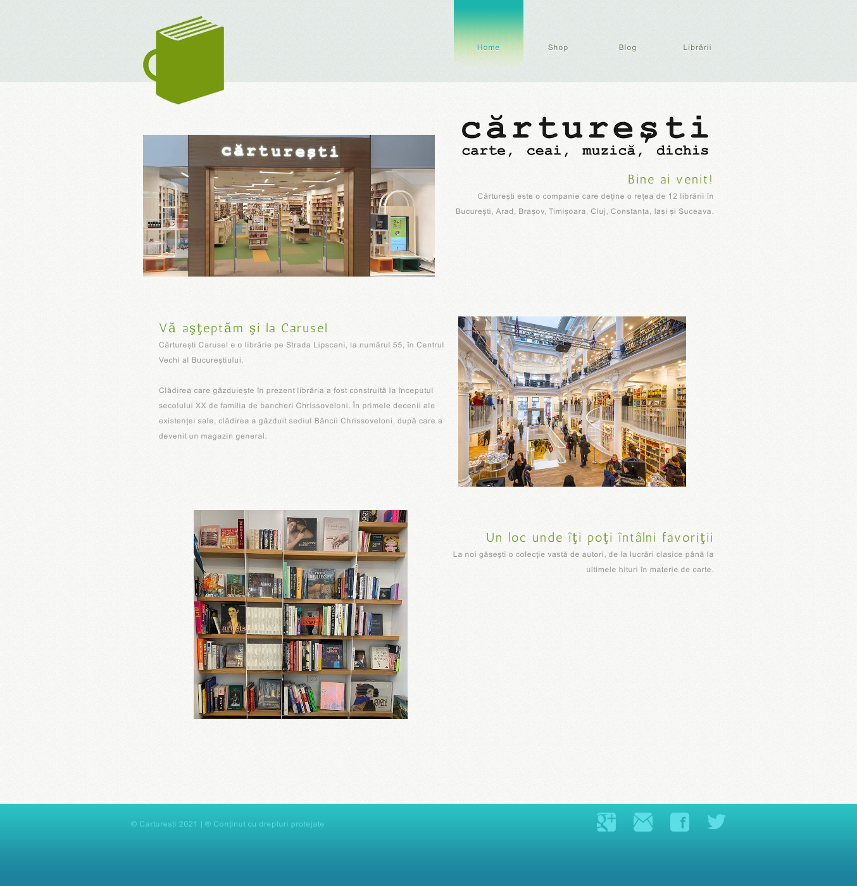

# Laborator 01

## Petculescu Mihai-Silviu

[TOC] 

### Ex 1.

Creaţi o pagină web care să conţină orarul pe zile de la grupa voastră. În bara de titlu trebuie să apară textul: `Orar grupa 3 an universitar 2`. Se vor folosi fonturi, culori, dimensiuni, grosimi diferite.

```html
<!DOCTYPE html>
<html lang="en">
  <head>
    <meta charset="UTF-8" />
    <meta http-equiv="X-UA-Compatible" content="IE=edge" />
    <meta name="viewport" content="width=device-width, initial-scale=1.0" />
    <title>Orar grupa 2.2.1 an universitar 2</title>
  </head>

  <body bgcolor="silver">
    <font size="4" face="Georgia" new color="green" weight="100">
      <p>Luni</p>
    </font>
    <p><i>08:00 - 10:00</i> <font color="r" ed>Probabilitati si statistica mat.</font> <b>(Curs)</b></p>
    <p><i>10:00 - 12:00</i> <font color="r" ed>Metode avansate de programare</font> <b>(Curs)</b></p>

    <font size="4" face="Georgia" new color="green" weight="100">
      <p>Marti</p>
    </font>
    <p><i>08:00 - 10:00</i> <font color="r" ed>Educatie fizica</font> <b>(Seminar)</b></p>
    <p><i>10:00 - 12:00</i> <font color="r" ed>Retele neuronale</font> <b>(Curs)</b></p>
    <p><i>14:00 - 16:00</i> <font color="r" ed>Retele neuronale</font> <b>(Laborator)</b></p>

    <font size="4" face="Georgia" new color="green" weight="100">
      <p>Miercuri</p>
    </font>
    <p><i>08:00 - 10:00</i> <font color="r" ed>Programare WEB</font> <b>(Curs)</b></p>
    <p><i>10:00 - 12:00</i> <font color="r" ed>Probabilitati si statistica mat.</font> <b>(Laborator)</b></p>
    <p><i>12:00 - 14:00</i> <font color="r" ed>Metode avansate de programare</font> <b>(Laborator)</b></p>

    <font size="4" face="Georgia" new color="green" weight="100">
      <p>Joi</p>
    </font>
    <p><i>10:00 - 12:00</i> <font color="r" ed>Verif. si validarea sistemelor de programe</font> <b>(Curs)</b></p>
    <p><i>12:00 - 14:00</i> <font color="r" ed>Didactica specialitatii</font> <b>(Curs)</b></p>
    <p><i>14:00 - 16:00</i> <font color="r" ed>Didactica specialitatii</font> <b>(Seminar)</b></p>
    <p><i>16:00 - 18:00</i> <font color="r" ed>Limba engleza</font> <b>(Seminar)</b></p>
    <p><i>18:00 - 19:00</i> <font color="r" ed>Probabilitati si statistica mat.</font> <b>(Seminar)</b></p>

    <font size="4" face="Georgia" new color="green" weight="100">
      <p>Vineri</p>
    </font>
    <p><i>10:00 - 12:00</i> <font color="r" ed>Programare WEB</font> <b>(Laborator)</b></p>
    <p><i>12:00 - 14:00</i> <font color="r" ed>Verif. si validarea sistemelor de programe</font> <b>(Laborator)</b></p>
  </body>
</html>
```



### 2.

Căutaţi pe Internet sau pe calculatorul vostru o poză cu un animal domestic. Creaţi o pagină web cu aceasta poza si informaţii despre acel animal de pe sitetul https://ro.wikipedia.org/wiki/.

```html
<!DOCTYPE html>
<html lang="en">
  <head>
    <meta charset="UTF-8" />
    <meta http-equiv="X-UA-Compatible" content="IE=edge" />
    <meta name="viewport" content="width=device-width, initial-scale=1.0" />
    <title>Animal Domestic</title>
  </head>

  <body>
    

    <p style="text-align: center;">
      <font size="5" face="Georgia" new color="green" weight="100"><b>Raţa Domestică</b></font>
    </p>

    <p>
      Rața este numele atribuit unei varietăți de specii din familia Anatidae. Sunt păsări de apă, mai mici decât rudele lor, lebedele și gâștele și pot fi găsite atât în apa dulce cât și în cea sărată. Există numeroase specii, majoritatea
      fiind migratoare.
    </p>

    <p>
      Majoritatea rațelor au un cioc lung și lat, folosit la săpat. Rațele au un meniu divers; pot consuma ierburi, plante acvatice, pești, insecte, amfibieni mici, viermi și moluște mici.
    </p>

    <p>
      Multe rațe nu pot zbura în timpul năpârlirii. În timpul năpârlirii, se retrag în medii protejate, unde există destulă hrană pentru ele. De obicei, năpârlirea are loc înaintea începerii migrației.
    </p>

    <p style="text-align: center;"><a href="https://ro.wikipedia.org/wiki/Ra%C8%9B%C4%83">Afla mai multe</a></p>
  </body>
</html>
```



### 3.

Creaţi o pagină web care să conţină o listă cu numele celor mai mari râuri din Romania şi pentru fiecare râu cele mai importante oraşe prin care trece.

```html
<!DOCTYPE html>
<html lang="en">
  <head>
    <meta charset="UTF-8" />
    <meta http-equiv="X-UA-Compatible" content="IE=edge" />
    <meta name="viewport" content="width=device-width, initial-scale=1.0" />
    <title>Râuri Romania</title>
  </head>
  <body bgcolor="CCCCCC">
    <p><font size="4" face="Georgia" new color="blue">Mureş</font></p>
    <ol>
      <li><i>Târgu Mureș</i></li>
      <li><i>Alba Iulia</i></li>
      <li><i>Deva</i></li>
      <li><i>Arad</i></li>
    </ol>

    <p><font size="4" face="Georgia" new color="blue">Olt</font></p>
    <ol type="a">
      <li><b>Miercurea Ciuc</b></li>
      <li><b>Sfântu Gheorghe</b></li>
      <li><b>Râmnicu Vâlcea</b></li>
      <li><b>Slatina</b></li>
    </ol>

    <p><font size="4" face="Georgia" new color="blue">Argeș</font></p>
    <ol type="i">
      <li>Curtea de Argeş</li>
      <li>Piteşti</li>
      <li>Goleşti</li>
      <li>Merişani</li>
    </ol>
  </body>
</html>
```



### Temă

Participaţi la un interviu pentru angajare la serviciul de proiectare şi dezvoltare aplicaţii web. Cerinţele minime de agajare sunt să dezvoltaţi, folosind numai HTML, un site de prezentare a unui eveniment (cultural, sportive, etc.) pornind de la un template `html` free de pe site-ul: https://freewebsitetemplates.com/

**Cărtureşti - Site de prezentare**





