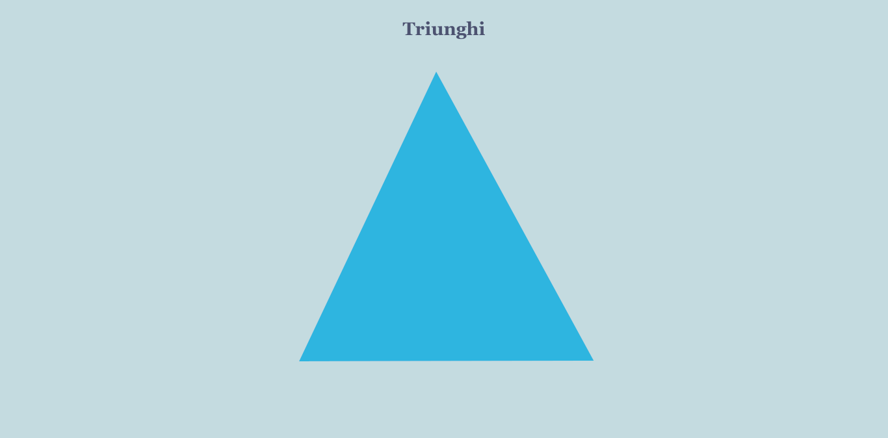
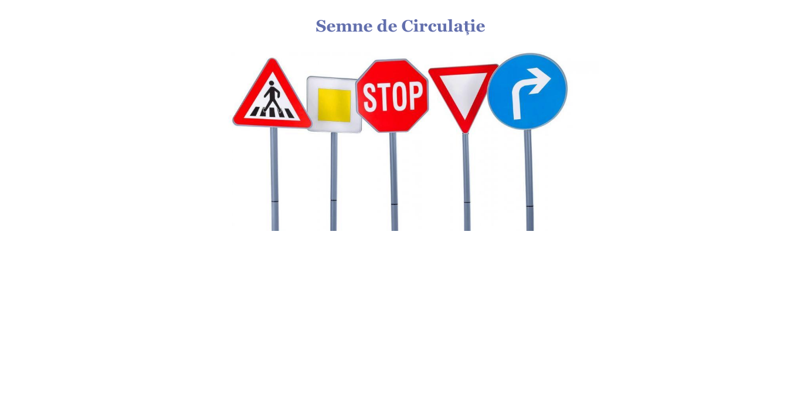
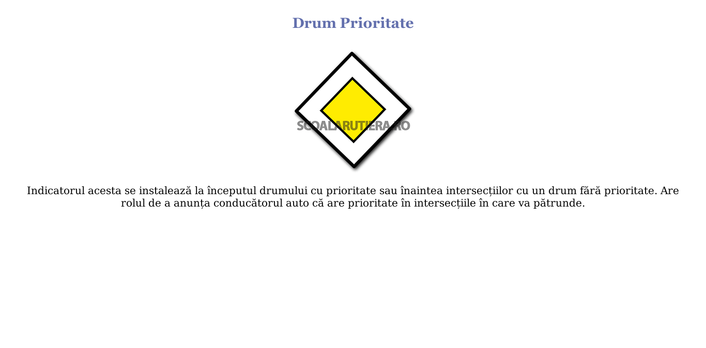

# Laborator 02

## Petculescu Mihai-Silviu

[TOC] 

## Tabele

### Exerciţiu 01

Creaţi o pagină web care să conţină o tablă de şah cu 4 linii şi 4 coloane, pătrăţelele fiind colorate cu alb şi negru (alternativ).

```html
<!DOCTYPE html>
<html lang="ro">
  <head>
    <meta charset="UTF-8" />
    <meta http-equiv="X-UA-Compatible" content="IE=edge" />
    <meta name="viewport" content="width=device-width, initial-scale=1.0" />
    <title>Tabla de sah</title>
    <style>
      .chess-board {
        border-spacing: 0;
      }
      .chess-board th {
        padding: 10px;
      }
      .chess-board td {
        border: 1px solid #3a3939;
        width: 30px;
        height: 30px;
      }
      .chess-board .luminos {
        background: #fbfbfb;
      }
      .chess-board .intunecat {
        background: #3a3939;
      }
    </style>
  </head>
  <body>
    <table class="chess-board">
      <tr>
        <th></th>
        <th>a</th>
        <th>b</th>
        <th>c</th>
        <th>d</th>
      </tr>
      <tr>
        <th>4</th>
        <td class="luminos"></td>
        <td class="intunecat"></td>
        <td class="luminos"></td>
        <td class="intunecat"></td>
      </tr>
      <tr>
        <th>3</th>
        <td class="intunecat"></td>
        <td class="luminos"></td>
        <td class="intunecat"></td>
        <td class="luminos"></td>
      </tr>
      <tr>
        <th>2</th>
        <td class="luminos"></td>
        <td class="intunecat"></td>
        <td class="luminos"></td>
        <td class="intunecat"></td>
      </tr>
      <tr>
        <th>1</th>
        <td class="intunecat"></td>
        <td class="luminos"></td>
        <td class="intunecat"></td>
        <td class="luminos"></td>
      </tr>
    </table>
  </body>
</html>
```


### Exerciţiu 02

Creaţi o pagina web care să conţină tabelul:

```bash
------------------------------------
| Ingredient    | Cantitate | Kcal |
------------------------------------
| cascaval      | 300g      | 950  |
------------------------------------
| oua           | 3         | 450  |
------------------------------------
| sare          | 50g       | 0    |
------------------------------------
| aluat foietaj | 1 pachet  | 400  |
------------------------------------
| Total kcal                | 1800 |
------------------------------------
```

```html
<!DOCTYPE html>
<html lang="ro">
  <head>
    <meta charset="UTF-8" />
    <meta http-equiv="X-UA-Compatible" content="IE=edge" />
    <meta name="viewport" content="width=device-width, initial-scale=1.0" />
    <title>Lista Ingrediente</title>
    <style>
      table,
      td {
        width: 40%;
        border: 1px solid black;
        border-collapse: collapse;
      }
      thead {
        background-color: #333;
        color: #fff;
      }
    </style>
  </head>
  <body>
    <table>
      <thead>
        <tr>
          <th>Ingredient</th>
          <th>Cantitate</th>
          <th>Kcal</th>
        </tr>
      </thead>
      <tbody>
        <tr>
          <td>cascaval</td>
          <td>300g</td>
          <td>950</td>
        </tr>
        <tr>
          <td>oua</td>
          <td>3</td>
          <td>450</td>
        </tr>
        <tr>
          <td>oua</td>
          <td>3</td>
          <td>450</td>
        </tr>
        <tr>
          <td>sare</td>
          <td>50g</td>
          <td>0</td>
        </tr>
        <tr>
          <td>aluat foietaj</td>
          <td>1 pachet</td>
          <td>400</td>
        </tr>
        <tr>
          <td colspan="2">Total kcal</td>
          <td>1800</td>
        </tr>
      </tbody>
    </table>
  </body>
</html>
```


## Harţi de imagini

### Exerciţiu 01

Creaţi o aplicaţie web care să conţină:

- 4 imagini (create în Paint - un triunghi, un cerc, un pătrat şi cele trei figuri anterioare în aceeaşi imagine)
- 4 pagini web, care să conţină fiecare câte o imagine

În pagina web cu imaginea care conţine cele trei figuri se va folosi o hartă de imagine pentru a accesa pagina corespunzătoare fiecărei figure geometrice.

```html
<!DOCTYPE html>
<html lang="ro">
  <head>
    <meta charset="UTF-8" />
    <meta http-equiv="X-UA-Compatible" content="IE=edge" />
    <meta name="viewport" content="width=device-width, initial-scale=1.0" />
    <link rel="stylesheet" href="l02_p03.css" />
    <title>Mapa Geometrie</title>
  </head>
  <body>
    <h3>Figuri Geometrie</h3>
    
    <map name="harta">
      <area shape="rect" coords="37,35,185,178" href="l02_p03_patrat.html" />
      <area shape="circle" coords="330,300,80" href="l02_p03_cerc.html" />
      <area shape="poly" coords="555,185,470,36,630,36" href="l02_p03_triunghi.html" />
    </map>
  </body>
</html>
```

```css
body {
  background-color: #c4dbe0;
}
h3 {
  text-align: center;
  font-family: Georgia, 'Times New Roman', Times, serif;
  font-size: 1.75em;
  color: #4C5270;
}
.center {
  display: block;
  margin-left: auto;
  margin-right: auto;
  width: 50%;
}
.img-figura{
  width: 500px;
  height: 500px;
}
```


```html
<!DOCTYPE html>
<html lang="ro">
  <head>
    <meta charset="UTF-8" />
    <meta http-equiv="X-UA-Compatible" content="IE=edge" />
    <meta name="viewport" content="width=device-width, initial-scale=1.0" />
    <link rel="stylesheet" href="l02_p03.css" />
    <title>Triunghi</title>
  </head>
  <body>
    <h3>Triunghi</h3>
    
  </body>
</html>
```



```html
<!DOCTYPE html>
<html lang="ro">
  <head>
    <meta charset="UTF-8" />
    <meta http-equiv="X-UA-Compatible" content="IE=edge" />
    <meta name="viewport" content="width=device-width, initial-scale=1.0" />
    <link rel="stylesheet" href="l02_p03.css" />
    <title>Patrat</title>
  </head>
  <body>
    <h3>Pătrat</h3>
    
  </body>
</html>
```


```html
<!DOCTYPE html>
<html lang="en">
  <head>
    <meta charset="UTF-8" />
    <meta http-equiv="X-UA-Compatible" content="IE=edge" />
    <meta name="viewport" content="width=device-width, initial-scale=1.0" />
    <link rel="stylesheet" href="l02_p03.css" />
    <title>Cerc</title>
  </head>
  <body>
    <h3>Cerc</h3>
    
  </body>
</html>
```


### Exerciţiu 02

Creaţi o aplicaţie web care să conţină o hartă cu o imagine pentru cel puţin trei persoane prin care să se acceseze pagina fiecărei persoane cu click pe acestea.

```html
<!DOCTYPE html>
<html lang="ro">
  <head>
    <meta charset="UTF-8" />
    <meta http-equiv="X-UA-Compatible" content="IE=edge" />
    <meta name="viewport" content="width=device-width, initial-scale=1.0" />
    <link rel="stylesheet" href="./style.css" />
    <title>Vinland Saga</title>
  </head>
  <body>
    <a href="./home.html"></a>
    
    <map name="harta">
      <area shape="poly" coords="0,0,0,420,270,420,380,0" href="./thorfinn.html" />
      <area shape="poly" coords="380,0,270,420,480,420,400,0" href="./askeladd.html" />
      <area shape="poly" coords="400,0,490,420,520,420,620,0" href="./canute.html" />
      <area shape="poly" coords="630,0,530,420,680,420,680,0" href="./thors.html" />
    </map>
  </body>
</html>
```

```css
body {
  background-color: #ecd8ac;
}
h3 {
  text-align: center;
  font-family: Georgia, 'Times New Roman', Times, serif;
  font-size: 1.75em;
  color: #000000;
}
.center {
  display: block;
  margin-left: auto;
  margin-right: auto;
  width: 50%;
}
.logo{
  display: block;
  margin-left: auto;
  margin-right: auto;
}
.profile{
  width: 500px;
  height: 500px;
}
```


```html
<!DOCTYPE html>
<html lang="ro">
  <head>
    <meta charset="UTF-8" />
    <meta http-equiv="X-UA-Compatible" content="IE=edge" />
    <meta name="viewport" content="width=device-width, initial-scale=1.0" />
    <link rel="stylesheet" href="./style.css" />
    <title>Thorfinn</title>
  </head>
  <body>
    <h3>Thorfinn</h3>
    
  </body>
</html>
```


```html
<!DOCTYPE html>
<html lang="ro">
  <head>
    <meta charset="UTF-8" />
    <meta http-equiv="X-UA-Compatible" content="IE=edge" />
    <meta name="viewport" content="width=device-width, initial-scale=1.0" />
    <link rel="stylesheet" href="./style.css" />
    <title>Askeladd</title>
  </head>
  <body>
    <h3>Askeladd</h3>
    
  </body>
</html>
```


````html
<!DOCTYPE html>
<html lang="ro">
  <head>
    <meta charset="UTF-8" />
    <meta http-equiv="X-UA-Compatible" content="IE=edge" />
    <meta name="viewport" content="width=device-width, initial-scale=1.0" />
    <link rel="stylesheet" href="./style.css" />
    <title>Canute</title>
  </head>
  <body>
    <h3>Canute</h3>
    
  </body>
</html>
````


```html
<!DOCTYPE html>
<html lang="ro">
  <head>
    <meta charset="UTF-8" />
    <meta http-equiv="X-UA-Compatible" content="IE=edge" />
    <meta name="viewport" content="width=device-width, initial-scale=1.0" />
    <link rel="stylesheet" href="./style.css" />
    <title>Thors</title>
  </head>
  <body>
    <h3>Thors</h3>
    
  </body>
</html>
```


### Exerciţiu 03

Creaţi o aplicaţie web care să conţină informaţii despre semnele de circulaţie (harta centralizatoare şi pagini pentru fiecare semn de circulaţie).

```html
<!DOCTYPE html>
<html lang="ro">
  <head>
    <meta charset="UTF-8" />
    <meta http-equiv="X-UA-Compatible" content="IE=edge" />
    <meta name="viewport" content="width=<device-width>, initial-scale=1.0" />
    <link rel="stylesheet" href="./style.css" />
    <title>Semne de circulatie</title>
  </head>
  <body>
    <h3>Semne de Circulaţie</h3>
    
    <map name="harta">
      <area shape="poly" coords="130,0,50,130,180,130" href="./trecere_pietoni.html" />
      <area shape="rect" coords="170,44,260,130" href="./drum_prioritate.html" />
      <area shape="poly" coords="290,18,265,48,265,100,300,140,350,140,390,100,390,48,355,16" href="./oprire.html" />
      <area shape="poly" coords="380,22,450,140,510,20" href="./cedare_trecere.html" />
      <area shape="circle" coords="555,70,68" href="./la_dreapta.html" />
    </map>
  </body>
</html>
```

```css
body {
  background-color: #fff;
}
h3 {
  text-align: center;
  font-family: Georgia, 'Times New Roman', Times, serif;
  font-size: 1.75em;
  color: #626fad;
}
.center {
  display: block;
  margin-left: auto;
  margin-right: auto;
  width: 50%;
}
.img-figura{
  width: 500px;
  height: 500px;
}
.text{
  text-align: center;
  font-size: 1.25em;
  margin-left: 1em;
  margin-right: 1em;
}
```



```html
<!DOCTYPE html>
<html lang="ro">
  <head>
    <meta charset="UTF-8" />
    <meta http-equiv="X-UA-Compatible" content="IE=edge" />
    <meta name="viewport" content="width=device-width, initial-scale=1.0" />
    <link rel="stylesheet" href="./style.css" />
    <title>Trecere Pietoni</title>
  </head>
  <body>
    <h3>Trecere pentru Pietoni</h3>
    
    <p class="text">
      Se amplasează la 50 - 200 de metri, în localități cât și în afara acestora, înaintea trecerilor de pietoni de pe arterele intens circulate sau când observarea trecerii de pietoni poate deveni dificilă datorită lipsei de vizibilitate.
    </p>
  </body>
</html>
```


```html
<!DOCTYPE html>
<html lang="ro">
  <head>
    <meta charset="UTF-8" />
    <meta http-equiv="X-UA-Compatible" content="IE=edge" />
    <meta name="viewport" content="width=device-width, initial-scale=1.0" />
    <link rel="stylesheet" href="./style.css" />
    <title>Drum Prioritate</title>
  </head>
  <body>
    <h3>Drum Prioritate</h3>
    
    <p class="text">
      Indicatorul acesta se instalează la începutul drumului cu prioritate sau înaintea intersecțiilor cu un drum fără prioritate. Are rolul de a anunța conducătorul auto că are prioritate în intersecțiile în care va pătrunde.
    </p>
  </body>
</html>
```



```html
<!DOCTYPE html>
<html lang="ro">
  <head>
    <meta charset="UTF-8" />
    <meta http-equiv="X-UA-Compatible" content="IE=edge" />
    <meta name="viewport" content="width=device-width, initial-scale=1.0" />
    <link rel="stylesheet" href="./style.css" />
    <title>Oprire</title>
  </head>
  <body>
    <h3>Oprire</h3>
    
    <p class="text">
      Se amplasează pe drumul public fără prioritate, unde poziția de pătrundere este lipsită de vizibilitate (clădiri, copaci, etc.). Conducătorul vehiculului este obligat să oprească în locul cu vizibilitate maximă (putând trece de indicator) indiferent dacă pe drumul prioritar circulă sau nu alte vehicule, dacă circulă vehicule pe drumul prioritar le acordă prioritate, după care își poate continua deplasarea.
    </p>
  </body>
</html>
```


```html
<!DOCTYPE html>
<html lang="ro">
  <head>
    <meta charset="UTF-8" />
    <meta http-equiv="X-UA-Compatible" content="IE=edge" />
    <meta name="viewport" content="width=device-width, initial-scale=1.0" />
    <link rel="stylesheet" href="./style.css" />
    <title>Cedare Trecere</title>
  </head>
  <body>
    <h3>Cedare Trecere</h3>
    
    <p class="text">
      Se amplasează pe drumul public fără prioritate, la intersecția acestuia cu un drum public prioritar.
    </p>
  </body>
</html>

```


```html
<!DOCTYPE html>
<html lang="ro">
  <head>
    <meta charset="UTF-8" />
    <meta http-equiv="X-UA-Compatible" content="IE=edge" />
    <meta name="viewport" content="width=device-width, initial-scale=1.0" />
    <link rel="stylesheet" href="./style.css" />
    <title>La dreapta</title>
  </head>
  <body>
    <h3>La dreapta</h3>
    
    <p class="text">
      Obligă conducătorul de vehicul să vireze la dreapta în prima intersecție, depășind locul unde este instalat indicatorul rutier
    </p>
  </body>
</html>
```


