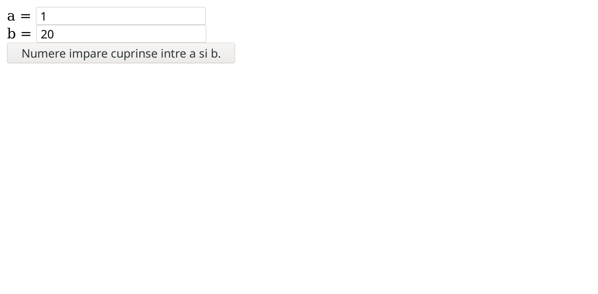

# Laborator 03

## Petculescu Mihai-Silviu

[TOC]

## Aplicaţii pentru instrucţiunile din PHP 

### Exerciţiu 01

Citiţi $\large n$ număr natural şi afişaţi suma $\large s=1+2+3+...+n$.

```html
<!DOCTYPE html>
<html lang="ro">
  <head>
    <meta charset="UTF-8" />
    <meta http-equiv="X-UA-Compatible" content="IE=edge" />
    <meta name="viewport" content="width=device-width, initial-scale=1.0" />
    <title>Suma Numere</title>
  </head>
  <body>
    <form action="http://localhost:8088/index01.php" method="POST">
      n = <input type="text" name="n" /><br />
      <input type="submit" value="Suma primilor n numere" />
    </form>
  </body>
</html>
```

```php+HTML
<?php
$n = $_POST["n"];
$s = 1;
for($i=2; $i<=$n; $i++)
    $s += $i;
echo "s = $s";
?>
```


### Exerciţiu 02

Citiţi lungimea şi lăţimea unui dreptunghi şi afişaţi perimetrul şi aria acestuia.

```html
<!DOCTYPE html>
<html lang="ro">
  <head>
    <meta charset="UTF-8" />
    <meta http-equiv="X-UA-Compatible" content="IE=edge" />
    <meta name="viewport" content="width=device-width, initial-scale=1.0" />
    <title>Perimetru si Arie</title>
  </head>
  <body>
    <form action="http://localhost:8088/index02.php" method="POST">
      Lungimea = <input type="text" name="L" /><br />
      Latimea = <input type="text" name="l" /><br />
      <input type="submit" value="Perimetru si Arie Dreptunghi" />
    </form>
  </body>
</html>
```

```php+HTML
<?php
$L = $_POST["L"];
$l = $_POST["l"];

$arie = $L * $l;
$perimetru = 2*($L + $l);

echo "Perimetru = $perimetru <br>";
echo "Arie = $arie";
?>
```


### Exerciţiu 03

Citiţi trei numere naturale şi verificaţi dacă acestea sunt numere consecutive.

```html
<!DOCTYPE html>
<html lang="ro">
  <head>
    <meta charset="UTF-8" />
    <meta http-equiv="X-UA-Compatible" content="IE=edge" />
    <meta name="viewport" content="width=device-width, initial-scale=1.0" />
    <title>Consecutive</title>
  </head>
  <body>
    <form action="http://localhost:8088/index03.php" method="POST">
      a = <input type="text" name="a" /><br />
      b = <input type="text" name="b" /><br />
      c = <input type="text" name="c" /><br />
      <input type="submit" value="Sunt consecutive?" />
    </form>
  </body>
</html>
```

```php+HTML
<?php
$a = $_POST["a"];
$b = $_POST["b"];
$c = $_POST["c"];

if($a == $b - 1 && $b == $c - 1)
    echo "Numerele $a, $b, $c SUNT consecutive.";
else
    echo "Numerele $a, $b, $c NU SUNT consecutive.";
?>
```


### Exerciţiu 04

Citiţi $\large n$ număr natural şi afişaţi suma numerelor pare mai mici sau egale cu $\large n$.

```html
<!DOCTYPE html>
<html lang="ro">
  <head>
    <meta charset="UTF-8" />
    <meta http-equiv="X-UA-Compatible" content="IE=edge" />
    <meta name="viewport" content="width=device-width, initial-scale=1.0" />
    <title>Suma Pare</title>
  </head>
  <body>
    <form action="http://localhost:8088/index04.php" method="POST">
      n = <input type="text" name="n" /><br />
      <input type="submit" value="Suma numere pare." />
    </form>
  </body>
</html>
```

```php+HTML
<?php
$n = $_POST["n"];
$s = 0;

for($i=2; $i<=$n; $i+=2)
    $s += $i;

echo "Suma numere pare mai mici ca $n = $s";
?>
```


### Exerciţiu 05

Citiţi două numere naturale $\large a$ şi $\large b$ şi afişaţi $\large a^b$.

```html
<!DOCTYPE html>
<html lang="ro">
  <head>
    <meta charset="UTF-8" />
    <meta http-equiv="X-UA-Compatible" content="IE=edge" />
    <meta name="viewport" content="width=device-width, initial-scale=1.0" />
    <title>Ridicare la Putere</title>
  </head>
  <body>
    <form action="http://localhost:8088/index05.php" method="POST">
      a = <input type="text" name="a" /><br />
      b = <input type="text" name="b" /><br />
      <input type="submit" value="Rezultat a^b." />
    </form>
  </body>
</html>
```

```php+HTML
<?php
$a = $_POST["a"];
$b = $_POST["b"];
$p = $a ** $b;

echo "$a <sup>$b</sup> = $p";
?>
```


### Exerciţiu 06

Pentru $\large a$ şi $\large b$ numere natural crescătoare afişaţi toate numerele impare cuprinse între $\large a$ şi $\large b$.

```html
<!DOCTYPE html>
<html lang="ro">
  <head>
    <meta charset="UTF-8" />
    <meta http-equiv="X-UA-Compatible" content="IE=edge" />
    <meta name="viewport" content="width=device-width, initial-scale=1.0" />
    <title>Numere Impare</title>
  </head>
  <body>
    <form action="http://localhost:8088/index06.php" method="POST">
      a = <input type="text" name="a" /><br />
      b = <input type="text" name="b" /><br />
      <input type="submit" value="Numere impare cuprinse intre a si b." />
    </form>
  </body>
</html>
```

```php+HTML
<?php
$a = $_POST["a"];
$b = $_POST["b"];

for($i=$a + ($a+1) % 2; $i<=$b; $i+=2)
    echo "$i <br>";
?>
```




### Exerciţiu 07

Pentru $\large a$ număr natural afişaţi toate numerele pare mai mici sau egale cu $\large a$.

```html
<!DOCTYPE html>
<html lang="ro">
  <head>
    <meta charset="UTF-8" />
    <meta http-equiv="X-UA-Compatible" content="IE=edge" />
    <meta name="viewport" content="width=device-width, initial-scale=1.0" />
    <title>Numere pare</title>
  </head>
  <body>
    <form action="http://localhost:8088/index07.php" method="POST">
      a = <input type="text" name="a" /><br />
      <input type="submit" value="Numere pare mai mici decat a." />
    </form>
  </body>
</html>
```

```php+HTML
<?php
$a = $_POST["a"];
for($i=0; $i<=$a; $i+=2)
    echo "$i <br>";
?>
```


## Aplicaţii PHP cu prelucrarea unor date

### Exerciţiu 08

Realizaţi o aplicaţie web, care să conţină un test cu semne de circulaţie. Testul va avea cel puţin 10 întrebări, va conţine imaginea semnelor de circulaţie la care se referă întrebarile şi va utiliza butoane radio. La finalul testului se va afişa o fişă de raspuns ce va conţine:
1. Corectitudinea răspunsurilor (Corect / Incorect) fiecărei întrebări. La raspunsurile incorecte se va afişa şi varianta corectă.
2. Punctajul obţinut (numărul de raspunsuri corecte).

```html
<!DOCTYPE html>
<html lang="ro">
  <head>
    <meta charset="UTF-8" />
    <meta http-equiv="X-UA-Compatible" content="IE=edge" />
    <meta name="viewport" content="width=device-width, initial-scale=1.0" />
    <title>Test cu semne de circulaţie</title>
  </head>
  <body background="#bfc0c0">
    <form action="http://localhost:8088/index08.php" method="post">
      <h4>1. Schimbarea direcţiei de mers la dreapta sau la stânga nu este permisă la întâlnirea:</h4>
      
      <p>
        <br />
        <input name="Buton01" type="radio" value="1" checked />
        indicatorul 1;
        <br />
        <input name="Buton01" type="radio" value="2" />
        indicatorul 2;
        <br />
        <input name="Buton01" type="radio" value="3" />
        ambelor indicatoare.
        <br />
        <br />
      </p>

      <h4>2. Panoul de sub indicator permite:</h4>
      
      <p>
        <br />
        <input name="Buton02" type="radio" value="1" checked />
        staţionarea mijloacelor de transport public de persoane în intervalul menţionat;
        <br />
        <input name="Buton02" type="radio" value="2" />
        staţionarea în timpul orelor menţionate;
        <br />
        <input name="Buton02" type="radio" value="3" />
        staţionarea în afara intervalului orar menţionat.
        <br />
        <br />
      </p>

      <h4>3. Care dintre indicatoare te avertizează că urmează să intersectezi un drum fără prioritate?</h4>
      
      <p>
        <br />
        <input name="Buton03" type="radio" value="1" checked />
        ambele;
        <br />
        <input name="Buton03" type="radio" value="2" />
        indicatorul 1;
        <br />
        <input name="Buton03" type="radio" value="3" />
        indicatorul 2.
        <br />
        <br />
      </p>

      <h4>4. Care dintre indicatoarele alăturate creează obligaţii pentru conducătorii de vehicule?</h4>
      
      <p>
        <br />
        <input name="Buton04" type="radio" value="1" checked />
        indicatorul nr. 1;
        <br />
        <input name="Buton04" type="radio" value="2" />
        indicatorul nr. 2;
        <br />
        <input name="Buton04" type="radio" value="3" />
        nici unul dintre aceste indicatoare.
        <br />
        <br />
      </p>

      <h4>5. La întâlnirea panoului de pe stâlp aveţi obligaţia:</h4>
      
      <p>
        <br />
        <input name="Buton05" type="radio" value="1" checked />
        să vă deplasaţi cu atenţie pe sectorul de drum îngustat;
        <br />
        <input name="Buton05" type="radio" value="2" />
        să acordaţi prioritate numai autocamioanelor şi autobuzelor care circulă din sens opus;
        <br />
        <input name="Buton05" type="radio" value="3" />
        să acordaţi prioritate vehiculelor care circulă din sens opus.
        <br />
        <br />
      </p>

      <h4>6. Indicatorul interzice accesul:</h4>
      
      <p>
        <br />
        <input name="Buton06" type="radio" value="1" checked />
        autoturismelor, motocicletelor fără ataş şi vehiculelor cu tracţiune animală;
        <br />
        <input name="Buton06" type="radio" value="2" />
        autovehiculelor şi vehiculelor cu tracţiune animală;
        <br />
        <input name="Buton06" type="radio" value="3" />
        autoturismelor, motocicletelor şi vehiculelor împinse sau trase cu mâna.
        <br />
        <br />
      </p>

      <h4>7. Indicatorul vă avertizează că urmeaza:</h4>
      
      <p>
        <br />
        <input name="Buton07" type="radio" value="1" checked />
        un drum cu denivelări;
        <br />
        <input name="Buton07" type="radio" value="2" />
        un segment de drum pe care se execută lucrări de amenajare;
        <br />
        <input name="Buton07" type="radio" value="3" />
        o denivelare pentru limitarea vitezei.
        <br />
        <br />
      </p>

      <h4>8. Dacă aţi selectat banda de circulaţie conform imaginii prezentate, vă este permis:</h4>
      
      <p>
        <br />
        <input name="Buton08" type="radio" value="1" checked />
        să circulaţi înainte sau la dreapta;
        <br />
        <input name="Buton08" type="radio" value="2" />
        să viraţi numai la dreapta;
        <br />
        <input name="Buton08" type="radio" value="3" />
        să circulaţi numai înainte.
        <br />
        <br />
      </p>

      <h4>9. Care este regula de trecere la întâlnirea acestui indicator?</h4>
      
      <p>
        <br />
        <input name="Buton09" type="radio" value="1" checked />
        regula priorităţii de stânga;
        <br />
        <input name="Buton09" type="radio" value="2" />
        regula primului ajuns în intersecţie;
        <br />
        <input name="Buton09" type="radio" value="3" />
        regula priorităţii de dreapta.
        <br />
        <br />
      </p>

      <h4>10. Indicatorul interzice accesul:</h4>
      
      <p>
        <br />
        <input name="Buton10" type="radio" value="1" checked />
        motocicletelor;
        <br />
        <input name="Buton10" type="radio" value="2" />
        mopedelor;
        <br />
        <input name="Buton10" type="radio" value="3" />
        bicicletelor.
        <br />
        <br />
      </p>

      <input type="submit" value="Trimite soluţie." />
    </form>
  </body>
</html>
```

```php+HTML
<?php
$p = 0;

echo "Răspuns intrebare 1: ","<br>";
$b01 = $_POST['Buton01'];
if($b01 == 2) { echo "Răspuns <b>CORECT</b> ", "<br>"; $p++; }
else echo "Răspuns <b>INCORECT</b>. ", "Soluţie: <b>B</b>;", "<br>";

echo "Răspuns intrebare 2: ","<br>";
$b02 = $_POST['Buton02'];
if($b02 == 3) { echo "Răspuns <b>CORECT</b> ", "<br>"; $p++; }
else echo "Răspuns <b>INCORECT</b>. ", "Soluţie: <b>C</b>;", "<br>";

echo "Răspuns intrebare 3: ","<br>";
$b03 = $_POST['Buton03'];
if($b03 == 2) { echo "Răspuns <b>CORECT</b> ", "<br>"; $p++; }
else echo "Răspuns <b>INCORECT</b>. ", "Soluţie: <b>B</b>;", "<br>";

echo "Răspuns intrebare 4: ","<br>";
$b04 = $_POST['Buton04'];
if($b04 == 1) { echo "Răspuns <b>CORECT</b> ", "<br>"; $p++; }
else echo "Răspuns <b>INCORECT</b>. ", "Soluţie: <b>A</b>;", "<br>";

echo "Răspuns intrebare 5: ","<br>";
$b05 = $_POST['Buton05'];
if($b05 == 1) { echo "Răspuns <b>CORECT</b> ", "<br>"; $p++; }
else echo "Răspuns <b>INCORECT</b>. ", "Soluţie: <b>A</b>;", "<br>";

echo "Răspuns intrebare 6: ","<br>";
$b06 = $_POST['Buton06'];
if($b06 == 2) { echo "Răspuns <b>CORECT</b> ", "<br>"; $p++; }
else echo "Răspuns <b>INCORECT</b>. ", "Soluţie: <b>B</b>;", "<br>";

echo "Răspuns intrebare 7: ","<br>";
$b07 = $_POST['Buton07'];
if($b07 == 3) { echo "Răspuns <b>CORECT</b> ", "<br>"; $p++; }
else echo "Răspuns <b>INCORECT</b>. ", "Soluţie: <b>C</b>;", "<br>";

echo "Răspuns intrebare 8: ","<br>";
$b08 = $_POST['Buton08'];
if($b08 == 1) { echo "Răspuns <b>CORECT</b> ", "<br>"; $p++; }
else echo "Răspuns <b>INCORECT</b>. ", "Soluţie: <b>A</b>;", "<br>";

echo "Răspuns intrebare 9: ","<br>";
$b09 = $_POST['Buton09'];
if($b09 == 3) { echo "Răspuns <b>CORECT</b> ", "<br>"; $p++; }
else echo "Răspuns <b>INCORECT</b>. ", "Soluţie: <b>C</b>;", "<br>";

echo "Răspuns intrebare 10: ","<br>";
$b10 = $_POST['Buton10'];
if($b10 == 2) { echo "Răspuns <b>CORECT</b> ", "<br>"; $p++; }
else echo "Răspuns <b>INCORECT</b>. ", "Soluţie: <b>B</b>;", "<br>";

echo "Punctaj Obţinut: $p";
?>
```


