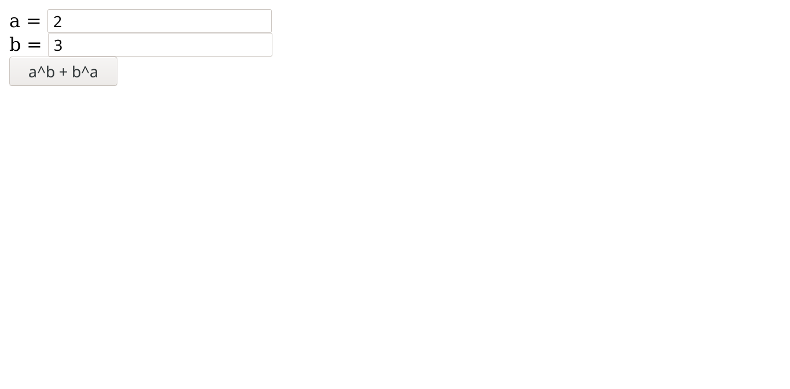
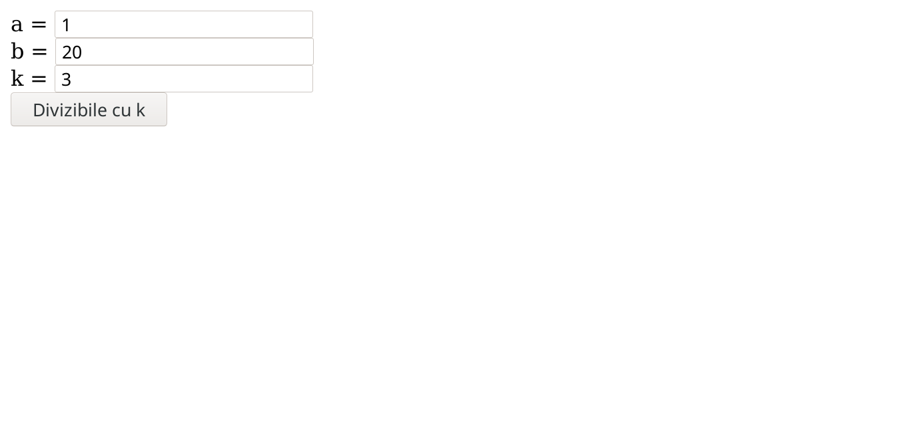
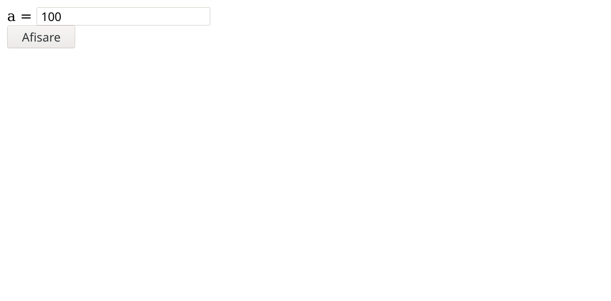
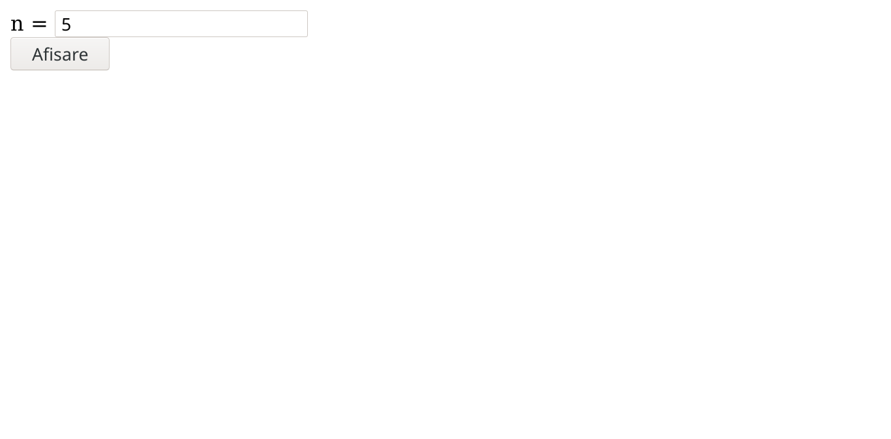
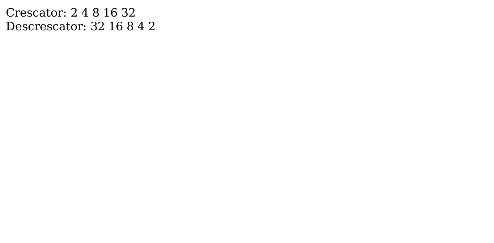
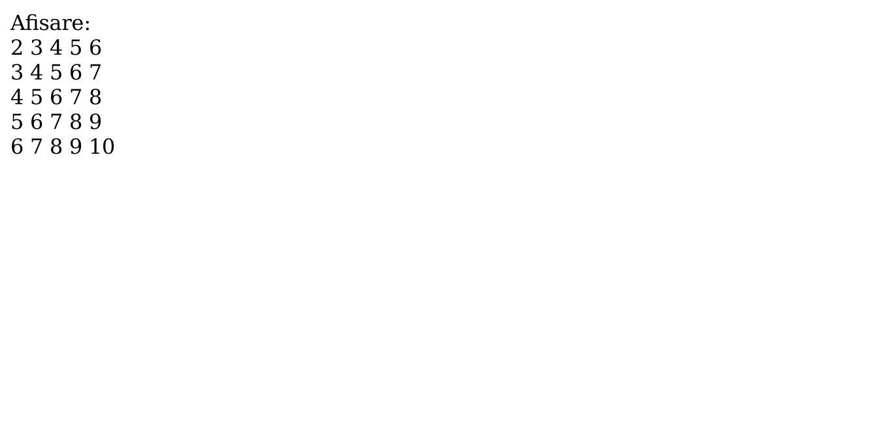
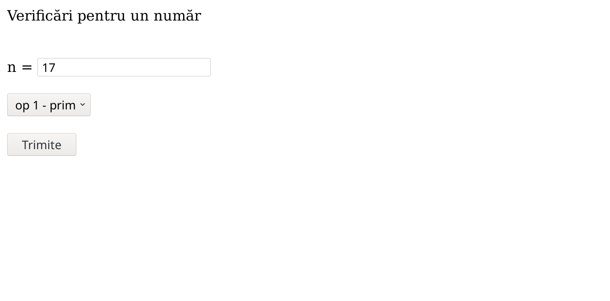
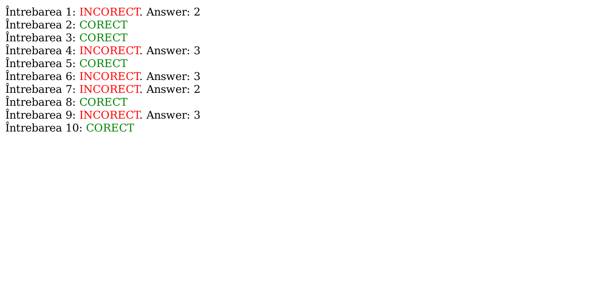

# Laborator 04

## Petculescu Mihai-Silviu

[TOC] 

### Exerciţiu 1

Citiţi două numere naturale $\large a$ şi $\large b$ şi afişaţi $\large a \cdot b+ b \cdot a$. Se va folosi o funcţie pentru calculul puterii.

```html
<!DOCTYPE html>
<html lang="ro">
  <head>
    <meta charset="UTF-8"/>
  </head>
  <body>
    <form action="http://localhost:8088/lab04/p01.php" method="post">
      a = <input type="text" name="a"/><br/>
      b = <input type="text" name="b"/><br/>
      <input type="submit" value="a^b + b^a"/>
    </form>
  </body>
</html>
```

```php+HTML
<?php
function suma_puteri($a, $b) {
  return $a ** ($b + $b ** $a);
}
$a = $_POST['a'];
$b = $_POST['b'];
echo suma_puteri($a, $b);
?>
```




### Exerciţiu 2

Pentru $\large a$ şi $\large b$ numere natural crescătoare afişaţi toate numerele divizibile cu $\large k$, cuprinse între $\large a$ şi $\large b$ folosind o funcţie care verifică această proprietate.

```html
<!DOCTYPE html>
<html lang="ro">
  <head>
    <meta charset="UTF-8"/>
  </head>
  <body>
    <form action="http://localhost:8088/lab04/p02.php" method="post">
      a = <input type="text" name="a"/><br/>
      b = <input type="text" name="b"/><br/>
      k = <input type="text" name="k"/><br/>
      <input type="submit" value="Divizibile cu k"/>
    </form>
  </body>
</html>
```

```php+HTML
<?php
function afisare_divizibile_k($a, $b, $k) {
  for ($i = $a; $i <= $b; $i++)
    if ($i % $k == 0)
      echo "$i <br>";
}

$a = $_POST['a'];
$b = $_POST['b'];
$k = $_POST['k'];

if ($a < $b) afisare_divizibile_k($a, $b, $k);
afisare_divizibile_k($b, $a, $k);
?>
```




### Exerciţiu 3

Pentru $\large a$ număr natural afişaţi toate numerele cu exact trei divizori mai mici sau egale cu $\large a$. Se va scrie o funcţie care determină numărul de divizori pentru un număr dat ca parametru.

```html
<!DOCTYPE html>
<html lang="ro">
  <head>
    <meta charset="UTF-8"/>
  </head>
  <body>
    <form action="http://localhost:8088/lab04/p03.php" method="post">
      a = <input type="text" name="a"/><br/>
      <input type="submit" value="Afisare"/>
    </form>
  </body>
</html>
```

```php+HTML
<?php
function nr_divizori($n) {
  $k = 0;
  for ($i = 1; $i <= $n; $i++)
    if ($n % $i == 0)
      $k++;
  return $k;
}

function afisare_nr_cu_3_divizori($a) {
  for ($i = 1; $i <= $a; $i++)
    if (nr_divizori($i) == 3)
      echo "$i <br>";
}

$a = $_POST['a'];
afisare_nr_cu_3_divizori($a);
?>
```




### Exerciţiu 4

Construiţi şi afişaţi crescător şi descrescător un tablou unidimensional cu numerele $\large 1, 2, 4, ..., 2^n$.

```html
<!DOCTYPE html>
<html lang="ro">
  <head>
    <meta charset="UTF-8"/>
  </head>
  <body>
    <form action="http://localhost:8088/lab04/p04.php" method="post">
      n = <input type="text" name="n"/><br/>
      <input type="submit" value="Afisare"/>
    </form>
  </body>
</html>
```

```php+HTML
<?php
function sir($n) {
  for ($i = 1; $i <= $n; $i++)
    $x[$i] = 2 ** $i;
  echo "Crescator: ";
  for ($i = 1; $i <= $n; $i++)
    echo "$x[$i] ";
  echo "<br> Descrescator: ";
  for ($i = $n; $i >= 1; $i--)
    echo "$x[$i] ";
  echo "<br>";
}

$n = $_POST['n'];
sir($n);
?>
```





### Exerciţiu 5

Construiţi un tablou pătratic de dimensiune $\large n$ în care linia $\large i$ are componentele egale cu $\large i+1, i+2, ..., i+n$. Apoi afişaţi tabloul.


```html
<!DOCTYPE html>
<html lang="ro">
  <head>
    <meta charset="UTF-8"/>
  </head>
  <body>
    <form action="http://localhost:8088/lab04/p05.php" method="post">
      n = <input type="text" name="n"/><br/>
      <input type="submit" value="Afisare"/>
    </form>
  </body>
</html>
```

```php+HTML
<?php
function matrice($n) {
  for ($i = 1; $i <= $n; $i++)
    for ($j = 1; $j <= $n; $j++)
      $x[$i][$j] = $i + $j;
  echo "Afisare: <br>";
  for ($i = 1; $i <= $n; $i++) {
    for ($j = 1; $j <= $n; $j++)
      echo $x[$i][$j]." ";
    echo "<br>";
  }
}

$n = $_POST['n'];
matrice($n);
?>
```




### Exerciţiu 6

Creaţi o aplicaţie web, care să citească un număr natural $\large n$ şi să afişeze prin intermediul unei liste cu trei opţiuni:

- Par / impar
- Pătrat perfect / nu este pătrat perfect
- Cub perfect / nu este cub perfect

```html
<!DOCTYPE html>
<html lang="ro">
  <head>
    <meta charset="UTF-8"/>
  </head>
  <body>
    <form action="http://localhost:8088/lab04/p06.php" method="post">
      Verificări pentru un număr <br/><br/><br/>
      n = <input type="text" name="n"/>
      <br/><br/>
      <select name="lista">
        <option value="op 1 - prim">op 1 - prim</option>
        <option value="op 2 - pp">op 2 - pp</option>
        <option value="op 3 - cp">op 1 - cp</option>
      </select>
      <br/><br/>
      <input type="submit" value="Trimite"/>
    </form>
  </body>
</html>
```

```php+HTML
<?php
function prim($n) {
  if ($n < 2) return 0;
  for ($i = 2; $i * $i <= $n; $i++)
    if ($n % $i == 0)
      return 0;
  return 1;
}

function pp($n) {
  $i = 1;
  while ($i * $i < $n)
    $i++;
  if ($i * $i == $n)
    return 1;
  return 0;
}

function cp($n) {
  $i = 1;
  while ($i * $i * $i < $n)
    $i++;
  if ($i * $i * $i == $n)
    return 1;
  return 0;
}

$n = $_POST['n'];
$op = $_POST['lista'];

if ($op == "op 1 - prim") {
  if (prim($n) == 1) echo "numarul $n este prim";
  else echo "numarul $n nu este prim";
}

if ($op == "op 2 - pp") {
  if (pp($n) == 1) echo "numarul $n este patrat perfect";
  else echo "numarul $n nu este patrat perfect";
}

if ($op == "op 3 - cp") {
  if (cp($n) == 1) echo "numarul $n este cub perfect";
  else echo "numarul $n nu este cub perfect";
}
?>
```




### Exerciţiu 7

Completaţi aplicaţia de mai sus pentru a crea un test cu 10 întrebări. Intrebările vor folosi liste
cu raspunsurile posibile (unul dintre acestea este corect).

```html
<!DOCTYPE html>
<html lang="ro">
  <head>
    <meta charset="UTF-8" />
  </head>
  <body background="#bfc0c0">
    <h3>Quiz</h3>
    <form action="http://localhost:8088/lab04/p07.php" method="post">
      <p> Cum se numea asasinul lui Abraham Lincoln?
        <select name="lista01">
          <option value="1">Andrew Johnson</option>
          <option value="2">John Wilkes Booth</option> <!-- Ok -->
          <option value="3">William H. Seward</option>
        </select>
      </p>
      <p> În ce secol a fost scris Decameronul lui Bocaccio?
        <select name="lista02">
          <option value="1">XIV</option> <!-- Ok -->
          <option value="2">XII</option>
          <option value="3">XVIII</option>
        </select>
      </p>
      <p> În ce an a fost asasinat Martin Luther King Jr?
        <select name="lista03">
          <option value="1">1968</option> <!-- Ok -->
          <option value="2">1970</option>
          <option value="3">1954</option>
        </select>
      </p>
      <p> În ce an a fost lansat pentru prima dată The Godfather?
        <select name="lista04">
          <option value="1">1968</option>
          <option value="2">1990</option>
          <option value="3">1972</option> <!-- Ok -->
        </select>
      </p>
      <p> În ce an Beatles a plecat prima dată în SUA?
        <select name="lista05">
          <option value="1">1964</option> <!-- Ok -->
          <option value="2">1960</option>
          <option value="3">1970</option>
        </select>
      </p>
      <p> Care este numele celei mai mari companii tehnologice din Coreea de Sud?
        <select name="lista06">
          <option value="1">LG</option>
          <option value="2">Panasonic</option>
          <option value="3">Samsung</option> <!-- Ok -->
        </select>
      </p>
      <p> Care este capitala Portugaliei?
        <select name="lista07">
          <option value="1">Budapesta</option>
          <option value="2">Lisabona</option> <!-- Ok -->
          <option value="3">Paris</option>
        </select>
      </p>
      <p> Pentru ce film a câştigat Leonardo DiCaprio oscarul?
        <select name="lista08">
          <option value="1">The Revenant</option> <!-- Ok -->
          <option value="2">Once Upon a Time in Hollywood</option>
          <option value="3">The Wolf of Wall Street</option>
        </select>
      </p>
      <p> Câte state are Statele Unite ale Americii?
        <select name="lista09">
          <option value="1">48</option>
          <option value="2">64</option>
          <option value="3">50</option> <!-- Ok -->
        </select>
      </p>
      <p> Ce naționalitate avea sculptorul Alberto Giacometti?
        <select name="lista10">
          <option value="1">Elveţian</option> <!-- Ok -->
          <option value="2">Italian</option>
          <option value="3">German</option>
        </select>
      </p>
      <input type="submit" value="Trimite soluţie." />
    </form>
  </body>
</html>
```

```php+HTML
<?php
$lista01 = $_POST['lista01']; # 2
$lista02 = $_POST['lista02']; # 1
$lista03 = $_POST['lista03']; # 1
$lista04 = $_POST['lista04']; # 3
$lista05 = $_POST['lista05']; # 1
$lista06 = $_POST['lista06']; # 3
$lista07 = $_POST['lista07']; # 2
$lista08 = $_POST['lista08']; # 1
$lista09 = $_POST['lista09']; # 3
$lista10 = $_POST['lista10']; # 1

function verificare($nr, $question, $answer) {
  echo "Întrebarea $nr: ";
  if ($question == $answer) echo "<span style=\"color:green;\">CORECT</span>";
  else echo "<span style=\"color:red;\">INCORECT</span>. Answer: $answer";
  echo "<br>";
}

verificare(1, $lista01, 2);
verificare(2, $lista02, 1);
verificare(3, $lista03, 1);
verificare(4, $lista04, 3);
verificare(5, $lista05, 1);
verificare(6, $lista06, 3);
verificare(7, $lista07, 2);
verificare(8, $lista08, 1);
verificare(9, $lista09, 3);
verificare(10, $lista10, 1);
?>
```





