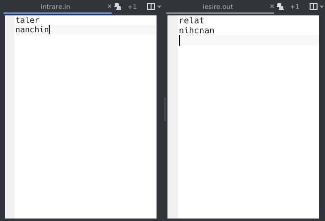
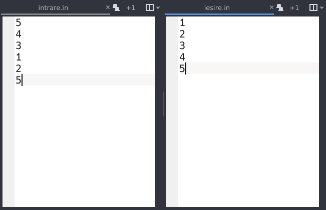
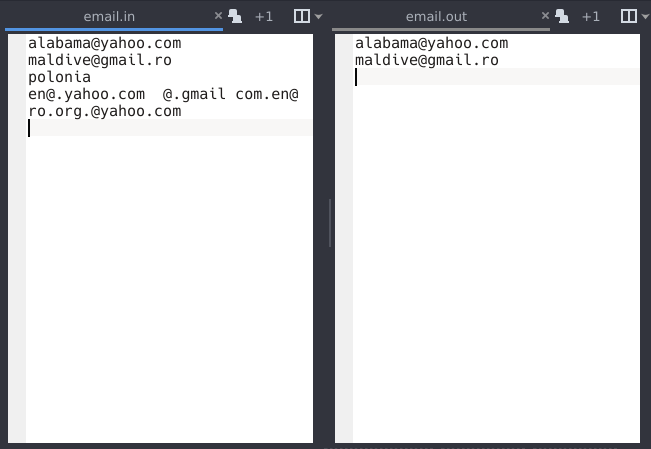

# Laborator 05

## Petculescu Mihai-Silviu

[TOC]

## I. Folosind fişiere în PHP rezolvaţi problemele următoare

### Exerciţiu 1

În fişierul text `intrare.in` se află două cuvinte pe cate o linie fiecare. Afişaţi în fişierul `iesire.out` cuvintele cu literele inversate (ex. `dana => anad`).

```php+HTML
<?php
$file_out = fopen("iesire.out", "w") or die("Unable to open file!");

if ($file = fopen("intrare.in", "r")) {
  $a = strrev(fgets($file));
  $b = strrev(fgets($file));

  fwrite($file_out, "$a\n"); echo "$a <br>";
  fwrite($file_out, "$b\n"); echo "$b <br>";
}

fclose($file_out);
?>
```

```bash
> intrare.in:
taler
nanchin

> iesire.in:
relat
nihcnan
```



### Exerciţiu 2

În fişierul text `intrare.in` se află `n` numere naturale. Afişaţi în fişierul `iesire.out` numerele în ordine crescătoare.

```php+HTML
<?php
function afisare($x) {
  $file_out = fopen("iesire.out", "w") or die("Unable to open file!");
  foreach ($x as $i) {
    echo "$i <br>";
    fwrite($file_out, "$i");
  }
  fclose($file_out);
}

if ($file = fopen("intrare.in", "r")) {
  $n = fgets($file);
  for ($i = 1; $i <= $n; $i++) {
    $x[$i] = fgets($file);
  }
  sort($x);
  afisare($x);
}
?>
```

```bash
> intrare.in: 5 4 3 1 2 5
> iesire.in: 1 2 3 4 5
```



### Exerciţiu 3

În fişierul `email.in` se află pe câte o linie câte o adresă de email. Afişaţi aceste adrese şi scrieţi rezultatul în fişierul `email.out`.

```php+HTML
<?php
$file_out = fopen("email.out", "w") or die("Unable to open file!");

if ($file = fopen("email.in", "r")) {
  while (!feof($file)) {
    $line = fgets($file);
    $words = preg_split("/[\s]+/", $line, -1, PREG_SPLIT_NO_EMPTY);
    foreach ($words as $w)
      if (filter_var($w, FILTER_VALIDATE_EMAIL)) {
        echo "$w <br>";
        fwrite($file_out, "$w\n");
      }
  }
  fclose($file);
}

fclose($file_out);
?>
```

```bash
> intrare.in:
alabama@yahoo.com maldive@gmail.ro
polonia
en@.yahoo.com  @.gmail com.en@
ro.org.@yahoo.com

> iesire.in:
alabama@yahoo.com
maldive@gmail.ro 
```



## II. Aplicaţii MySql

```sql
-- Creare Baza de date
create database l05_2021;
use l05_2021;
```

### Exerciţiu 4
**Problema "Materiale2"**
O firmă dispune de mai multe depozite, în fiecare depozit regăsindu-se mai multe materiale. Pentru fiecare material se cunoaşte numele materialului `char(10)`, cantitatea `int(4)`, preţul unei unităţi `int(4)` şi depozitul în care se află materialul respectiv `char(10)`. Tabelul care conţine înregistrările se numeşte `materiale`.

a) Să se introducă în tablel următoarele date:

| Nume_material | Cantitate | Pret_unitar | Depozit  |
| :------------ | --------- | ----------- | -------- |
| Caramida      | 10        | 2           | Depozit1 |
| Caramida      | 5         | 2           | Depozit2 |
| Caramida      | 60        | 2           | Depozit3 |
| BCA           | 80        | 5           | Depozit3 |
| BCA           | 55        | 5           | Depozit1 |
| BCA           | 30        | 5           | Depozit2 |
| Ciment        | 20        | 10          | Depozit1 |
| Ciment        | 75        | 10          | Depozit3 |
| Ipsos         | 4         | 13          | Depozit4 |
| Ipsos         | 70        | 13          | Depozit2 |

```sql
> create table materiale(nume_material varchar(10), cantitate int(4), pret_unitate int(4), depozit varchar(10));

> insert into materiale values
('Caramida', 10, 2, 'Depozit1'),
('Caramida',  5, 2, 'Depozit2'),
('Caramida', 60, 2, 'Depozit3'),
('BCA', 80, 5, 'Depozit3'),
('BCA', 55, 5, 'Depozit1'),
('BCA', 30, 5, 'Depozit2'),
('Ciment', 20, 10, 'Depozit1'),
('Ciment', 75, 10, 'Depozit3'),
('Ipsos', 4, 13, 'Depozit4'),
('Ipsos', 70, 13, 'Depozit2');

> select * from materiale;
```

b) Afişaţi tabelul creat.

```sql
> select * from materiale;
```

```bash
+---------------+-----------+--------------+----------+
| nume_material | cantitate | pret_unitate | depozit  |
+---------------+-----------+--------------+----------+
| Caramida      |        10 |            2 | Depozit1 |
| Caramida      |         5 |            2 | Depozit2 |
| Caramida      |        60 |            2 | Depozit3 |
| BCA           |        80 |            5 | Depozit3 |
| BCA           |        55 |            5 | Depozit1 |
| BCA           |        30 |            5 | Depozit2 |
| Ciment        |        20 |           10 | Depozit1 |
| Ciment        |        75 |           10 | Depozit3 |
| Ipsos         |         4 |           13 | Depozit4 |
| Ipsos         |        70 |           13 | Depozit2 |
+---------------+-----------+--------------+----------+
```

c) Afişaţi un tabel cu informatiile: `Nume_material`, `Cantitate`, `Pret_unitar`, `Pret_total`

```sql
> select nume_material, cantitate, pret_unitate, cantitate * pret_unitate as pret_total from materiale;
```

```bash
+---------------+-----------+--------------+------------+
| nume_material | cantitate | pret_unitate | pret_total |
+---------------+-----------+--------------+------------+
| Caramida      |        10 |            2 |         20 |
| Caramida      |         5 |            2 |         10 |
| Caramida      |        60 |            2 |        120 |
| BCA           |        80 |            5 |        400 |
| BCA           |        55 |            5 |        275 |
| BCA           |        30 |            5 |        150 |
| Ciment        |        20 |           10 |        200 |
| Ciment        |        75 |           10 |        750 |
| Ipsos         |         4 |           13 |         52 |
| Ipsos         |        70 |           13 |        910 |
+---------------+-----------+--------------+------------+
```

d) Afişaţi un tabel cu informatiile: `Nume_material`, `Depozit`, `Pret_total`

```sql
> select nume_material, depozit, cantitate * pret_unitate as pret_total from materiale;
```

```bash
+---------------+----------+------------+
| nume_material | depozit  | pret_total |
+---------------+----------+------------+
| Caramida      | Depozit1 |         20 |
| Caramida      | Depozit2 |         10 |
| Caramida      | Depozit3 |        120 |
| BCA           | Depozit3 |        400 |
| BCA           | Depozit1 |        275 |
| BCA           | Depozit2 |        150 |
| Ciment        | Depozit1 |        200 |
| Ciment        | Depozit3 |        750 |
| Ipsos         | Depozit4 |         52 |
| Ipsos         | Depozit2 |        910 |
+---------------+----------+------------+
```

### Exerciţiu 5

**Problema "Împrumuturi2"**
Mai multe persoane au credite, în acelaşi timp, la mai multe bănci. O astfel de situaţie este prezentată în tabelul de mai jos, numit `Imprumuturi`. În crearea tabelului vom utiliza câmpurile: Nume `char(20)`, Banca `char(10)`, Suma_lei `int(10)`. Se cere:

a) Să se introducă în tabelul `Imprumuturi` următoarele date:

| Nume            | Banca   | Suma_lei |
| --------------- | ------- | -------- |
| Ionescu Grigore | Banca 1 | 10       |
| Ionescu Grigore | Banca 2 | 6        |
| Ionescu Mihai   | Banca 2 | 7        |
| Malai Mihai     | Banca 2 | 12       |
| Malai Mihai     | Banca 1 | 8        |
| Malai Mihai     | Banca 3 | 7        |
| Popescu Ion     | Banca 1 | 5        |

```sql
> create table imprumuturi(nume varchar(20), banca varchar(10), suma_lei int(10));

> insert into imprumuturi values
('Ionescu Grigore', 'Banca 1', 10),
('Ionescu Grigore', 'Banca 2', 6),
('Ionescu Mihai', 'Banca 2', 7),
('Malai Mihai', 'Banca 2', 12),
('Malai Mihai', 'Banca 1', 8),
('Malai Mihai', 'Banca 3', 7),
('Popescu Ion', 'Banca 1', 5);
```

b) Afişaţi tabelul creat.
```sql
> select * from imprumuturi;
```

```bash
+-----------------+---------+----------+
| nume            | banca   | suma_lei |
+-----------------+---------+----------+
| Ionescu Grigore | Banca 1 |       10 |
| Ionescu Grigore | Banca 2 |        6 |
| Ionescu Mihai   | Banca 2 |        7 |
| Malai Mihai     | Banca 2 |       12 |
| Malai Mihai     | Banca 1 |        8 |
| Malai Mihai     | Banca 3 |        7 |
| Popescu Ion     | Banca 1 |        5 |
+-----------------+---------+----------+
```

c) Afişaţi un tabel cu informatiile: `nume`, `banca`, `suma_lei` şi `suma_euro`, folosind un curs valutar 1euro = 4.89 lei.

```sql
> select nume, banca, suma_lei, suma_lei / 4.89 as suma_euro from imprumuturi;
```

```bash
+-----------------+---------+----------+-----------+
| nume            | banca   | suma_lei | suma_euro |
+-----------------+---------+----------+-----------+
| Ionescu Grigore | Banca 1 |       10 |    2.0450 |
| Ionescu Grigore | Banca 2 |        6 |    1.2270 |
| Ionescu Mihai   | Banca 2 |        7 |    1.4315 |
| Malai Mihai     | Banca 2 |       12 |    2.4540 |
| Malai Mihai     | Banca 1 |        8 |    1.6360 |
| Malai Mihai     | Banca 3 |        7 |    1.4315 |
| Popescu Ion     | Banca 1 |        5 |    1.0225 |
+-----------------+---------+----------+-----------+
```

d) Afişaţi un tabel cu informatiile: `nume`, `banca`, `suma_lei`, `suma_euro`, `suma_dolari` folosind un curs valutar 1euro = 4.89 lei, 1dolar = 4.32 lei.

```sql
> select nume, banca, suma_lei, suma_lei / 4.89 as suma_euro, suma_lei / 4.32 as suma_dolari from imprumuturi;
```

```bash
+-----------------+---------+----------+-----------+-------------+
| nume            | banca   | suma_lei | suma_euro | suma_dolari |
+-----------------+---------+----------+-----------+-------------+
| Ionescu Grigore | Banca 1 |       10 |    2.0450 |      2.3148 |
| Ionescu Grigore | Banca 2 |        6 |    1.2270 |      1.3889 |
| Ionescu Mihai   | Banca 2 |        7 |    1.4315 |      1.6204 |
| Malai Mihai     | Banca 2 |       12 |    2.4540 |      2.7778 |
| Malai Mihai     | Banca 1 |        8 |    1.6360 |      1.8519 |
| Malai Mihai     | Banca 3 |        7 |    1.4315 |      1.6204 |
| Popescu Ion     | Banca 1 |        5 |    1.0225 |      1.1574 |
+-----------------+---------+----------+-----------+-------------+
```

e) Afişaţi un tabel cu informatiile: `nume`, `suma_lei`, `suma_euro`, `suma_dolari`, `suma_lire` folosind un curs valutar 1euro = 4.89 lei, 1dolar = 4.32 lei, 1lira = 5.84 lei.

```sql
> select nume, banca, suma_lei, suma_lei / 4.89 as suma_euro, suma_lei / 4.32 as suma_dolari, suma_lei / 5.84 as suma_lire from imprumuturi;
```

```bash
+-----------------+---------+----------+-----------+-------------+-----------+
| nume            | banca   | suma_lei | suma_euro | suma_dolari | suma_lire |
+-----------------+---------+----------+-----------+-------------+-----------+
| Ionescu Grigore | Banca 1 |       10 |    2.0450 |      2.3148 |    1.7123 |
| Ionescu Grigore | Banca 2 |        6 |    1.2270 |      1.3889 |    1.0274 |
| Ionescu Mihai   | Banca 2 |        7 |    1.4315 |      1.6204 |    1.1986 |
| Malai Mihai     | Banca 2 |       12 |    2.4540 |      2.7778 |    2.0548 |
| Malai Mihai     | Banca 1 |        8 |    1.6360 |      1.8519 |    1.3699 |
| Malai Mihai     | Banca 3 |        7 |    1.4315 |      1.6204 |    1.1986 |
| Popescu Ion     | Banca 1 |        5 |    1.0225 |      1.1574 |    0.8562 |
+-----------------+---------+----------+-----------+-------------+-----------+
```

