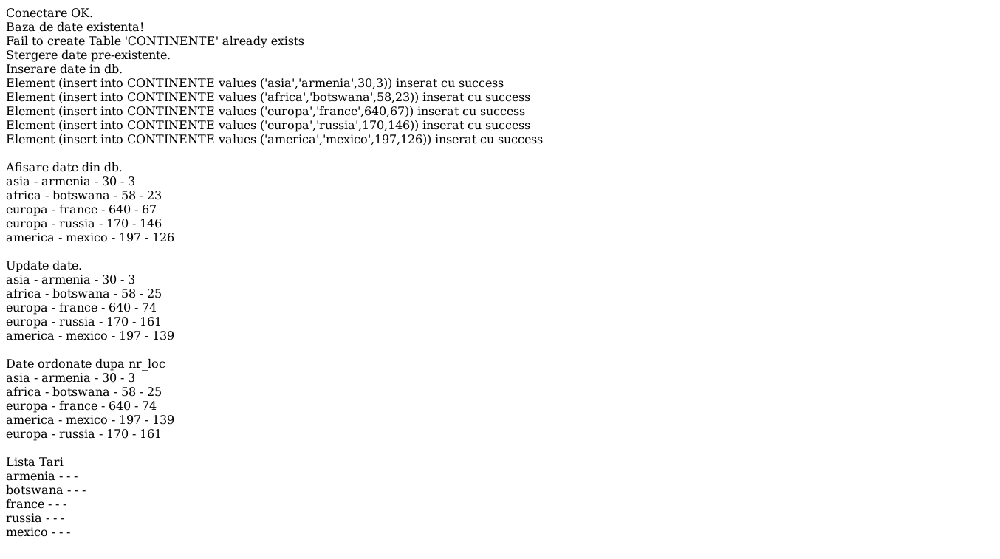
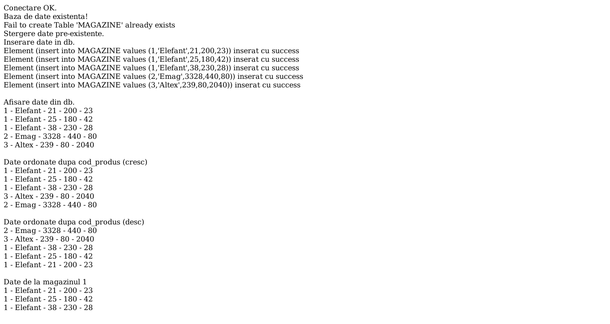

# Laborator 06

## Petculescu Mihai-Silviu

[TOC]

## Rezolvaţi pe modelul aplicaţiei anterioare următoarele probleme

### Exerciţiu 1

Se consideră tabela `CONTINENTE` cu structura: continent `char(15)`, ţară `char(15)`, suprafaţă `int(10)`, nr_loc `int(10)`.
Se cere:
a) crearea bazei de date şi popularea cu date semnificative rezolvării problemei.
b) vizualizarea conţinutului tabelei date.
c) afişaţi datele ştiind că numărul de locuitori al ţărilor existente în baza de date a crescut cu $10\%$.
d) lista ţărilor, ordonate descrescător după `nr_loc`.
e) afisaţi ţările fiecarui continent.

```php+HTML
<?php

// Functions
function show_records($view, $con){
  $result = $con->query($view);
  while($x = mysqli_fetch_array($result))
    echo $x[0].' - '.$x[1].' - '.$x[2].' - '.$x[3]."<br>";
  echo("<br>");
}

function logging($message){
  echo $message."<br>";
}

function insert_data($insert, $con){
  foreach($insert as $element)
    if($con->query($element))
      logging("Element ($element) inserat cu success");
  echo("<br>");
}

function create_db($con){
  $db = mysqli_select_db($con, "pw2021");

  if(!$db){
    $sql = "CREATE DATABASE pw2021";
    if($con->query($sql) === TRUE)
      logging("Database created successfully.");
    else
      logging("Error creating database: ".$conn->error);
  }else
    logging("Baza de date existenta!");
}

function create_table($con){
  $createTable = "create table CONTINENTE (continent char(15), tara char(15), suprafata int, nr_loc int)";
  if($con->query($createTable))
    logging("Tabela CONTINENTE creata cu success!");
  else
    logging("Fail to create"." ".$con->error);
}

// Create connection
$con = mysqli_connect("localhost", "root", "");

if(!$con){
  logging("Eroare de conexiune la server MySql.");
  exit;
}else
  logging("Conectare OK.");

// Create DB
create_db($con);

// Create Table
create_table($con);

// Data to be inserted 
$insert=[];
array_push($insert, "insert into CONTINENTE values ('asia','armenia',30,3)");
array_push($insert, "insert into CONTINENTE values ('africa','botswana',58,23)");
array_push($insert, "insert into CONTINENTE values ('europa','france',640,67)");
array_push($insert, "insert into CONTINENTE values ('europa','russia',170,146)");
array_push($insert, "insert into CONTINENTE values ('america','mexico',197,126)");

// Clear previous records 
logging("Stergere date pre-existente.");
$con->query("delete from CONTINENTE");

// Insert Data
logging("Inserare date in db.");
insert_data($insert, $con);

// Show Data From DB
logging("Afisare date din db.");
show_records("select * from CONTINENTE", $con);

// Update Data From DB
logging("Update date.");
$con->query("update CONTINENTE set nr_loc = nr_loc + (nr_loc/10)");
show_records("select * from CONTINENTE", $con);

// Show Data From DB (Order by nr_loc)
logging("Date ordonate dupa nr_loc");
show_records("select * from CONTINENTE order by nr_loc", $con);

// Show Countries
logging("Lista Tari");
show_records("select tara from CONTINENTE", $con);
?>
```



### Exerciţiu 2

Se consideră tabela `MAGAZINE`, cu structura: cod_mag `int(3)`, denumire `char(20)`, cod_prod `int(3)`, cantitate `int(5)`, pret_unit `int(7)`. Observaţie: un produs poate să apară de mai multe ori, la preţuri diferite.
Se cere:
a) crearea bazei de date şi popularea cu date semnificative rezolvării problemei.
b) vizualizarea conţinutului tabelei date.
c) afişaţi datele din tabel ordonate crescător după `cod_prod`.
d) afişaţi datele din tabel ordonate descrescător după `cod_prod`.
e) afişaţi produse unui magazin cu un `cod_mag` cunoscut.

```php+HTML
<?php
// Functions
function show_records($view, $con){
  $result = $con->query($view);
  while($x = mysqli_fetch_array($result))
    echo $x[0].' - '.$x[1].' - '.$x[2].' - '.$x[3].' - '.$x[4]."<br>";
  echo("<br>");
}

function logging($message){
  echo $message."<br>";
}

function insert_data($insert, $con){
  foreach($insert as $element)
    if($con->query($element))
      logging("Element ($element) inserat cu success");
  echo("<br>");
}

function create_db($con){
  $db = mysqli_select_db($con, "pw2021");

  if(!$db){
    $sql = "CREATE DATABASE pw2021";
    if($con->query($sql) === TRUE)
      logging("Database created successfully.");
    else
      logging("Error creating database: ".$conn->error);
  }else
    logging("Baza de date existenta!");
}

function create_table($con){
  $createTable = "create table MAGAZINE (cod_mag int, denumire char(20), cod_prod int, cantitate int, pret_unit int)";
  if($con->query($createTable))
    logging("Tabela MAGAZINE creata cu success!");
  else
    logging("Fail to create"." ".$con->error);
}

// Create connection
$con = mysqli_connect("localhost", "root", "");

if(!$con){
  logging("Eroare de conexiune la server MySql.");
  exit;
}else
  logging("Conectare OK.");

// Create DB
create_db($con);

// Create Table
create_table($con);

// Data to be inserted 
$insert=[];
array_push($insert, "insert into MAGAZINE values (1,'Elefant',21,200,23)");
array_push($insert, "insert into MAGAZINE values (1,'Elefant',25,180,42)");
array_push($insert, "insert into MAGAZINE values (1,'Elefant',38,230,28)");
array_push($insert, "insert into MAGAZINE values (2,'Emag',3328,440,80)");
array_push($insert, "insert into MAGAZINE values (3,'Altex',239,80,2040)"); 

// Clear previous records 
logging("Stergere date pre-existente.");
$con->query("delete from MAGAZINE");

// Insert Data
logging("Inserare date in db.");
insert_data($insert, $con);

// Show Data From DB
logging("Afisare date din db.");
show_records("select * from MAGAZINE", $con);

// Show Data From DB (Order by cod_prod, Cresc)
logging("Date ordonate dupa cod_produs (cresc)");
show_records("select * from MAGAZINE order by cod_prod", $con);

// Show Data From DB (Order by cod_prod, Desc)
logging("Date ordonate dupa cod_produs (desc)");
show_records("select * from MAGAZINE order by cod_prod desc", $con);

// Show Data From DB (With cod_mag given)
logging("Date de la magazinul 1");
show_records("select * from MAGAZINE where cod_mag = 1", $con);
?>
```

