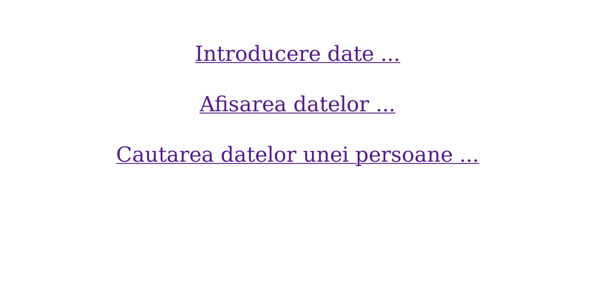

# Laborator 07

## Petculescu Mihai-Silviu

[TOC]

## Exerciţiu 1

Creaţi o bază de date cu numele `pw2021` care să conţină un tabel cu numele informaţii şi câmpurile: `nume`, `cnp`, `ci`, `inaltime`.
- Introduceţi înregistrări cu un formular.
- Afişaţi datele din tabelul informaţii folosind un tabel `HTML`
- Afişaţi datele unei persoane date prin `CNP`




```php+HTML
<?php // script_introducere.php
// conectarea la MySql
$conectare = mysqli_connect("localhost", "root", "");
if (!$conectare) {
  echo "Eroare de conexiune la server MySql" . "<br>";
  exit();
}

// crearea bazei de date
$db = mysqli_select_db($conectare, "pw2021");
if (!$db) {
  if ($conectare->query("CREATE DATABASE pw2021"))
    echo "Baza de date creata" . "<br>";
  else
    echo "Eroare: " . $conectare->error;
}

// crearea tabelului informatii
$creare_tabel = "CREATE TABLE informatii ( nume char(40) PRIMARY KEY, cnp char(13), ci char(8), inaltime int )";
if ($conectare->query($creare_tabel))
  echo "Tabela CONTINENTE creata cu success!" . "<br>";
else
  echo "Fail to create" . " " . $conectare->error . "<br>";

// preluarea datelor din formular
$nume = $_POST['nume'];
$cnp = $_POST['cnp'];
$ci = $_POST['ci'];
$inaltime = $_POST['inaltime'];

//introducerea inregistrarilor in tabel
$introducere = "INSERT INTO informatii VALUES('$nume', '$cnp', '$ci', '$inaltime')";
if (!$conectare->query($introducere)) {
  echo "Eroare la introducerea datelor" . "<br>";
else 
  echo "Introducere cu succes in tabelul informatii" . "<br>";
?>
```

```php+HTML
<?php // script_cautare.php
// conectarea la MySql
$conectare = mysqli_connect("localhost", "root", "");
if (!$conectare) {
  echo "Eroare de conexiune la server MySql";
  exit();
}

// crearea bazei de date
$db = mysqli_select_db($conectare, "pw2021");
if (!$db) {
  echo "Eroare la selectarea bazei de date!" . "<br>";
}

// preluarea datelor din formular
$cnp = $_POST['cnp'];
$comanda_afisare = "SELECT * FROM informatii WHERE cnp = '$cnp'";
$rez = $conectare->query($comanda_afisare);
if (!$rez) {
  echo "Eroare la afisarea datelor" . "<BR>";
  exit();
}

// afisare tabelata a informatiilor din tabela informatii
echo "Tabelul persoanele cautate <br><br>";
echo "<table border = 1>";
echo "<tr> <td> Nume </td> <td> CNP </td> <td> CI </td> <td> Inaltime </td> </tr>";
while ($x = mysqli_fetch_array($rez)) {
  echo "<tr>";
  echo "<td>" . $x['nume'] . "</td>";
  echo "<td>" . $x['cnp'] . "</td>";
  echo "<td>" . $x['ci'] . "</td>";
  echo "<td>" . $x['inaltime'] . "</td>";
  echo "</tr>";
}
echo "</table>";
?>
```

```php+HTML
<?php // script_afisare.php
// conectarea la MySql
$conectare = mysqli_connect("localhost", "root", "");
if (!$conectare) {
  echo "Eroare de conexiune la server MySql";
  exit();
}

// crearea bazei de date
$db = mysqli_select_db($conectare, "pw2021");
if (!$db) {
  echo "Eroare la selectarea bazei de date!" . "<br>";
}

$comanda_afisare = "SELECT * From informatii";
$rez = $conectare->query($comanda_afisare);
if (!$rez) {
  echo "Eroare la afisarea datelor" . "<br>";
  exit();
}

// afisare tabelata a informatiilor din tabela informatii
echo "Tabelul informatii <br><br>";
echo "<table border = 1>";
echo "<tr> <td> Nume </td> <td> CNP </td> <td> CI </td> <td> Inaltime </td> </tr>";
while ($x = mysqli_fetch_array($rez)) {
  echo "<tr>";
  echo "<td>" . $x['nume'] . "</td>";
  echo "<td>" . $x['cnp'] . "</td>";
  echo "<td>" . $x['ci'] . "</td>";
  echo "<td>" . $x['inaltime'] . "</td>";
  echo "</tr>";
}
echo "</table>";
?>
```

## Exerciţiu 2

Realizaţi o aplicaţie web în care să creaţi o bază de date cu numele `pw2021` şi in ea tabelul orar cu câmpurile: `semestru`, `zi`, `interval_orar`, `an_studiu`, `grupa_studiu`, `denumire_curs`, `tip` (curs / laborator / seminar), `sala`, `profesor`. Aplicaţia va avea următoarele funcţionalităţi:

- formular de introdus date
- afişarea tabelului
- afişarea datelor pentru un semestru (citit dintr-un formular) pe zile şi ore
- afişarea orarului unei zile dintr-un semestru specificat
- afişarea orelor pentru o grupă dată
- afişarea orelor pentru un profesor dată

```html
<!-- index.html -->
<!DOCTYPE html>
<html lang="ro">
  <head>
    <link rel="stylesheet" href="./style/style.css" />
    <title>Orar</title>
  </head>
  <body>
    <div class="topnav">
      <a href="./index.html" class="active">Home</a>
      <a href="./insert.html">Insert</a>
      <a href="./search.html">Search</a>
    </div>
    <div class="group">
      <h3>Admin - Orar</h3>
      <p>O pagină dedicată celor care doresc administrarea unui orar.</p>
    </div>
  </body>
</html>
```


```html
<!-- insert.html -->
<!DOCTYPE html>
<html lang="ro">
  <body>
    <div class="topnav">
      <a href="./index.html">Home</a>
      <a href="./insert.html" class="active">Insert</a>
      <a href="./search.html">Search</a>
    </div>
    <form action="http://localhost:8088/lab07/script.php" method="post">
      <div class="group">
        <p>Semestru:</p> <input name="semestru" type="number" />
        <p>Zi:</p> <input name="zi" type="text" />
        <p>Interval Orar:</p> <input name="interval_orar" type="text" />
        <p>An Studiu:</p> <input name="an_studiu" type="number" />
        <p>Grupa:</p> <input name="grupa" type="number" />
        <p>Denumire:</p> <input name="denumire" type="text" />
        <p>Tip:</p> <input name="tip" type="text" />
        <p>Sala:</p> <input name="sala" type="text" />
        <p>Profesor:</p> <input name="profesor" type="text" />
        <br/> <input type="submit" name="insert" value="Inserare" class="button blue" />
        <br/><br/> <input type="submit" name="delete_all" value="Resetare Orar" class="button red" />
      </div>
    </form>
  </body>
</html>
```


```html
<!-- search.html -->
<!DOCTYPE html>
<html lang="ro">
  <body>
    <div class="topnav">
      <a href="./index.html">Home</a>
      <a href="./insert.html">Insert</a>
      <a href="./search.html" class="active">Search</a>
    </div>
    <form action="http://localhost:8088/lab07/script.php" method="post">
      <div class="group">
        <p>Semestru:</p> <input name="semestru" type="number" />
        <p>Zi:</p> <input name="zi" type="text" />
        <p>Interval Orar:</p> <input name="interval_orar" type="text" />
        <p>Grupa:</p> <input name="grupa" type="number" />
        <p>Profesor:</p> <input name="profesor" type="text" />
        <br/> <input type="submit" name="view_all" value="Afisare integrara" class="button blue" />
        <br/> <input type="submit" name="search_course" value="Cautare dupa semestru, zi, interval" class="button blue" />
        <input type="submit" name="delete_course" value="Stergere Cursuri" class="button red" />
        <br/> <input type="submit" name="view_group" value="Afisare ore grupa" class="button blue" />
        <br/> <input type="submit" name="view_teacher" value="Afisare ore profesor" class="button blue" />
      </div>
    </form>
  </body>
</html>
```


```css
/* css */
html, body {
  padding: 0;
  margin: 0;
  min-height: 100%;
  font-family: Arial, Helvetica, sans-serif;
  box-sizing: border-box;
}
body {
  background-image: url("../img/background.jpg");
  background-repeat: no-repeat;
  background-position: center bottom;
  background-size: cover;
  z-index: -1;
}
.topnav {
  overflow: hidden;
  text-align: center;
  background-color: #333;
}
.topnav a {
  display: inline-block;
  color: #f2f2f2;
  text-align: center;
  padding: 12px 14px;
  text-decoration: none;
  font-size: 1em;
}
.topnav a:hover {
  background-color: #ddd;
  color: black;
}
.topnav a.active {
  background-color: #0260fc;
  color: white;
}
.group {
  display: inline-block;
  text-align: center;
  margin-left: 50%;
  transform: translateX(-50%);
  background: rgba(51, 51, 51, 0.6);
  padding: 20px;
  width: 40%;
}
.group h3 {
  color: white;
  font-size: 1.8em;
  margin: 15px;
}
.group p {
  color: white;
  font-size: 1.5em;
  margin: 10px;
}
.group input[type="text"] {
  width: 100%;
  padding: 10px 10px;
  margin: 5px 0;
  display: inline-block;
  border: 1px solid #ccc;
  border-radius: 4px;
  box-sizing: border-box;
}
.group input[type="number"] {
  width: 100%;
  padding: 10px 10px;
  margin: 5px 0;
  display: inline-block;
  border: 1px solid #ccc;
  border-radius: 4px;
  box-sizing: border-box;
}
.button {
  border: none;
  color: white;
  padding: 10px;
  text-align: center;
  text-decoration: none;
  display: inline-block;
  font-size: 1.2em;
  margin: 4px 2px;
  cursor: pointer;
}
.red {
  background-color: #9d091a;
}
.blue {
  background-color: #0260fc;
}
```

```php+HTML
<?php
// functii
function insert($con) {
  $semestru = $_POST["semestru"];
  $zi = $_POST["zi"];
  $interval = $_POST["interval_orar"];
  $an = $_POST["an_studiu"];
  $grupa = $_POST["grupa"];
  $denumire = $_POST["denumire"];
  $tip = $_POST["tip"];
  $sala = $_POST["sala"];
  $profesor = $_POST["profesor"];
  $insert="INSERT INTO orar VALUES ($semestru, '$zi', '$interval', $an, $grupa, '$denumire','$tip','$sala','$profesor')";
  if($con->query($insert))
    echo "Date adaugate cu success"."<br>";
  else
    echo "Probleme la insert: ".$con->error;
}
function afisare($con, $view){
  echo "Tabel cu informatii"."<br>";
  echo "<table border = 2>";
  echo "<tr> <td>Semestru</td> <td>Zi</td> <td>Interval</td> <td>An</td> <td>Grupa</td> <td>Denumire</td> <td>Tip</td> <td>Sala</td> <td>Profesor</td> </tr>";
  $result = $con->query($view);
  while($x=mysqli_fetch_array($result)){
    echo "<tr>";
    for ($i = 0; $i <= 8; $i++)
      echo "<td>".$x[$i]."</td>";
    echo "</tr>";
  }
  echo "</table>";    
}

// creare conexiune
$con = mysqli_connect("localhost", "root", "");
if(!$con){
  echo "Eroare de conexiune la server MySql"."<br>";
  exit;
}

// crearea bazei de date
$db = mysqli_select_db($con, "pw2021");
if(!$db){
  if($con->query("CREATE DATABASE pw2021"))
    echo "Baza de date creata"."<br>";
  else
    echo "Eroare: ".$con->error;
}

// crearea tabelului informatii
$creare_tabel = "CREATE TABLE orar (semestru int, zi char(20), interval_orar char(20), an_studiu int, grupa int, denumire char(50), tip char(20), sala char(50), profesor char(50))";
if($con->query($creare_tabel))
  echo "Tabela orar creata cu success!"."<br>";
else
  echo "Fail to create"." ".$con->error."<br>";

// prelucrare actiuni
if(isset($_POST['insert'])) {
  insert($con);
}
if(isset($_POST['view_all'])) {
  afisare($con,"select * from orar");
}
if(isset($_POST['search_course'])) {
  $semestru = $_POST["semestru"];
  $zi = $_POST["zi"];
  $interval = $_POST["interval_orar"];
  if($interval == '')
    afisare($con, "SELECT * FROM orar WHERE `semestru`=$semestru AND `zi`='$zi'");
  else
    afisare($con, "SELECT * FROM orar WHERE `semestru`=$semestru AND `zi`='$zi' AND `interval_orar`='$interval'");
}
if(isset($_POST['view_group'])) {
  $grupa = $_POST["grupa"];
  afisare($con, "SELECT * FROM orar WHERE `grupa`='$grupa' ORDER BY `zi`"); 
}
if(isset($_POST['view_teacher'])) {
  $profesor = $_POST["profesor"];
  afisare($con, "SELECT * FROM orar WHERE `profesor`='$profesor' ORDER BY `zi`"); 
}
if(isset($_POST['delete_all'])){
  if($con->query("DELETE FROM orar"))
    echo "Resetare realizata cu success"."<br>";
  else
    echo "Erroare la resetare: ".$con->error."<br>";
}
if(isset($_POST['delete_course'])){
  $semestru = $_POST["semestru"];
  $zi = $_POST["zi"];
  $interval = $_POST["interval_orar"];
  if($con->query("DELETE FROM orar WHERE `semestru`='$semestru' AND `zi`='$zi' AND `interval_orar`='$interval'"))
    echo "Date eliminate cu success"."<br>";
  else
    echo "Erroare la stergere: ".$con->error."<br>";
}
?>
```


