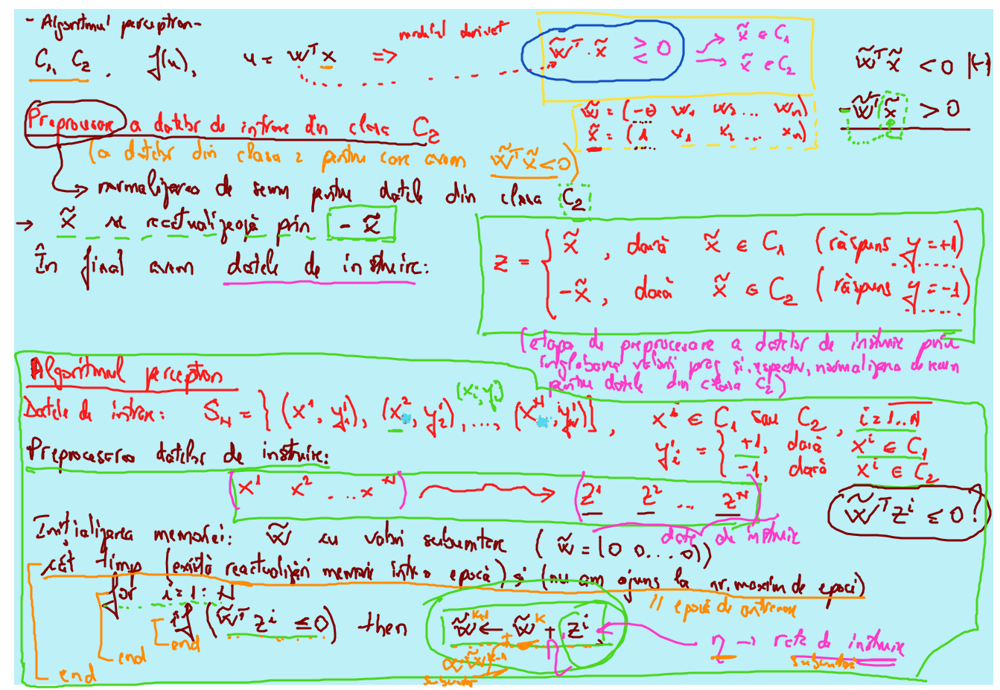

# Laborator 05

 ## Date: 31.03.2021

[TOC]

## Part 1



## Part 2

```matlab
%% INSTRUCTIUNI IN MATLAB

%% 1. INSTRUCTIUNEA IF (test de utilizare)
n = 8;
if rem(n,2) ~= 0 % rem(x,y) - calculeaza restul  impartirii lui x la y
  Expresie = n^3-2;
elseif rem(n,3) ~= 0
  Expresie = n^2-1;
else
  Expresie = n-1;
end
Expresie % Afisarea variabilei rezultat

%% 2. INSTRUCTIUNEA SWITCH (test de utilizare)
n = 9;
switch (rem(n,4) + rem(n,2)) % variabila selector = suma resturilor
  case 0
    E = n^2-2*n-1;
  case 1
    E = n-2;
  case 2
    E = n-2*n^2;
  otherwise
    E = n^2-10;
end
E % Afisarea variabilei rezultat

%% 3. INSTRUCTIUNEA FOR (test de utilizare)
% Exemplu 1
n = 4; m = 4;
for i = 1:n
  for j = i:m
    A(i,j) = i + j;
  end
end
A

% Exemplu 2
for i = 1:size(A,1)
  for j = 1:size(A,2)
    B(i,j) = A(i,j)^2-1;
  end
end
B

%% 4. INSTRUCTIUNEA WHILE (test de utilizare)
% determinarea sol aprox pentru ecuatia f(x) = x^3-2*x-5 = 0;
% determinare sol pe intervalul [a,b]
% in care solutia este separata: f(a)*f(b)<0

a = 0; fa = -Inf;
b = 5; fb = Inf;
% v = []; % initializare cu vector vid
% v = vectorul valorilor calculate
while b-a > 0.00000001
  x = (a+b)/2; % injumatatirea intervalului
  % v = [v;x]; % adaugarea valorii de la jumatate intr-un vector v
  fx = x^3-2*x-5;
  if sign(fx) == sign(fa)
    a = x; fa = fx;
  else
    b = x; fb = fx;
  end
end
x % afisare solutie aproximativa
% v % afisarea vectorului cu valorile calculate in while

%% verificare solutie obtinuta x
x0 = x % retinem solutia aproximativa
% se calculeaza f(x0) si se afiseaza solutia
fx0 = x0^3-2*x0-5
```

